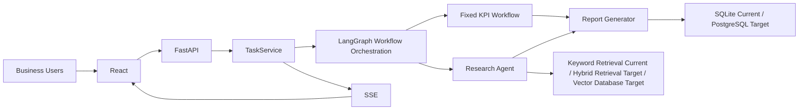
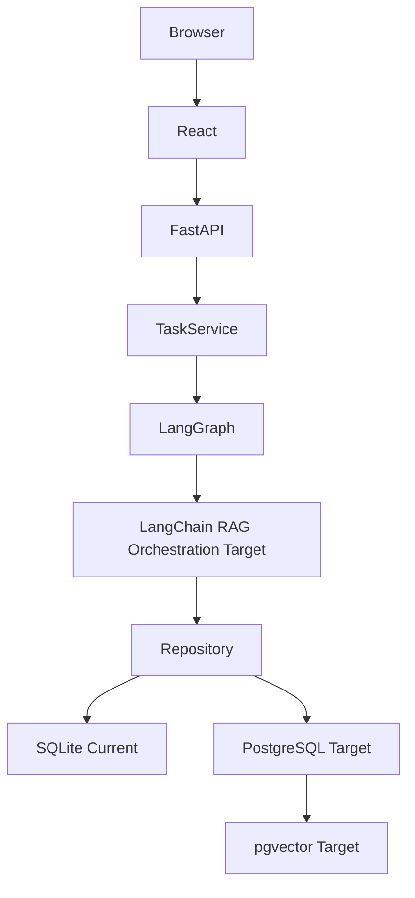
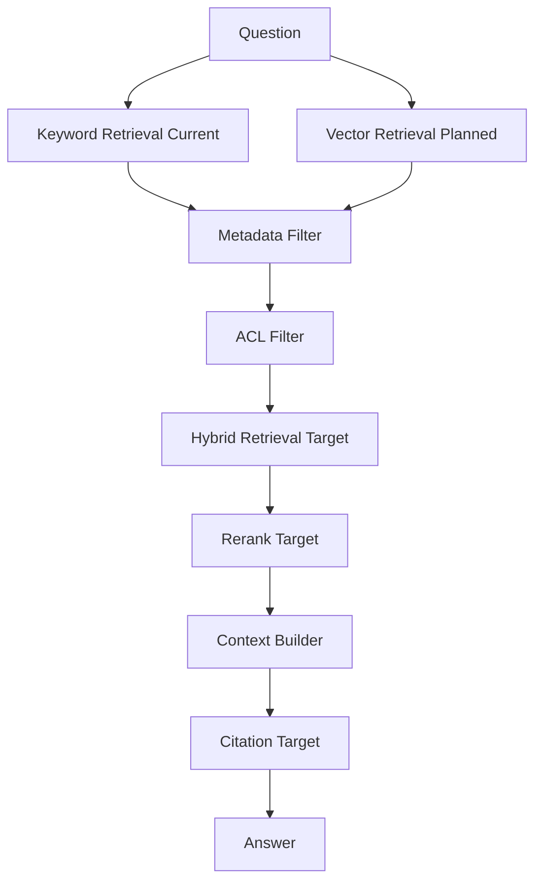
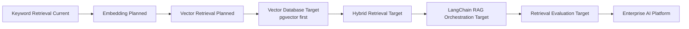
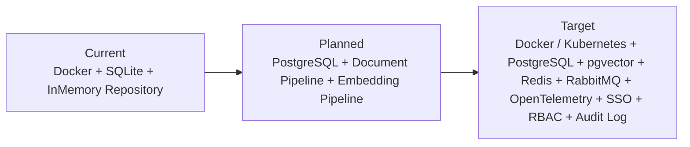
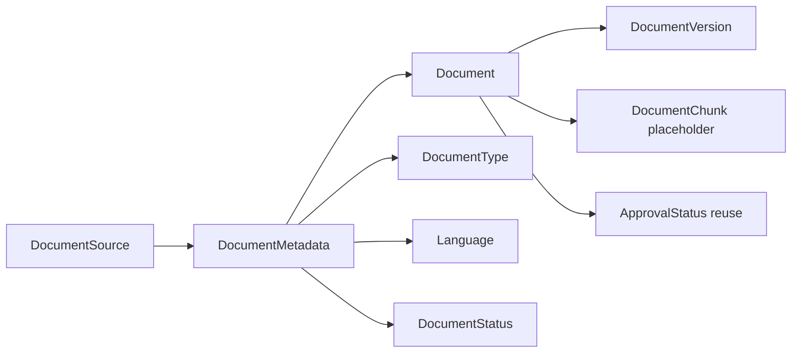
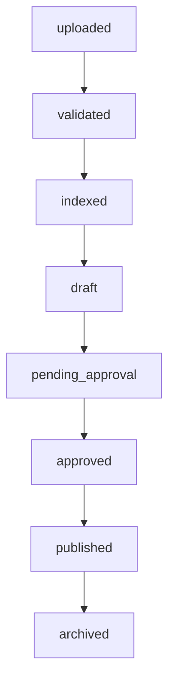
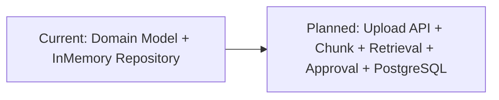

# 09_系统设计书

> **V1.0 现状指针**：运行与分层以 `docs/architecture/ARCHITECTURE.md` 与仓库源码为准；本文保留系统设计叙述。业务链 `文書管理→RAG→AI分析→董事会报告→承認→Audit`。


# 目录

- [1. 项目概要](#1-项目概要)
- [2. 系统目标](#2-系统目标)
- [3. 业务背景](#3-业务背景)
- [4. 用户角色](#4-用户角色)
- [5. 功能列表](#5-功能列表)
- [6. 非功能需求](#6-非功能需求)
- [7. 系统架构](#7-系统架构)
- [7.0 Technical Architecture（技术架构总览）](#70-technical-architecture技术架构总览)
- [8. API设计](#8-api设计)
- [9. DB设计](#9-db设计)
- [10. LangGraph设计](#10-langgraph设计)
- [11. Agent设计](#11-agent设计)
- [12. RAG设计](#12-rag设计)
- [13. 权限设计](#13-权限设计)
- [14. 审计设计](#14-审计设计)
- [15. 日志设计](#15-日志设计)
- [16. 监控设计](#16-监控设计)
- [17. 容灾设计](#17-容灾设计)
- [18. 部署设计](#18-部署设计)
- [19. 运维设计](#19-运维设计)
- [20. Production Gap](#20-production-gap)
- [Appendix A Document Platform Design](#appendix-a-document-platform-design)
- [A.1 Document Domain Model](#a1-document-domain-model)
- [A.2 Upload API Contract](#a2-upload-api-contract)
- [A.3 Upload Workflow](#a3-upload-workflow)
- [A.4 Import Pipeline](#a4-import-pipeline)
- [A.5 Read API](#a5-read-api)
- [A.6 Archive API](#a6-archive-api)

本文是 `Enterprise Retail Intelligence Platform (ERIP)` 的基本设计书。Enterprise Retail Intelligence Platform（ERIP）V1.0 已正式交付，并投入企业使用；当前能力与企业运行架构以 `PROJECT_BIBLE.md` 为准。

## Project Positioning

### Current Platform

当前项目名称统一为 `Enterprise Retail Intelligence Platform (ERIP)`，当前定位是大手流通集团企业经营分析平台。

### System Architecture

平台名称统一为：

`Enterprise Retail Intelligence Platform (ERIP)`

### Enterprise Deployment

本设计书中所有平台化能力统一按正式交付与企业运行架构描述。

## Architecture Principles

- Platform First
- Domain Driven
- Provider Pattern
- Repository Pattern
- Workflow Driven
- Configuration First
- Test First
- Documentation First
- Backward Compatibility

Related ADR:

- `ADR-002 引入 TaskService`
- `ADR-003 使用 LangGraph Workflow`
- `ADR-017 Repository 隔离持久化实现`

## Definition of Done

任何一个 Phase 完成必须满足：

- Code
- Unit Test
- Integration Test
- Frontend Test
- Handbook
- Changelog
- Decision Record
- Architecture Update
- Mermaid Diagram Update
- Task Update

## Enterprise Architecture Freeze

### Production Architecture

- 当前系统已作为企业经营分析平台运行。
- 当前主链路聚焦 Task、Workflow、KPI、Research、Report、SSE。
- 当前已覆盖平台化目录、文档入库、审批流、互联网检索和 PostgreSQL 主事实层。

### System Architecture

- 平台名称为 `Enterprise Retail Intelligence Platform (ERIP)`。
- 所有能力围绕 Platform、Domain、Infrastructure、Frontend、Documentation、Data、Template、Test 分层运行。

### Runtime Architecture

- 架构与接口已冻结。
- 文件输入、事务持久化、检索、审批与外部 Provider 已纳入统一运行架构。

### Risks

- 抽象过早增加复杂度。
- 抽象过晚导致后续各 Phase 反复返工。

## Retrieval and RAG Platform Positioning

### Runtime Architecture

当前已落地完整 Retrieval and RAG Platform。

### Production Architecture

Retrieval and RAG Platform 明确包括：

- 结构化业务数据检索
- 社内文档检索
- 互联网检索
- 上下文合并
- 引用与来源追踪
- 幻觉风险控制
- 检索评估

### Enterprise Deployment

RAG 在本项目中不只表示社内文档问答，已经覆盖企业知识检索与报告生成链路。

## 文档同步与测试模板规则

- 每个 Phase 完成后，必须同步回写本设计书中的受影响章节。
- 涉及测试方法的章节必须采用统一模板：
  用例目标、前端操作流程、后端处理流程、数据输入来源、预期输出、验收标准、Mermaid 前端流程图、Mermaid 后端流程图。
- 涉及流程与架构的章节必须与 `docs/ARCHITECTURE.md`、`08_架构图册.md` 保持一致，不允许主项目和 handbook 出现两套冲突流程。

## 1. 项目概要

| 项目                    | 内容                                                                                                                          |
| ----------------------- | ----------------------------------------------------------------------------------------------------------------------------- |
| 系统名称                | Enterprise Retail Intelligence Platform (ERIP)                                                                                |
| 平台版本                | Enterprise Retail Intelligence Platform（ERIP）V1.0                                                                           |
| 日文名称                | 小売業向け AI 経営分析システム                                                                                                |
| 客户类型                | 日本中大型零售企业                                                                                                            |
| 主要用户                | 经营层、经营企画、商品部、库存管理、会员运营、门店负责人、IT 部门                                                             |
| 主要输入                | POS、库存、商品、会员、销售、门店、CSV、Excel、API、日报、月报                                                                |
| 主要输出                | KPI、异常提示、市场与竞品调查结果、日文经营分析报告                                                                           |
| Runtime Architecture    | FastAPI、Task API、TaskService、LangGraph Workflow、Fixed KPI Workflow、Research Agent、SSE、Report Generator、SQLite、Docker |
| Production Architecture | PostgreSQL、Redis、RabbitMQ、SSO、RBAC、Audit Log、OpenTelemetry、Kubernetes                                                  |

系统范围从分析任务受理开始，到报告保存、进度通知和结果读取结束。上游 POS 与业务系统的源数据生成、管理层的最终经营决策不属于本系统责任。

## 2. 系统目标

| ID     | 目标                                   | 验收观点                             |
| ------ | -------------------------------------- | ------------------------------------ |
| OBJ-01 | 缩短经营会议前的数据整理与报告制作时间 | 任务可从统一入口发起并自动生成报告   |
| OBJ-02 | 固定 KPI 计算口径                      | 同一数据版本与规则版本可复算         |
| OBJ-03 | 为市场与竞品结论保留证据               | Research 输出包含来源与更新时间      |
| OBJ-04 | 让长时间任务可观察                     | 可查询任务状态并通过 SSE 接收进度    |
| OBJ-05 | 支持障害调查与影响分析                 | request_id、task_id、trace_id 可关联 |
| OBJ-06 | 为企业运用建立权限与审计基础           | RBAC 与 Audit Log 在正式开放前完成   |

不以“增加 Agent 数量”作为目标。Agent 只用于调查路径不确定、且能够被权限与 Tool 边界约束的任务。

## 3. 业务背景

日本零售企业在固定经营会议前，需要跨部门收集销售、库存、商品、会员、促销、市场与竞品信息。当前业务面临以下问题：

- 数据来源分散，CSV、Excel、API 和内部资料格式不统一。
- KPI 计算口径可能随担当者变化，历史报告难以复算。
- 市场与竞品信息缺少统一来源记录。
- 报告制作耗时，任务执行状态不可见。
- 部门和门店权限不同，报告与内部资料存在访问边界。

目标业务流程：

```text
数据接入与校验
→ Fixed KPI Workflow
→ Research Agent
→ Report Generator
→ 管理层 Review
→ 改善行动
```

## 4. 用户角色

| 角色         | 主要操作                   | 数据范围           | 高风险操作        |
| ------------ | -------------------------- | ------------------ | ----------------- |
| 经营层       | 查看全社 KPI 与管理层报告  | 经授权的全社范围   | 报告批准          |
| 经营企画     | 创建分析任务、查看综合报告 | 经授权的部门与门店 | 报告再生成        |
| 商品部       | 查看商品、毛利、促销分析   | 商品与负责区域     | 商品资料 Research |
| 库存管理     | 查看欠品、过剩、周转分析   | 仓库与门店范围     | 库存规则确认      |
| 会员运营     | 查看会员与促销响应         | 经脱敏的会员范围   | 会员数据导出      |
| 门店负责人   | 查看本店结果               | 自门店             | 无跨店访问        |
| 数据分析担当 | 数据导入、口径确认         | 经授权的数据集     | 数据版本发布      |
| IT 运维      | 配置、监控、障害対応       | 系统元数据         | 运维操作          |
| 审计担当     | 查询 Audit Log             | 审计数据           | 审计导出          |

角色不能直接等同数据范围；授权结果必须同时包含 role 与 department / store scope。

## 5. 功能列表

| ID   | 功能           | 说明                                                         | 当前状态       |
| ---- | -------------- | ------------------------------------------------------------ | -------------- |
| F-01 | 创建分析任务   | 校验输入并返回 task_id                                       | 已实现         |
| F-02 | 查询任务状态   | 返回 queued / running / completed / failed                   | 已实现         |
| F-03 | 订阅任务事件   | SSE 推送 started / status / error / done                     | 已实现         |
| F-04 | Fixed KPI 分析 | 销售、库存、商品、会员、促销 KPI                             | 已实现         |
| F-05 | Research       | 市场、竞品、内部资料调查                                     | 已实现         |
| F-06 | 报告生成       | 合并 KPI、Research、来源与风险                               | 已实现         |
| F-07 | 报告保存与读取 | 按 task_id 保存和读取                                        | 已实现         |
| F-08 | 数据导入校验   | CSV / Excel Schema 与业务规则校验                            | 已实现边界     |
| F-09 | SSO            | 对接客户统一身份                                             | Production Gap |
| F-10 | RBAC           | 角色与数据范围授权                                           | Production Gap |
| F-11 | Audit Log      | 记录关键操作与结果                                           | Production Gap |
| F-12 | 分布式任务执行 | RabbitMQ 与 Worker Pool                                      | Production Gap |
| F-13 | 企业检索       | Keyword Retrieval / Hybrid Retrieval / Vector Database + ACL | Production Gap |
| F-14 | 人工审批       | 报告批准、退回与恢复                                         | Production Gap |

## 6. 非功能需求

| 分类     | 设计要求                                        | 确认方式                |
| -------- | ----------------------------------------------- | ----------------------- |
| 可用性   | API、任务执行、SSE、数据层分别定义健康状态      | Health Check 与障害演练 |
| 性能     | 分别测量受理延迟、队列等待、Node 延迟、完成时间 | Load Test 与 Trace      |
| 扩展性   | API、SSE、KPI、Research、Report 可独立扩展      | Worker 与部署单元评审   |
| 安全性   | SSO、RBAC、Secret 外部化、默认拒绝              | 权限测试与安全 Review   |
| 可追踪性 | request_id、task_id、trace_id 全链路关联        | 日志与 OpenTelemetry    |
| 审计性   | 关键操作不可遗漏，敏感正文不进入审计            | Audit Log Review        |
| 可恢复性 | 数据备份、checkpoint、重试与 rollback           | Restore Test            |
| 可维护性 | 层次与依赖方向固定，契约可测试                  | Architecture Test       |
| 数据质量 | 来源、版本、期间、导入结果可追踪                | 数据校验报告            |
| AI 质量  | 来源正确、输出结构稳定、失败可降级              | Offline Evaluation      |

SLA、SLO、Error Budget 的具体数值由业务部门与 IT 部门在正式运用前共同确定，本设计不虚构容量或可用性数值。

## 7. 系统架构



架构规则：

- Frontend 不拥有任务事实。
- API 不包含 Workflow 和 SQL 逻辑。
- TaskService 不包含 KPI、Research、Report 内部算法。
- LangGraph Node 不直接处理 HTTP。
- Repository 是业务层访问存储的唯一边界。
- Agent 不能绕过 Tool Layer、权限和 Audit Log。

## 7.0 Technical Architecture（技术架构总览）

本章补充企业级技术栈视角，用于回答“系统由哪些技术层组成、当前处于什么状态、未来如何演进”。它不替代 `ROADMAP.md`、`TASK.md` 或 `PROJECT_BACKLOG.md`，而是把这些规划收束为一张可执行的技术架构说明。
所有 Mermaid 统一维护在 `08_架构图册.md` Figure `28~35`；本章负责设计原因、边界、阶段状态与 ADR 引用。

### Technology Stack Overview

| Layer                        | Responsibility                                   | Runtime Architecture                                                           | Enterprise Deployment                                                                                                | Production Architecture                                                         |
| ---------------------------- | ------------------------------------------------ | ------------------------------------------------------------------------------ | -------------------------------------------------------------------------------------------------------------------- | ------------------------------------------------------------------------------- |
| Presentation Layer           | 提供浏览器交互、任务发起、进度订阅和结果展示入口 | React、TypeScript、本地联调 UI                                                 | 补齐更完整的业务页面与学习入口                                                                                       | 企业级前端门户与权限感知界面                                                    |
| HTTP Boundary Layer          | 对外暴露稳定 API、SSE、Health 和错误边界         | FastAPI、Pydantic、Swagger、SSE                                                | 扩展更多企业接口契约                                                                                                 | 保持 FastAPI 边界稳定并接入企业网关体系                                         |
| Application Service Layer    | 负责任务受理、文档、审批、安全、审计等应用编排   | TaskService、Document Services、ApprovalService、SecurityService、AuditService | 增加更多服务边界与契约测试                                                                                           | 形成可替换、可审计的 Application Service 体系                                   |
| Workflow Orchestration Layer | 管理任务状态机、节点路由、重试与未来 checkpoint  | LangGraph = Workflow Orchestration                                             | 补齐 checkpoint、恢复与多工作流治理                                                                                  | LangGraph 持续作为企业工作流与状态机核心                                        |
| AI Execution Layer           | 执行 KPI、Research、Answer 组装等 AI 相关步骤    | Fixed KPI Workflow、Research Agent、Deterministic Internal RAG                 | LangChain = RAG Orchestration，仅补充 Retriever、Prompt、Context Builder、Tool Calling、Document Pipeline、Embedding | 保持 LangGraph + LangChain 分层协作，而非互相替代                               |
| Knowledge & Retrieval Layer  | 管理知识接入、检索、引用、评估与演进路径         | Keyword Retrieval、Chunk、InMemory Repository                                  | Embedding、Vector Retrieval、Citation、Rerank、Retrieval Evaluation                                                  | Hybrid Retrieval、Vector Database（pgvector first；Qdrant / Milvus extensible） |
| Data & Persistence Layer     | 保存任务、事件、报告、文档、审批与未来向量事实   | Repository Pattern、InMemory Repository、SQLite                                | PostgreSQL Repository 继续扩展，向量接口先冻结                                                                       | PostgreSQL + pgvector，必要时扩展 Qdrant / Milvus                               |
| Infrastructure Layer         | 保证运行环境一致性、部署、缓存、队列与观测基础   | Docker、本地运行基线                                                           | Redis、RabbitMQ、OpenTelemetry                                                                                       | Kubernetes、企业级配置、观测与恢复体系                                          |
| Security & Governance Layer  | 管理身份、权限、审计、数据边界与运维治理         | Placeholder current user、Approval RBAC、InMemory Audit Log                    | 扩展到更完整的 RBAC、审计和策略治理                                                                                  | SSO、全链路 RBAC、独立 Audit Log、企业合规控制                                  |

技术口径统一如下：

- Current Retrieval 统一使用 `Keyword Retrieval (Current)`。
- Production Retrieval 统一使用 `Hybrid Retrieval`，表示 `Keyword + Vector`。
- Vector Layer 统一使用 `Vector Database`，第一优先是 `pgvector`，支持扩展 `Qdrant / Milvus`。
- `LangGraph = Workflow Orchestration`，`LangChain = RAG Orchestration`。

Related ADR:

- `ADR-003 使用 LangGraph Workflow`
- `ADR-007 企业数据迁移 PostgreSQL`
- `ADR-013 使用 Docker 标准化环境`
- `ADR-015 RAG 使用 Hybrid Search 与 Rerank`
- `ADR-017 Repository 隔离持久化实现`

See: `12_ADR.md`

### Layered Architecture

See Figure `28. Technology Stack Architecture` and Figure `33. Container Architecture`.



分层原则：

- React 负责表现层，不负责业务状态机。
- FastAPI 负责 HTTP Boundary，不负责 Workflow 内部状态。
- TaskService 与其他 Service 负责 Application Service 编排。
- LangGraph 负责 Workflow / State Machine。
- LangChain 仅在未来负责 RAG Orchestration，不替代 LangGraph。
- Repository 负责 Persistence，不承载业务编排。

### AI Framework Relationship

See Figure `29. AI Framework Relationship` and Figure `34. AI Component Architecture`.

| Component   | Primary Responsibility                                                                            | Why This Boundary Exists                               |
| ----------- | ------------------------------------------------------------------------------------------------- | ------------------------------------------------------ |
| FastAPI     | HTTP Boundary、API Contract、SSE、Health                                                          | 保证接口层稳定，不把工作流和存储细节暴露到 HTTP 层     |
| TaskService | Application Service、任务受理、状态收口、异步启动                                                 | 统一“先创建 Task，再启动 Workflow”的应用编排责任     |
| LangGraph   | Workflow Orchestration、State Machine、Checkpoint                                                 | 适合表达任务流转、节点状态、分支、重试与恢复           |
| LangChain   | RAG Orchestration、Retriever、Prompt、Context Builder、Tool Calling、Document Pipeline、Embedding | 适合组织 RAG 组件，不应该接管业务工作流状态机          |
| Repository  | Persistence、事实保存、后端切换                                                                   | 保持存储实现可替换，避免业务代码绑定具体数据库或向量库 |

职责划分说明：

- `FastAPI -> TaskService`：先建立稳定的 HTTP 与应用服务边界。
- `TaskService -> LangGraph`：由应用服务决定什么时候进入工作流。
- `LangGraph -> LangChain`：LangGraph 调用 RAG 编排能力，不持有 RAG 组件内部细节。
- `LangChain -> Repository / Vector Store Interface`：LangChain 未来负责 Retriever、Context Builder 和 Embedding Pipeline，但数据落盘仍由 Repository / Vector Store 边界负责。

Related ADR:

- `ADR-001 使用 Task API`
- `ADR-002 引入 TaskService`
- `ADR-003 使用 LangGraph Workflow`
- `ADR-005 Research Agent 独立`
- `ADR-017 Repository 隔离持久化实现`

See: `12_ADR.md`

### Retrieval Pipeline

See Figure `30. Retrieval Pipeline`.



状态说明：

- Current：`Keyword Retrieval (Current)` 是当前唯一已落地的检索能力。
- Enterprise Deployment：`Embedding`、`Vector Retrieval`、`Metadata Filter`、`ACL Filter`、`Context Builder` 已纳入运行架构。
- Production Architecture：`Hybrid Retrieval`、`Rerank`、`Citation`、`Retrieval Evaluation`、`Vector Database` 已属于企业级运行能力。

### Technology Evolution

See Figure `31. Technology Evolution`.



演进规则：

- 不把 `Embedding`、`Vector Database`、`LangChain` 写成当前已实现。
- `pgvector` 是第一优先，不等于排斥 `Qdrant / Milvus`，而是确定第一落点。
- `LangGraph` 在整个演进过程中持续保留为 Workflow Orchestration。

### Enterprise Deployment

See Figure `32. Enterprise Deployment Topology`.



部署说明：

- Current 仍以 Docker、SQLite、本地 Repository 为主。
- Planned 进入 PostgreSQL、文档流水线和向量化准备阶段。
- Target 才进入 Kubernetes、Redis、RabbitMQ、OpenTelemetry、SSO、全链路 RBAC 与企业审计。

### Runtime Architecture Matrix

| Capability        | Runtime Architecture                     | Enterprise Deployment               | Production Architecture                    |
| ----------------- | ---------------------------------------- | ----------------------------------- | ------------------------------------------ |
| Backend           | FastAPI                                  | FastAPI + More Enterprise Contracts | FastAPI                                    |
| Workflow          | LangGraph                                | LangGraph + Checkpoint Preparation  | LangGraph                                  |
| RAG Orchestration | No LangChain                             | LangChain Planning                  | LangChain                                  |
| Retrieval         | Keyword Retrieval                        | Embedding + Vector Retrieval        | Hybrid Retrieval                           |
| Embedding         | No                                       | Provider Interface + Pipeline       | Yes                                        |
| Vector Database   | No                                       | Vector Store Interface              | pgvector first, Qdrant / Milvus extensible |
| Repository        | InMemory / SQLite first                  | PostgreSQL migration expansion      | PostgreSQL + pgvector                      |
| Deployment        | Docker                                   | Docker + PostgreSQL preparation     | Docker + Kubernetes                        |
| Cache             | No                                       | Redis planning                      | Redis                                      |
| Queue             | No                                       | RabbitMQ planning                   | RabbitMQ                                   |
| Observability     | Structured logs only                     | OpenTelemetry planning              | OpenTelemetry                              |
| Security          | Placeholder current user + approval RBAC | Wider RBAC planning                 | SSO + full RBAC + enterprise Audit Log     |

## 8. API设计

### 8.1 API 一览

| Method | Path                            | 用途         | 成功结果                 |
| ------ | ------------------------------- | ------------ | ------------------------ |
| POST   | `/api/tasks`                  | 创建分析任务 | task_id、accepted 状态   |
| GET    | `/api/tasks/{task_id}`        | 查询任务状态 | 当前状态、进度、错误摘要 |
| GET    | `/api/tasks/{task_id}/events` | 订阅 SSE     | 事件流                   |
| GET    | `/api/tasks/{task_id}/report` | 读取报告     | 报告与 metadata          |
| GET    | `/api/health`                 | 健康检查     | 组件状态                 |

### 8.2 共通设计

- 请求必须包含或生成 request_id。
- 创建任务支持幂等键；幂等范围包含用户、请求参数和有效期间。
- 错误响应包含 code、message、request_id，已创建任务还包含 task_id。
- 认证与授权失败不创建任务。
- report API 在读取时重新检查权限，不只依赖任务创建时权限。
- API 版本变更遵循向后兼容，破坏性变更采用新版本路径。

## 9. DB设计

### 9.1 逻辑表

| 表             | 主键         | 主要内容               | 数据责任   |
| -------------- | ------------ | ---------------------- | ---------- |
| users          | user_id      | 用户与组织引用         | 身份关联   |
| stores         | store_id     | 门店主数据             | 业务主数据 |
| products       | product_id   | 商品、分类、价格、成本 | 业务主数据 |
| members        | member_id    | 会员引用与必要属性     | 受限数据   |
| sales          | sale_id      | 销售事实               | KPI 来源   |
| inventory      | inventory_id | 库存快照               | KPI 来源   |
| tasks          | task_id      | 状态、参数摘要、版本   | 任务事实   |
| task_events    | event_id     | 状态事件               | 进度恢复   |
| reports        | report_id    | 报告、版本、状态       | 业务交付物 |
| report_sources | source_id    | 报告引用来源           | 证据链     |
| audit_logs     | audit_id     | 操作、对象、结果       | 审计事实   |

### 9.2 数据规则

- 当前 SQLite / CSV 通过 Repository 访问；企业目标迁移 PostgreSQL。
- 业务数据、系统数据、审计数据分域，不共享无边界事务。
- tenant_id、department_id、store_id 作为企业扩展字段进入访问路径。
- 原始文件保存 hash、来源部门、导入时间、Schema 版本和导入结果。
- 迁移必须执行件数、金额、期间和抽样明细校验。

## 10. LangGraph设计

### 10.1 State

| 字段            | 生产者        | 消费者               | 说明             |
| --------------- | ------------- | -------------------- | ---------------- |
| task_id         | TaskService   | 全 Node              | 关联任务         |
| request         | API / Route   | Route、KPI、Research | 结构化输入       |
| route           | Route Node    | Edge                 | 执行路径         |
| kpi_result      | KPI Node      | Report Node          | 版本化 KPI       |
| research_result | Research Node | Report Node          | 摘要、来源、风险 |
| errors          | 各 Node       | TaskService、Report  | 结构化错误       |
| report_ref      | Report Node   | TaskService          | 报告引用         |

### 10.2 Node 与 Edge

| Node     | 输入              | 输出            | 失败处理           |
| -------- | ----------------- | --------------- | ------------------ |
| route    | request           | route           | 未知输入安全失败   |
| kpi      | request、数据引用 | kpi_result      | 核心失败终止       |
| research | request、权限     | research_result | 可降级             |
| report   | KPI、Research     | report_ref      | 保留中间结果后重试 |

所有 Edge 必须有终止路径；副作用 Node 在 retry 前确认幂等性。正式运用时 checkpoint 持久化到 PostgreSQL，并保存 State Schema 版本。

## 11. Agent设计

Research Agent 的责任限定为市场趋势、竞品调查与内部资料检索。

| 控制项  | 设计                                      |
| ------- | ----------------------------------------- |
| 输入    | 结构化问题、用户权限、数据期间、调查类型  |
| Tool    | allowlist 管理，按调查类型与权限开放      |
| 输出    | summary、sources、updated_at、risk、error |
| timeout | Tool 级与 Research 总时限分离             |
| retry   | 仅临时错误，次数受限                      |
| 终止    | 最大 Tool 次数、总时间与预算              |
| 降级    | 保留 KPI，报告明确 Research 缺失          |
| 审计    | 记录 Tool、对象标识、结果和 trace_id      |

Fixed KPI Workflow 不属于 Agent。Multi Agent 仅在职责、权限或扩展特性明确分离时启用。

## 12. RAG设计

### 12.1 数据源

- 商品政策与说明资料。
- 月次报告与会议资料。
- 促销规则与库存处理规则。
- 经授权的内部 Wiki 与 FAQ。

### 12.2 处理链

高层处理链统一以 Chapter `7.0 Retrieval Pipeline` 和 Figure `30. Retrieval Pipeline` 为准。本章不重复维护第二套检索演进说明。

### 12.3 设计要求

- Chunk 保存 document_id、section、version、updated_at、department、store_scope。
- Query 必须携带用户权限，检索后再次验证 ACL。
- 商品代码与固有名词优先关键词检索，抽象问题组合语义检索。
- 文档更新、删除、权限变化触发增量索引。
- 评价覆盖 recall@k、MRR、引用正确性、groundedness、延迟和无结果率。

## 13. 权限设计

### 13.1 授权模型

```text
可信身份
× Role Permission
× Tenant / Department / Store Scope
× Resource State
= Authorization Decision
```

### 13.2 权限点

| 资源            | 操作                        | 校验位置                   |
| --------------- | --------------------------- | -------------------------- |
| Task            | create、read、cancel、retry | API + TaskService          |
| Business Data   | read、import                | Service + Repository       |
| Research Source | search、read                | Tool Layer + Search Filter |
| Report          | read、regenerate、approve   | API + Report Service       |
| Configuration   | change                      | Admin Service              |
| Audit Log       | query、export               | Audit Service              |

权限默认拒绝。前端显示控制不构成安全边界。权限变更和拒绝访问进入 Audit Log。

## 14. 审计设计

### 14.1 审计事件

| 事件               | 必须字段                               |
| ------------------ | -------------------------------------- |
| task.created       | user_id、task_id、request_id、result   |
| data.imported      | source_id、schema_version、result      |
| tool.called        | task_id、tool_id、resource_ref、result |
| report.generated   | report_id、task_id、versions、result   |
| report.viewed      | user_id、report_id、scope、result      |
| permission.changed | actor、target、before、after           |
| access.denied      | user_id、resource_ref、reason          |

### 14.2 审计规则

- 不记录 Secret、完整 Prompt、会员原文或报告全文。
- 审计写入使用追加模式，访问权限独立于应用日志。
- 保留期限由客户合规要求确定。
- 高风险操作的审计写入失败时，操作默认失败关闭。

### 14.3 Phase 1 文件化输入实现

### Current State

- KPI 当前由本地 CSV 驱动
- Research 当前由本地 JSON 驱动
- Report 当前直接生成，状态为 `generated`

### Enterprise Deployment

- 后续审批状态扩展为：
  `draft / pending_approval / approved / rejected / revised`
- 当前文件输入层不依赖审批实现，因此不会阻碍后续承認ワークフロー接入

### 14.4 Phase 1.5 契约冻结与审批状态机设计

### Current State

- 当前只实现 `generated`
- 当前未实现审批 API
- 当前未实现 PostgreSQL

### Enterprise Deployment

- 冻结 Data Contract
- 冻结 Import Error Model
- 冻结 Approval State Machine
- 冻结 Phase 2 PostgreSQL 准备项

### 14.5 Phase 2 PostgreSQL Persistence MVP

### Current State

- 当前默认仍为 `InMemory Repository`
- 当前已新增可选 PostgreSQL Repository
- 当前 PostgreSQL 仅覆盖 Task、Event、Report 事实持久化
- 当前 Approval / Import 仅完成 schema 预留
- 当前状态：
  `Code implemented`
  `InMemory path verified`
  `PostgreSQL schema implemented`
  `PostgreSQL repository tests prepared`
  `PostgreSQL real integration test pending`
  `Status: In Progress / Partially Verified`

### Production Architecture

- 在不破坏现有 API / Workflow / SSE / Frontend 的前提下，建立事务事实持久化基础

### Enterprise Deployment

- 后续 Approval Workflow 复用 `reports.approval_status`、`report_versions`、`approval_requests`、`approval_events`
- 后续 Import 流程复用 `data_imports`、`import_errors`
- 当前未验证原因：
  当前环境缺少 Docker CLI；当前环境未安装 `psycopg` 到实际运行 venv；PostgreSQL 集成测试当前被 skip。
- 下一步验证命令：
  `docker compose up -d postgres`
  `cd backend`
  `source .venv/bin/activate`
  `pip install -r requirements.txt`
  `REPOSITORY_BACKEND=postgres python -m unittest tests.test_postgres_repositories -v`

## 15. 日志设计

结构化日志共通字段：

| 字段          | 说明                        |
| ------------- | --------------------------- |
| timestamp     | 事件时间                    |
| level         | DEBUG / INFO / WARN / ERROR |
| service       | API、Worker、SSE 等         |
| environment   | dev / test / production     |
| request_id    | 请求关联                    |
| task_id       | 任务关联                    |
| trace_id      | Trace 关联                  |
| user_id       | 经脱敏的操作者标识          |
| workflow_node | Node 名称                   |
| event         | 事件类型                    |
| duration_ms   | 处理时间                    |
| error_code    | 结构化错误                  |

禁止把 API Key、Token、会员数据、完整 Prompt 与内部资料正文写入日志。日志、Audit Log、业务数据的用途和权限必须分离。

## 16. 监控设计

| 层       | 指标                              | 主要告警                 |
| -------- | --------------------------------- | ------------------------ |
| API      | 请求数、延迟、错误率、限流数      | 错误率与延迟异常         |
| Task     | queued、running、failed、完成时间 | 长时间 running、失败突增 |
| Queue    | depth、oldest age、consume rate   | 积压与消费者停止         |
| Workflow | Node 延迟、retry、fallback        | 特定 Node 异常           |
| Research | Tool 成功率、timeout、成本        | 外部依赖异常             |
| SSE      | 连接数、断线、重连                | 重连失败与连接异常       |
| DB       | 连接、慢查询、锁、存储            | 连接耗尽与慢查询         |
| RAG      | 无结果率、recall、引用正确性      | 检索质量下降             |
| Report   | 成功率、验证失败、生成时间        | 报告失败突增             |

OpenTelemetry 负责 Trace、Metrics、Logs 关联；告警必须指定 Owner、严重度、初步操作和升级路径。

## 17. 容灾设计

### 17.1 故障边界

| 故障               | 业务影响               | 恢复策略                   |
| ------------------ | ---------------------- | -------------------------- |
| API 实例故障       | 新请求受影响           | 多实例摘除故障节点         |
| SSE 连接中断       | 进度暂不可见           | 重连与状态 API 兜底        |
| Worker 故障        | 在途任务中断           | checkpoint + Queue 重投    |
| Redis 故障         | 热状态与事件不可用     | PostgreSQL 回退与缓存重建  |
| RabbitMQ 故障      | 新任务不能分发         | 恢复 Queue 后继续消费      |
| PostgreSQL 故障    | 任务事实与报告不可用   | 备份恢复或高可用切换       |
| Research Tool 故障 | 外部调查缺失           | Circuit Breaker + 降级报告 |
| 模型故障           | Research / Report 失败 | 受控 fallback 或等待恢复   |

### 17.2 恢复要求

- RPO、RTO 由业务影响与客户运维标准确定。
- 备份完成不代表可恢复，必须执行 restore test。
- 恢复后核对任务终态、报告版本、审计连续性和重复执行。
- 灾害恢复手册记录判断人、执行人、沟通路径和恢复确认。

## 18. 部署设计

### 18.1 环境

| 环境        | 目的                 | 数据         |
| ----------- | -------------------- | ------------ |
| Development | 开发与单体确认       | 合成数据     |
| Test        | 结合测试与性能基线   | 脱敏测试数据 |
| Staging     | 发布前验证与恢复演练 | 生产相似数据 |
| Production  | 正式业务             | 受控生产数据 |

### 18.2 部署单元

- Frontend。
- FastAPI API。
- SSE Service。
- KPI Worker。
- Research Worker。
- Report Worker。
- OpenTelemetry Collector。

当前以 Docker 保证环境一致性。企业目标部署 Kubernetes 或客户标准容器平台；发布前验证 DB Migration、State / Checkpoint 兼容和 rollback。

## 19. 运维设计

### 19.1 日常运维

- 确认任务失败率、队列等待、SSE 连接和报告成功率。
- 确认数据导入批次、Schema 变化和索引更新。
- 确认权限变更、拒绝访问和 Audit Log 异常。
- 确认模型、Tool、数据库、Redis、RabbitMQ 健康状态。
- 确认 Token / 成本趋势与容量余量。

### 19.2 障害対応

```text
影响确认
→ 止血与业务沟通
→ request_id / task_id / trace_id 调查
→ 恢复
→ 根因分析
→ 恒久对应
→ 再发防止与 Runbook 更新
```

### 19.3 变更管理

KPI、Prompt、Template、Workflow State、DB Schema、权限和部署配置全部版本化。高风险变更必须包含影响调查、测试证据、批准与 rollback 条件。

## 20. Production Gap

| 优先级 | 项目                               | 当前             | 完成条件                    |
| ------ | ---------------------------------- | ---------------- | --------------------------- |
| P0     | SSO                                | 身份上下文边界   | IdP 接入、停用与故障验证    |
| P0     | RBAC                               | 权限模型设计     | 全链路服务端校验与回归测试  |
| P0     | Audit Log                          | 字段与事件设计   | 独立存储、权限、保留策略    |
| P0     | PostgreSQL                         | SQLite / CSV     | 迁移、校验、备份、恢复      |
| P0     | OpenTelemetry                      | 关联 ID 与观测点 | Collector、Dashboard、Alert |
| P0     | Backup / Restore                   | 需求识别         | 首次恢复演练通过            |
| P0     | Rollback                           | 人工切回思路     | 应用、DB、State 联合演练    |
| P1     | Redis                              | 使用边界设计     | 多实例状态与事件恢复        |
| P1     | RabbitMQ                           | 队列设计         | 幂等、retry、DLQ、积压告警  |
| P1     | Load Test                          | 测量项定义       | 容量基线与瓶颈报告          |
| P1     | Hybrid Retrieval / Vector Database | 检索设计         | ACL、更新、离线评价         |
| P1     | CI/CD                              | 质量门禁设计     | 自动构建、验证、发布与回滚  |
| P1     | Kubernetes                         | 部署设计         | 伸缩、滚动发布、恢复验证    |
| P2     | Multi Tenant                       | 隔离点设计       | tenant 全链路隔离测试       |
| P2     | Multi Agent                        | 未来边界         | 角色价值与评价证据成立      |

Production Gap 关闭标准不是“组件已安装”，而是业务验收、测试证据、监控、Runbook、权限和恢复路径全部可用。

## Appendix A Document Platform Design

本附录集中收纳文档平台主题，避免 `Document Domain Model`、`Upload API`、`Read API`、`Archive API`、`Import Pipeline` 分散在正文主线和文档末尾，形成两套编号体系。

### A.1 Document Domain Model

#### Current State

- 当前已经补齐 Document / DocumentVersion / DocumentChunk placeholder / DocumentMetadata / DocumentSource。
- 当前只实现 InMemory Document Repository，还没有 Upload API、RAG、Chunk、pgvector 或 PostgreSQL Document Repository。
- `ImportBatch` 复用 `DataImport`，`ApprovalStatus` 复用现有审批状态语义。

#### Production Architecture

- Document Domain 作为 Upload、Version Management、Internal RAG、Approval Workflow、Retrieval 与 PostgreSQL Persistence 的共同基础。
- 所有文档相关能力都必须沿用本节定义的状态、类型、语言和元数据，不得重新发明另一套文档语义。

#### Enterprise Deployment

- 后续 Upload API、Document Pipeline、Chunk Pipeline、Retrieval Provider、Approval API 和 PostgreSQL Repository 都必须基于本节模型扩展。
- 当前阶段只允许 `uploaded` 作为新建文档的初始状态，未来状态仅作为生命周期占位与迁移边界。







### A.2 Upload API Contract

### Current State

当前 `POST /api/v1/documents` 已形成同步 MVP，当前仍以 backend-only、InMemory Repository 为主。

### Production Architecture

冻结 `POST /api/v1/documents`、`GET /api/v1/documents`、`GET /api/v1/documents/{document_id}`、`GET /api/v1/documents/{document_id}/versions`、`GET /api/v1/documents/{document_id}/chunks`、`DELETE /api/v1/documents/{document_id}` 以及对应的 document upload event contract。

### Enterprise Deployment

Upload API 只负责受理、校验、版本边界和事件发布；审批仍是未来独立能力。更细流程见 Figure `22. Document Upload API MVP`。

### A.3 Upload Workflow

### Current State

当前 Upload API 已形成同步 MVP，但 Upload Workflow、Error Catalog、Upload Policy 仍需要以统一边界维护。

### Production Architecture

统一维护 Upload Workflow、Upload Session、Idempotency、Error Catalog、Upload Policy，以及当前同步 MVP 的闭环约束。

### Enterprise Deployment

后续 Upload API 实现必须先遵守这组冻结契约。当前同步闭环包括：multipart/form-data、metadata 校验、SHA-256 checksum、重复检测、幂等处理、Repository save、事件发布与 `201 Created` 响应。更细流程见 Figure `22. Document Upload API MVP`。

### A.4 Import Pipeline

### Current State

`POST /api/v1/documents/{document_id}/import` 与 `GET /api/v1/document-imports/{import_id}` 已实现。

### Production Architecture

导入流水线成为 future chunking、internal RAG、全文检索和审批的前置边界。

### Enterprise Deployment

成功导入后，文档状态推进到 `validated`；导入失败时保留错误码与错误信息。当前不创建 chunk、不做检索、不做审批。详细流程见 Figure `27. Document Import API MVP`。

### A.5 Read API

### Current State

`GET /api/v1/documents` 与 `GET /api/v1/documents/{document_id}` 已实现。

### Production Architecture

低风险读取能力直接复用现有 `InMemoryDocumentRepository`，只在 service 层完成基础过滤与缺失文档映射。

### Enterprise Deployment

`DELETE`、`versions`、`chunks` 继续保持冻结未实现；PostgreSQL Document Repository 仍只设计不实现。

### A.6 Archive API

### Current State

`DELETE /api/v1/documents/{document_id}` 仍未实现。

### Production Architecture

DELETE 语义冻结为 archive / soft delete，不做物理删除；archived 文档默认不出现在列表中。

### Enterprise Deployment

`versions`、`chunks`、PostgreSQL Document Repository 仍只设计不实现。详细流程见 Figure `26. Document Archive API MVP`。

<!-- DOC-SYNC:START group=architecture -->

## 文档同步块

- group: `architecture`
- file: `ai-agent-retail-handbook-v3/09_系统设计书.md`
- self_sha256: `506bedbfe7ebcb7f81c127c63a3ace28ee8d3329261015d798bb5b6783032f2e`
- peers:
- `retail-insight-ai/docs/ARCHITECTURE.md` | sha256=99ec6a7ef9caa11ad9233e4d6e8d40c2a55ba621584fde27685bce1a52da50b0 | # retail-insight-ai Architecture / 最后更新：2026-06-29 / 本文件记录项目实际架构。未实现的能力必须明确标注，不得把规划写成现状。 / ## 技术架构图
- `retail-insight-ai/docs/DECISIONS.md` | sha256=fde8a8d32a6812c38add97db9042a1932dda711f32999bde03e862b86bef35d5 | # retail-insight-ai Architecture Decisions / 本文件保存 Architecture Decision Record（ADR）。不得删除已生效或已废弃的历史决策。 / ## ADR-001 / 日期：2026-06-29
- `ai-agent-retail-handbook-v3/03_AI核心知识.md` | sha256=b29ec1e0b01d85b5a69735c85dcc9e8cfac763e70e38b844dcca04cce5bb64e5 | # 03_AI核心知识 / ## 第一章 知识服务于项目 / 本书中的知识点只围绕 Retail Insight AI 展开。FastAPI、LangGraph、RAG、Streaming、Docker 都不是孤立知识，而是服务于日本小売業客户的经营分析任务。 / 【TL Review】
- `ai-agent-retail-handbook-v3/08_架构图册.md` | sha256=ab27e2cb38443f53f6aff5c2b5d5a495a1774894d29429f463b926c5993d4611 | # 08_架构图册 / # 目录 / - [1. Overall Architecture](#1-overall-architecture) / - [2. User to API Flow](#2-user-to-api-flow)
- `ai-agent-retail-handbook-v3/12_ADR.md` | sha256=1e6bffd61980a95594dd214ccd7db7261c5f63f13df186a392ead99cc8f47766 | # 12_ADR / # 目录 / - [ADR-001 使用 Task API](#adr-001-使用-task-api) / - [ADR-002 引入 TaskService](#adr-002-引入-taskservice)

说明：

- 这个块由 `scripts/sync_retail_handbook_docs.py` 自动维护。
- 只同步这个块，不覆盖各自正文。
- 任一组内文档正文变化时，整组文档的同步块都会一起刷新。

<!-- DOC-SYNC:END group=architecture -->
