# ai-agent-retail-handbook-v3 Architecture

最后更新：2026-07-04

本文件记录项目实际架构。未实现的能力必须明确标注，不得把规划写成现状。

## Project Positioning

### Current State

当前项目名称保持为：

`Retail Insight AI`

当前架构定位：

`Retail Analysis Domain Reference Implementation`

### Target State

未来平台目标名称：

`Enterprise Retail Intelligence Platform (ERIP)`

### Planned

ERIP 只表示目标平台架构，当前尚未全部实现。

## Handbook 同步规则

- 每个 Phase 完成后，必须同步更新本文件。
- 若架构变化涉及任务流、数据流、检索、审批、互联网检索或测试方法，必须同步更新 handbook 的相关章节。
- 若本文件未更新，不得把主项目对应 Phase 标记为完成。

## 企业化目录结构与待完善章节

```text
docs/ai-agent-retail-handbook-v3/
├── TASK.md
├── ROADMAP.md
├── 08_架构图册.md
├── 09_系统设计书.md
├── 10_Production_Roadmap.md
└── docs/
    ├── ARCHITECTURE.md
    ├── CHANGELOG.md
    ├── DECISIONS.md
    └── PROJECT_BACKLOG.md
```

待完善章节：

- 前端流程图
- 后端流程图
- 数据流图
- 数据库 ER 图
- LangGraph workflow 图
- 文档检索流程图
- 审批 workflow 图
- 互联网检索流程图
- 测试用例模板与图示约束

## Architecture Principles

- Platform First
- Domain Driven
- Provider Pattern
- Repository Pattern
- Workflow Driven
- Configuration First
- Test First
- Documentation First
- Backward Compatibility

## Target Architecture

### Current State

当前 handbook 主要记录单项目参考实现视角。

### Target State

未来 ERIP 目标逻辑分层：

```text
Platform
Domain
Provider
Workflow
Repository
Approval
Documents
Search
Import
Audit
Database
Frontend
```

### Planned

该结构是未来平台目标，不表示当前全部目录或模块已经存在。

## Definition of Done

未来任何一个 Phase 完成必须满足：

- Code
- Unit Test
- Integration Test
- Frontend Test
- Handbook
- Changelog
- Decision Record
- Architecture Update
- Mermaid Diagram Update
- Task Update

## Architecture Freeze

### Current Architecture

Current State

- 当前项目名称保持为 `Retail Insight AI`。
- 当前是零售分析领域参考实现，而非完整企业平台。
- 当前链路集中在 Task、Workflow、KPI、Research、Report 和 SSE。
- 当前尚未完成 PostgreSQL、Document Pipeline、审批流、互联网检索和平台级目录冻结。

### Target Architecture

Target State

- 未来平台目标为 `Enterprise Retail Intelligence Platform (ERIP)`。
- `Retail Insight AI` 保留为零售分析领域参考实现。
- 未来所有能力通过 Platform / Domain / Infrastructure 分层演进。

### Migration Strategy

Planned

1. 先冻结设计，再实施 Phase。
2. 先定义抽象边界，再替换具体实现。
3. 先落地事务事实存储，再引入搜索与向量能力。
4. 先保持接口兼容，再逐步完成目录与实现迁移。

### Planned State

- 本文档作为后续 handbook 讲解与主项目演进的统一基线。

### Risks

- 设计过重导致实现推进变慢。
- 冻结后若不持续同步，文档会再次失真。
- 多 Provider / 多 Repository 引入后测试成本会明显提升。

## Directory Refactor Design

### Current State

- 当前 handbook 记录的是真实目录和目标目录混合视图。

### Target State

未来目录设计：

```text
Platform Layer
Domain Layer
Infrastructure Layer
Frontend
Documentation
Data
Template
Test
```

### Planned State

```text
retail-insight-ai/
├── platform/
├── domain/
├── infrastructure/
├── frontend/
├── docs/
├── data/
├── templates/
└── tests/
```

当前尚未全部实现。

## Repository Abstraction Design

- Repository Interface
  职责：定义领域事实读写合同。
  输入：领域对象、查询条件。
  输出：领域对象、列表、可选结果。
  生命周期：长期稳定接口。
- InMemory Repository
  职责：本地运行与测试默认实现。
  输入：与 Interface 一致。
  输出：与 Interface 一致。
  生命周期：继续保留。
- PostgreSQL Repository
  职责：企业事务事实主存储。
  输入：领域对象、事务上下文、查询条件。
  输出：持久化领域事实。
  生命周期：未来主实现。
- Future Vector Repository
  职责：文档块、向量、相似检索。
  输入：文本块、向量查询。
  输出：Top-K 结果与来源。
  生命周期：Phase 4 以后引入。

抽象原因：

- 隔离本地实现与企业实现。
- 避免 Workflow 与 Service 直接依赖存储技术。
- 支持事务事实与向量事实分开治理。

## Provider Abstraction Design

### LLM Provider

- 职责：分析、摘要、格式化生成
- 输入：Prompt、上下文、参数
- 输出：结构化文本、元数据
- 生命周期：按调用装配

### Research Provider

- 职责：市场 / 竞品调研获取
- 输入：问题、业务上下文
- 输出：摘要、来源、风险
- 生命周期：当前可静态，未来可外部化

### Internal Search Provider

- 职责：社内知识检索
- 输入：查询、权限、Top-K
- 输出：文档块、评分、来源
- 生命周期：文档入库后启用

### Internet Search Provider

- 职责：互联网公开检索
- 输入：查询、来源白名单、时间窗口
- 输出：外部来源、摘要片段
- 生命周期：按配置启用

### Vector Provider

- 职责：向量生成与相似检索
- 输入：文本块、查询向量
- 输出：向量与相似结果
- 生命周期：Future Provider

### Prompt Provider

- 职责：Prompt 模板管理
- 输入：模板名、版本、变量
- 输出：最终 Prompt 与版本
- 生命周期：长期稳定

### Config Provider

- 职责：统一配置装配
- 输入：环境变量、配置文件、系统设置
- 输出：标准配置对象
- 生命周期：进程级

## Retrieval Layer Architecture

### Current State

- 当前尚未形成统一 Retrieval Layer。

### Target State

- 未来 Retrieval Layer 统一承接结构化业务检索、社内文档检索、互联网检索、上下文合并、引用追踪和评估。

### Planned

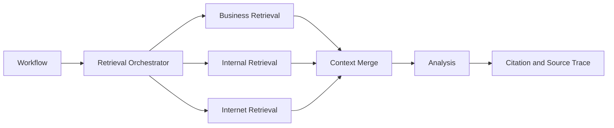

RAG 在本项目中不只包括社内文档，也包括结构化业务数据检索和互联网检索。

## Business Retrieval Flow

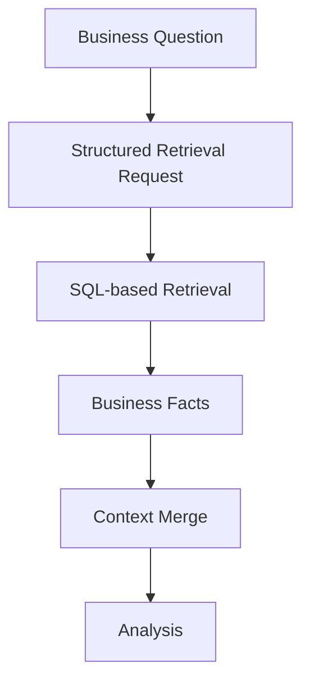

## Internal RAG Flow

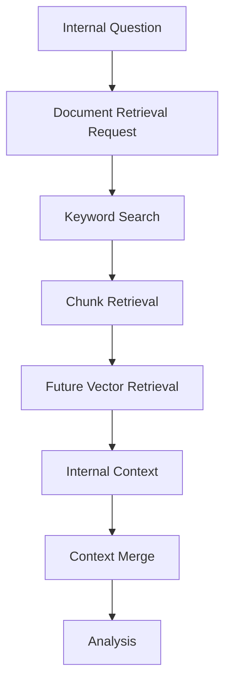

## Internet Search Flow

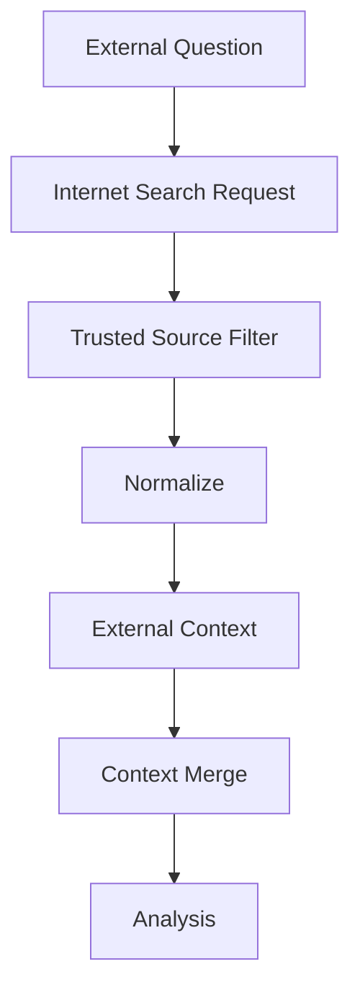

## Context Merge Flow

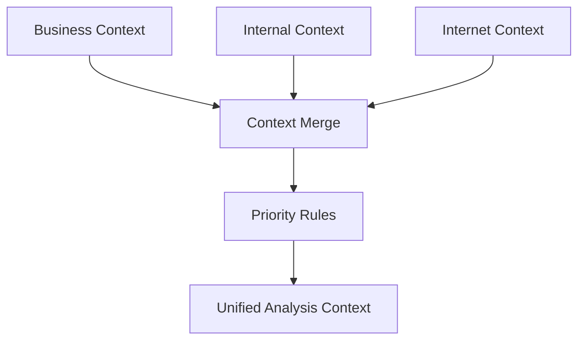

## Citation and Source Trace Flow

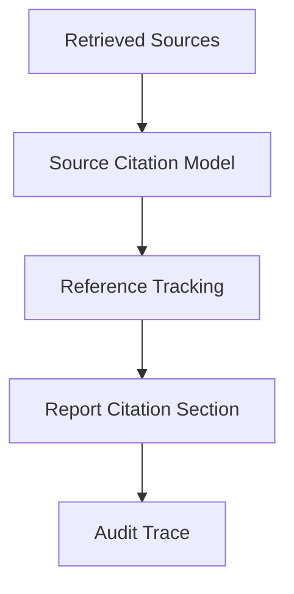

## Future Hybrid Search Architecture

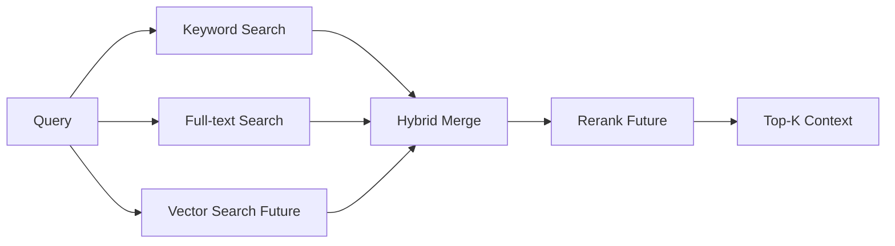

## Workflow Architecture

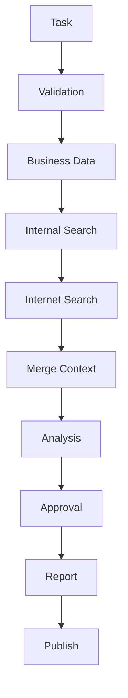

## Document Pipeline

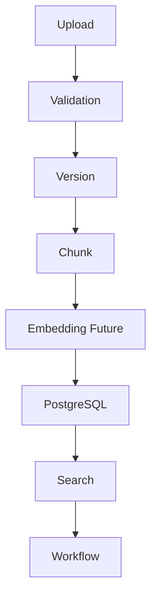

## Business Data Pipeline

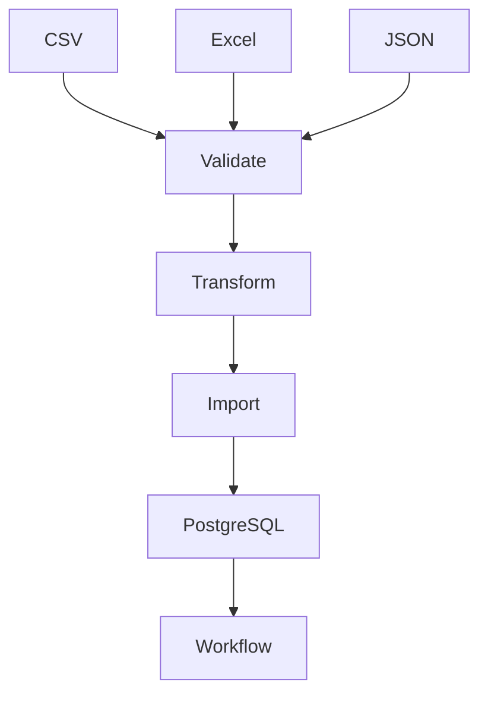

## Approval Workflow

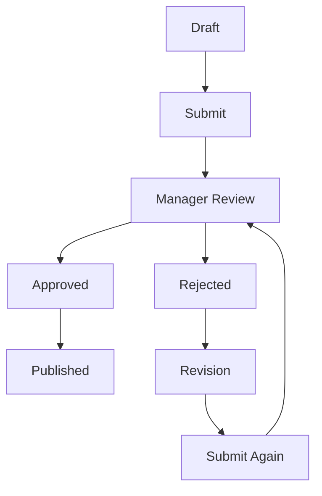

## Phase 1 File Input Flow

### Current State

- KPI 使用 `backend/data/business/*.csv`
- Research 使用 `backend/data/research/*.json`
- Documents 边界使用 `backend/data/documents/*.md`
- Report 当前直接生成，状态为 `generated`

### Planned

- 后续审批状态演进为：
  `draft`
  `pending_approval`
  `approved`
  `rejected`
  `revised`

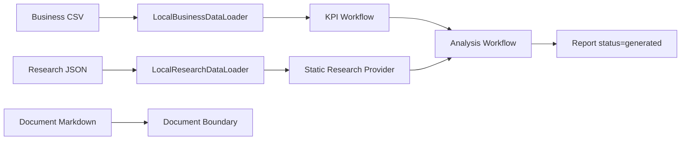

## Phase 1.5 Contract Freeze and Approval Design

### Current State

- 当前 handbook 只记录了 Phase 1 文件输入
- 当前还未完整记录 Import Error Model 和扩展后的审批状态机

### Planned

- Data Contract 作为文件输入单一来源
- Import Error Model 作为未来导入失败单一来源
- Approval State Machine 作为未来承認ワークフロー单一来源

## Approval State Machine

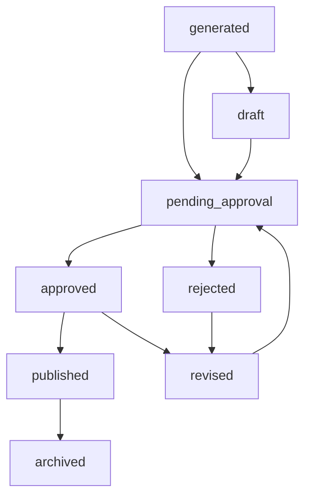

## Report Revision Flow

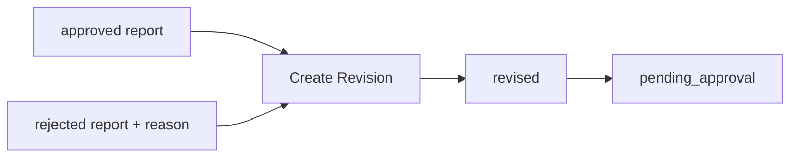

## Phase 1 to Phase 2 Migration Flow

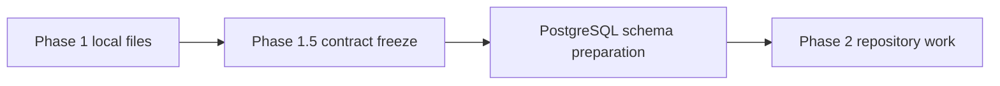

## Phase 2 PostgreSQL Persistence MVP

### Current State

- 当前默认后端仍为 `inmemory`
- 当前已新增可选 `postgres` backend
- 当前 PostgreSQL 持久化只覆盖 Task、Task Event、Report
- 当前 Approval / Import 仍是 schema-only

### Target State

- PostgreSQL 承接事务事实
- InMemory 继续作为本地 fallback
- 后续 Approval / Import / Document Pipeline 基于同一 schema 扩展

### Planned

- 在具备 PostgreSQL 运行环境后执行真实联调
- 保持 API / Workflow / SSE 合同稳定

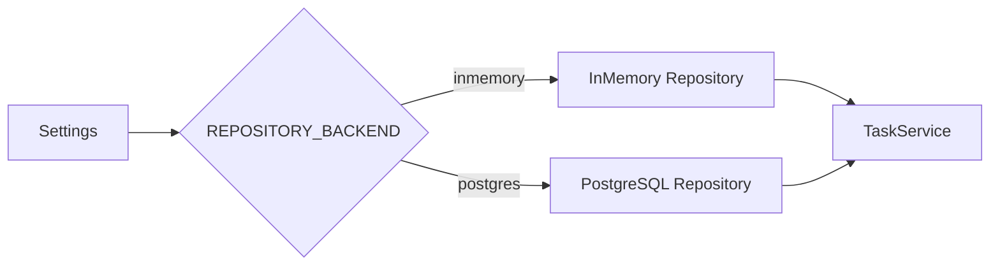

## Database Target Design

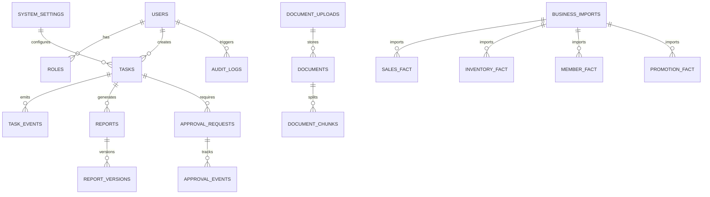

## Testing Matrix

| 测试类型 | 覆盖对象 | 目标 |
| --- | --- | --- |
| Unit | Domain、Provider、Repository、Validator | 单模块规则验证 |
| Integration | API、Repository、Import、Approval | 模块协作验证 |
| API | HTTP、Error、SSE Contract | 接口稳定性 |
| Workflow | Node、Route、Approval、Publish | 状态流转验证 |
| Frontend | 表单、时间线、报告、审批 UI | 交互与契约验证 |
| Database | Migration、Schema、Restore | 数据库设计安全 |
| Performance | API、Search、Workflow、Import | 容量与退化验证 |
| Manual | 端到端业务场景 | 真实验收 |

## Documentation Matrix

| 文档 | 必须同步内容 |
| --- | --- |
| README | 功能定位、启动方式、边界 |
| TASK | 当前任务与关闭条件 |
| ROADMAP | 路线与阶段 |
| BACKLOG | 永久任务与技术债 |
| ARCHITECTURE | 架构边界与图 |
| CHANGELOG | 变更历史 |
| DECISIONS | 决策记录 |
| HANDBOOK | handbook 镜像 |
| FLOW | 前后端、Workflow、Pipeline 图 |
| TESTING | 测试矩阵与方法 |

## Epic 0 Deliverables

- [ ] Architecture Freeze
- [ ] Directory Freeze
- [ ] Repository Freeze
- [ ] Provider Freeze
- [ ] Workflow Freeze
- [ ] Database Freeze
- [ ] Testing Freeze
- [ ] Documentation Freeze

## 技术架构图


> 当前为治理初始化视图。后续必须依据真实代码、文档或运行结果细化。

## 系统架构

- 当前实现：待根据项目结构确认。
- 外部依赖：待确认。
- 数据边界：待确认。
- 部署方式：待确认。

## 前端流程图


> 规划要求：Phase 8 前必须替换为与 React 实现一致的真实流程图。

## 后端流程图

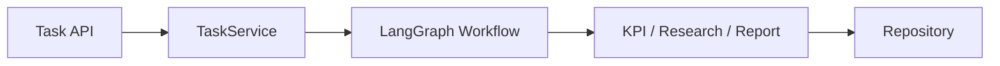

> 规划要求：Phase 1 到 Phase 7 每次流程变化都要回写本节。

## 数据流图

```mermaid
flowchart LR
    A[CSV / JSON / Markdown] --> B[数据加载层]
    B --> C[Workflow]
    C --> D[Report / Task / Event]
    D --> E[Frontend]
```

> 规划要求：Phase 1 后细化文件输入；Phase 2 后细化 PostgreSQL；Phase 4 后补检索数据流。

## 数据库 ER 图

```mermaid
erDiagram
    TASKS ||--o{ TASK_EVENTS : has
    TASKS ||--o| REPORTS : produces
    DOCUMENT_UPLOADS ||--o{ DOCUMENT_CHUNKS : splits_into
```

> 规划要求：当前为占位 ER 图，Phase 2 前后必须替换为真实表设计草案。

## LangGraph Workflow 图

```mermaid
flowchart TD
    ROUTE --> KPI
    ROUTE --> RESEARCH
    KPI --> REPORT
    RESEARCH --> REPORT
```

> 规划要求：Phase 5 审批接入后，本图必须补人工审批节点、恢复路径和失败路径。

## 文档检索流程图

```mermaid
flowchart LR
    A[文档上传] --> B[入库]
    B --> C[切分]
    C --> D[检索]
    D --> E[引用输出]
```

> 当前为规划占位图。Phase 3 和 Phase 4 完成后必须替换成真实流程。

## 审批 workflow 图

```mermaid
flowchart LR
    A[报告生成] --> B[待审批]
    B --> C[批准]
    B --> D[拒绝]
```

> 当前为规划占位图。Phase 5 完成后必须包含状态流转、人工节点和审计路径。

## 互联网检索流程图

```mermaid
flowchart LR
    A[查询输入] --> B[搜索 Provider]
    B --> C[来源过滤]
    C --> D[摘要/引用]
```

> 当前为规划占位图。Phase 6 完成后必须细化可信来源、超时、降级与审计边界。

## Agent 架构

- 是否包含 Agent：待确认。
- Agent 角色、状态、工具、权限和失败处理：待确认。

## RAG 流程图

```mermaid
flowchart LR
    D[文档] --> E[切分与索引]
    E --> F[检索与排序]
    F --> G[上下文与回答]
```

> 如果项目不包含 RAG，应明确标记“不适用”；如果包含，应替换为实际流程。

## MCP 流程图

```mermaid
flowchart LR
    H[MCP Client] --> I[MCP Server]
    I --> J[Tools / Resources / Prompts]
```

> 如果项目不包含 MCP，应明确标记“不适用”；如果包含，应补充权限、参数校验和审计边界。

## 更新规则

- 架构变化必须同步更新本文件。
- 重要决策必须登记到 `DECISIONS.md`。
- 复杂流程优先使用 Mermaid，并与真实实现保持一致。
- 每个测试用例相关章节必须遵守统一模板：
  用例目标、前端操作流程、后端处理流程、数据输入来源、预期输出、验收标准、Mermaid 前端流程图、Mermaid 后端流程图。
