# ai-agent-retail-handbook-v3 Architecture

最后更新：2026-07-04

本文件记录项目实际架构。未实现的能力必须明确标注，不得把规划写成现状。

Human-readable architecture explanations are trilingual by default.
本文件中的人类可读架构说明默认采用三语。
本書の人間向けアーキテクチャ説明は三言語を標準とします。

## Engineering Standards Freeze

### Current State

- handbook 过去主要通过架构图、系统设计书和 ADR 承载规则。
- 对 Master Prompt、API Contract、Event Contract、Prompt Standard、Coding Standard 的入口还不集中。

### Target State

- handbook `docs/` 下存在与主项目一致的工程标准镜像。
- 这些镜像作为教学、审查、AI 协作的统一引用入口。

### Planned

- 继续保持 handbook 架构说明与标准镜像分层：
  标准文档负责冻结规则，
  handbook 主章节负责解释、教学和面试表达。
- Epic 14 has frozen the master prompt, API contract, event contract, prompt standard, coding standard, development guide, and AI agent design guide as the final planning baseline.

## Project Positioning

### Current State

当前项目名称保持为：

`Retail Insight AI`

当前架构定位：

`Retail Analysis Domain Reference Implementation`

### Target State

未来平台目标名称：

`Enterprise Retail Intelligence Platform (ERIP)`

### Planned

ERIP 只表示目标平台架构，当前尚未全部实现。

## Handbook 同步规则

- 每个 Phase 完成后，必须同步更新本文件。
- 若架构变化涉及任务流、数据流、检索、审批、互联网检索或测试方法，必须同步更新 handbook 的相关章节。
- 若本文件未更新，不得把主项目对应 Phase 标记为完成。

## 企业化目录结构与待完善章节

```text
docs/ai-agent-retail-handbook-v3/
├── TASK.md
├── ROADMAP.md
├── 08_架构图册.md
├── 09_系统设计书.md
├── 10_Production_Roadmap.md
└── docs/
    ├── ARCHITECTURE.md
    ├── CHANGELOG.md
    ├── DECISIONS.md
    └── PROJECT_BACKLOG.md
```

待完善章节：

- 前端流程图
- 后端流程图
- 数据流图
- 数据库 ER 图
- LangGraph workflow 图
- 文档检索流程图
- 审批 workflow 图
- 互联网检索流程图
- 测试用例模板与图示约束

## Architecture Principles

- Platform First
- Domain Driven
- Provider Pattern
- Repository Pattern
- Workflow Driven
- Configuration First
- Test First
- Documentation First
- Backward Compatibility

## Target Architecture

### Current State

当前 handbook 主要记录单项目参考实现视角。

### Target State

未来 ERIP 目标逻辑分层：

```text
Platform
Domain
Provider
Workflow
Repository
Approval
Documents
Search
Import
Audit
Database
Frontend
```

### Planned

该结构是未来平台目标，不表示当前全部目录或模块已经存在。

## Definition of Done

未来任何一个 Phase 完成必须满足：

- Code
- Unit Test
- Integration Test
- Frontend Test
- Handbook
- Changelog
- Decision Record
- Architecture Update
- Mermaid Diagram Update
- Task Update

## Architecture Freeze

### Phase 3.1 Document Domain Model

Phase 3.1 has frozen the Document Domain Model, Document Repository Interface, and InMemory Document Repository as the current domain baseline for Upload, Version Management, Internal RAG, Approval Workflow, Retrieval, and PostgreSQL persistence.

## Sprint 2 Document Upload API Contract Freeze

### Current State

- 当前实现仍只停留在 Document Domain Model。
- 当前没有 Upload API，没有 Upload 事件流，没有前端改动。

### Target State

- 冻结 `POST /api/v1/documents`、`GET /api/v1/documents`、`GET /api/v1/documents/{document_id}`、`GET /api/v1/documents/{document_id}/versions`、`GET /api/v1/documents/{document_id}/chunks`、`DELETE /api/v1/documents/{document_id}`。
- 冻结 `document.upload.started`、`document.upload.validated`、`document.upload.completed`、`document.upload.failed`、`document.version.created`、`document.validation.failed`。
- Upload API 只负责受理、校验、版本边界和事件发布，不直接实现审批。

### Planned

- 后续实现必须遵守 `docs/API_CONTRACT.md` 与 `docs/EVENT_CONTRACT.md`。
- 当前阶段不实现 Upload API，不修改业务代码，不把审批状态当成 Upload 成功的隐含结果。

## Document Upload API Flow

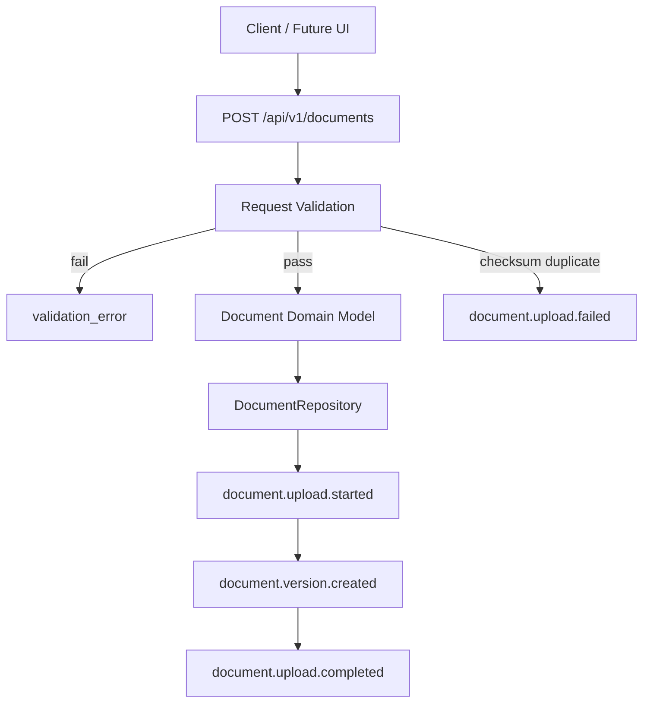

## Document Upload Event Flow

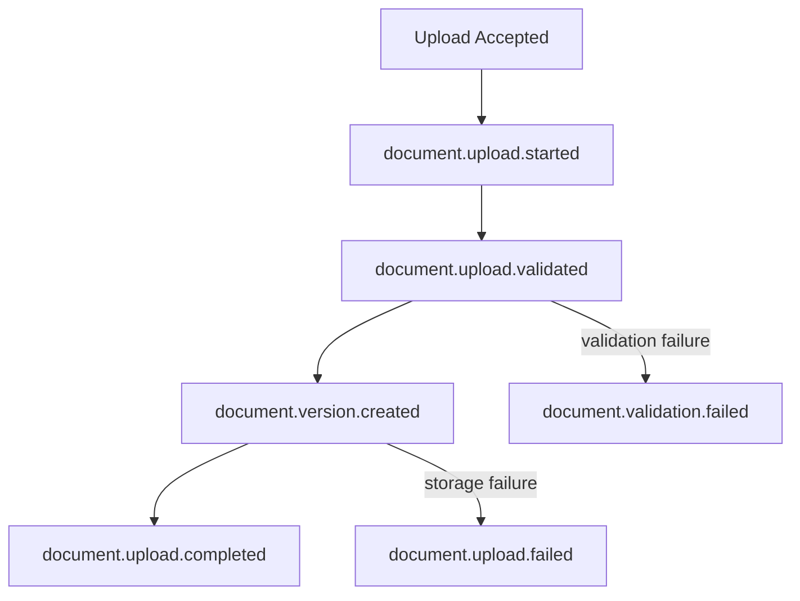

## Document Upload Validation Flow

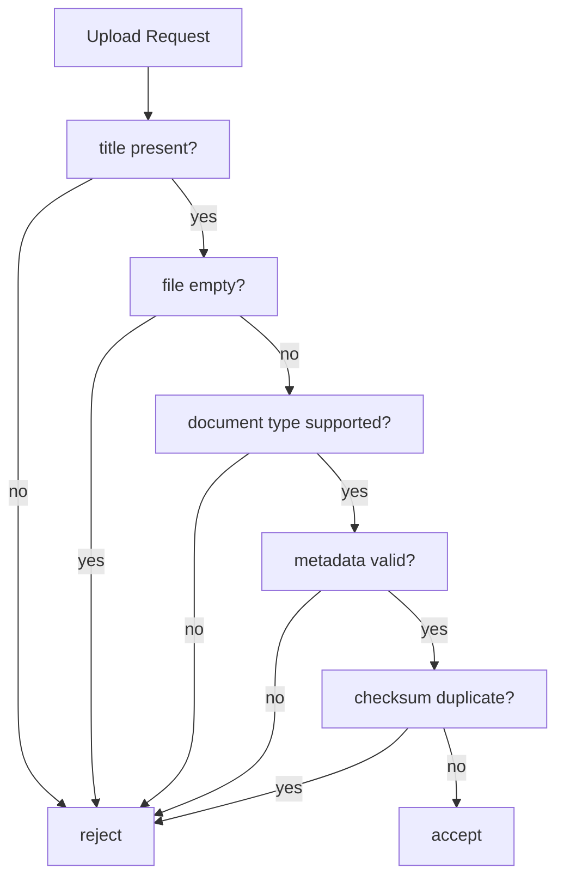

## Future Approval Integration Flow

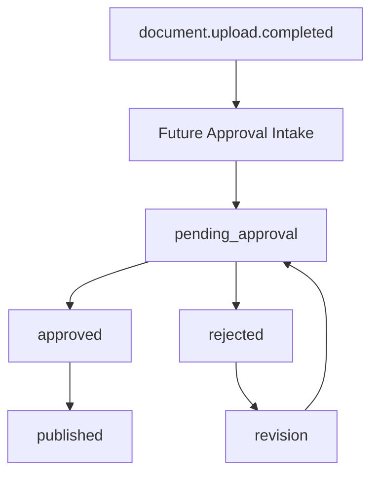

## Sprint 2.5 Document Upload Workflow + Error Catalog + Upload Policy Freeze

### Current State

- 当前仍只停留在 Document Domain Model 与 Upload API contract freeze。

### Target State

- 冻结 Upload Workflow、Upload Session、Idempotency、Error Catalog、Upload Policy，作为 Upload API 实现前的最后边界。

### Planned

- 后续实现必须先遵守 Upload Session、Idempotency、Error Catalog、Upload Policy。
- 当前阶段不实现 Upload API，不引入文件存储、Chunk、RAG、Approval API、pgvector 或前端上传 UI。

## Document Upload Workflow

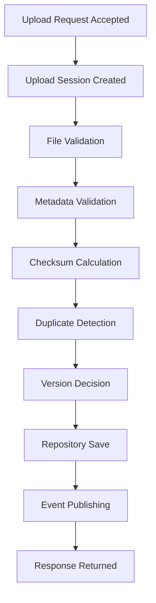

## Sprint 3 Document Upload API MVP Implementation

### Current State

- `POST /api/v1/documents` 已实现同步 MVP。
- 当前只实现 backend，不实现 frontend、不实现 RAG、不实现 chunking、不实现 pgvector、不实现 Approval API。

### Target State

- 继续保持 `DocumentUploadSession`、checksum duplicate detection、`Idempotency-Key`、event publishing 和 `InMemoryDocumentRepository` 作为当前文档上传闭环。

### Result

- 成功上传返回 `201 Created` 和完成态 `DocumentUploadSession`。
- 重复 checksum 返回已有结果。
- `Idempotency-Key` 同 key 不同 checksum 返回 `idempotency_conflict`。

### Planned

- 后续只读接口、删除接口、版本接口和 chunks 接口仍保持冻结未实现。
- PostgreSQL Document Repository 仍保持设计不实现。

## Sprint 4 Document Read API MVP

### Current State

- `GET /api/v1/documents` 与 `GET /api/v1/documents/{document_id}` 已实现。
- 当前只使用现有 `InMemoryDocumentRepository`，不引入新的检索层或 PostgreSQL 读实现。

### Target State

- 保持低风险读取能力，支持 status / document_type / language / owner / tag 的基础过滤。

### Result

- 列表接口返回 `items` 与 `next_cursor`。
- 详情接口在缺失时返回 `document_not_found`。

### Planned

- `DELETE`、`versions`、`chunks` 继续冻结未实现。
- PostgreSQL Document Repository 仍只设计不实现。

## Sprint 5 Document Archive API MVP

### Current State

- `DELETE /api/v1/documents/{document_id}` 仍未实现。
- 列表接口需要明确 archived 的默认过滤边界。

### Target State

- DELETE 语义冻结为 archive / soft delete，不做物理删除。
- archived 文档默认不出现在列表中，除非显式请求 `include_archived=true` 或 `status=archived`。

### Result

- 软删除归档语义已经冻结，后续可直接接入实现。

### Planned

- `versions`、`chunks`、PostgreSQL Document Repository 仍只设计不实现。

## Sprint 6 Document Import Pipeline MVP

### Current State

- `POST /api/v1/documents/{document_id}/import` 与 `GET /api/v1/document-imports/{import_id}` 已实现。
- 当前导入流水线只做同步 MVP，不创建 chunk、不做检索、不做审批。
- 当前只复用现有 `InMemoryDocumentRepository`，不引入 PostgreSQL Import Repository。

### Target State

- 导入流水线成为 future chunking、internal RAG、full-text search、approval workflow 与 audit 的前置边界。
- 成功导入后，文档状态推进到 `validated`。
- 仅允许 `markdown`、`text`、`csv`、`json` 进入当前导入闭环。

### Result

- 导入结果、错误与状态查询已可在后端读取。

### Planned

- `versions`、`chunks`、RAG、embedding、pgvector、Internet Search、Approval API 与 PostgreSQL Document Repository 继续冻结未实现。

## Sprint 7 Document Chunk Pipeline MVP

### Current State

- `POST /api/v1/documents/{document_id}/chunks` 与 `GET /api/v1/documents/{document_id}/chunks` 已实现。
- 当前 chunk pipeline 只接受 `validated` 文档，只支持 `markdown` / `text`，并使用独立的 InMemory chunk repository。
- 当前 chunk 结果采用 deterministic replace 规则，同一文档版本重复 chunk 会覆盖并返回相同结果。

### Target State

- 文档切片成为 future RAG、全文检索、上下文组装与引用追踪的前置边界。
- chunk 结果必须稳定保存 `chunk_index`、`content`、`character_count` 与父文档 metadata snapshot。
- chunk pipeline 不改变 approval 状态，也不承担 search / embedding 职责。

### Result

- 支持 import 完成后的文档切片、chunk 查询与事件记录。

### Planned

- `versions`、`RAG`、`embedding`、`pgvector`、`Approval API`、`PostgreSQL Document Repository` 继续冻结未实现。

## Document Chunk Pipeline

```mermaid
flowchart TD
    A[POST /api/v1/documents/{document_id}/chunks] --> B[Load validated document]
    B --> C{Document exists?}
    C -->|no| X[document_not_found]
    C -->|yes| D{Archived?}
    D -->|yes| Y[document_archived]
    D -->|no| E{Validated?}
    E -->|no| Z[document_not_validated]
    E -->|yes| F{Type supported?}
    F -->|no| U[unsupported_document_type]
    F -->|yes| G[Split by paragraph / fixed-size fallback]
    G --> H[Replace stored chunk set]
    H --> I[document.chunk.completed]
```

## Chunk Lifecycle

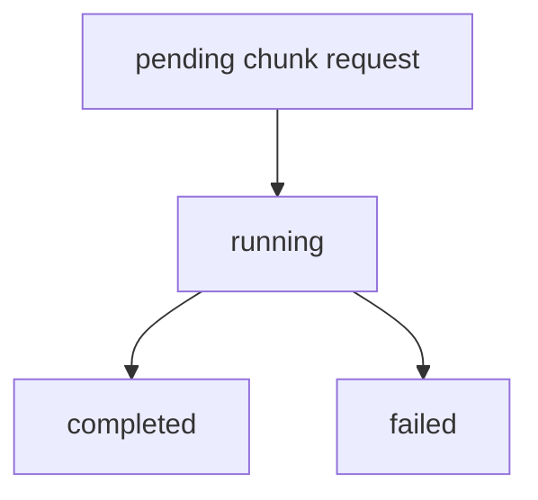

## Chunk Error Flow

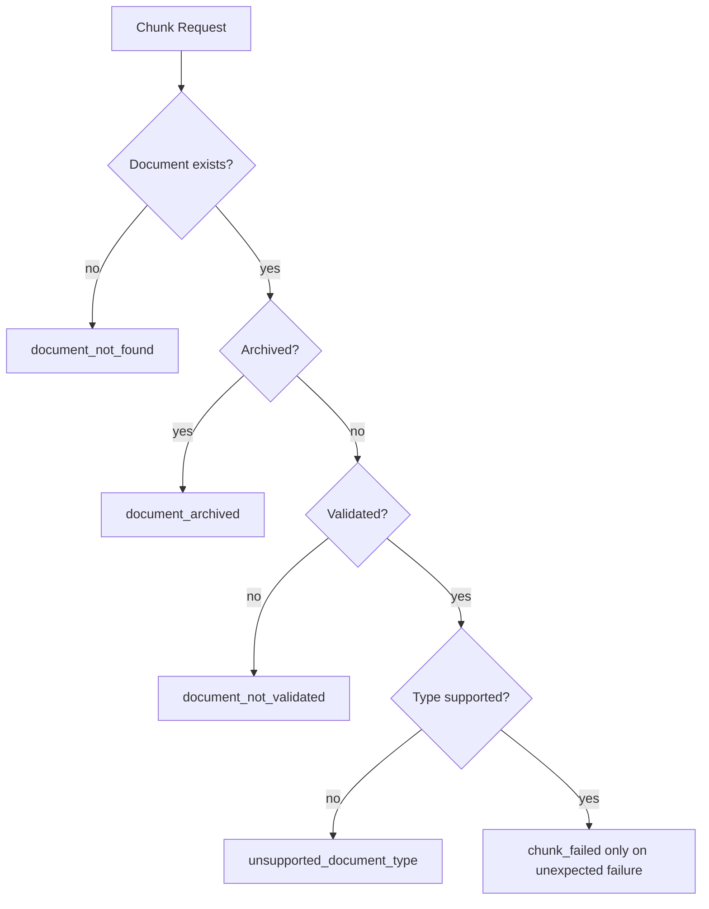

## Future RAG Integration Flow

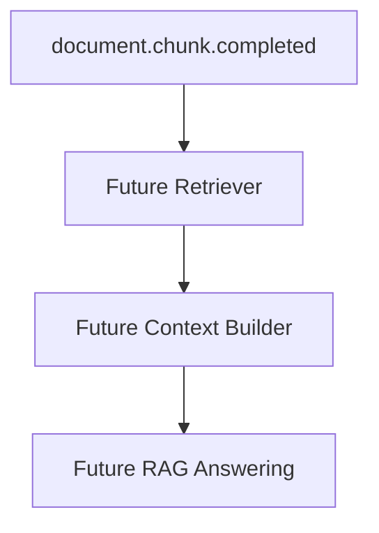

## Future Approval Integration Flow

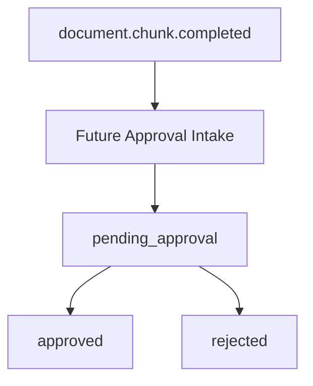

## Document Import Pipeline

```mermaid
flowchart TD
    A[POST /api/v1/documents/{document_id}/import] --> B[Load uploaded document]
    B --> C[Validate document status]
    C -->|archived| X[document_archived]
    C -->|missing| Y[document_not_found]
    C --> D[Validate document type]
    D -->|unsupported| Z[unsupported_document_type]
    D --> E[Mark running]
    E --> F[Mark document validated]
    F --> G[Persist import record in memory]
    G --> H[document.import.completed]
```

## Import Status Flow

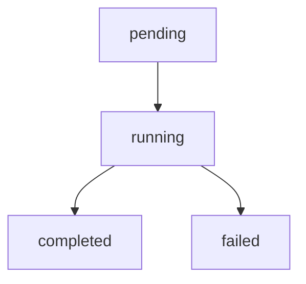

## Import Error Flow

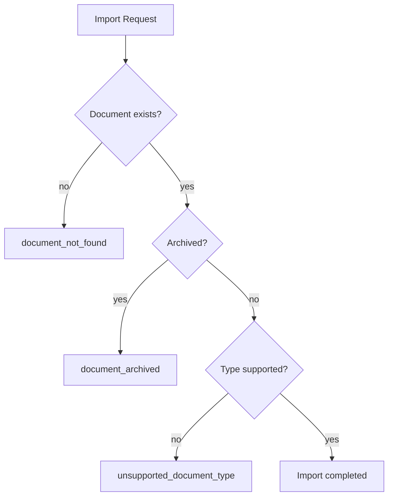

## Future Chunking Integration Flow

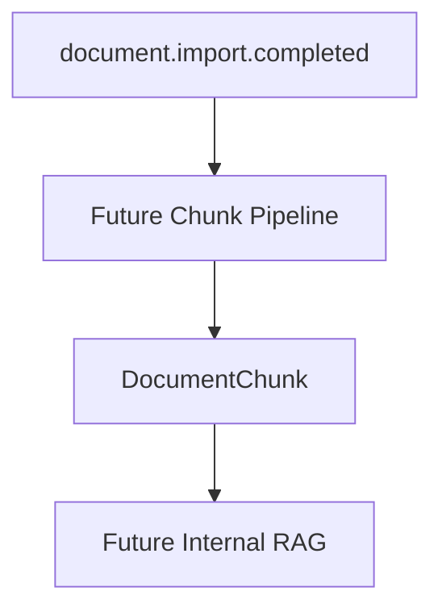

## Future Approval Integration Flow

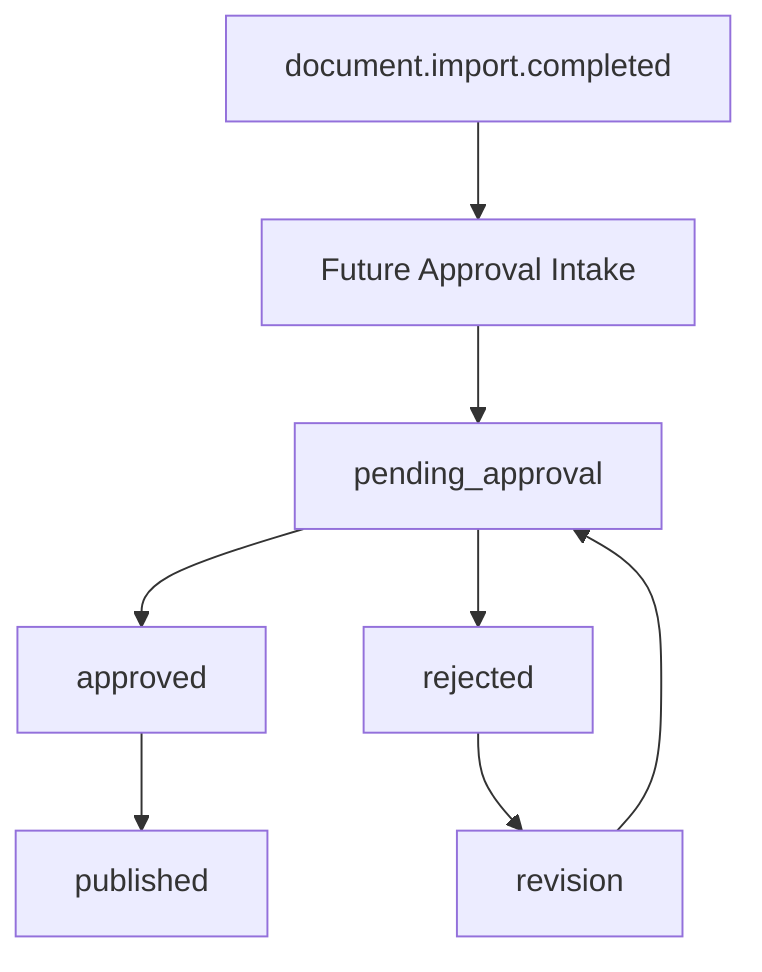

## Sprint 8.1 Document Retrieval Contract Freeze

### Current State

- `POST /api/v1/document-retrieval/search` 已冻结为内部文档检索 contract。
- 当前只冻结 keyword retrieval，不实现 RAG、embedding 或真实搜索后端。
- 当前检索结果以 document/chunk/source/metadata 为核心，不能把答案生成混进该 contract。

### Target State

- 文档检索成为 chunk 之后、RAG 之前的稳定只读边界。
- 检索请求必须支持 query、limit、include_archived、document_type、language、tags。
- 检索响应必须返回 `results[]`、`total`、`query`、`retrieval_mode=keyword`。

### Result

- 只冻结 API / Event / Error contract，不实现检索后端。

### Planned

- 未来检索实现可替换为 keyword search、full-text search、hybrid search 或 retrieval provider，但必须保持契约兼容。

## Sprint 8.2 Document Retrieval API MVP Implementation

### Current State

- `POST /api/v1/document-retrieval/search` 已实现为 keyword-only search。
- 当前检索只读取现有 in-memory document chunks，不调用 LLM、embedding、pgvector 或 PostgreSQL 搜索后端。
- 当前支持 `query`、`limit`、`include_archived`、`document_type`、`language`、`tags`，并返回 `document_id`、`chunk_id`、`chunk_index`、`content_excerpt`、`score`、`source`、`metadata`。
- 当前事件已实现 `document.retrieval.started`、`document.retrieval.completed`、`document.retrieval.failed`。

### Target State

- 检索继续保持为 chunk 之后、RAG 之前的稳定只读边界。
- 未来可以替换 keyword scoring 为 full-text search、hybrid search 或 retrieval provider，但 response contract 必须保持兼容。

### Result

- 当前 MVP 已可通过测试验证空查询、无结果、归档过滤、include_archived 与确定性排序。

### Planned

- 未来检索后端可迁移到 PostgreSQL full-text 或混合检索，但不在当前 sprint 引入。
- 当前阶段不把答案生成、引用拼装或上下文构建塞进 retrieval API。

## Document Retrieval Flow

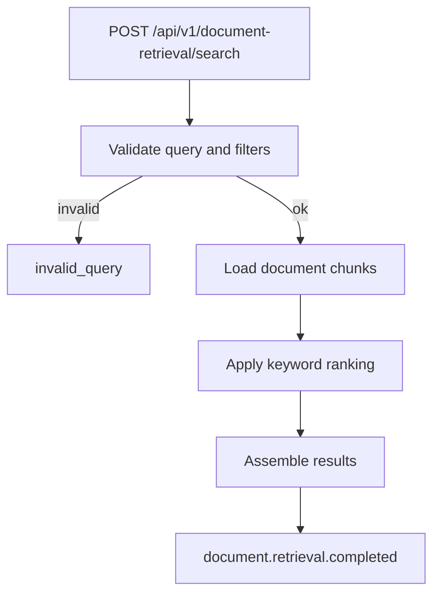

## Source Trace Flow

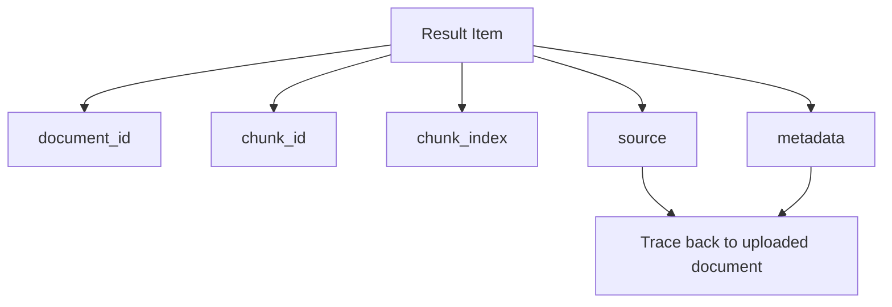

## Future RAG Integration Flow

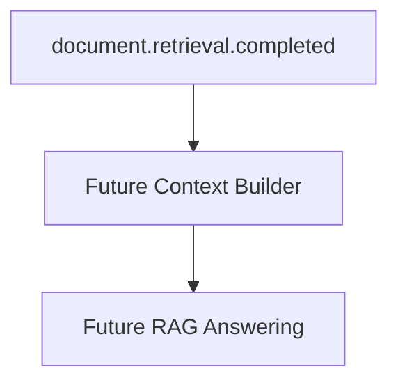

## Upload Session Flow

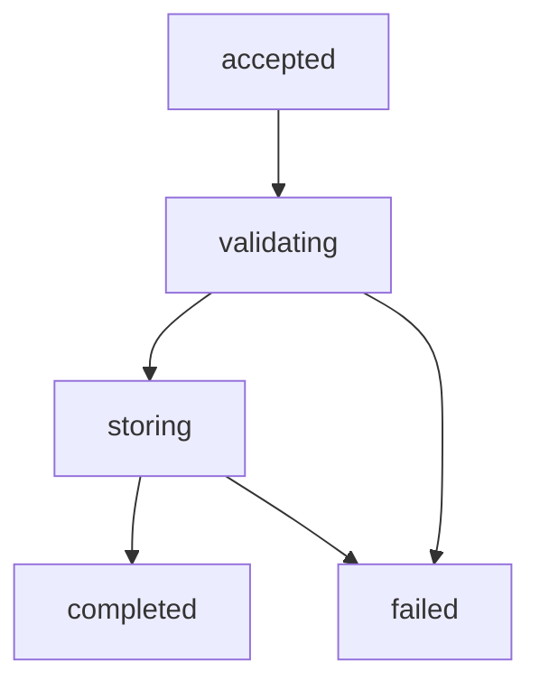

## Validation Flow

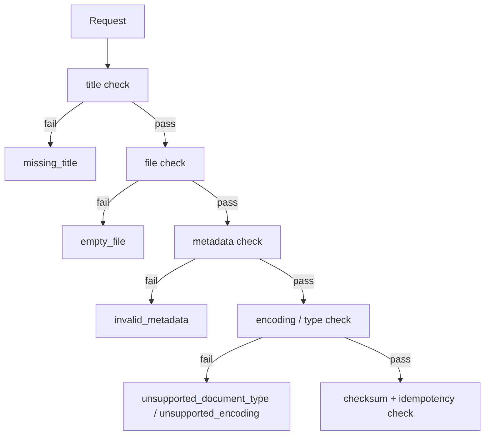

## Duplicate Detection Flow

```mermaid
flowchart TD
    A[Same Idempotency-Key] --> B{Same checksum?}
    B -->|yes| C[return existing result]
    B -->|no| D[idempotency_conflict]
    E[Same checksum without key] --> F[duplicate_checksum]
```

### Current Architecture

Current State

- 当前项目名称保持为 `Retail Insight AI`。
- 当前是零售分析领域参考实现，而非完整企业平台。
- 当前链路集中在 Task、Workflow、KPI、Research、Report 和 SSE。
- 当前尚未完成 PostgreSQL、Document Pipeline、审批流、互联网检索和平台级目录冻结。

### Target Architecture

Target State

- 未来平台目标为 `Enterprise Retail Intelligence Platform (ERIP)`。
- `Retail Insight AI` 保留为零售分析领域参考实现。
- 未来所有能力通过 Platform / Domain / Infrastructure 分层演进。

### Migration Strategy

Planned

1. 先冻结设计，再实施 Phase。
2. 先定义抽象边界，再替换具体实现。
3. 先落地事务事实存储，再引入搜索与向量能力。
4. 先保持接口兼容，再逐步完成目录与实现迁移。

### Planned State

- 本文档作为后续 handbook 讲解与主项目演进的统一基线。

### Risks

- 设计过重导致实现推进变慢。
- 冻结后若不持续同步，文档会再次失真。
- 多 Provider / 多 Repository 引入后测试成本会明显提升。

## Directory Refactor Design

### Current State

- 当前 handbook 记录的是真实目录和目标目录混合视图。

### Target State

未来目录设计：

```text
Platform Layer
Domain Layer
Infrastructure Layer
Frontend
Documentation
Data
Template
Test
```

### Planned State

```text
retail-insight-ai/
├── platform/
├── domain/
├── infrastructure/
├── frontend/
├── docs/
├── data/
├── templates/
└── tests/
```

当前尚未全部实现。

## Repository Abstraction Design

- Repository Interface
  职责：定义领域事实读写合同。
  输入：领域对象、查询条件。
  输出：领域对象、列表、可选结果。
  生命周期：长期稳定接口。
- InMemory Repository
  职责：本地运行与测试默认实现。
  输入：与 Interface 一致。
  输出：与 Interface 一致。
  生命周期：继续保留。
- PostgreSQL Repository
  职责：企业事务事实主存储。
  输入：领域对象、事务上下文、查询条件。
  输出：持久化领域事实。
  生命周期：未来主实现。
- Future Vector Repository
  职责：文档块、向量、相似检索。
  输入：文本块、向量查询。
  输出：Top-K 结果与来源。
  生命周期：Phase 4 以后引入。

抽象原因：

- 隔离本地实现与企业实现。
- 避免 Workflow 与 Service 直接依赖存储技术。
- 支持事务事实与向量事实分开治理。

## Provider Abstraction Design

### LLM Provider

- 职责：分析、摘要、格式化生成
- 输入：Prompt、上下文、参数
- 输出：结构化文本、元数据
- 生命周期：按调用装配

### Research Provider

- 职责：市场 / 竞品调研获取
- 输入：问题、业务上下文
- 输出：摘要、来源、风险
- 生命周期：当前可静态，未来可外部化

### Internal Search Provider

- 职责：社内知识检索
- 输入：查询、权限、Top-K
- 输出：文档块、评分、来源
- 生命周期：文档入库后启用

### Internet Search Provider

- 职责：互联网公开检索
- 输入：查询、来源白名单、时间窗口
- 输出：外部来源、摘要片段
- 生命周期：按配置启用

### Vector Provider

- 职责：向量生成与相似检索
- 输入：文本块、查询向量
- 输出：向量与相似结果
- 生命周期：Future Provider

### Prompt Provider

- 职责：Prompt 模板管理
- 输入：模板名、版本、变量
- 输出：最终 Prompt 与版本
- 生命周期：长期稳定

### Config Provider

- 职责：统一配置装配
- 输入：环境变量、配置文件、系统设置
- 输出：标准配置对象
- 生命周期：进程级

## Retrieval Layer Architecture

### Current State

- 当前 Retrieval Layer 已出现稳定的 service/provider 边界，但仍处于本地 InMemory 实现阶段。
- 当前 Research 与未来 Internal Search / Internet Search / Structured Retrieval 仍然是不同能力域，尚未合并成统一平台层。
- `DocumentRetrievalService` 现在依赖 `DocumentRetrievalProvider`，而不是直接依赖 raw chunk storage。
- Internal RAG contract is frozen on top of the same retrieval provider boundary, but answer generation is still only a documented future boundary.

### Target State

- 未来 Retrieval Layer 统一承接结构化业务检索、社内文档检索、互联网检索、上下文合并、引用追踪和评估。
  - Internal RAG Answering

### Planned

```mermaid
flowchart LR
    A[Workflow] --> B[Retrieval Orchestrator]
    B --> C[Business Retrieval]
    B --> D[Internal Retrieval]
    B --> E[Internet Retrieval]
    D --> D1[DocumentRetrievalProvider]
    D1 --> D2[InMemoryKeywordRetrieval]
    D2 --> D3[Internal RAG Contract]
    D3 --> D4[Citation Assembly]
    D4 --> D5[Answer Contract]
    C --> F[Context Merge]
    D --> F
    E --> F
    F --> G[Analysis]
    G --> H[Citation and Source Trace]
```

RAG 在本项目中不只包括社内文档，也包括结构化业务数据检索和互联网检索。

## Business Retrieval Flow

```mermaid
flowchart TD
    A[Business Question] --> B[Structured Retrieval Request]
    B --> C[SQL-based Retrieval]
    C --> D[Business Facts]
    D --> E[Context Merge]
    E --> F[Analysis]
```

## Internal RAG Flow

```mermaid
flowchart TD
    A[Internal Question] --> B[Validate question and answer mode]
    B --> C[Document Retrieval Request]
    C --> D[DocumentRetrievalProvider]
    D --> E[Retrieved Chunks]
    E --> F[Citation Assembly]
    F --> G[Answer Contract]
    G --> H[Context Merge]
    H --> I[Analysis]
```

### Current State

- Internal RAG MVP 已实现 deterministic answer assembly。
- Internal RAG 只依赖 existing DocumentRetrievalProvider，不直接碰 raw chunk storage。
- `answer_mode=extractive | summary` 都不调用 LLM。

### Planned

- 未来 summary mode 可以替换成可插拔 LLM provider，但 citation contract 不变。
- Internal RAG 仍然必须保持 retrieval provider boundary 不变。

## Retrieval to Citation Flow

```mermaid
flowchart TD
    A[Retrieval Result] --> B[Chunk Excerpt]
    B --> C[Citation Object]
    C --> D[Confidence Note]
    D --> E[Answer Payload]
```

### Result

- Citations preserve `document_id`、`chunk_id`、`chunk_index`、`excerpt`、`source` 和 `score`。
- Answer payloads remain secret-safe and schema-bound.

## Future LLM Provider Flow

```mermaid
flowchart TD
    A[Summary Mode Request] --> B[Future LLM Provider]
    B --> C[Draft Answer]
    C --> D[Citation Check]
    D --> E[Final Answer Contract]
```

### Planned

- Future LLM providers must be replaceable and must not change the frozen internal RAG API contract.

## Future Approval Integration Flow

```mermaid
flowchart TD
    A[internal_rag.answer_generated] --> B[Future Approval Intake]
    B --> C[pending_approval]
    C --> D[approved]
    C --> E[rejected]
    D --> F[published]
    E --> G[revision]
    G --> C
```

### Planned

- Internal RAG itself does not create approval state.
- Approval remains a separate future API and must not be implied by answer success.

## Sprint 9.5 LLM Provider Seam Stub MVP

### Current State

- Internal RAG 仍然默认走 deterministic extractive path。
- `StubLLMProvider` 已接入 `RAGAnswerGenerator`，但只有在 `INTERNAL_RAG_USE_LLM=true` 时才会使用。
- 当前不调用 OpenAI、Azure 或任何外部 API，不引入真实 LLM dependency。

### Target State

- 未来真实 LLM provider 可以替换 stub provider，而不改变 retrieval contract、citation contract 或 API contract。
- usage / cost / latency placeholder 记录只用于内部事件和日志，不暴露为 API response 字段。

### Result

- `StubLLMProvider`、`RAGAnswerGenerator`、`LLM_PROVIDER=stub`、`INTERNAL_RAG_USE_LLM=false` 默认值已落地。
- provider failure / timeout / invalid output / missing citation 都会回退到 deterministic answer。
- backend full suite 与 compileall 已通过。

### Planned

- 继续保持 deterministic fallback 为默认路径。
- 未来若接入真实 provider，只允许替换 provider 实现，不允许改动 internal RAG response contract。

## Stub LLM Provider Flow

```mermaid
flowchart TD
    A[Internal RAG request] --> B[RAGAnswerGenerator]
    B --> C{INTERNAL_RAG_USE_LLM?}
    C -->|no| D[Deterministic answer]
    C -->|yes| E[StubLLMProvider]
    E --> F{output valid?}
    F -->|yes| G[Use stub answer]
    F -->|no| D
    E --> H[Usage placeholders]
    H --> G
```

## Usage Placeholder Flow

```mermaid
flowchart TD
    A[StubLLMProvider] --> B[prompt_tokens]
    A --> C[completion_tokens]
    A --> D[estimated_cost]
    A --> E[latency_ms]
    B --> F[Internal events/logs]
    C --> F
    D --> F
    E --> F
```

## Sprint 9.4 LLM Provider Seam Contract Freeze

### Current State

- 当前 Internal RAG 仍然是 deterministic answer assembly。
- 当前没有真实 LLM provider，没有外部调用，没有新增依赖。
- 当前只冻结未来 model integration seam，不改变 `POST /api/v1/internal-rag/answer` response。

### Target State

- 未来 `LLMProvider` 可以接到 `RAGAnswerGenerator` 后面，而不改变 retrieval contract、citation contract 或 API contract。
- provider error model、fallback behavior、token/cost/latency tracking placeholders 必须先冻结，再考虑任何实现。

### Result

- `LLMProvider`、`RAGAnswerGenerator`、future provider errors、fallback behavior、tracking placeholders 已在文档层冻结。
- backend、frontend、scripts 维持不变。

### Planned

- 继续保持 deterministic extractive fallback 为默认路径。
- 未来若接入模型，只允许替换 answer generation seam，不允许回写 retrieval provider boundary。

## Future LLM Provider Seam

```mermaid
flowchart TD
    A[Internal RAG request] --> B[RAGAnswerGenerator]
    B --> C[Bind prompt contract]
    C --> D[LLMProvider request]
    D --> E{provider output valid?}
    E -->|yes| F[Use provider answer]
    E -->|no| G[Fallback to deterministic extractive mode]
    D -->|timeout / unavailable / cost limit| G
```

## Internal RAG with Optional LLM

```mermaid
flowchart TD
    A[Retrieval results] --> B[Deterministic extractive mode]
    A --> C[Optional LLMProvider]
    C --> D[RAGAnswerGenerator]
    D --> E[Answer + citations + confidence]
    B --> E
```

## Fallback to Extractive Mode

```mermaid
flowchart TD
    A[Provider error or invalid output] --> B[Keep retrieval citations]
    B --> C[Assemble deterministic answer]
    C --> D[Return frozen API response]
```

## Token Cost Tracking Flow

```mermaid
flowchart TD
    A[LLMProvider request] --> B[Count input tokens]
    B --> C[Count output tokens]
    C --> D[Estimate cost]
    D --> E[Record latency_ms]
    E --> F[Attach usage placeholders]
```

## Sprint 9.3 Internal RAG Evaluation + Citation Quality MVP

### Current State

- Internal RAG 已实现 deterministic answer assembly，并新增内部 evaluation / citation quality checking。
- warnings taxonomy 已包含 `low_context`、`missing_citation`、`weak_match`。

### Target State

- 未来若引入 LLM provider，仍要复用当前 evaluation contract 与 citation quality checker。

### Result

- `coverage_score`、`citation_score`、`confidence` 和 warnings 由内部 evaluation service 计算。
- citation quality checker 验证 `document_id`、`chunk_id` 与 grounded excerpt 的一致性。
- backend tests 已覆盖 perfect citation score、missing citation warning、weak match、low context、summary citation 和 archived filtering。

### Planned

- 继续保持 `POST /api/v1/internal-rag/answer` 对外 response backward compatible。
- 继续保持 retrieval API contract / scoring / response shape 不变。

## RAG Evaluation Flow

```mermaid
flowchart TD
    A[Internal RAG Answer] --> B[Build citations]
    B --> C[Validate citation grounding]
    C --> D[Compute coverage_score]
    C --> E[Compute citation_score]
    D --> F[Derive confidence]
    E --> F
    F --> G[warnings]
```

## Citation Quality Flow

```mermaid
flowchart TD
    A[Citation] --> B{document_id/chunk_id exists?}
    B -->|no| X[missing_citation]
    B -->|yes| C{excerpt grounded in chunk excerpt?}
    C -->|no| X
    C -->|yes| D[valid citation]
```

## Future LLM Evaluation Flow

```mermaid
flowchart TD
    A[Future LLM answer] --> B[Reuse evaluation service]
    B --> C[Check citations]
    B --> D[Check coverage]
    B --> E[Check weak_match]
    C --> F[Final answer contract]
    D --> F
    E --> F
## Internet Search Flow

```mermaid
flowchart TD
    A[External Question] --> B[Internet Search Request]
    B --> C[Trusted Source Filter]
    C --> D[Normalize]
    D --> E[External Context]
    E --> F[Context Merge]
    F --> G[Analysis]
```

## Context Merge Flow

```mermaid
flowchart TD
    A[Business Context] --> D[Context Merge]
    B[Internal Context] --> D
    C[Internet Context] --> D
    D --> E[Priority Rules]
    E --> F[Unified Analysis Context]
```

## Citation and Source Trace Flow

```mermaid
flowchart TD
    A[Retrieved Sources] --> B[Source Citation Model]
    B --> C[Reference Tracking]
    C --> D[Report Citation Section]
    D --> E[Audit Trace]
```

## Future Hybrid Search Architecture

```mermaid
flowchart LR
    A[Query] --> B[Keyword Search]
    A --> C[Full-text Search]
    A --> D[Vector Search Future]
    B --> E[Hybrid Merge]
    C --> E
    D --> E
    E --> F[Rerank Future]
    F --> G[Top-K Context]
```

## Workflow Architecture

```mermaid
flowchart TD
    A[Task] --> B[Validation]
    B --> C[Business Data]
    C --> D[Internal Search]
    D --> E[Internet Search]
    E --> F[Merge Context]
    F --> G[Analysis]
    G --> H[Approval]
    H --> I[Report]
    I --> J[Publish]
```

## Document Pipeline

```mermaid
flowchart TD
    A[Upload] --> B[Validation]
    B --> C[Version]
    C --> D[Chunk]
    D --> E[Embedding Future]
    E --> F[PostgreSQL]
    F --> G[Search]
    G --> H[Workflow]
```

## Business Data Pipeline

```mermaid
flowchart TD
    A[CSV]
    B[Excel]
    C[JSON]
    A --> D[Validate]
    B --> D
    C --> D
    D --> E[Transform]
    E --> F[Import]
    F --> G[PostgreSQL]
    G --> H[Workflow]
```

## Approval Workflow

```mermaid
flowchart TD
    A[Draft] --> B[Submit]
    B --> C[Manager Review]
    C --> D[Approved]
    C --> E[Rejected]
    D --> F[Published]
    E --> G[Revision]
    G --> H[Submit Again]
    H --> C
```

## Phase 1 File Input Flow

### Current State

- KPI 使用 `backend/data/business/*.csv`
- Research 使用 `backend/data/research/*.json`
- Documents 边界使用 `backend/data/documents/*.md`
- Report 当前直接生成，状态为 `generated`

### Planned

- 后续审批状态演进为：
  `draft`
  `pending_approval`
  `approved`
  `rejected`
  `revised`

```mermaid
flowchart LR
    A[Business CSV] --> B[LocalBusinessDataLoader]
    C[Research JSON] --> D[LocalResearchDataLoader]
    E[Document Markdown] --> F[Document Boundary]
    B --> G[KPI Workflow]
    D --> H[Static Research Provider]
    G --> I[Analysis Workflow]
    H --> I
    I --> J[Report status=generated]
```

## Phase 1.5 Contract Freeze and Approval Design

### Current State

- 当前 handbook 已记录 Phase 1 文件输入、Import Error Model 和 Approval Workflow contract freeze
- 当前仍然没有 Approval API 实现，只有 contract boundary

### Planned

- Data Contract 作为文件输入单一来源
- Import Error Model 作为未来导入失败单一来源
- Approval State Machine 作为未来承認ワークフロー单一来源

## Sprint 10.1 Approval Workflow Contract Freeze

### Current State

- Approval workflow 已有 backend-only MVP，但仍然必须遵守 frozen contract。
- 当前 report revision 仍然是 immutable snapshot boundary。

中文（简体）：
审批工作流现在已经有 backend MVP，但仍然以冻结 contract 为边界。当前实现的关键是把审批记录、审计事件和 report revision snapshot 分开，不允许把可变正文当成审批事实。

日本語：
承認ワークフローは backend MVP まで実装済みですが、境界は凍結済み契約のままです。承認記録、監査イベント、report revision snapshot を分離し、可変本文を承認事実として扱わないことが重要です。

### Target State

- Future Approval API 可以在不修改 report / retrieval / internal RAG contract 的情况下实现。

### Result

- approval domain model、API contract、event contract、error catalog 和 state machine 已冻结。
- report revision relationship、audit relationship、future RBAC relationship 已写入 handbook 架构层。
- backend-only Approval API MVP 已落地。

中文（简体）：
这个结果表示“契约已冻结，代码已落地”。后续只能沿用相同的审批状态语义继续演进，不能把前端、RBAC 或外部 workflow engine 直接塞进当前边界。

日本語：
この結果は「契約は凍結済みで、コードも実装済み」という意味です。今後は同じ状態意味を保ったまま拡張し、frontend、RBAC、外部 workflow engine を直接混ぜ込んではいけません。

### Planned

- 后续 Approval API 只允许复用当前冻结的状态语义。
- 未来 RBAC 只能约束权限，不能改变已冻结的状态转移规则。

## Sprint 11.1 Enterprise Security Foundation Contract Freeze / 企业安全基础合同冻结 / エンタープライズセキュリティ基盤契約凍結

### Current State

- 当前没有实现 RBAC、认证服务或 Audit API。
- 当前 Approval API、Retrieval API 和 Internal RAG 仍只依赖既有 backend service boundary。
- 当前 security model 仍然是 contract-only，不能被解释为已上线的身份系统。

中文（简体）：
这一阶段先把企业安全基础的概念层冻结下来，再谈实现。我们只冻结用户、组织、部门、角色、权限、策略、审计日志和操作日志的语义，不提前引入真实认证或 RBAC 服务。

日本語：
この段階では、企業セキュリティ基盤の概念層を先に凍結します。ユーザー、組織、部署、ロール、権限、ポリシー、監査ログ、操作ログの意味だけを固定し、実認証や RBAC サービスはまだ導入しません。

### Target State

- `GET /api/v1/users/me` provides the authenticated principal snapshot.
- `GET /api/v1/security/roles` provides the frozen role catalog.
- `GET /api/v1/security/permissions` provides the frozen permission catalog.
- `GET /api/v1/audit-logs` provides append-only audit facts and the operation log projection.
- RBAC approval-action matrix is fixed before backend implementation.

### Result

- User / organization / department / role / permission / policy concepts are frozen as documentation-level domain models.
- Security API contracts are frozen for future implementation without changing existing document, retrieval, RAG, or approval response shapes.
- Audit log contract and operation log contract are defined as read-only, append-only facts.

### Planned

- Later backend work may implement authentication middleware, RBAC enforcement, and audit append paths.
- The current contract only freezes the read surface and the approval-action matrix.
- Future implementation must preserve the frozen permission names and event names.

## Enterprise Security Overview

### Security Domain Model

- `user` belongs to one `organization` and one `department`.
- `role` groups permissions for a job function or operational responsibility.
- `permission` names one stable action.
- `policy` resolves whether a role may perform an action on a resource.
- `audit log` is append-only and read-only.
- `operation log` is the operator-facing projection of audit facts.

### RBAC Approval-Action Matrix

| Action | Permission | Default Roles |
|---|---|---|
| `GET /api/v1/users/me` | authenticated identity | all authenticated users |
| `GET /api/v1/security/roles` | `system.admin` | admin |
| `GET /api/v1/security/permissions` | `system.admin` | admin |
| `GET /api/v1/audit-logs` | `audit.read` | auditor, admin |
| `POST /api/v1/reports/{task_id}/submit-approval` | `report.submit_approval` | analyst, manager, admin |
| `GET /api/v1/approvals` | `approval.review` | approver, manager, auditor, admin |
| `GET /api/v1/approvals/{approval_id}` | `approval.review` | approver, manager, auditor, admin |
| `POST /api/v1/approvals/{approval_id}/approve` | `approval.approve` | approver, manager, admin |
| `POST /api/v1/approvals/{approval_id}/reject` | `approval.reject` | approver, manager, admin |
| `POST /api/v1/reports/{task_id}/revise` | `approval.revise` | analyst, manager, approver, admin |

### Audit Log Contract

- Audit logs are append-only facts and are safe to read after the originating operation is archived.
- Audit log records must include actor, resource, result, request_id, trace_id, timestamp, and a secret-safe metadata payload.
- Operation logs are a projection of the same facts for human review and support workflows.
- Audit failures must not leak sensitive input, and they must preserve the failure error code.

### Future Authentication Flow

```mermaid
flowchart LR
    A[Identity Provider] --> B[Authentication Middleware]
    B --> C[Authenticated Principal]
    C --> D[RBAC Policy Resolver]
    D --> E[API / Service Boundary]
    E --> F[Audit Log Writer]
```

### RBAC Flow

```mermaid
flowchart TD
    A[User] --> B[Role Assignment]
    B --> C[Permission Resolution]
    C --> D{Allowed?}
    D -->|yes| E[Proceed]
    D -->|no| F[permission_denied]
```

### Approval Permission Flow

```mermaid
flowchart TD
    A[Approval Action] --> B[Policy Check]
    B --> C{Permission Matched?}
    C -->|yes| D[Approval API]
    C -->|no| E[forbidden / permission_denied]
```

### Audit Log Flow

```mermaid
flowchart TD
    A[Business Action] --> B[Audit Fact]
    B --> C[Append-only Store]
    C --> D[Audit Log API]
    C --> E[Operation Log Projection]
```

### Future Authentication Flow Notes

- Authentication is a future seam, not a current implementation dependency.
- RBAC consumes the authenticated principal after the identity provider is introduced.
- Audit logging must remain available as a read model even before the authentication seam ships.

## Approval Workflow Model

```mermaid
flowchart TD
    A[generated] --> B[draft]
    B --> C[pending_approval]
    C --> D[approved]
    C --> E[rejected]
    E --> F[revised]
    D --> F
    F --> C
    D --> G[published]
    G --> H[archived]
```

## Report Revision Flow

```mermaid
flowchart LR
    A[approved or rejected snapshot] --> B[Create Revision]
    B --> C[new immutable version]
    C --> D[revised]
    D --> E[pending_approval]
```

## Approval Event Flow

```mermaid
flowchart TD
    A[submit-approval] --> B[approval.submitted]
    B --> C[approve]
    B --> D[reject]
    C --> E[approval.approved]
    D --> F[approval.rejected]
    F --> G[revise]
    G --> H[approval.revised]
    E --> I[publish]
    I --> J[approval.published]
```

## Approval + Audit Flow

```mermaid
flowchart TD
    A[Approval API] --> B[approval_requests]
    A --> C[approval_events]
    C --> D[audit trail]
    B --> E[report_version_id]
    E --> F[report_versions]
    F --> D
```

## Future RBAC Integration Flow

```mermaid
flowchart TD
    A[Identity Provider] --> B[Role / Permission Check]
    B --> C[Approval API]
    C --> D[submit / approve / reject / revise]
    B -->|deny| E[authorization rejected]
```

## Approval State Machine

```mermaid
flowchart TD
    A[generated] --> B[draft]
    A --> C[pending_approval]
    B --> C
    C --> D[approved]
    C --> E[rejected]
    D --> F[published]
    D --> G[revised]
    E --> G
    G --> C
    F --> H[archived]
```

## Report Revision Flow

```mermaid
flowchart LR
    A[approved report] --> B[Create Revision]
    C[rejected report + reason] --> B
    B --> D[revised]
    D --> E[pending_approval]
```

## Phase 1 to Phase 2 Migration Flow

```mermaid
flowchart LR
    A[Phase 1 local files] --> B[Phase 1.5 contract freeze]
    B --> C[PostgreSQL schema preparation]
    C --> D[Phase 2 repository work]
```

## Phase 2 PostgreSQL Persistence MVP

### Current State

- 当前默认后端仍为 `inmemory`
- 当前已新增可选 `postgres` backend
- 当前 PostgreSQL 持久化只覆盖 Task、Task Event、Report
- 当前 Approval / Import 仍是 schema-only
- 当前状态：
  `Code implemented`
  `InMemory path verified`
  `PostgreSQL schema implemented`
  `PostgreSQL repository tests prepared`
  `PostgreSQL real integration test pending`
  `Status: In Progress / Partially Verified`

### Target State

- PostgreSQL 承接事务事实
- InMemory 继续作为本地 fallback
- 后续 Approval / Import / Document Pipeline 基于同一 schema 扩展

### Planned

- 在具备 PostgreSQL 运行环境后执行真实联调
- 保持 API / Workflow / SSE 合同稳定
- 当前未验证原因：
  当前环境缺少 Docker CLI；当前环境未安装 `psycopg` 到实际运行 venv；PostgreSQL 集成测试当前被 skip。
- 下一步验证命令：
  `docker compose up -d postgres`
  `cd backend`
  `source .venv/bin/activate`
  `pip install -r requirements.txt`
  `REPOSITORY_BACKEND=postgres python -m unittest tests.test_postgres_repositories -v`

```mermaid
flowchart LR
    A[Settings] --> B{REPOSITORY_BACKEND}
    B -->|inmemory| C[InMemory Repository]
    B -->|postgres| D[PostgreSQL Repository]
    C --> E[TaskService]
    D --> E
```

## Database Target Design

```mermaid
erDiagram
    USERS ||--o{ ROLES : has
    USERS ||--o{ TASKS : creates
    TASKS ||--o{ TASK_EVENTS : emits
    TASKS ||--o{ REPORTS : generates
    REPORTS ||--o{ REPORT_VERSIONS : versions
    TASKS ||--o{ APPROVAL_REQUESTS : requires
    APPROVAL_REQUESTS ||--o{ APPROVAL_EVENTS : tracks
    DOCUMENT_UPLOADS ||--o{ DOCUMENTS : stores
    DOCUMENTS ||--o{ DOCUMENT_CHUNKS : splits
    BUSINESS_IMPORTS ||--o{ SALES_FACT : imports
    BUSINESS_IMPORTS ||--o{ INVENTORY_FACT : imports
    BUSINESS_IMPORTS ||--o{ MEMBER_FACT : imports
    BUSINESS_IMPORTS ||--o{ PROMOTION_FACT : imports
    USERS ||--o{ AUDIT_LOGS : triggers
    SYSTEM_SETTINGS ||--o{ TASKS : configures
```

## Testing Matrix

| 测试类型 | 覆盖对象 | 目标 |
| --- | --- | --- |
| Unit | Domain、Provider、Repository、Validator | 单模块规则验证 |
| Integration | API、Repository、Import、Approval | 模块协作验证 |
| API | HTTP、Error、SSE Contract | 接口稳定性 |
| Workflow | Node、Route、Approval、Publish | 状态流转验证 |
| Frontend | 表单、时间线、报告、审批 UI | 交互与契约验证 |
| Database | Migration、Schema、Restore | 数据库设计安全 |
| Performance | API、Search、Workflow、Import | 容量与退化验证 |
| Manual | 端到端业务场景 | 真实验收 |

## Documentation Matrix

| 文档 | 必须同步内容 |
| --- | --- |
| README | 功能定位、启动方式、边界 |
| TASK | 当前任务与关闭条件 |
| ROADMAP | 路线与阶段 |
| BACKLOG | 永久任务与技术债 |
| ARCHITECTURE | 架构边界与图 |
| CHANGELOG | 变更历史 |
| DECISIONS | 决策记录 |
| HANDBOOK | handbook 镜像 |
| FLOW | 前后端、Workflow、Pipeline 图 |
| TESTING | 测试矩阵与方法 |

## Epic 0 Deliverables

- [ ] Architecture Freeze
- [ ] Directory Freeze
- [ ] Repository Freeze
- [ ] Provider Freeze
- [ ] Workflow Freeze
- [ ] Database Freeze
- [ ] Testing Freeze
- [ ] Documentation Freeze

## 技术架构图

```mermaid
flowchart LR
    A[输入与使用者] --> B[项目核心能力]
    B --> C[输出与交付]
```

> 当前为治理初始化视图。后续必须依据真实代码、文档或运行结果细化。

## 系统架构

- 当前实现：待根据项目结构确认。
- 外部依赖：待确认。
- 数据边界：待确认。
- 部署方式：待确认。

## 前端流程图

```mermaid
flowchart LR
    A[用户输入] --> B[前端表单]
    B --> C[调用 API]
    C --> D[SSE 订阅]
    D --> E[状态展示]
    E --> F[报告展示]
```

> 规划要求：Phase 8 前必须替换为与 React 实现一致的真实流程图。

## 后端流程图

```mermaid
flowchart LR
    A[Task API] --> B[TaskService]
    B --> C[LangGraph Workflow]
    C --> D[KPI / Research / Report]
    D --> E[Repository]
```

> 规划要求：Phase 1 到 Phase 7 每次流程变化都要回写本节。

## 数据流图

```mermaid
flowchart LR
    A[CSV / JSON / Markdown] --> B[数据加载层]
    B --> C[Workflow]
    C --> D[Report / Task / Event]
    D --> E[Frontend]
```

> 规划要求：Phase 1 后细化文件输入；Phase 2 后细化 PostgreSQL；Phase 4 后补检索数据流。

## 数据库 ER 图

```mermaid
erDiagram
    TASKS ||--o{ TASK_EVENTS : has
    TASKS ||--o| REPORTS : produces
    DOCUMENT_UPLOADS ||--o{ DOCUMENT_CHUNKS : splits_into
```

> 规划要求：当前为占位 ER 图，Phase 2 前后必须替换为真实表设计草案。

## LangGraph Workflow 图

```mermaid
flowchart TD
    ROUTE --> KPI
    ROUTE --> RESEARCH
    KPI --> REPORT
    RESEARCH --> REPORT
```

> 规划要求：Phase 5 审批接入后，本图必须补人工审批节点、恢复路径和失败路径。

## 文档检索流程图

```mermaid
flowchart LR
    A[文档上传] --> B[入库]
    B --> C[切分]
    C --> D[检索]
    D --> E[引用输出]
```

> 当前为规划占位图。Phase 3 和 Phase 4 完成后必须替换成真实流程。

## 审批 workflow 图

```mermaid
flowchart LR
    A[报告生成] --> B[待审批]
    B --> C[批准]
    B --> D[拒绝]
```

> 当前为规划占位图。Phase 5 完成后必须包含状态流转、人工节点和审计路径。

## 互联网检索流程图

```mermaid
flowchart LR
    A[查询输入] --> B[搜索 Provider]
    B --> C[来源过滤]
    C --> D[摘要/引用]
```

> 当前为规划占位图。Phase 6 完成后必须细化可信来源、超时、降级与审计边界。

## Agent 架构

- 是否包含 Agent：待确认。
- Agent 角色、状态、工具、权限和失败处理：待确认。

## RAG 流程图

```mermaid
flowchart LR
    D[文档] --> E[切分与索引]
    E --> F[检索与排序]
    F --> G[上下文与回答]
```

> 如果项目不包含 RAG，应明确标记“不适用”；如果包含，应替换为实际流程。

## MCP 流程图

```mermaid
flowchart LR
    H[MCP Client] --> I[MCP Server]
    I --> J[Tools / Resources / Prompts]
```

> 如果项目不包含 MCP，应明确标记“不适用”；如果包含，应补充权限、参数校验和审计边界。

## 更新规则

- 架构变化必须同步更新本文件。
- 重要决策必须登记到 `DECISIONS.md`。
- 复杂流程优先使用 Mermaid，并与真实实现保持一致。
- 每个测试用例相关章节必须遵守统一模板：
  用例目标、前端操作流程、后端处理流程、数据输入来源、预期输出、验收标准、Mermaid 前端流程图、Mermaid 后端流程图。
