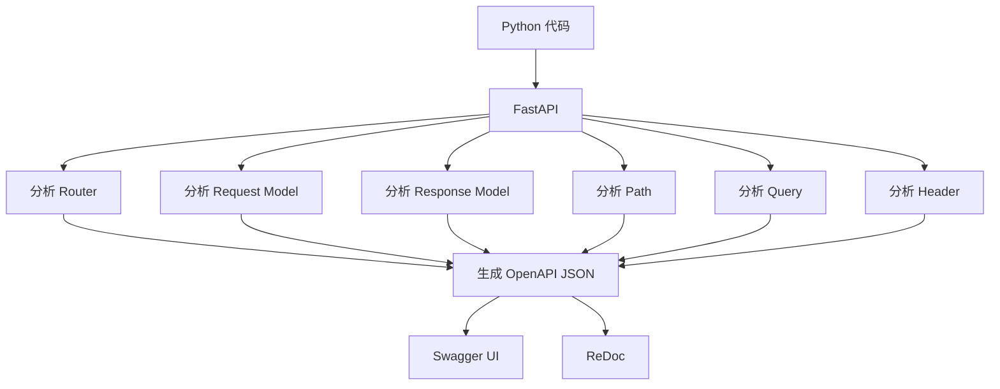
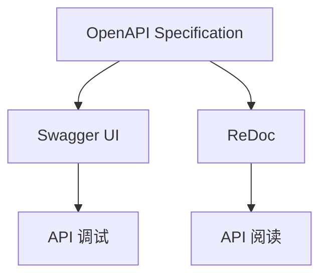
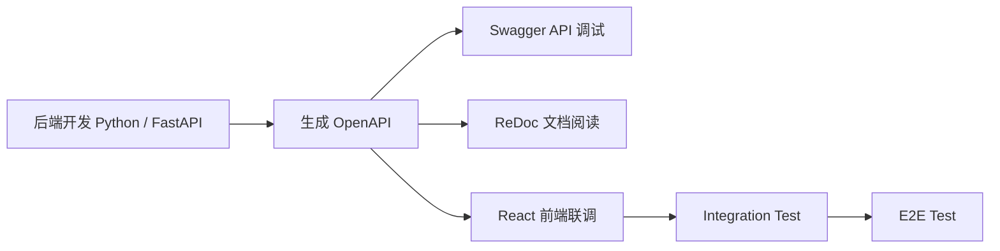
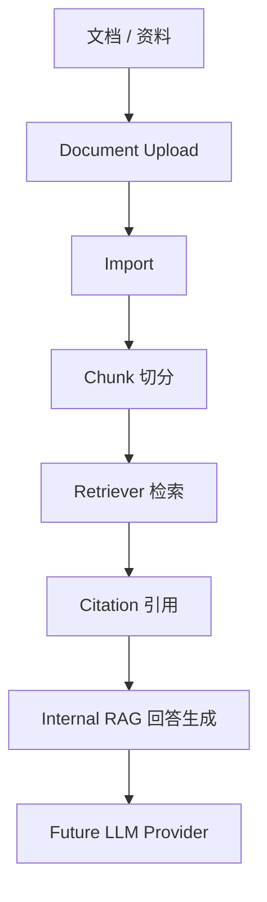
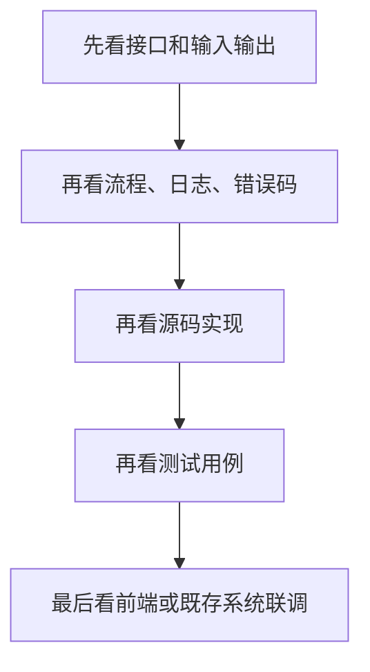

# AI Learn Concept Map 01：OpenAPI / Swagger / ReDoc

> 本章用于理解企业 AI 后端项目中：
>
> Python、FastAPI、OpenAPI、Swagger、ReDoc 的关系。
>
> 正式术语请查看：`ai-lab/术语速查表.md`

---

## 目录

1. Python → FastAPI → OpenAPI → Swagger / ReDoc
2. 企业为什么说 OpenAPI，而不是 Swagger
3. 企业 API 开发流程
4. 企业测试体系
5. RAG 学习路径
6. 企业学习方法
7. 本章总结

---

## 1. Python → FastAPI → OpenAPI → Swagger / ReDoc

### 1.1 真正的数据流



### 1.2 每一步在做什么

| 阶段 | 作用 | 学习重点 |
|---|---|---|
| Python 代码 | 编写后端接口和业务逻辑 | 真正开发的是 Python 代码，不是 Swagger |
| FastAPI | 读取并分析 Python 代码 | 自动识别 Router、Path、Query、Header、Request Model、Response Model |
| OpenAPI JSON | 生成接口标准规范 | 企业真正维护的是 OpenAPI 规范 |
| Swagger UI | API 调试与验证工具 | 用于 Try it out、Execute、联调接口 |
| ReDoc | API 阅读文档工具 | 适合阅读接口结构和字段说明 |

### 1.3 一句话记忆

> Python 代码通过 FastAPI 生成 OpenAPI JSON，再由 Swagger UI 和 ReDoc 展示成可读、可验证的接口文档。

### 1.4 日本語補足

OpenAPI は API 仕様です。
Swagger UI と ReDoc は OpenAPI の表示ツールです。

### 1.5 一句话总结

Python 代码通过 FastAPI 生成 OpenAPI JSON，再由 Swagger UI 和 ReDoc 展示成可读、可验证的接口文档。

---

## 2. 企业为什么说 OpenAPI，而不是 Swagger

### 2.1 概念关系



### 2.2 企业怎么理解

| 名称 | 角色 | 企业说法 |
|---|---|---|
| OpenAPI | 接口契约 / 标准规范 | 我们提供 OpenAPI |
| Swagger UI | OpenAPI 的调试 Viewer | 我们使用 Swagger 调试 API |
| ReDoc | OpenAPI 的阅读 Viewer | 我们使用 ReDoc 阅读 API 文档 |

### 2.3 重点理解

Swagger 不是接口本身。

Swagger 只是：

> OpenAPI 的一个展示工具。

真正重要的是：

```text
OpenAPI JSON
```

企业真正维护的是：

- Router
- Request Model
- Response Model
- OpenAPI Contract

不是手写 Swagger 页面。

### 2.4 企业项目必须记住

- Swagger 不是正式 UI。
- Swagger 不是测试环境。
- Swagger 是 API 调试与验证工具。
- React UI 和 Swagger 调用的是同一套 FastAPI API。
- UI 完成以后，Swagger 通常仍然长期保留。

### 2.5 日本語補足

Swagger は本番 UI ではありません。
API の検証画面です。
企業では OpenAPI 仕様を提供します。

---

## 3. 企业 API 开发流程

### 3.1 开发流程



### 3.2 每一步做什么

| 阶段 | 做什么 | 工具 |
|---|---|---|
| 后端开发 | 编写 Router、Service、Schema | Python / FastAPI |
| 接口规范 | 自动生成接口定义 | OpenAPI JSON |
| 接口验证 | 手动执行 API | Swagger UI |
| 文档阅读 | 阅读 API 结构 | ReDoc |
| 前端联调 | React 调用同一套 API | React + FastAPI |
| 集成测试 | 验证前后端业务流程 | Integration Test |
| 端到端测试 | 模拟真实用户操作 | E2E Test |

---

## 4. 企业测试体系

### 4.1 四层验证关系

```text
                E2E Test
                    ▲
            Integration Test
                    ▲
        Swagger API Verification
                    ▲
              Unit Test
```

### 4.2 四层验证说明

| 层级 | 工具 | 目的 |
|---|---|---|
| Unit Test | pytest / unittest | 验证模块、类、函数逻辑 |
| API Verification | Swagger UI | 手动验证接口请求、响应和业务流程 |
| Integration Test | React + FastAPI | 验证前后端联调流程 |
| E2E Test | Playwright / Cypress | 模拟真实用户完成完整业务流程 |

### 4.3 UI 完成后 Swagger 是否删除？

不会。

企业项目通常会长期保留 Swagger，因为它可以用于：

- 后端开发调试
- 前端联调
- QA 验证
- 第三方系统对接
- 新成员学习 API
- 排查接口问题

---

## 5. RAG 学习路径

### 5.1 RAG 主流程



### 5.2 各模块作用

| 阶段 | 含义 | 本项目对应功能 | 学习重点 |
|---|---|---|---|
| 文档 / 资料 | 原始知识来源 | Document Upload | RAG 的起点是资料，不是模型 |
| Import | 导入并验证文档 | Document Import | 先保证文档状态正确 |
| Chunk | 切分文档 | Document Chunk | Chunk 是检索基本单位 |
| Retrieval | 检索相关证据 | Document Retrieval | Retriever 找证据，不直接生成答案 |
| Citation | 标记答案依据 | Internal RAG citation | 企业 RAG 必须可追溯 |
| Answer | 生成回答 | Internal RAG | 当前先用确定性回答 |
| LLM Provider | 未来模型接入 | OpenRouter / Gemini / Qwen | 后续通过 Provider 扩展 |

### 5.3 一句话总结

> RAG 的核心不是“让模型会说”，而是让答案有证据、有来源、可回溯。

---

## 6. 企业学习方法

### 6.1 推荐学习顺序



### 6.2 为什么这样学习

| 顺序 | 学习重点 | 原因 |
|---|---|---|
| 1 | 接口和输入输出 | 先确认系统边界和 API Contract |
| 2 | 流程、日志、错误码 | 再理解问题如何定位和排查 |
| 3 | 源码实现 | 理解 Router、Service、Repository 如何协作 |
| 4 | 测试用例 | 确认哪些行为被保护 |
| 5 | 前端或既存系统联调 | 最后理解真实业务使用场景 |

### 6.3 一句话总结

> 企业项目学习先看边界，再看流程，再看源码，最后看测试和联调。

---

## 7. 本章总结（★★★★★）

请永远记住：

1. Python 才是真正开发的代码。
2. FastAPI 自动分析 Python 代码。
3. OpenAPI 是接口规范。
4. Swagger 是 API 调试工具。
5. ReDoc 是 API 阅读工具。
6. 企业真正维护的是 OpenAPI，而不是 Swagger。
7. Swagger 不是正式 UI，也不是测试环境。
8. React UI 和 Swagger 调用的是同一套 FastAPI API。
9. UI 完成以后，Swagger 通常仍然长期保留。
10. RAG 的重点是证据、引用和可追溯性。

---

## 学习完成标准

完成本章后，你应该能够回答：

- Swagger 是什么？
- OpenAPI 是什么？
- Swagger 和 OpenAPI 有什么区别？
- ReDoc 是什么？
- 为什么企业说 OpenAPI，而不是 Swagger？
- UI 完成以后 Swagger 是否还保留？
- FastAPI 为什么能自动生成 Swagger？
- RAG 为什么需要 Chunk、Retriever 和 Citation？

如果这些问题都能回答，说明本章已经掌握。
