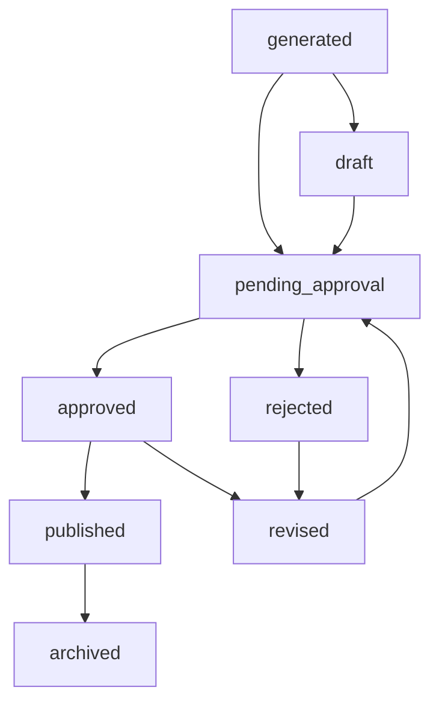
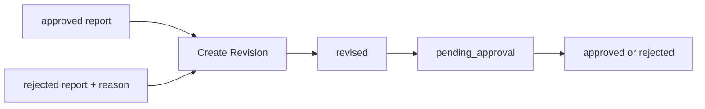
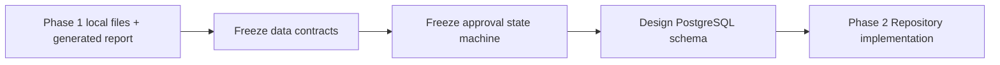

# ERIP 审批工作流设计

最后更新：2026-07-04

本文件冻结 Report / Approval 状态机设计。

## 当前状态（V1.0 已交付，2026-07-17 校正）

- 报告默认 `ReportStatus.GENERATED`（JSON `"generated"`）
- Approval API 已落地：submit / list / detail / approve / reject / revise
- PostgreSQL Approval Repository + History + ReportVersion；InMemory 测试适配器仍可用
- 前端「承認管理」页已交付（JWT + RBAC）
- HTTP 口径（与源码一致）：submit **201** + `pending_approval`；approve **200** + `approved`；employee 无权限 **403**
- 权威状态机与锁策略见 `ARCHITECTURE.md`「Enterprise Approval Workflow」

## 目标状态（枚举全集，含已实现）

承認ワークフロー状态机：

- `generated`（已实现）
- `draft`（预留）
- `pending_approval`（已实现）
- `approved` / `rejected` / `revised`（已实现）
- `published` / `archived`（预留/边界）

## 计划项（历史规划记录，部分已完成）

- ~~Phase 2 PostgreSQL 审批表~~ → **V1.0 已完成**
- ~~Phase 5 审批 API / 前端~~ → **V1.0 已完成**
- 仍属后续：跨系统工作流引擎产品化、SIEM 消费 Approval/Audit 事件

## 状态定义

| 状态 | 说明 | Current State / Planned |
| --- | --- | --- |
| `generated` | Workflow 直接生成的报告 | Current State |
| `draft` | 可编辑草稿版本 | Planned |
| `pending_approval` | 已提交等待审批 | Planned |
| `approved` | 已审批通过 | Planned |
| `rejected` | 已审批拒绝，必须带 reason | Planned |
| `revised` | 基于已批准或已拒绝版本生成的新修订 | Planned |
| `published` | 已对外发布或被业务确认的正式版本 | Planned |
| `archived` | 历史归档版本，不再作为当前有效版本 | Planned |

## 状态迁移规则

### 当前状态

- 只有 `generated`

### 目标状态

- `generated -> draft`
- `generated -> pending_approval`
- `draft -> pending_approval`
- `pending_approval -> approved`
- `pending_approval -> rejected`
- `rejected -> revised`
- `approved -> revised`
- `approved -> published`
- `published -> archived`
- `revised -> pending_approval`

### 硬性规则

- `rejected` 必须允许保存 `reason`
- `approved` 后不可直接覆盖原报告，必须生成 revision
- `published` 表示对外发布或业务确认版本
- `archived` 只能由历史版本进入，不能直接回到审批中

## 审批状态机

## 报告修订流程

## 审批工作流边界

### 当前状态

- 当前 API / SSE / Frontend 主链路仍然基于“生成即完成”
- 当前文件输入层与审批流解耦

### 计划项

- 后续会把“任务完成”与“报告审批完成”拆成两个状态面
- Task 状态与 Report 审批状态将分别持久化

## 阶段 1 到阶段 2 迁移流程

