# Enterprise Retail Intelligence Platform (ERIP) Architecture


## ERIP V1.0 交付架构摘要

> 本节为 **2026-07-17 现状摘要**。下文历史章节保留；冲突时以本节 + 源码为准。
> 业务链：`文書管理 → RAG検索 → AI分析(low_cost) → 董事会报告(high_quality) → 承認管理 → Persistent Audit`
> 数字：PG **281/2 skip**，InMemory **270/52 skip**，Frontend **113/113**，Alembic **`20260717_07_fallback_chain`**。
> 详细命令不复制：见 `docs/learning/01_Foundation/RUNBOOK_LOCAL.md` Appendix L/M/N。

```text
React (JWT / ProtectedRoute / RBAC UI / Learning Dashboard / Lifecycle Live Status)
  → FastAPI routes
  → Auth · Documents · Retrieval · Internal RAG
  → AI Analysis (LLM Gateway low_cost + Evidence Gate + Idempotency + Ledger)
  → Executive Report (high_quality + ReportVersion，不自动审批)
  → Approval state machine (owner / History / 403·409)
  → Persistent Audit + request_id
  → InMemory（学习）或 PostgreSQL/pgvector（企业验收）
```

**已交付**：JWT/RBAC、双路由 LLM 治理、Fallback Chain（OpenRouter→NVIDIA→Gemini→Local Qwen）、Compose+Alembic+Stub E2E、普通 RAG 默认可零真实 LLM。
**未交付（勿夸大）**：真实付费 smoke 默认化、Billing/多租户预算 UI、SIEM/WORM/Streaming、DeepSeek 默认启用、Redis/RabbitMQ/K8s 作为本仓默认可运行栈。


## 2026-07-17 显式 AI Analysis 成本边界

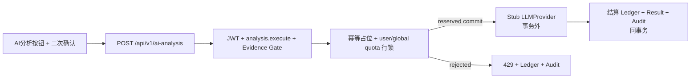

State owner：PostgreSQL 持有 usage/quota/result/audit 事实；React 只持有当前用户操作的临时幂等键和展示状态。InMemory 不实现 Ledger。

最后更新：2026-07-17

本文件记录 `Enterprise Retail Intelligence Platform (ERIP)` 的统一架构口径。当前仓库中的 `Retail Insight AI` 只表示 ERIP 的 Current MVP；未实现的能力必须明确标注，不得把规划写成现状。

Human-readable architecture explanations are trilingual by default.
本文件中的人类可读架构说明默认采用三语。
本書の人間向けアーキテクチャ説明は三言語を標準とします。

## Enterprise Approval Workflow / 企业审批工作流 / エンタープライズ承認ワークフロー

- English: Enterprise approval is PostgreSQL-only. InMemory remains the frozen local learning implementation.
- 中文（简体）：企业审批增强只面向 PostgreSQL；InMemory 保持冻结的本地学习实现。
- 日本語：エンタープライズ承認の強化は PostgreSQL のみを対象とし、InMemory は凍結されたローカル学習実装として維持します。

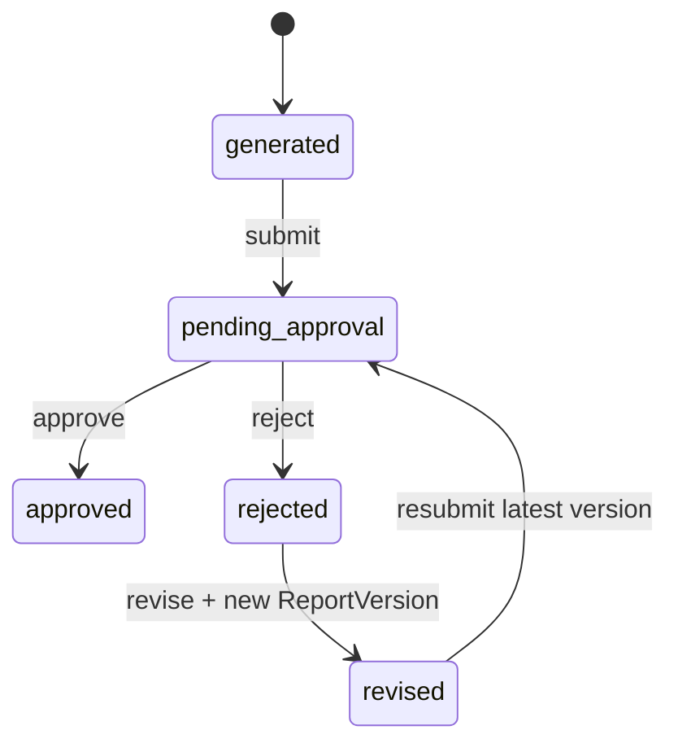

```text
JWT CurrentUser
├── Normal decision: approval.review
├── Owner actions: approval.submit + requested_by
├── Cross-owner management: approval.admin
├── Ownership: original submitter or approval.admin
└── PostgreSQL Transaction
    ├── Report / Approval row lock
    ├── ApprovalRequest current decision
    ├── immutable ReportVersion
    ├── append-only Approval History
    └── Persistent Audit security fact
```

- `ApprovalRequest` stores the current request and decision facts; `ReportVersion` is the immutable content boundary.
- `ApprovalEvent` is task-level business history with from/to status, verified actor, reason/comment, version link, and stable chronological ordering.
- `AuditLog` remains the separate security/compliance record. A report body is never copied into either approval audit metadata or permission-denied detail.
- PostgreSQL uses report/approval row locks plus a partial unique index allowing at most one `pending_approval` request per task.
- Initial submission claims the workflow for the verified submitter; later revise/resubmit requires that owner or the frozen `approval.admin` permission.

## PostgreSQL Persistent Audit / PostgreSQL 持久化审计 / PostgreSQL 永続監査

- English: Persistent Audit is enabled only for PostgreSQL; InMemory remains the frozen local learning path.
- 中文（简体）：Persistent Audit 只在 PostgreSQL 启用；InMemory 保持冻结的本地学习路径。
- 日本語：Persistent Audit は PostgreSQL のみで有効化し、InMemory は凍結されたローカル学習経路として維持します。

```text
JWT CurrentUser / Permission Dependency / Business Endpoint
│
▼
Persistent Audit yield Dependency
│
├── success -> business savepoint release -> append audit -> request transaction commit
└── failure -> business savepoint rollback -> append failure audit -> commit audit -> rethrow error
```

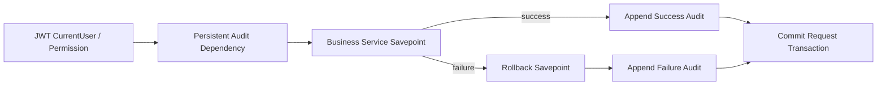

- Audit Log remains append-only and read-only through ordinary APIs.
- actor identity comes from verified `CurrentUser`; credentials, headers, document bodies, prompts, and full RAG context are excluded.
- Physical legacy columns (`operation_type`, `actor_id`, `created_at`) remain for data compatibility; the API exposes enterprise aliases such as `action`, `actor_user_id`, and `occurred_at`.

## Current Verified Capability Envelope / 当前已验证能力边界 / 現在の検証済み能力範囲

### Current State

- English: the Retail Insight AI MVP backend is verified for document lifecycle, document retrieval, internal RAG without LLM, LLM provider stub seam, approval workflow, approval-scope RBAC, approval-scope audit middleware, security domain, and in-memory audit log
- 中文（简体）：当前 `Retail Insight AI` MVP 后端已验证文档生命周期、文档检索、无 LLM 的内部 RAG、LLM Provider Stub 接缝、审批工作流、审批范围内的 RBAC、审批范围内的审计中间件、安全域和 InMemory 审计日志
- 日本語：現在の `Retail Insight AI` MVP バックエンドでは、ドキュメントライフサイクル、ドキュメント検索、LLM なしの内部 RAG、LLM Provider Stub の接続点、承認ワークフロー、承認範囲の RBAC、承認範囲の監査ミドルウェア、セキュリティドメイン、InMemory 監査ログまで検証済みです

### Target State

- English: keep the Retail Insight AI MVP stable while future ERIP phases intentionally add frontend UI, PostgreSQL, pgvector, hybrid retrieval, full-platform RBAC, audit persistence, OpenTelemetry, Redis, RabbitMQ, MCP, and production deployment
- 中文（简体）：在保持 `Retail Insight AI` MVP 稳定的前提下，后续 ERIP 阶段再有计划地加入前端 UI、PostgreSQL、pgvector、Hybrid Retrieval、全平台 RBAC、持久化 Audit Log、OpenTelemetry、Redis、RabbitMQ、MCP 和生产部署
- 日本語：`Retail Insight AI` MVP を安定させたまま、今後の ERIP 段階で frontend UI、PostgreSQL、pgvector、Hybrid Retrieval、全体 RBAC、永続 Audit Log、OpenTelemetry、Redis、RabbitMQ、MCP、本番デプロイを計画的に追加します

### Result

- English: the current Retail Insight AI MVP is runnable, learnable, and interview-ready, but ERIP as the final enterprise platform is still a target state
- 中文（简体）：当前 `Retail Insight AI` MVP 可运行、可学习、可面试讲解，但 `ERIP` 作为最终企业平台仍然是 Target State
- 日本語：現在の `Retail Insight AI` MVP は実行可能で、学習しやすく、面接説明にも使えますが、最終的な企業プラットフォームとしての `ERIP` はまだ Target State です

## Epic 14 Engineering Standards Freeze

### Current State

- Architecture、Workflow、Contract、Prompt、Development Standard 的约束分散在 README、AGENTS、Architecture 文档与历史任务记录中。
- 不同 AI 工具可能对 API version、SSE event、prompt 分类和 workflow 边界产生不一致解释。

### Target State

- `docs/development/MASTER_PROMPT.md` 成为唯一总入口。
- `docs/contracts/API_CONTRACT.md` 冻结 HTTP 边界。
- `docs/contracts/EVENT_CONTRACT.md` 冻结 SSE 事件封装。
- `docs/development/PROMPT_STANDARD.md` 冻结 Prompt 分类与模板要求。
- `docs/development/CODING_STANDARD.md`、`docs/development/DEVELOPMENT_GUIDE.md`、`docs/architecture/AI_AGENT_DESIGN_GUIDE.md` 冻结工程实现与设计判断入口。

### Planned

- 以后新增 API 必须 version。
- 以后新增 event family 或 breaking event 字段必须 version。
- 以后新增 prompt family 必须声明 category、variables、output、version。
- 以后所有 AI 工具必须先读冻结文档，再执行具体实现。
- Epic 14 has frozen the master prompt, API contract, event contract, prompt standard, coding standard, development guide, and AI agent design guide as the final planning baseline.

## Phase 1.5 Contract Freeze and Approval Design

### Current State

- 当前文件输入已落地
- 当前 Report 只实现 `generated`
- 当前无审批 API、无 PostgreSQL、无导入表

### Target State

- 文件输入字段契约冻结
- 导入错误模型冻结
- Approval State Machine 冻结
- Phase 2 数据库准备项冻结

### Planned

- 由 `docs/architecture/DATA_CONTRACTS.md` 作为文件输入单一来源
- 由 `docs/architecture/APPROVAL_WORKFLOW.md` 作为审批状态机单一来源
- 由 `docs/database/DATABASE.md` 作为 Phase 2 表结构准备来源

## Sprint 10.1 Approval Workflow Contract Freeze

### Current State

- 当前报告仍以 `generated` 作为默认业务状态。
- Approval API MVP 已实现，但仍必须遵守已冻结的审批 contract、event contract 和 error catalog。
- 当前审批通过 backend service + in-memory approval repository 落地，仍保持 report revision 之前的稳定边界。

中文（简体）：
审批工作流现在已经有 backend MVP，但仍然以冻结 contract 为边界。当前实现的关键是把审批记录、审计事件和 report revision snapshot 分开，不允许把可变正文当成审批事实。

日本語：
承認ワークフローは backend MVP まで実装済みですが、境界は凍結済み契約のままです。承認記録、監査イベント、report revision snapshot を分離し、可変本文を承認事実として扱わないことが重要です。

### Target State

- Approval Workflow 成为 Report Revision、Audit、Future RBAC 之间的稳定承接层。
- `submit-approval`、`approve`、`reject`、`revise`、`list`、`detail` 六个 API 先冻结契约，再进入实现。
- `approved` report 只能通过创建新 revision 变更，不得覆盖旧 snapshot。

### Result

- Approval domain model、state machine、API contract、event contract、error catalog 已冻结。
- report revision relationship、audit relationship、future RBAC relationship 已写入架构边界。
- backend-only Approval API MVP 已接入 frozen contract，不修改 frontend 或 scripts。

中文（简体）：
这个结果表示“契约已冻结，代码已落地”。后续只能沿用相同的审批状态语义继续演进，不能把前端、RBAC 或外部 workflow engine 直接塞进当前边界。

日本語：
この結果は「契約は凍結済みで、コードも実装済み」という意味です。今後は同じ状態意味を保ったまま拡張し、frontend、RBAC、外部 workflow engine を直接混ぜ込んではいけません。

### Planned

- 后续 Approval API 只能沿用当前冻结的状态与事件语义。
- 未来 RBAC 只能控制调用资格，不能改变既有状态机含义。
- 未来实现必须保留 report version 的 immutable snapshot 语义。

## Sprint 11.1 Enterprise Security Foundation Contract Freeze / 企业安全基础合同冻结 / エンタープライズセキュリティ基盤契約凍結

### Current State

- （历史记录）当时没有真实 RBAC/JWT/OAuth。**V1.0**：JWT + 冻结 RBAC 已交付；完整 SSO/OAuth 产品化仍属后续。
- 当前 Approval API、Retrieval API 和 Internal RAG 仍只依赖既有 backend service boundary。
- 当前 security model 已在 Sprint 11.2 落地为 placeholder principal + static catalog + append-only audit seam，但仍不能被解释为已上线的身份系统。

中文（简体）：
这一阶段先把企业安全基础的概念层冻结下来，再谈实现。我们只冻结用户、组织、部门、角色、权限、策略、审计日志和操作日志的语义，不提前引入真实认证或 RBAC 服务。

日本語：
この段階では、企業セキュリティ基盤の概念層を先に凍結します。ユーザー、組織、部署、ロール、権限、ポリシー、監査ログ、操作ログの意味だけを固定し、実認証や RBAC サービスはまだ導入しません。

### Target State

- `GET /api/v1/users/me` provides the authenticated principal snapshot.
- `GET /api/v1/security/roles` provides the frozen role catalog.
- `GET /api/v1/security/permissions` provides the frozen permission catalog.
- `GET /api/v1/audit-logs` provides append-only audit facts and the operation log projection.
- RBAC approval-action matrix is fixed before backend implementation.

### Result

- User / organization / department / role / permission / policy concepts are frozen as documentation-level domain models.
- Security API contracts are frozen and now have a backend MVP with a system placeholder principal.
- Audit log contract and operation log contract are defined as read-only, append-only facts.

### Planned

- Later backend work may implement authentication middleware, RBAC enforcement, and audit append paths.
- The current contract only freezes the read surface and the approval-action matrix.
- Future implementation must preserve the frozen permission names and event names.

## Sprint 11.2 Security Domain + InMemory Audit MVP / 企业安全域 + InMemory 审计最小可行实现 / 企業セキュリティ領域 + InMemory 監査 MVP

### Current State

- 当前 backend 仍不接真实认证、JWT、OAuth 或外部身份提供器。
- 当前 current user 采用 `user_id="system"` 的 placeholder principal。
- 当前 role / permission / policy 使用 frozen static catalog，不做动态授权决策。
- 当前 audit log 采用 append-only InMemoryAuditRepository，并通过 AuditService 记录成功与失败。

中文（简体）：
这一阶段把安全域从“只冻结契约”推进到“有后端可运行的读模型 + 审计追加 seam”。重点不是做真实登录，而是把 current user、角色目录、权限目录和审计事实分成独立边界，后续替换认证或持久化时不用重写 API。

日本語：
この段階では、セキュリティ領域を「契約凍結だけ」から「バックエンドで動く read model + 監査追加 seam」へ進めます。目的は実ログインではなく、current user、role catalog、permission catalog、audit fact を分離して、後続の認証や永続化差し替えを容易にすることです。

### Target State

- 未来 RBAC middleware 可以直接消费 current user snapshot，而不破坏 `users/me` contract。
- 未来 audit persistence 可以替换 repository 实现，而不破坏 `GET /api/v1/audit-logs` contract。
- 未来真身份接入前，系统占位用户仍然是当前默认行为。

### Result

- `User` / `Organization` / `Department` / `Role` / `Permission` / `Policy` domain models added.
- `GET /api/v1/users/me` returns the system placeholder principal.
- `GET /api/v1/security/roles` and `GET /api/v1/security/permissions` return frozen static catalogs.
- `AuditLog` model, `AuditRepository`, `InMemoryAuditRepository`, and `AuditService` added.
- `GET /api/v1/audit-logs` returns append-only audit facts.
- `audit.log.created` is logged after successful append; `audit.log.failed` is logged only when append fails.
- Existing approval/document/RAG APIs remain unaffected by RBAC enforcement in this sprint.

### Planned

- Later backend work may implement authentication middleware, RBAC enforcement, and audit append paths.
- The current contract only freezes the read surface and the approval-action matrix.
- Future implementation must preserve the frozen permission names and event names.

### Security Read Flow

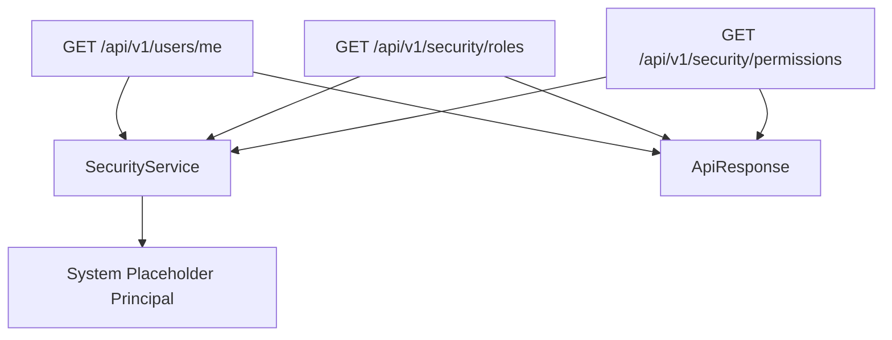

### Audit Append Flow

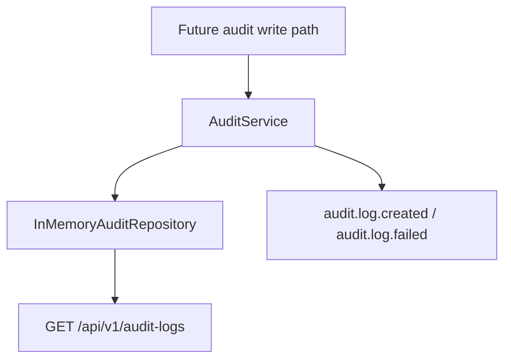

## Sprint 11.3 RBAC Enforcement for Approval APIs

### Current State

- 当前 current user 仍然使用 `user_id="system"` 的 placeholder principal。
- 当前 RBAC 只在 approval APIs 上生效，不扩展到 document / retrieval / RAG / task APIs。
- 当前 default system admin 占位用户通过全部 approval permission checks。
- 当前 permission denied 会先写 append-only audit fact，再返回 `permission_denied`。

中文（简体）：
这一层把 approval API 的 RBAC 门禁落到 backend service / route seam 上，但仍然不引入真实认证、JWT、OAuth 或外部身份提供器。这样可以先验证 current-user seam、permission map 和 denied audit fact，再决定未来怎么接入真正登录。

日本語：
この層では approval API の RBAC ガードを backend service / route seam に実装しますが、実認証、JWT、OAuth、外部 IdP はまだ導入しません。current-user seam、permission map、deny 時の audit fact を先に検証し、その後に本物のログイン接続を検討できます。

### Target State

- 未来可以在不改变 approval API response shape 的前提下替换 current user 来源。

### Result

- `POST /api/v1/reports/{task_id}/submit-approval` now requires `report.submit_approval`
- `GET /api/v1/approvals` now requires `approval.review`
- `GET /api/v1/approvals/{approval_id}` now requires `approval.review`
- `POST /api/v1/approvals/{approval_id}/approve` now requires `approval.approve`
- `POST /api/v1/approvals/{approval_id}/reject` now requires `approval.reject`
- `POST /api/v1/reports/{task_id}/revise` now requires `approval.revise`
- denied approval access writes `security.permission.denied` audit facts
- backend tests cover allow / deny paths and audit logging
- handbook mirror synchronized

### Planned

- Future RBAC can replace the placeholder current user seam without changing approval payloads.
- Keep approval RBAC isolated from document, retrieval, RAG, and task APIs until a later sprint.

## Enterprise Security Overview

### Security Domain Model

- `user` belongs to one `organization` and one `department`.
- `role` groups permissions for a job function or operational responsibility.
- `permission` names one stable action.
- `policy` resolves whether a role may perform an action on a resource.
- Current runtime uses `user_id="system"` as a placeholder principal until real authentication arrives.
- `audit log` is append-only and read-only.
- `operation log` is the operator-facing projection of audit facts.

### RBAC Approval-Action Matrix

| Action | Permission | Default Roles |
|---|---|---|
| `GET /api/v1/users/me` | authenticated identity | all authenticated users |
| `GET /api/v1/security/roles` | `system.admin` | admin |
| `GET /api/v1/security/permissions` | `system.admin` | admin |
| `GET /api/v1/audit-logs` | `audit.read` | auditor, admin |
| `POST /api/v1/reports/{task_id}/submit-approval` | `report.submit_approval` | analyst, manager, admin |
| `GET /api/v1/approvals` | `approval.review` | approver, manager, auditor, admin |
| `GET /api/v1/approvals/{approval_id}` | `approval.review` | approver, manager, auditor, admin |
| `POST /api/v1/approvals/{approval_id}/approve` | `approval.approve` | approver, manager, admin |
| `POST /api/v1/approvals/{approval_id}/reject` | `approval.reject` | approver, manager, admin |
| `POST /api/v1/reports/{task_id}/revise` | `approval.revise` | analyst, manager, approver, admin |

### Audit Log Contract

- Audit logs are append-only facts and are safe to read after the originating operation is archived.
- Audit log records must include actor, resource, result, request_id, trace_id, timestamp, and a secret-safe metadata payload.
- Operation logs are a projection of the same facts for human review and support workflows.
- Audit failures must not leak sensitive input, and they must preserve the failure error code.

### Future Authentication Flow

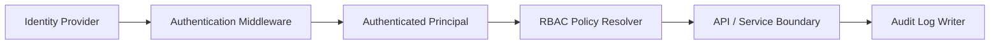

### RBAC Flow

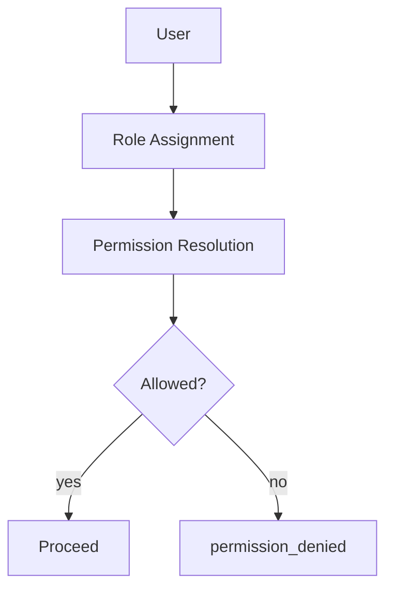

### Approval Permission Flow

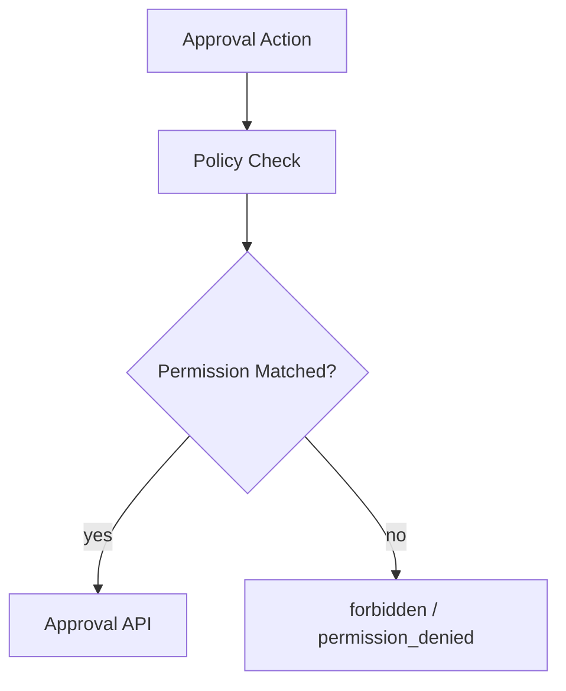

### Audit Log Flow

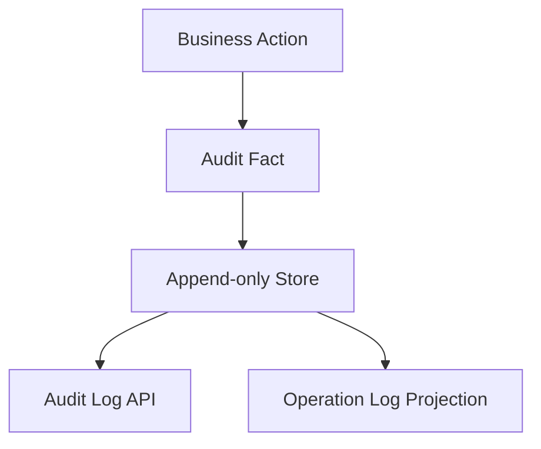

### Future Authentication Flow Notes

- Authentication is a future seam, not a current implementation dependency.
- RBAC consumes the authenticated principal after the identity provider is introduced.
- Audit logging must remain available as a read model even before the authentication seam ships.

## Approval Workflow Model

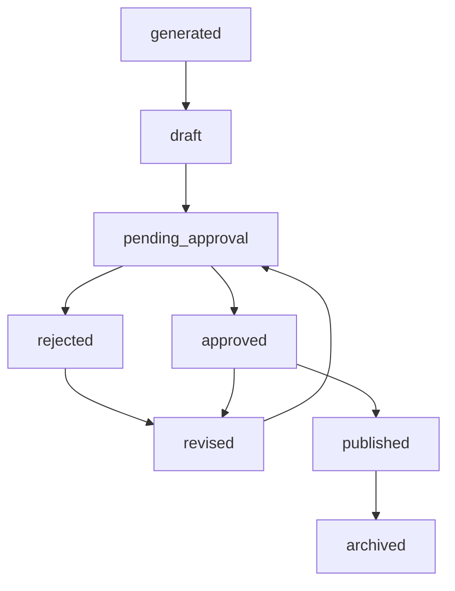

## Report Revision Flow

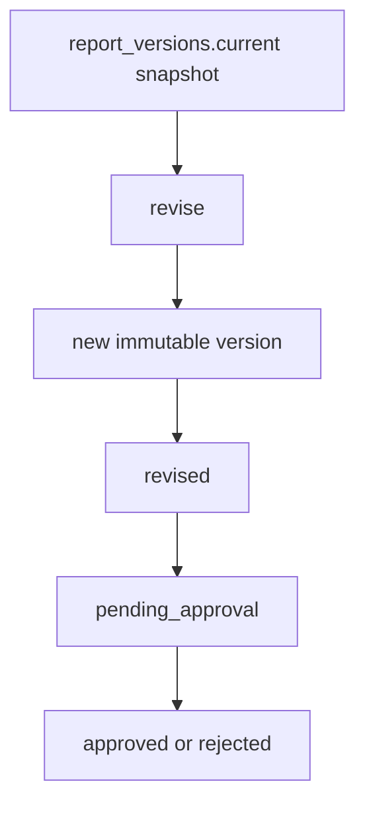

## Approval Event Flow

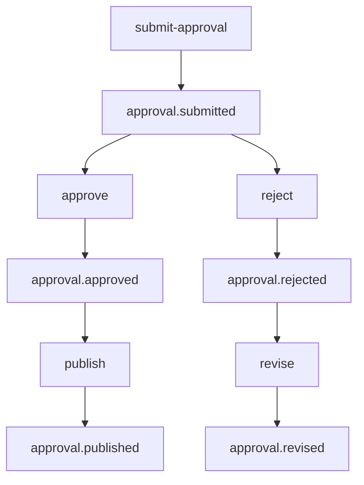

## Approval + Audit Flow

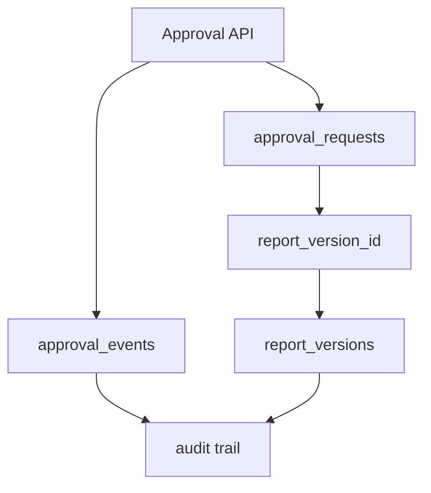

## Future RBAC Integration Flow

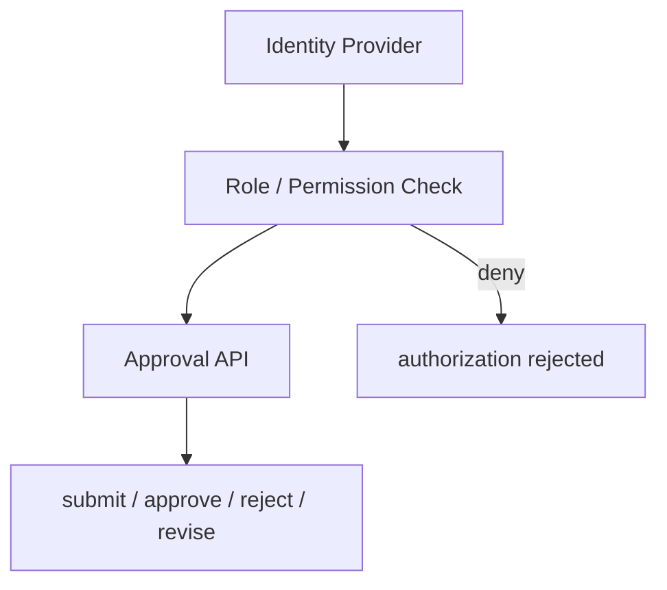

### Planned Notes

- RBAC is a future authorization seam only.
- Audit facts must remain usable even before RBAC exists.
- Published output must stay readable after archival.

## Phase 3.1 Document Domain Model

### Current State

- 当前已经补齐 Document / DocumentVersion / DocumentChunk placeholder / DocumentMetadata / DocumentSource。
- （历史记录）早期仅 InMemory Document。**V1.0**：Upload/Import/Chunk/Retrieval、pgvector Compose、PostgreSQL Repository 已交付；InMemory 学习路径仍保留。
- `ImportBatch` 复用现有 `DataImport`，`ApprovalStatus` 复用现有 `ReportStatus`。

### Target State

- Document Domain 成为 Upload、Version Management、Internal RAG、Approval Workflow、Retrieval 与 PostgreSQL Persistence 的共同基础。
- 未来所有文档相关能力都必须沿用本节定义的状态、类型、语言和元数据，不得重新发明另一套文档语义。

### Planned

- 后续 Upload API、Document Pipeline、Chunk Pipeline、Retrieval Provider、Approval API 和 PostgreSQL Repository 都必须基于本节模型扩展。
- 当前阶段只允许 `uploaded` 作为新建文档的初始状态，未来状态仅作为生命周期占位与迁移边界。

## Document Domain

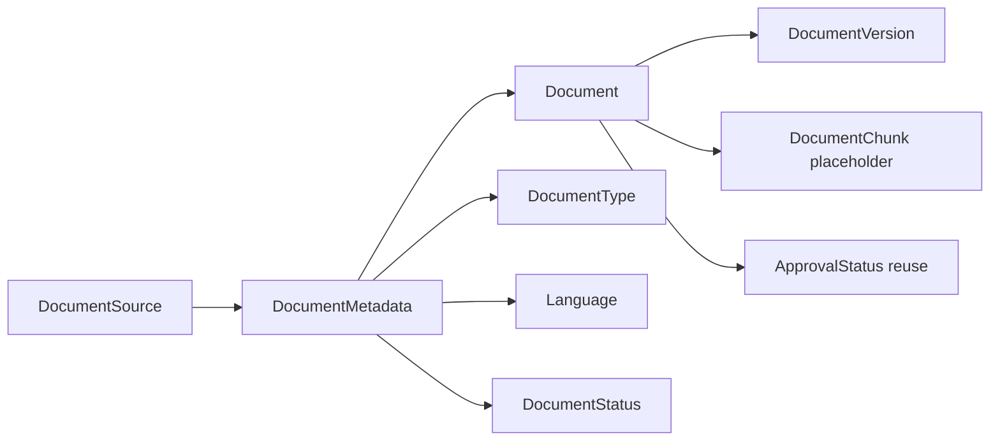

## Document Lifecycle

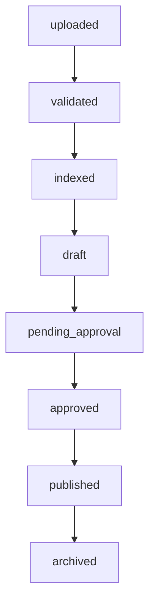

## Document Metadata

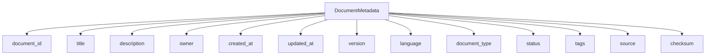

## Future Document Pipeline

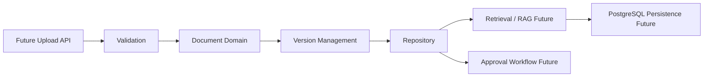

## Current vs Future

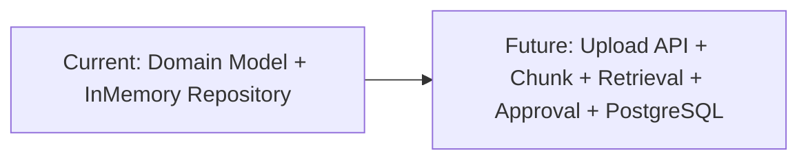

## Sprint 2 Document Upload API Contract Freeze

### Current State

- 当前实现仍只停留在 Document Domain Model。
- 当前没有 Upload API，没有 Upload 事件流，没有前端改动。

### Target State

- 冻结 `POST /api/v1/documents`、`GET /api/v1/documents`、`GET /api/v1/documents/{document_id}`、`GET /api/v1/documents/{document_id}/versions`、`GET /api/v1/documents/{document_id}/chunks`、`DELETE /api/v1/documents/{document_id}`。
- 冻结 `document.upload.started`、`document.upload.validated`、`document.upload.completed`、`document.upload.failed`、`document.version.created`、`document.validation.failed`。
- Upload API 只负责受理、校验、版本边界和事件发布，不直接实现审批。

### Planned

- 后续实现必须遵守 `docs/contracts/API_CONTRACT.md` 与 `docs/contracts/EVENT_CONTRACT.md`。
- 当前阶段不实现 Upload API，不修改业务代码，不把审批状态当成 Upload 成功的隐含结果。

## Document Upload API Flow

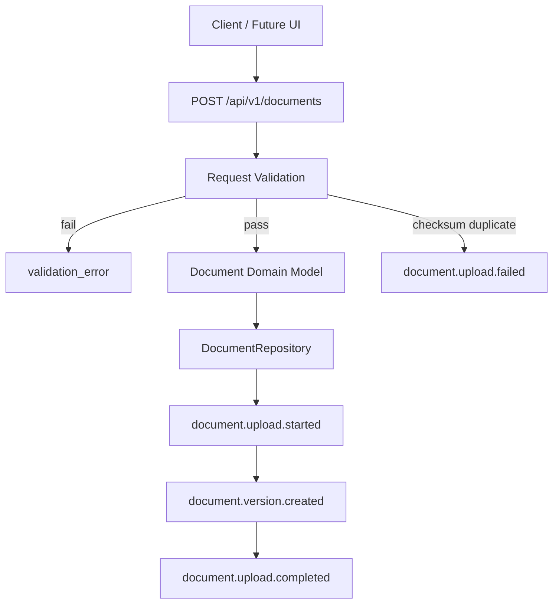

## Document Upload Event Flow

```mermaid
flowchart TD
    A[Upload Accepted] --> B[document.upload.started]
    B --> C[document.upload.validated]
    C --> D[document.version.created]
    D --> E[document.upload.completed]
    C -->|validation failure| F[document.validation.failed]
    D -->|storage failure| G[document.upload.failed]
```

## Document Upload Validation Flow

```mermaid
flowchart TD
    A[Upload Request] --> B[title present?]
    B -->|no| Z[reject]
    B -->|yes| C[file empty?]
    C -->|yes| Z
    C -->|no| D[document type supported?]
    D -->|no| Z
    D -->|yes| E[metadata valid?]
    E -->|no| Z
    E -->|yes| F[checksum duplicate?]
    F -->|yes| Z
    F -->|no| G[accept]
```

## Future Approval Integration Flow

```mermaid
flowchart TD
    A[document.upload.completed] --> B[Future Approval Intake]
    B --> C[pending_approval]
    C --> D[approved]
    C --> E[rejected]
    D --> F[published]
    E --> G[revision]
    G --> C
```

## Sprint 2.5 Document Upload Workflow + Error Catalog + Upload Policy Freeze

### Current State

- 当前仍只停留在 Document Domain Model 与 Upload API contract freeze。
- 当前 Upload Workflow 只作为前置契约冻结，不是已实现流程。

### Target State

- 冻结 Upload Request Accepted、Upload Session Created、File Validation、Metadata Validation、Checksum Calculation、Duplicate Detection、Version Decision、Repository Save、Event Publishing、Response Returned。
- 冻结 Error Catalog 与 Upload Policy 作为 Upload API 实现前的最后约束。

### Planned

- 后续 Upload API 实现必须先遵守 Upload Session、Idempotency、Error Catalog、Upload Policy。
- 当前阶段不实现 Upload API，不引入文件存储、Chunk、RAG、Approval API、pgvector 或前端上传 UI。

## Document Upload Workflow

```mermaid
flowchart TD
    A[Upload Request Accepted] --> B[Upload Session Created]
    B --> C[File Validation]
    C --> D[Metadata Validation]
    D --> E[Checksum Calculation]
    E --> F[Duplicate Detection]
    F --> G[Version Decision]
    G --> H[Repository Save]
    H --> I[Event Publishing]
    I --> J[Response Returned]
```

## Sprint 3 Document Upload API MVP Implementation

### Current State

- `POST /api/v1/documents` 已实现同步 MVP。
- 当前只实现 backend，不实现 frontend、不实现 RAG、不实现 chunking、不实现 pgvector、不实现 Approval API。

### Target State

- 继续保持 `DocumentUploadSession`、checksum duplicate detection、`Idempotency-Key`、event publishing 和 `InMemoryDocumentRepository` 作为当前文档上传闭环。

### Result

- 成功上传返回 `201 Created` 和完成态 `DocumentUploadSession`。
- 重复 checksum 返回已有结果。
- `Idempotency-Key` 同 key 不同 checksum 返回 `idempotency_conflict`。

### Planned

- 后续只读接口、删除接口、版本接口和 chunks 接口仍保持冻结未实现。
- PostgreSQL Document Repository 仍保持设计不实现。

## Sprint 4 Document Read API MVP

### Current State

- `GET /api/v1/documents` 与 `GET /api/v1/documents/{document_id}` 已实现。
- 当前只使用现有 `InMemoryDocumentRepository`，不引入新的检索层或 PostgreSQL 读实现。

### Target State

- 保持低风险读取能力，支持 status / document_type / language / owner / tag 的基础过滤。

### Result

- 列表接口返回 `items` 与 `next_cursor`。
- 详情接口在缺失时返回 `document_not_found`。

### Planned

- `DELETE`、`versions`、`chunks` 继续冻结未实现。
- PostgreSQL Document Repository 仍只设计不实现。

## Sprint 5 Document Archive API MVP

### Current State

- `DELETE /api/v1/documents/{document_id}` 仍未实现。
- 当前列表接口仍以低风险读取为主，需要明确 archived 的默认过滤边界。

### Target State

- DELETE 语义冻结为 archive / soft delete，不做物理删除。
- archived 文档默认不出现在列表中，除非显式请求 `include_archived=true` 或 `status=archived`。

### Result

- 当前阶段只补齐软删除契约，不引入新存储模型。

### Planned

- 继续保持 `versions`、`chunks`、`PostgreSQL Document Repository` 冻结未实现。

## Sprint 6 Document Import Pipeline MVP

### Current State

- `POST /api/v1/documents/{document_id}/import` 与 `GET /api/v1/document-imports/{import_id}` 已实现。
- 当前导入流水线只做同步 MVP，不创建 chunk、不做检索、不做审批。
- 当前只复用现有 `InMemoryDocumentRepository`，不引入 PostgreSQL Import Repository。

### Target State

- 导入流水线成为 future chunking、internal RAG、full-text search、approval workflow 与 audit 的前置边界。
- 成功导入后，文档状态推进到 `validated`。
- 仅允许 `markdown`、`text`、`csv`、`json` 进入当前导入闭环。

### Result

- 导入结果、错误与状态查询已可在后端读取。

### Planned

- `versions`、`chunks`、RAG、embedding、pgvector、Internet Search、Approval API 与 PostgreSQL Document Repository 继续冻结未实现。

## Document Import Pipeline

```mermaid
flowchart TD
    A[POST /api/v1/documents/{document_id}/import] --> B[Load uploaded document]
    B --> C[Validate document status]
    C -->|archived| X[document_archived]
    C -->|missing| Y[document_not_found]
    C --> D[Validate document type]
    D -->|unsupported| Z[unsupported_document_type]
    D --> E[Mark running]
    E --> F[Mark document validated]
    F --> G[Persist import record in memory]
    G --> H[document.import.completed]
```

## Import Status Flow

```mermaid
flowchart TD
    A[pending] --> B[running]
    B --> C[completed]
    B --> D[failed]
```

## Import Error Flow

```mermaid
flowchart TD
    A[Import Request] --> B{Document exists?}
    B -->|no| X[document_not_found]
    B -->|yes| C{Archived?}
    C -->|yes| Y[document_archived]
    C -->|no| D{Type supported?}
    D -->|no| Z[unsupported_document_type]
    D -->|yes| E[Import completed]
```

## Future Chunking Integration Flow

```mermaid
flowchart TD
    A[document.import.completed] --> B[Future Chunk Pipeline]
    B --> C[DocumentChunk]
    C --> D[Future Internal RAG]
```

## Future Approval Integration Flow

```mermaid
flowchart TD
    A[document.import.completed] --> B[Future Approval Intake]
    B --> C[pending_approval]
    C --> D[approved]
    C --> E[rejected]
    D --> F[published]
    E --> G[revision]
    G --> C
```

## Sprint 7 Document Chunk Pipeline MVP

### Current State

- `POST /api/v1/documents/{document_id}/chunks` 与 `GET /api/v1/documents/{document_id}/chunks` 已实现。
- 当前 chunk pipeline 只接受 `validated` 文档，只支持 `markdown` / `text`，并使用独立的 InMemory chunk repository。
- 当前 chunk 结果采用 deterministic replace 规则，同一文档版本重复 chunk 会覆盖并返回相同结果。

### Target State

- 文档切片成为 future RAG、全文检索、上下文组装与引用追踪的前置边界。
- chunk 结果必须稳定保存 `chunk_index`、`content`、`character_count` 与父文档 metadata snapshot。
- chunk pipeline 不改变 approval 状态，也不承担 search / embedding 职责。

### Result

- 支持 import 完成后的文档切片、chunk 查询与事件记录。

### Planned

- `versions`、`RAG`、`embedding`、`pgvector`、`Approval API`、`PostgreSQL Document Repository` 继续冻结未实现。

## Document Chunk Pipeline

```mermaid
flowchart TD
    A[POST /api/v1/documents/{document_id}/chunks] --> B[Load validated document]
    B --> C{Document exists?}
    C -->|no| X[document_not_found]
    C -->|yes| D{Archived?}
    D -->|yes| Y[document_archived]
    D -->|no| E{Validated?}
    E -->|no| Z[document_not_validated]
    E -->|yes| F{Type supported?}
    F -->|no| U[unsupported_document_type]
    F -->|yes| G[Split by paragraph / fixed-size fallback]
    G --> H[Replace stored chunk set]
    H --> I[document.chunk.completed]
```

## Chunk Lifecycle

```mermaid
flowchart TD
    A[pending chunk request] --> B[running]
    B --> C[completed]
    B --> D[failed]
```

## Chunk Error Flow

```mermaid
flowchart TD
    A[Chunk Request] --> B{Document exists?}
    B -->|no| X[document_not_found]
    B -->|yes| C{Archived?}
    C -->|yes| Y[document_archived]
    C -->|no| D{Validated?}
    D -->|no| Z[document_not_validated]
    D -->|yes| E{Type supported?}
    E -->|no| U[unsupported_document_type]
    E -->|yes| F[chunk_failed only on unexpected failure]
```

## Future RAG Integration Flow

```mermaid
flowchart TD
    A[document.chunk.completed] --> B[Future Retriever]
    B --> C[Future Context Builder]
    C --> D[Future RAG Answering]
```

## Future Approval Integration Flow

```mermaid
flowchart TD
    A[document.chunk.completed] --> B[Future Approval Intake]
    B --> C[pending_approval]
    C --> D[approved]
    C --> E[rejected]
```

## Upload Session Flow

```mermaid
flowchart TD
    A[accepted] --> B[validating]
    B --> C[storing]
    C --> D[completed]
    B --> E[failed]
    C --> E
```

## Validation Flow

```mermaid
flowchart TD
    A[Request] --> B[title check]
    B -->|fail| X[missing_title]
    B -->|pass| C[file check]
    C -->|fail| Y[empty_file]
    C -->|pass| D[metadata check]
    D -->|fail| Z[invalid_metadata]
    D -->|pass| E[encoding / type check]
    E -->|fail| U[unsupported_document_type / unsupported_encoding]
    E -->|pass| F[checksum + idempotency check]
```

## Duplicate Detection Flow

```mermaid
flowchart TD
    A[Same Idempotency-Key] --> B{Same checksum?}
    B -->|yes| C[return existing result]
    B -->|no| D[idempotency_conflict]
    E[Same checksum without key] --> F[duplicate_checksum]
```

## Future Approval Integration Flow

```mermaid
flowchart TD
    A[document.upload.completed] --> B[pending_approval]
    B --> C[approved]
    B --> D[rejected]
    C --> E[published]
    D --> F[revision]
    F --> B
```

## Sprint 8.1 Document Retrieval Contract Freeze

### Current State

- `POST /api/v1/document-retrieval/search` 已冻结为内部文档检索 contract。
- 当前只冻结 keyword retrieval，不实现 RAG、embedding 或真实搜索后端。
- 当前检索结果以 document/chunk/source/metadata 为核心，不能把答案生成混进该 contract。

### Target State

- 文档检索成为 chunk 之后、RAG 之前的稳定只读边界。
- 检索请求必须支持 query、limit、include_archived、document_type、language、tags。
- 检索响应必须返回 `results[]`、`total`、`query`、`retrieval_mode=keyword`。

### Result

- 只冻结 API / Event / Error contract，不实现检索后端。

### Planned

- 未来检索实现可替换为 keyword search、full-text search、hybrid search 或 retrieval provider，但必须保持契约兼容。

## Sprint 8.2 Document Retrieval API MVP Implementation

### Current State

- `POST /api/v1/document-retrieval/search` 已实现为 keyword-only search。
- 当前检索只读取现有 in-memory document chunks，不调用 LLM、embedding、pgvector 或 PostgreSQL 搜索后端。
- 当前支持 `query`、`limit`、`include_archived`、`document_type`、`language`、`tags`，并返回 `document_id`、`chunk_id`、`chunk_index`、`content_excerpt`、`score`、`source`、`metadata`。
- 当前事件已实现 `document.retrieval.started`、`document.retrieval.completed`、`document.retrieval.failed`。

### Target State

- 检索继续保持为 chunk 之后、RAG 之前的稳定只读边界。
- 未来可以替换 keyword scoring 为 full-text search、hybrid search 或 retrieval provider，但 response contract 必须保持兼容。

### Result

- 当前 MVP 已可通过测试验证空查询、无结果、归档过滤、include_archived 与确定性排序。

### Planned

- 未来检索后端可迁移到 PostgreSQL full-text 或混合检索，但不在当前 sprint 引入。
- 当前阶段不把答案生成、引用拼装或上下文构建塞进 retrieval API。

## Sprint 8.3 Retrieval Repository Abstraction + Worktree Cleanup

### Current State

- `POST /api/v1/document-retrieval/search` 的 HTTP contract 与事件 contract 保持不变。
- `DocumentRetrievalService` 已改为依赖 `DocumentRetrievalProvider`，不再直接读取 raw chunk storage。
- 当前唯一实现仍是本地 `InMemoryKeywordRetrieval`，它继续复用现有 `DocumentRepository` 与 `DocumentChunkRepository`。

### Target State

- Retrieval service 只负责 API、事件和错误边界，检索后端可替换。
- 后续引入 PostgreSQL full-text 或其他搜索后端时，只需要替换 provider 实现，不改 route contract。

### Result

- 检索评分、排序、响应结构保持不变。
- 工作区中未发现额外 untracked chunk 文件，因此没有需要回收的 Sprint 7 重复产物。

### Planned

- 后续可在 provider 接口后面继续增加 PostgreSQL search backend、hybrid search 或 retrieval evaluation。
- 当前阶段仍不实现 RAG、embedding、pgvector 或 frontend。

## Sprint 9.1 Internal RAG Contract Freeze

### Current State

- `POST /api/v1/internal-rag/answer` 仅完成 contract freeze。
- 当前没有 RAG implementation，没有 LLM provider，没有 embedding，没有 pgvector，没有 frontend。
- Internal RAG 依赖现有 retrieval provider 边界，但不改变 retrieval API 行为。

### Target State

- Internal RAG 作为 retrieval 之后、approval 之前的稳定只读回答边界。
- `answer_mode=extractive | summary` 与 `require_citations=true` 被冻结为 contract 约束。
- 未来 summary 生成可以接入可替换 LLM provider，但不能破坏当前 API / Event / Error contract。

### Result

- 当前只冻结 API、Event、Error、Prompt、Architecture 以及任务治理文档。
- 仍不实现回答生成、上下文合并执行逻辑、向量检索或审批联动。

### Planned

- 未来 Internal RAG 必须通过 citation-aware contract 连接 retrieval provider。
- 后续如果要支持其他 retrieval backend 或 LLM provider，必须在不破坏 `/api/v1/internal-rag/answer` 的前提下版本化扩展。

## Sprint 9.2 Internal RAG MVP without LLM

### Current State

- `POST /api/v1/internal-rag/answer` 已实现 deterministic answer assembly。
- internal RAG 只依赖现有 `DocumentRetrievalProvider`，不直接碰 raw chunk storage。
- `answer_mode=extractive | summary` 都保持 no-LLM、no-embedding、no-pgvector。

### Target State

- Internal RAG 继续作为 retrieval 之后、approval 之前的稳定 grounded answer boundary。
- 未来 summary mode 可以替换成可插拔 LLM provider，但必须保持 citation contract 和 retrieval contract 不变。

### Result

- extractive answer 会把 top retrieval excerpts 组装成可追溯 answer，并返回对应 citations。
- summary answer 采用 deterministic 本地规则，便于测试和面试讲解。
- `invalid_question`、`insufficient_context`、`citation_required`、archived exclusion 行为已被 backend tests 覆盖。

### Planned

- 继续保持 `/api/v1/internal-rag/answer` 与 `/api/v1/document-retrieval/search` 分离。
- 后续若引入真正的 LLM provider，只能替换 answer assembly 层，不得回写 retrieval provider contract。

## Internal RAG Flow

```mermaid
flowchart TD
    A[POST /api/v1/internal-rag/answer] --> B[Validate question / mode / citations]
    B -->|invalid| X[invalid_question]
    B -->|ok| C[Call DocumentRetrievalProvider]
    C --> D[Build grounded citations]
    D --> E[Assemble deterministic answer]
    E --> F[internal_rag.answer_generated]
```

## Retrieval to Citation Flow

```mermaid
flowchart TD
    A[Retrieval result] --> B[document_id]
    A --> C[chunk_id]
    A --> D[chunk_index]
    A --> E[excerpt]
    A --> F[source]
    A --> G[score]
    B --> H[Citation model]
    C --> H
    D --> H
    E --> H
    F --> H
    G --> H
```

## Future LLM Provider Flow

```mermaid
flowchart TD
    A[Current deterministic answer assembly] --> B[Future LLM provider]
    B --> C[Prompt with retrieval citations]
    C --> D[Grounded summary / extractive rewrite]
```

## Future Approval Integration Flow

```mermaid
flowchart TD
    A[internal_rag.answer_generated] --> B[Future approval intake]
    B --> C[pending_approval]
    C --> D[approved]
    C --> E[rejected]
```

## Sprint 9.5 LLM Provider Seam Stub MVP

### Current State

- Internal RAG 仍然默认走 deterministic extractive path。
- `StubLLMProvider` 已接入 `RAGAnswerGenerator`，但只有在 `INTERNAL_RAG_USE_LLM=true` 时才会使用。
- 当前不调用 OpenAI、Azure 或任何外部 API，不引入真实 LLM dependency。

### Target State

- 未来真实 LLM provider 可以替换 stub provider，而不改变 retrieval contract、citation contract 或 API contract。
- usage / cost / latency placeholder 记录只用于内部事件和日志，不暴露为 API response 字段。

### Result

- `StubLLMProvider`、`RAGAnswerGenerator`、`LLM_PROVIDER=stub`、`INTERNAL_RAG_USE_LLM=false` 默认值已落地。
- provider failure / timeout / invalid output / missing citation 都会回退到 deterministic answer。
- backend full suite 与 compileall 已通过。

### Planned

- 继续保持 deterministic fallback 为默认路径。
- 未来若接入真实 provider，只允许替换 provider 实现，不允许改动 internal RAG response contract。

## Stub LLM Provider Flow

```mermaid
flowchart TD
    A[Internal RAG request] --> B[RAGAnswerGenerator]
    B --> C{INTERNAL_RAG_USE_LLM?}
    C -->|no| D[Deterministic answer]
    C -->|yes| E[StubLLMProvider]
    E --> F{output valid?}
    F -->|yes| G[Use stub answer]
    F -->|no| D
    E --> H[Usage placeholders]
    H --> G
```

## Usage Placeholder Flow

```mermaid
flowchart TD
    A[StubLLMProvider] --> B[prompt_tokens]
    A --> C[completion_tokens]
    A --> D[estimated_cost]
    A --> E[latency_ms]
    B --> F[Internal events/logs]
    C --> F
    D --> F
    E --> F
```

## Sprint 9.4 LLM Provider Seam Contract Freeze

### Current State

- 当前 Internal RAG 仍然是 deterministic answer assembly。
- 当前没有真实 LLM provider，没有外部调用，没有新增依赖。
- 当前只冻结未来 model integration seam，不改变 `POST /api/v1/internal-rag/answer` response。

### Target State

- 未来 `LLMProvider` 可以接到 `RAGAnswerGenerator` 后面，而不改变 retrieval contract、citation contract 或 API contract。
- provider error model、fallback behavior、token/cost/latency tracking placeholders 必须先冻结，再考虑任何实现。

### Result

- `LLMProvider`、`RAGAnswerGenerator`、future provider errors、fallback behavior、tracking placeholders 已在文档层冻结。
- backend、frontend、scripts 维持不变。

### Planned

- 继续保持 deterministic extractive fallback 为默认路径。
- 未来若接入模型，只允许替换 answer generation seam，不允许回写 retrieval provider boundary。

## Future LLM Provider Seam

```mermaid
flowchart TD
    A[Internal RAG request] --> B[RAGAnswerGenerator]
    B --> C[Bind prompt contract]
    C --> D[LLMProvider request]
    D --> E{provider output valid?}
    E -->|yes| F[Use provider answer]
    E -->|no| G[Fallback to deterministic extractive mode]
    D -->|timeout / unavailable / cost limit| G
```

## Internal RAG with Optional LLM

```mermaid
flowchart TD
    A[Retrieval results] --> B[Deterministic extractive mode]
    A --> C[Optional LLMProvider]
    C --> D[RAGAnswerGenerator]
    D --> E[Answer + citations + confidence]
    B --> E
```

## Fallback to Extractive Mode

```mermaid
flowchart TD
    A[Provider error or invalid output] --> B[Keep retrieval citations]
    B --> C[Assemble deterministic answer]
    C --> D[Return frozen API response]
```

## Token Cost Tracking Flow

```mermaid
flowchart TD
    A[LLMProvider request] --> B[Count input tokens]
    B --> C[Count output tokens]
    C --> D[Estimate cost]
    D --> E[Record latency_ms]
    E --> F[Attach usage placeholders]
```

## Sprint 9.3 Internal RAG Evaluation + Citation Quality MVP

### Current State

- Internal RAG 已实现 deterministic answer assembly，并新增内部 evaluation / citation quality checking。
- warnings taxonomy 已包含 `low_context`、`missing_citation`、`weak_match`。

### Target State

- 未来若引入 LLM provider，仍要复用当前 evaluation contract 与 citation quality checker。

### Result

- `coverage_score`、`citation_score`、`confidence` 和 warnings 由内部 evaluation service 计算。
- citation quality checker 验证 `document_id`、`chunk_id` 与 grounded excerpt 的一致性。
- backend tests 已覆盖 perfect citation score、missing citation warning、weak match、low context、summary citation 和 archived filtering。

### Planned

- 继续保持 `POST /api/v1/internal-rag/answer` 对外 response backward compatible。
- 继续保持 retrieval API contract / scoring / response shape 不变。

## RAG Evaluation Flow

```mermaid
flowchart TD
    A[Internal RAG Answer] --> B[Build citations]
    B --> C[Validate citation grounding]
    C --> D[Compute coverage_score]
    C --> E[Compute citation_score]
    D --> F[Derive confidence]
    E --> F
    F --> G[warnings]
```

## Citation Quality Flow

```mermaid
flowchart TD
    A[Citation] --> B{document_id/chunk_id exists?}
    B -->|no| X[missing_citation]
    B -->|yes| C{excerpt grounded in chunk excerpt?}
    C -->|no| X
    C -->|yes| D[valid citation]
```

## Future LLM Evaluation Flow

```mermaid
flowchart TD
    A[Future LLM answer] --> B[Reuse evaluation service]
    B --> C[Check citations]
    B --> D[Check coverage]
    B --> E[Check weak_match]
    C --> F[Final answer contract]
    D --> F
    E --> F
```

## Document Retrieval Flow

```mermaid
flowchart TD
    A[POST /api/v1/document-retrieval/search] --> B[Validate query and filters]
    B -->|invalid| X[invalid_query]
    B -->|ok| C[Call DocumentRetrievalProvider]
    C --> D[Apply keyword ranking]
    D --> E[Assemble results]
    E --> F[document.retrieval.completed]
```

## Source Trace Flow

```mermaid
flowchart TD
    A[Result Item] --> B[document_id]
    A --> C[chunk_id]
    A --> D[chunk_index]
    A --> E[source]
    A --> F[metadata]
    E --> G[Trace back to uploaded document]
    F --> G
```

## Future RAG Integration Flow

```mermaid
flowchart TD
    A[document.retrieval.completed] --> B[Future Context Builder]
    B --> C[Future RAG Answering]
```

## Phase 2 PostgreSQL Persistence MVP

### Current State

- 当前默认 Repository backend 仍为 `inmemory`
- 当前已新增可选 `postgres` backend
- 当前 Task、Task Event、Report 已具备 PostgreSQL Repository
- 当前 `data_imports`、`import_errors`、`approval_requests`、`approval_events` 仅完成 schema 与模型预留
- 当前尚未实现 Approval API、Document Search、RAG、Internet Search；Import API 已有同步 MVP，PostgreSQL Import Repository 仍未实现
- 当前状态：
  `Code implemented`
  `InMemory path verified`
  `PostgreSQL schema implemented`
  `PostgreSQL repository tests prepared`
  `PostgreSQL real integration test pending`
  `Status: In Progress / Partially Verified`

### Target State

- PostgreSQL 成为事务事实的持久化实现
- InMemory 继续作为本地学习、测试和降级 fallback
- Approval 与 Import 在后续 Phase 基于现有表结构继续扩展，不破坏当前 API / Workflow / SSE

### Planned

- Phase 2 完成真实 PostgreSQL 联调后，继续保持 `REPOSITORY_BACKEND=inmemory` 默认值
- Phase 3 复用 `data_imports` 与 `import_errors`
- Phase 5 复用 `reports.approval_status`、`report_versions`、`approval_requests`、`approval_events`
- 当前未验证原因：
  当前环境缺少 Docker CLI；当前环境未安装 `psycopg` 到实际运行 venv；PostgreSQL 集成测试当前被 skip。
- 下一步验证命令：
  `docker compose up -d postgres`
  `cd backend`
  `source .venv/bin/activate`
  `pip install -r requirements.txt`
  `REPOSITORY_BACKEND=postgres python -m unittest tests.test_postgres_repositories -v`

## Repository Backend Switch

```mermaid
flowchart LR
    A[Settings] --> B{REPOSITORY_BACKEND}
    B -->|inmemory| C[InMemory Repositories]
    B -->|postgres| D[PostgresConnectionFactory]
    D --> E[initialize schema.sql]
    E --> F[PostgreSQL Repositories]
    C --> G[TaskService]
    F --> G
```

- `inmemory`:
  当前默认值，保持原有本地启动和测试路径不受影响。
- `postgres`:
  仅在显式配置后启用，并通过同一 Repository Interface 暴露给 Service / Workflow。

## PostgreSQL Persistence Scope

```mermaid
flowchart TD
    A[TaskService] --> B[TaskRepository]
    A --> C[EventRepository]
    A --> D[ReportRepository]
    B --> E[(tasks)]
    C --> F[(task_events)]
    D --> G[(reports)]
    D --> H[(report_versions)]
    I[Future Import Service] --> J[(data_imports)]
    I --> K[(import_errors)]
    L[Future Approval Service] --> M[(approval_requests)]
    L --> N[(approval_events)]
```

## Approval and Import Boundary

- Approval Current State:
  当前只在 `reports` 中持久化 `approval_status=generated`，尚未开放审批 API。
- Approval Planned:
  后续 Phase 通过 `report_versions`、`approval_requests`、`approval_events` 扩展 `draft / pending_approval / approved / rejected / revised / published / archived`。
- Import Current State:
  当前业务数据仍由本地文件读取，不写入 `data_imports` / `import_errors`。
- Import Planned:
  后续导入流程会把文件元数据、错误明细和 schema version 写入 PostgreSQL。

## Phase 1 File Input Implementation

### Current State

- 当前 KPI 已不再使用代码写死数值。
- 当前 Research 已不再使用代码写死 summary / sources。
- 当前仍使用 InMemory Repository，不接数据库。
- 当前报告仍直接生成，不经过 Approval Workflow。

### Target State

- 文件输入成为本地运行的稳定数据边界。
- KPI 从 CSV 读取并计算。
- Research 从 JSON 读取并组合。
- 文档目录为后续 RAG / Approval / Upload 提前固定输入边界。
- 报告状态模型提前预留审批流扩展。

### Planned

- Phase 2 把 Task / Event / Report 迁移到 PostgreSQL。
- Phase 3 开始利用 `backend/data/documents/` 向上传与文档入库演进。
- Phase 5 基于当前 `generated` 状态扩展 `draft / pending_approval / approved / rejected / revised`。

## File Input Flow

```mermaid
flowchart LR
    A[backend/data/business/*.csv] --> B[LocalBusinessDataLoader]
    C[backend/data/research/*.json] --> D[LocalResearchDataLoader]
    E[backend/data/documents/*.md] --> F[Document Input Boundary]
    B --> G[FixedKPIWorkflow]
    D --> H[StaticResearchProvider]
    G --> I[AnalysisWorkflow]
    H --> I
    I --> J[ReportGenerator]
    J --> K[Report status=generated]
```

## Approval State Machine

### Current State

- 当前只实现 `generated`

### Target State

- 未来状态机覆盖：
  `generated`
  `draft`
  `pending_approval`
  `approved`
  `rejected`
  `revised`
  `published`
  `archived`

### Planned

```mermaid
flowchart TD
    A[generated] --> B[draft]
    A --> C[pending_approval]
    B --> C
    C --> D[approved]
    C --> E[rejected]
    D --> F[published]
    D --> G[revised]
    E --> G
    G --> C
    F --> H[archived]
```

## Approval Workflow Reserve

- Current State:
  Report 当前仍在 Workflow 完成后直接生成，状态为 `generated`。
- Planned:
  后续 Approval Workflow 将在不破坏当前 API / SSE 主链路的前提下，演进到：
  `draft`
  `pending_approval`
  `approved`
  `rejected`
  `revised`
  `published`
  `archived`
- Boundary:
  当前文件输入层只负责提供业务事实和 Research 事实，不与审批状态耦合，因此不会阻碍后续审批流接入。

## Report Revision Flow

```mermaid
flowchart LR
    A[approved report] --> B[Create Revision]
    C[rejected report + reason] --> B
    B --> D[revised]
    D --> E[pending_approval]
    E --> F[approved or rejected]
```

## Phase 1 to Phase 2 Migration Flow

```mermaid
flowchart LR
    A[Phase 1 local file input] --> B[Phase 1.5 contract freeze]
    B --> C[PostgreSQL schema preparation]
    C --> D[Repository abstraction]
    D --> E[Phase 2 implementation]
```

## Project Positioning

### Current State

项目名称保持为 `Retail Insight AI`，它是 `Enterprise Retail Intelligence Platform (ERIP)` 的 Current MVP。

当前项目定位：

`Retail Analysis Domain Reference Implementation`

当前重点是把零售分析 Domain 的 `Task API`、`TaskService`、`LangGraph Workflow`、`Research Agent`、`Repository Pattern` 和文档治理边界稳定下来。

### Target State

未来目标平台名称：

`Enterprise Retail Intelligence Platform (ERIP)`

ERIP 是企业平台化目标架构，不代表当前仓库、当前目录或当前部署已经达到平台形态。

### Planned

后续平台化演进必须以 Current State / Target State / Planned 的方式描述，不得把目标能力写成现状。

## Architecture Principles

- Platform First
- Domain Driven
- Provider Pattern
- Repository Pattern
- Workflow Driven
- Configuration First
- Test First
- Documentation First
- Backward Compatibility

## Epic 0: Enterprise Platform Architecture Evolution

### Planned Tasks

- [ ] Architecture Freeze
- [ ] Directory Refactor
- [ ] Repository Abstraction
- [ ] Workflow Abstraction
- [ ] Provider Abstraction
- [ ] Documentation Standard
- [ ] Testing Standard

## Target Architecture

### Current State

当前实现仍是单仓库、单项目、教学型结构，尚未完全形成企业平台目录。

### Target State

未来 ERIP 目标逻辑分层：

```text
Platform
Domain
Provider
Workflow
Repository
Approval
Documents
Search
Import
Audit
Database
Frontend
```

### Planned

该分层用于指导后续目录重构和抽象边界，不表示当前这些模块都已全部实现。

## Definition of Done

任何一个 Phase 标记完成前，必须同时完成：

- Code
- Unit Test
- Integration Test
- Frontend Test
- Handbook
- Changelog
- Decision Record
- Architecture Update
- Mermaid Diagram Update
- Task Update

## Architecture Freeze

### Frontend Authentication and Authorization Flow

Current State

```mermaid
flowchart LR
    Login[Login Page] --> AuthAPI[POST /api/v1/auth/login]
    AuthAPI --> Session[sessionStorage Access Token]
    Session --> Me[GET /api/v1/users/me]
    Me --> Context[AuthContext + Frontend Permission Registry]
    Context --> Route[ProtectedRoute]
    Context --> Client[Central fetch API Client]
    Client --> API[FastAPI require_permission]
```

- JWT 只承载身份，Frontend 权限由冻结 role mapping 推导，Backend 仍是最终授权边界。
- 受保护 JSON API 与 SSE fetch stream 统一使用 Bearer Header；Login / Health 保持匿名。
- 401 清理会话并跳转 Login；403 保持会话和页面状态；未知角色为空权限集。

### Current Architecture

Current State

- 当前仓库保持 `Retail Insight AI` 名称。
- 当前运行形态是单仓库、单项目、教学型参考实现。
- 当前核心链路为：
  React
  → FastAPI
  → TaskService
  → LangGraph Workflow
  → KPI / Research
  → Report
  → SSE
- 当前主要存储仍是本地静态数据和 InMemory Repository。
- 当前尚未实现 PostgreSQL、审批流、互联网检索、向量检索、平台级目录冻结。

### Target Architecture

Target State

- 未来平台目标名称为 `Enterprise Retail Intelligence Platform (ERIP)`。
- `Retail Insight AI` 作为零售分析 Domain 的参考实现保留。
- 未来目标是形成 Platform / Domain / Infrastructure 分层，以及 Provider、Repository、Workflow、Approval、Documents、Search、Import、Audit 的稳定边界。
- 后续所有功能演进都必须遵守本次冻结定义的接口方向和文档门禁。

### Migration Strategy

Planned

1. 先冻结抽象边界，不改业务代码目录。
2. 先完成文件化输入和 PostgreSQL 设计，再逐步替换具体实现。
3. 在保持 API 合同稳定的前提下，引入 Repository / Provider / Workflow 抽象。
4. 再引入 Document Pipeline、Search、Approval、Internet Search。
5. 最后进入性能、观测、权限和平台化部署。

### Planned State

- 当前实现继续服务本地运行与学习。
- 新架构先作为设计约束存在，不代表当前已经落地。
- 后续 Phase 只能在本冻结文档范围内细化，不得绕开主边界新增临时架构。

### Risks

- 过早抽象导致实现复杂度上升。
- 平台目标与当前代码结构差距较大，迁移周期长。
- 多数据源与多 Provider 接入会增加测试矩阵和回归成本。
- 文档若不同步，会导致冻结失效。

## Directory Refactor Design

### Current State

- 当前真实目录仍以 `backend/`、`frontend/`、`docs/`、`scripts/` 为主。
- 本次不修改任何真实目录。

### Target State

未来目录结构只作为设计输出：

```text
retail-insight-ai/
├── platform/                  # Platform Layer：平台通用装配、配置、鉴权、审计、运行时策略
├── domain/                    # Domain Layer：零售分析核心业务模型、用例、规则
├── infrastructure/            # Infrastructure Layer：数据库、队列、搜索、日志、外部适配
├── frontend/                  # Frontend：React 页面、状态管理、前端 API 适配
├── docs/                      # Documentation：架构、设计、ADR、测试方法、运行手册
├── data/                      # Data：CSV / Excel / JSON / Markdown 输入样例与导入目录
├── templates/                 # Template：报告模板、Prompt 模板、导入模板
└── tests/                     # Test：unit / integration / api / workflow / frontend / db / performance / manual
```

### Planned State

未来逻辑分层映射：

```text
Platform Layer
├── Approval
├── Audit
└── Config

Domain Layer
├── Task
├── Workflow
├── Analysis
└── Report

Infrastructure Layer
├── Repository
├── Provider
├── Database
├── Search
└── Import

Frontend
Documentation
Data
Template
Test
```

## Repository Abstraction Design

### Goal

用统一 Repository Interface 隔离当前 InMemory、未来 PostgreSQL，以及后续向量检索与搜索存储实现。

### Repository Interface

- 职责：
  定义 Task、Event、Report、Document、Import、Approval、Audit 等聚合的读写合同。
- 输入：
  领域对象、查询条件、分页条件、版本条件。
- 输出：
  领域对象、对象列表、可选结果、持久化结果。
- 生命周期：
  长期稳定，先于具体实现冻结。

### InMemory Repository

- 职责：
  作为当前本地运行、测试和教学场景的默认实现。
- 输入：
  与 Interface 一致。
- 输出：
  与 Interface 一致。
- 生命周期：
  继续保留，作为本地模式和测试模式实现。

### PostgreSQL Repository

- 职责：
  承接任务、事件、报告、审批、文档、导入和审计事实的持久化。
- 输入：
  领域对象、事务上下文、查询条件。
- 输出：
  持久化后的领域事实和查询结果。
- 生命周期：
  作为企业运用的主事实存储实现。

### Future Vector Repository

- 职责：
  承接文档块索引、Embedding 元数据、向量查询结果。
- 输入：
  文档块、向量、检索查询、过滤条件。
- 输出：
  Top-K 文档块、相似度、来源信息。
- 生命周期：
  在 Phase 4 以后引入，不与业务事实 Repository 混用。

### Why This Abstraction

- 避免 Service 和 Workflow 直接绑定数据库实现。
- 允许本地运行继续使用 InMemory。
- 允许 PostgreSQL 先落地事务事实，再独立引入向量检索。
- 让搜索存储和事务存储分工清晰。

## Provider Abstraction Design

### LLM Provider

- 职责：
  提供分析、摘要、格式化生成能力。
- 输入：
  Prompt、上下文、模型参数、预算限制。
- 输出：
  结构化文本、模型元数据、失败信息。
- 生命周期：
  按请求初始化调用，上层通过接口引用。

### Research Agent

- 职责：
  统一封装市场、竞品、行业调研结果获取。
- 输入：
  问题、时间范围、业务上下文。
- 输出：
  摘要、来源列表、风险说明。
- 生命周期：
  当前可为静态实现，未来可切换到 Tool / Search 组合实现。

### Internal Search Provider

- 职责：
  从社内文档、知识块和内部资料中检索上下文。
- 输入：
  查询、权限范围、Top-K、过滤条件。
- 输出：
  命中文档块、来源、评分。
- 生命周期：
  在文档入库和切分能力落地后启用。

### Internet Search Provider

- 职责：
  检索互联网公开来源，用于补充市场与竞品信息。
- 输入：
  查询、可信来源白名单、时间窗口。
- 输出：
  外部来源、摘要片段、引用信息。
- 生命周期：
  默认关闭，按环境和配置启用。

### Vector Provider

- 职责：
  负责向量生成、相似度检索、向量元数据处理。
- 输入：
  文本块、查询向量、过滤条件。
- 输出：
  向量、相似结果、分数。
- 生命周期：
  Future Provider，不属于当前实现。

### Prompt Provider

- 职责：
  提供 Prompt 模板版本、变量装配和环境配置。
- 输入：
  模板名、版本、上下文变量。
- 输出：
  最终 Prompt、版本信息。
- 生命周期：
  长期稳定，避免 Prompt 写死在业务流程中。

### Config Provider

- 职责：
  统一管理环境配置、开关、Provider 选择、版本参数。
- 输入：
  环境变量、配置文件、系统设置。
- 输出：
  标准化配置对象。
- 生命周期：
  进程级加载，支持运行时读取配置快照。

## Retrieval Layer Architecture

### Current State

- 当前 Retrieval Layer 已出现稳定的 service/provider 边界，但仍处于本地 InMemory 实现阶段。
- 当前 Research 与未来 Internal Search / Internet Search / Structured Retrieval 仍然是不同能力域，尚未合并成统一平台层。
- `DocumentRetrievalService` 现在依赖 `DocumentRetrievalProvider`，而不是直接依赖 raw chunk storage。
- Internal RAG contract is frozen on top of the same retrieval provider boundary, but answer generation is still only a documented future boundary.

### Target State

- 未来 Retrieval Layer 统一承接：
  - Business Data Retrieval
  - Internal Document Retrieval
  - Internet Search Retrieval
  - Context Merge
  - Citation and Source Trace
  - Retrieval Evaluation
  - Internal RAG Answering

### Planned

```mermaid
flowchart LR
    A[Workflow] --> B[Retrieval Orchestrator]
    B --> C[Business Retrieval]
    B --> D[Internal Document Retrieval]
    B --> E[Internet Search Retrieval]
    D --> D1[DocumentRetrievalProvider]
    D1 --> D2[InMemoryKeywordRetrieval]
    D2 --> D3[Internal RAG Contract]
    D3 --> D4[Citation Assembly]
    D4 --> D5[Answer Contract]
    C --> F[Context Merge]
    D --> F
    E --> F
    F --> G[Analysis]
    G --> H[Citation and Source Trace]
```

RAG 在本项目中不只指社内文档问答，也包括结构化业务数据检索和互联网检索。

## Business Retrieval Flow

```mermaid
flowchart TD
    A[Business Question] --> B[Structured Retrieval Request]
    B --> C[SQL-based Retrieval]
    C --> D[Business Facts]
    D --> E[Context Merge]
    E --> F[Analysis]
```

### Planned

- 结构化业务数据检索优先使用 SQL-based structured retrieval。
- 业务事实与文档事实必须分层处理，不能直接混入同一检索实现。

## Internal RAG Flow

```mermaid
flowchart TD
    A[Internal Question] --> B[Validate question and answer mode]
    B --> C[Document Retrieval Request]
    C --> D[DocumentRetrievalProvider]
    D --> E[Retrieved Chunks]
    E --> F[Citation Assembly]
    F --> G[Answer Contract]
    G --> H[Context Merge]
    H --> I[Analysis]
```

### Planned

- 当前仅为目标设计，不表示已经实现 Internal RAG MVP。
- Internal RAG is frozen as contract-only on top of the retrieval provider boundary.

## Retrieval to Citation Flow

```mermaid
flowchart TD
    A[Retrieval Result] --> B[Chunk Excerpt]
    B --> C[Citation Object]
    C --> D[Confidence Note]
    D --> E[Answer Payload]
```

### Planned

- Citations must preserve document_id, chunk_id, chunk_index, excerpt, source, and score.
- Answer payloads must remain secret-safe and schema-bound.

## Future LLM Provider Flow

```mermaid
flowchart TD
    A[Summary Mode Request] --> B[Future LLM Provider]
    B --> C[Draft Answer]
    C --> D[Citation Check]
    D --> E[Final Answer Contract]
```

### Planned

- Future LLM providers must be replaceable and must not change the frozen internal RAG API contract.

## Future Approval Integration Flow

```mermaid
flowchart TD
    A[internal_rag.answer_generated] --> B[Future Approval Intake]
    B --> C[pending_approval]
    C --> D[approved]
    C --> E[rejected]
    D --> F[published]
    E --> G[revision]
    G --> C
```

### Planned

- Internal RAG itself does not create approval state.
- Approval remains a separate future API and must not be implied by answer success.

## Internet Search Flow

```mermaid
flowchart TD
    A[External Question] --> B[Internet Search Request]
    B --> C[Trusted Source Filter]
    C --> D[Search Result Normalize]
    D --> E[External Context]
    E --> F[Context Merge]
    F --> G[Analysis]
```

### Planned

- 互联网检索默认受控、可关闭。
- 所有外部结果必须带来源与时间边界。

## Context Merge Flow

```mermaid
flowchart TD
    A[Business Context] --> D[Context Merge]
    B[Internal Context] --> D
    C[Internet Context] --> D
    D --> E[Priority / Weight Rules]
    E --> F[Unified Analysis Context]
```

### Planned

- 未来必须定义合并优先级、冲突策略、缺失值策略和来源保留策略。

## Citation and Source Trace Flow

```mermaid
flowchart TD
    A[Retrieved Sources] --> B[Source Citation Model]
    B --> C[Reference Tracking]
    C --> D[Report Citation Section]
    D --> E[Audit / Trace]
```

### Planned

- 所有检索结果进入分析前后都必须可追踪来源。
- 引用模型与审计模型必须保持一致。

## Future Hybrid Search Architecture

```mermaid
flowchart LR
    A[Query] --> B[Keyword Search]
    A --> C[Full-text Search]
    A --> D[Vector Search Future]
    B --> E[Hybrid Merge]
    C --> E
    D --> E
    E --> F[Rerank Future]
    F --> G[Top-K Context]
```

### Planned

- PostgreSQL keyword search 可作为早期能力。
- PostgreSQL full-text search、pgvector、Hybrid Search 均为规划项，不表示当前已实现。

## Workflow Architecture

### Planned Flow

```mermaid
flowchart TD
    A[Task] --> B[Validation]
    B --> C[Business Data]
    C --> D[Internal Search]
    D --> E[Internet Search]
    E --> F[Merge Context]
    F --> G[Analysis]
    G --> H[Approval]
    H --> I[Report]
    I --> J[Publish]
```

### Current State

- 当前只实现了 Task → KPI / Research → Report 的简化链路。

### Planned State

- 后续 Workflow 统一以该主链路为冻结基线。

## Document Pipeline

```mermaid
flowchart TD
    A[Upload] --> B[Validation]
    B --> C[Version]
    C --> D[Chunk]
    D --> E[Embedding Future]
    E --> F[PostgreSQL]
    F --> G[Search]
    G --> H[Workflow]
```

### Current State

- 当前尚未实现完整 Document Pipeline。

### Planned State

- 文档先进入版本化与分块，再进入检索与 Workflow。

## Business Data Pipeline

```mermaid
flowchart TD
    A[CSV]
    B[Excel]
    C[JSON]
    A --> D[Validate]
    B --> D
    C --> D
    D --> E[Transform]
    E --> F[Import]
    F --> G[PostgreSQL]
    G --> H[Workflow]
```

### Current State

- 当前业务数据仍以写死示例和本地静态值为主。

### Planned State

- 所有业务数据通过 Validate → Transform → Import 进入 PostgreSQL，再供 Workflow 使用。

## Approval Workflow

```mermaid
flowchart TD
    A[Draft] --> B[Submit]
    B --> C[Manager Review]
    C --> D[Approved]
    C --> E[Rejected]
    D --> F[Published]
    E --> G[Revision]
    G --> H[Submit Again]
    H --> C
```

### Current State

- 当前未实现审批流。

### Planned State

- 后续 Approval 将作为 Workflow 正式节点而非附加人工步骤。

## Database Target Design

```mermaid
erDiagram
    USERS ||--o{ ROLES : has
    USERS ||--o{ TASKS : creates
    TASKS ||--o{ TASK_EVENTS : emits
    TASKS ||--o{ REPORTS : generates
    REPORTS ||--o{ REPORT_VERSIONS : versions
    TASKS ||--o{ APPROVAL_REQUESTS : requires
    APPROVAL_REQUESTS ||--o{ APPROVAL_EVENTS : tracks
    DOCUMENT_UPLOADS ||--o{ DOCUMENTS : stores
    DOCUMENTS ||--o{ DOCUMENT_CHUNKS : splits
    BUSINESS_IMPORTS ||--o{ SALES_FACT : imports
    BUSINESS_IMPORTS ||--o{ INVENTORY_FACT : imports
    BUSINESS_IMPORTS ||--o{ MEMBER_FACT : imports
    BUSINESS_IMPORTS ||--o{ PROMOTION_FACT : imports
    USERS ||--o{ AUDIT_LOGS : triggers
    SYSTEM_SETTINGS ||--o{ TASKS : configures
```

### Current State

- 当前数据库目标尚未实现。

### Planned State

- 上述 ER 图是 PostgreSQL 目标设计基线，不表示当前表已经存在。

## Testing Matrix

| 测试类型 | 覆盖对象 | 目标 |
| --- | --- | --- |
| Unit | Domain、Provider、Repository、Transformer、Validator | 验证单模块规则与纯逻辑 |
| Integration | API、Repository、Import、Search、Approval | 验证模块协作与持久化边界 |
| API | HTTP Contract、Error Contract、SSE Contract | 验证接口稳定性 |
| Workflow | LangGraph Node、Route、Approval、Publish | 验证状态流转与失败路径 |
| Frontend | 表单、Timeline、Report、Approval UI | 验证前端交互和契约一致性 |
| Database | Migration、Schema、Query、Restore | 验证 PostgreSQL 设计与演进安全 |
| Performance | API、Search、Workflow、Import | 验证容量、延迟、退化行为 |
| Manual | 端到端业务场景、异常场景、运维场景 | 验证真实业务可接受性 |

### Retrieval Evaluation Scope

- Business Data Retrieval
- Internal Document Retrieval
- Internet Search Retrieval
- Context Merge Quality
- Citation Completeness
- Hallucination Risk Control

## Documentation Matrix

任何功能完成后必须同步：

| 文档 | 必须同步内容 |
| --- | --- |
| README | 功能定位、启动方式、实现边界 |
| TASK | 当前任务与关闭条件 |
| ROADMAP | 阶段路线与下一阶段目标 |
| BACKLOG | 永久任务与技术债 |
| ARCHITECTURE | 架构边界、流程图、ER 图 |
| CHANGELOG | 变更历史 |
| DECISIONS | 架构与治理决策 |
| HANDBOOK | handbook 镜像与讲解文档 |
| FLOW | 前后端、Workflow、Pipeline 图 |
| TESTING | 测试矩阵、测试方法、验收路径 |

未同步以上文档，不得标记完成。

## Epic 0 Deliverables

- [ ] Architecture Freeze
- [ ] Directory Freeze
- [ ] Repository Freeze
- [ ] Provider Freeze
- [ ] Workflow Freeze
- [ ] Database Freeze
- [ ] Testing Freeze
- [ ] Documentation Freeze

## 技术架构图

```mermaid
flowchart LR
    A[输入与使用者] --> B[项目核心能力]
    B --> C[输出与交付]
```

> 当前为治理初始化视图。后续必须依据真实代码、文档或运行结果细化。

## 系统架构

- 当前实现：待根据项目结构确认。
- 外部依赖：待确认。
- 数据边界：待确认。
- 部署方式：待确认。

## Agent 架构

- 是否包含 Agent：待确认。
- Agent 角色、状态、工具、权限和失败处理：待确认。

## RAG 流程图

```mermaid
flowchart LR
    D[文档] --> E[切分与索引]
    E --> F[检索与排序]
    F --> G[上下文与回答]
```

> 如果项目不包含 RAG，应明确标记“不适用”；如果包含，应替换为实际流程。

## MCP 流程图

```mermaid
flowchart LR
    H[MCP Client] --> I[MCP Server]
    I --> J[Tools / Resources / Prompts]
```

> 如果项目不包含 MCP，应明确标记“不适用”；如果包含，应补充权限、参数校验和审计边界。

## 更新规则

- 架构变化必须同步更新本文件。
- 重要决策必须登记到 `DECISIONS.md`。
- 复杂流程优先使用 Mermaid，并与真实实现保持一致。

<!-- DOC-SYNC:START group=architecture -->
## 文档同步块

- group: `architecture`
- file: `retail-insight-ai/docs/architecture/ARCHITECTURE.md`
- self_sha256: `99ec6a7ef9caa11ad9233e4d6e8d40c2a55ba621584fde27685bce1a52da50b0`
- peers:
- `retail-insight-ai/docs/governance/DECISIONS.md` | sha256=fde8a8d32a6812c38add97db9042a1932dda711f32999bde03e862b86bef35d5 | # retail-insight-ai Architecture Decisions / 本文件保存 Architecture Decision Record（ADR）。不得删除已生效或已废弃的历史决策。 / ## ADR-001 / 日期：2026-06-29
- `ai-agent-retail-handbook-v3/03_AI核心知识.md` | sha256=b29ec1e0b01d85b5a69735c85dcc9e8cfac763e70e38b844dcca04cce5bb64e5 | # 03_AI核心知识 / ## 第一章 知识服务于项目 / 本书中的知识点只围绕 Retail Insight AI 展开。FastAPI、LangGraph、RAG、Streaming、Docker 都不是孤立知识，而是服务于日本小売業客户的经营分析任务。 / 【TL Review】
- `ai-agent-retail-handbook-v3/08_架构图册.md` | sha256=ab27e2cb38443f53f6aff5c2b5d5a495a1774894d29429f463b926c5993d4611 | # 08_架构图册 / # 目录 / - [1. Overall Architecture](#1-overall-architecture) / - [2. User to API Flow](#2-user-to-api-flow)
- `ai-agent-retail-handbook-v3/09_系统设计书.md` | sha256=506bedbfe7ebcb7f81c127c63a3ace28ee8d3329261015d798bb5b6783032f2e | # 09_系统设计书 / # 目录 / - [1. 项目概要](#1-项目概要) / - [2. 系统目标](#2-系统目标)
- `ai-agent-retail-handbook-v3/12_ADR.md` | sha256=1e6bffd61980a95594dd214ccd7db7261c5f63f13df186a392ead99cc8f47766 | # 12_ADR / # 目录 / - [ADR-001 使用 Task API](#adr-001-使用-task-api) / - [ADR-002 引入 TaskService](#adr-002-引入-taskservice)

说明：
- 这个块由 `scripts/sync_retail_handbook_docs.py` 自动维护。
- 只同步这个块，不覆盖各自正文。
- 任一组内文档正文变化时，整组文档的同步块都会一起刷新。
<!-- DOC-SYNC:END group=architecture -->
