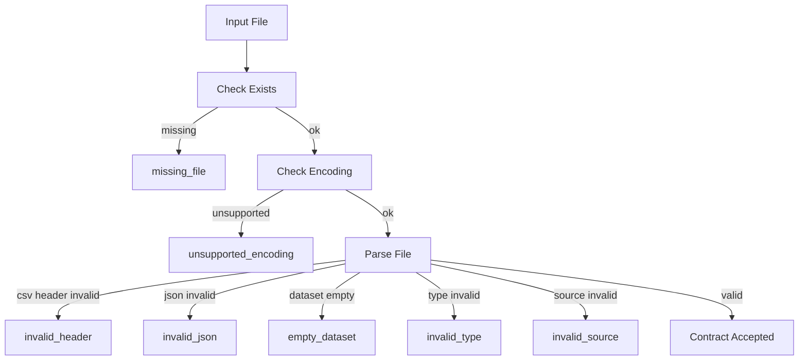

# ERIP 数据契约（Data Contracts）

最后更新：2026-07-04

本文件冻结 Phase 1 已落地的本地文件输入契约。

要求：

- 当前只描述本地文件输入。
- （历史句）曾表示 PostgreSQL 未实现。**V1.0**：PostgreSQL/pgvector 为企业验收路径；本文件仍以领域合同为主，实现细节见 ARCHITECTURE 与 migrations。
- 当前不表示导入 API 已实现。
- 后续 Phase 2 及以后必须兼容本文件，除非通过 ADR 明确变更。

## 当前状态

- KPI 输入来自 `backend/data/business/*.csv`
- Research 输入来自 `backend/data/research/*.json`
- Documents 输入边界来自 `backend/data/documents/*.md`
- 当前由本地文件加载层读取，不经过数据库

## 目标状态

- 文件输入字段冻结
- 校验规则冻结
- 导入错误分类冻结
- 为 Phase 2 PostgreSQL 导入表和 Repository 提供依据

## 计划项

- Phase 2 将把本文件映射到 `data_imports` / `import_errors`
- Phase 3 将把 documents Markdown 纳入上传与入库规则

## 导入错误模型

导入错误分类冻结如下：

| error_code | 说明 | 当前触发场景 | 后续数据库映射 |
| --- | --- | --- | --- |
| `missing_file` | 目标文件不存在 | CSV / JSON 文件缺失 | `import_errors.error_code` |
| `invalid_header` | 表头缺失或与契约不一致 | CSV header 不匹配 | `import_errors.error_code` |
| `invalid_type` | 字段类型不合法 | 数字、布尔或字符串格式错误 | `import_errors.error_code` |
| `empty_dataset` | 文件存在但没有有效数据行 | 空 CSV / 空数据集 | `import_errors.error_code` |
| `invalid_json` | JSON 结构非法 | 解析失败或根结构不是 object | `import_errors.error_code` |
| `invalid_source` | `sources` 等来源字段非法 | 空来源、非法来源格式 | `import_errors.error_code` |
| `unsupported_encoding` | 文件编码不受支持 | 非 UTF-8 等后续导入失败 | `import_errors.error_code` |

## sales.csv

### 当前状态

- 路径：`backend/data/business/sales.csv`
- 用途：用于计算 `revenue` 与 `gross_margin_rate`

### 契约

| 字段 | 类型 | 必填 | 示例 | 校验规则 |
| --- | --- | --- | --- | --- |
| `date` | `YYYY-MM-DD` 字符串 | 是 | `2026-06-01` | 必须是非空日期字符串；同一导入批次建议统一月份 |
| `store_id` | 字符串 | 是 | `tokyo-central` | 非空；仅允许字母、数字、`-` |
| `revenue_jpy` | 整数 | 是 | `4200000` | `>= 0` |
| `gross_profit_jpy` | 整数 | 是 | `1302000` | `>= 0` 且 `<= revenue_jpy` |

### 表头冻结

```text
date,store_id,revenue_jpy,gross_profit_jpy
```

### 校验规则

- 表头顺序必须固定
- 至少 1 行数据
- 数值字段必须能解析为整数
- `gross_profit_jpy` 不得大于 `revenue_jpy`

## inventory.csv

### 当前状态

- 路径：`backend/data/business/inventory.csv`
- 用途：用于计算 `inventory_turnover`

### 契约

| 字段 | 类型 | 必填 | 示例 | 校验规则 |
| --- | --- | --- | --- | --- |
| `sku_id` | 字符串 | 是 | `sku-001` | 非空 |
| `category` | 字符串 | 是 | `apparel` | 非空 |
| `average_inventory_jpy` | 整数 | 是 | `1200000` | `> 0` |
| `cost_of_goods_sold_jpy` | 整数 | 是 | `5100000` | `>= 0` |

### 表头冻结

```text
sku_id,category,average_inventory_jpy,cost_of_goods_sold_jpy
```

### 校验规则

- 表头顺序必须固定
- 至少 1 行数据
- `average_inventory_jpy` 必须大于 0，避免周转率分母为 0

## members.csv

### 当前状态

- 路径：`backend/data/business/members.csv`
- 用途：用于计算 `active_members`

### 契约

| 字段 | 类型 | 必填 | 示例 | 校验规则 |
| --- | --- | --- | --- | --- |
| `member_id` | 字符串 | 是 | `m-001` | 非空 |
| `segment` | 字符串 | 是 | `gold` | 非空；建议使用受控枚举 |
| `is_active` | 布尔字符串 | 是 | `true` | 只允许 `true/false/1/0/yes/no/y/n` |

### 表头冻结

```text
member_id,segment,is_active
```

### 校验规则

- 表头顺序必须固定
- 至少 1 行数据
- `is_active` 只能取受支持布尔字面量

## promotions.csv

### 当前状态

- 路径：`backend/data/business/promotions.csv`
- 用途：用于计算 `promotion_lift`

### 契约

| 字段 | 类型 | 必填 | 示例 | 校验规则 |
| --- | --- | --- | --- | --- |
| `promotion_id` | 字符串 | 是 | `promo-001` | 非空 |
| `channel` | 字符串 | 是 | `app` | 非空 |
| `baseline_revenue_jpy` | 整数 | 是 | `1200000` | `> 0` |
| `promoted_revenue_jpy` | 整数 | 是 | `1380000` | `>= 0` |

### 表头冻结

```text
promotion_id,channel,baseline_revenue_jpy,promoted_revenue_jpy
```

### 校验规则

- 表头顺序必须固定
- 至少 1 行数据
- `baseline_revenue_jpy` 必须大于 0

## 调研（Research） JSON

### 当前状态

- 路径：`backend/data/research/*.json`
- 用途：用于 `StaticResearchProvider` 组合 `summary / sources`

### 契约

| 字段 | 类型 | 必填 | 示例 | 校验规则 |
| --- | --- | --- | --- | --- |
| `title` | 字符串 | 否 | `Market Trend 2026-06` | 建议非空；缺失时回退为文件名 |
| `summary` | 字符串 | 是 | `2026年6月...` | 非空 |
| `sources` | 字符串数组 | 是 | `["local://research/market-trend-2026-06"]` | 至少 1 条；每项非空 |

### Example

```json
{
  "title": "Market Trend 2026-06",
  "summary": "2026年6月の小売市場では...",
  "sources": [
    "local://research/market-trend-2026-06",
    "internal://planning/monthly-market-watch-2026-06"
  ]
}
```

### 校验规则

- JSON 根必须是 object
- `summary` 必须是非空字符串
- `sources` 必须是非空字符串列表
- 推荐来源 URI 使用带 scheme 的格式，如：
  `local://`
  `internal://`
  `external://`

## Documents Markdown

### 当前状态

- 路径：`backend/data/documents/*.md`
- 当前只作为目录边界样例存在
- 当前不参与 Workflow、RAG、Approval、Import API

### 目标状态

- 未来作为文档上传、入库、切分、检索的输入源之一

### 计划项 Rules

- 编码默认 `UTF-8`
- 文件扩展名固定 `.md`
- 建议包含标题和分级章节
- 后续导入时将补充：
  - `document_id`
  - `version`
  - `source_system`
  - `owner`
  - `classification`
  - `approval_scope`

## 数据（Data） Contract Validation Flow



## 数据（Data） Import Flow


