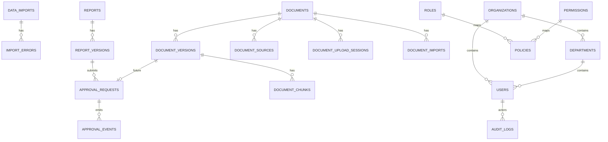

# retail-insight-ai Database Preparation

最后更新：2026-07-04

本文件记录 Phase 2 PostgreSQL Persistence MVP 的目标表结构与当前落地边界。未接入业务 API 的能力必须明确标注为规划，不得写成已实现。

## Current State

- 当前默认仍使用 InMemory Repository
- 当前已新增可选 PostgreSQL Repository
- 当前已提供 `backend/db/schema.sql` 与 `backend/db/init.sql`
- 当前已建 `approval_requests` / `approval_events` 表，审批 API 仍未实现，但 contract 已冻结
- 当前仍只实现 Document Domain Model 与 InMemory Document Import MVP，不存在 PostgreSQL Import 表结构

## Target State

为以下对象建立 PostgreSQL 持久化基础：

- `tasks`
- `task_events`
- `data_imports`
- `import_errors`
- `reports`
- `report_versions`
- `approval_requests`
- `approval_events`
- `documents`
- `document_versions`
- `document_chunks`
- `document_sources`
- `document_upload_sessions`
- `document_imports`

## Planned

- 当前已落地 PostgreSQL 表结构与 Task / Event / Report Repository
- 当前文档继续作为 Import / Approval 扩展的设计输入
- Document Upload 相关表只作为未来扩展边界，不表示已经实现 Upload API
- Document Import 相关表只作为未来扩展边界，不表示已经实现 PostgreSQL Import API

## Runtime Rules

- `REPOSITORY_BACKEND`:
  `inmemory` 为默认值，`postgres` 为显式启用值。
- UTC:
  所有数据库时间字段统一使用 `TIMESTAMPTZ`，连接建立后设置 `SET TIME ZONE 'UTC'`。
- Schema:
  `backend/db/schema.sql` 使用 `CREATE TABLE IF NOT EXISTS`，支持重复执行。
- Driver:
  当前实现优先使用 `psycopg[binary]`。

## tasks

### Purpose

保存任务事实。

### Current State

已实现 PostgreSQL Repository。

### Key Fields

| 字段 | 类型建议 | 说明 |
| --- | --- | --- |
| `id` | TEXT | 主键，task_id |
| `question` | TEXT | 用户问题 |
| `mode` | TEXT | `hybrid / kpi / research` |
| `status` | TEXT | `queued / running / completed / failed` |
| `created_at` | TIMESTAMPTZ | 创建时间 |
| `updated_at` | TIMESTAMPTZ | 更新时间 |

## task_events

### Purpose

保存任务事件轨迹，供 SSE 与审计复用。

### Current State

已实现 PostgreSQL Repository。

### Key Fields

| 字段 | 类型建议 | 说明 |
| --- | --- | --- |
| `task_id` | TEXT | 关联 `tasks.id` |
| `sequence` | INTEGER | 事件顺序号 |
| `event_type` | TEXT | `status / done / error` |
| `status` | TEXT | 当前任务状态 |
| `message` | TEXT | 事件说明 |
| `created_at` | TIMESTAMPTZ | 事件时间 |

## data_imports

### Purpose

记录一次文件导入批次。

### Planned Fields

| 字段 | 类型建议 | 说明 |
| --- | --- | --- |
| `id` | UUID | 主键 |
| `import_type` | TEXT | `business_csv` / `research_json` / `document_markdown` |
| `file_name` | TEXT | 原始文件名 |
| `file_path` | TEXT | 本地路径或未来对象存储路径 |
| `schema_version` | TEXT | 数据契约版本 |
| `status` | TEXT | `accepted` / `failed` / `processed` |
| `record_count` | INTEGER | 数据行数 |
| `started_at` | TIMESTAMPTZ | 开始时间 |
| `completed_at` | TIMESTAMPTZ | 完成时间 |
| `created_by` | TEXT NULL | 未来导入操作者 |

## import_errors

### Purpose

记录导入错误明细。

### Planned Fields

| 字段 | 类型建议 | 说明 |
| --- | --- | --- |
| `id` | UUID | 主键 |
| `data_import_id` | UUID | 关联 `data_imports.id` |
| `error_code` | TEXT | `missing_file` / `invalid_header` / `invalid_type` / `empty_dataset` / `invalid_json` / `invalid_source` / `unsupported_encoding` |
| `field_name` | TEXT NULL | 出错字段 |
| `row_number` | INTEGER NULL | 出错行号 |
| `message` | TEXT | 安全错误说明 |
| `created_at` | TIMESTAMPTZ | 记录时间 |

## reports

### Purpose

保存当前有效报告实体。

### Current State

已实现当前报告持久化，`approval_status` 当前仍写入 `generated`。

### Planned Fields

| 字段 | 类型建议 | 说明 |
| --- | --- | --- |
| `task_id` | UUID / TEXT | 与任务关联 |
| `provider` | TEXT | 当前是 `static` |
| `approval_status` | TEXT | `generated` / `draft` / `pending_approval` / `approved` / `rejected` / `revised` / `published` / `archived` |
| `current_version_id` | UUID NULL | 指向当前版本 |
| `created_at` | TIMESTAMPTZ | 创建时间 |
| `updated_at` | TIMESTAMPTZ | 更新时间 |

## report_versions

### Purpose

保存报告内容版本历史。

### Current State

已实现随报告保存而写入版本快照。

### Planned Fields

| 字段 | 类型建议 | 说明 |
| --- | --- | --- |
| `id` | UUID | 主键 |
| `task_id` | UUID / TEXT | 关联任务 |
| `version_no` | INTEGER | 版本号 |
| `markdown` | TEXT | 报告正文 |
| `status` | TEXT | 版本状态 |
| `revised_from_version_id` | UUID NULL | 指向被修订的上一版 |
| `revision_reason` | TEXT NULL | 修订原因 |
| `created_at` | TIMESTAMPTZ | 创建时间 |
| `created_by` | TEXT NULL | 未来操作者 |

## approval_requests

### Purpose

记录一次审批申请。

### Planned Fields

| 字段 | 类型建议 | 说明 |
| --- | --- | --- |
| `id` | UUID | 主键 |
| `report_version_id` | UUID | 关联 `report_versions.id` |
| `requested_by` | TEXT NULL | 提交者 |
| `requested_at` | TIMESTAMPTZ | 提交时间 |
| `status` | TEXT | `pending_approval` / `approved` / `rejected` |
| `approver_id` | TEXT NULL | 审批者 |
| `decision_at` | TIMESTAMPTZ NULL | 审批时间 |

### Relationship Notes

- 一条 `report` 对应一组 `report_versions`，其中最新版本是当前可审批快照。
- `approval_requests.report_version_id` 绑定单一报告版本，不直接指向可变正文。
- `report_versions.revised_from_version_id` 记录修订来源，保证 approved snapshot 不可覆盖。
- `approval_requests` 与 `approval_events` 共同构成审批审计链。
- 未来 RBAC 只控制谁可以写入审批记录，不改变表关系。

## approval_events

### Purpose

保存审批过程事件轨迹。

### Planned Fields

| 字段 | 类型建议 | 说明 |
| --- | --- | --- |
| `id` | UUID | 主键 |
| `approval_request_id` | UUID | 关联 `approval_requests.id` |
| `event_type` | TEXT | `submitted` / `approved` / `rejected` / `revised` / `published` / `failed` |
| `actor_id` | TEXT NULL | 操作者 |
| `reason` | TEXT NULL | 拒绝或修订原因 |
| `created_at` | TIMESTAMPTZ | 事件时间 |

### Approval Audit Notes

- `approval_events` 是 append-only 审计轨迹，不能改写历史决策。
- `reason` 在 reject / revise 场景必须保持安全且可审计。
- `published` 代表 business-confirmed output，仍然对应同一 report version lineage。

## documents

### Purpose

保存文档事实主记录。

### Planned Fields

| 字段 | 类型建议 | 说明 |
| --- | --- | --- |
| `id` | UUID / TEXT | 主键，document_id |
| `title` | TEXT | 文档标题 |
| `description` | TEXT NULL | 文档描述 |
| `owner` | TEXT | 所属人 |
| `version` | INTEGER | 当前版本号 |
| `language` | TEXT | `en / ja / zh-CN / unknown` |
| `document_type` | TEXT | 冻结文档类型 |
| `status` | TEXT | `uploaded / validated / indexed / draft / pending_approval / approved / published / archived` |
| `tags` | JSONB / TEXT[] | 标签集合 |
| `source` | JSONB | 来源对象 |
| `checksum` | TEXT | 文件校验值 |
| `created_at` | TIMESTAMPTZ | 创建时间 |
| `updated_at` | TIMESTAMPTZ | 更新时间 |

## document_versions

### Purpose

保存文档版本历史。

### Planned Fields

| 字段 | 类型建议 | 说明 |
| --- | --- | --- |
| `id` | UUID | 主键 |
| `document_id` | UUID / TEXT | 关联 `documents.id` |
| `version_no` | INTEGER | 版本号 |
| `storage_path` | TEXT | 本地或对象存储路径 |
| `checksum` | TEXT | 版本校验值 |
| `created_at` | TIMESTAMPTZ | 创建时间 |
| `created_by` | TEXT NULL | 未来上传者 |

## document_chunks

### Purpose

保留未来 chunk pipeline 的占位表。

### Planned Fields

| 字段 | 类型建议 | 说明 |
| --- | --- | --- |
| `id` | UUID | 主键 |
| `document_version_id` | UUID | 关联 `document_versions.id` |
| `chunk_no` | INTEGER | 顺序号 |
| `content` | TEXT | chunk 内容 |
| `metadata` | JSONB | chunk 元数据 |
| `created_at` | TIMESTAMPTZ | 创建时间 |

## document_sources

### Purpose

保存文档来源信息，便于追踪上传输入。

### Planned Fields

| 字段 | 类型建议 | 说明 |
| --- | --- | --- |
| `id` | UUID | 主键 |
| `document_id` | UUID / TEXT | 关联 `documents.id` |
| `source_type` | TEXT | `local_file / api / manual` |
| `source_uri` | TEXT | 来源路径或 URI |
| `created_at` | TIMESTAMPTZ | 创建时间 |

## document_upload_sessions

### Purpose

保存文档上传会话状态，支撑幂等、进度、重试与支持排障。

### Planned Fields

| 字段 | 类型建议 | 说明 |
| --- | --- | --- |
| `upload_id` | UUID / TEXT | 上传会话 ID |
| `document_id` | UUID / TEXT | 关联 `documents.id` |
| `status` | TEXT | `accepted` / `validating` / `storing` / `completed` / `failed` |
| `progress` | INTEGER | 0-100 进度 |
| `error_code` | TEXT NULL | 错误码 |
| `error_message` | TEXT NULL | 错误说明 |
| `idempotency_key` | TEXT NULL | 幂等键 |
| `checksum` | TEXT NULL | 校验值 |
| `created_at` | TIMESTAMPTZ | 创建时间 |
| `updated_at` | TIMESTAMPTZ | 更新时间 |

## document_imports

### Purpose

保存文档导入会话状态，支撑 Import Pipeline 的状态查询、重试与审计。

### Planned Fields

| 字段 | 类型建议 | 说明 |
| --- | --- | --- |
| `import_id` | UUID / TEXT | 导入会话 ID |
| `document_id` | UUID / TEXT | 关联 `documents.id` |
| `status` | TEXT | `pending` / `running` / `completed` / `failed` |
| `error_code` | TEXT NULL | 错误码 |
| `error_message` | TEXT NULL | 错误说明 |
| `created_at` | TIMESTAMPTZ | 创建时间 |
| `updated_at` | TIMESTAMPTZ | 更新时间 |

## Security Domain Model / 安全域模型 / セキュリティドメインモデル

### Purpose

Freeze the future identity, authorization, and audit storage concepts before RBAC implementation.

### Current State

- 当前没有认证 API、RBAC API 或 Audit API 的后端实现。
- 当前只冻结数据概念，不把它们解释为已上线的表结构依赖。
- 未来实现可以落到 PostgreSQL，但现阶段仅作为合同准备。

中文（简体）：
这里冻结的是企业安全的概念层：用户属于组织和部门，角色通过策略映射到权限，审计日志与操作日志以追加写方式保存。现在只定义边界，不把实现细节当成现状。

日本語：
ここで凍結するのは企業セキュリティの概念層です。ユーザーは組織と部署に属し、ロールはポリシーを介して権限へ写像され、監査ログと操作ログは追記型で保存されます。現時点では境界だけを定義し、実装済みとはみなしません。

### users

| 字段 | 类型建议 | 说明 |
| --- | --- | --- |
| `id` | UUID / TEXT | 主键，user_id |
| `username` | TEXT | 登录名 |
| `display_name` | TEXT | 展示名称 |
| `organization_id` | UUID / TEXT | 所属组织 |
| `department_id` | UUID / TEXT | 所属部门 |
| `status` | TEXT | `active / suspended / disabled` |
| `created_at` | TIMESTAMPTZ | 创建时间 |
| `updated_at` | TIMESTAMPTZ | 更新时间 |

### organizations

| 字段 | 类型建议 | 说明 |
| --- | --- | --- |
| `id` | UUID / TEXT | 主键，organization_id |
| `name` | TEXT | 组织名称 |
| `status` | TEXT | `active / archived` |
| `created_at` | TIMESTAMPTZ | 创建时间 |

### departments

| 字段 | 类型建议 | 说明 |
| --- | --- | --- |
| `id` | UUID / TEXT | 主键，department_id |
| `organization_id` | UUID / TEXT | 关联组织 |
| `name` | TEXT | 部门名称 |
| `parent_department_id` | UUID / TEXT NULL | 上级部门 |
| `created_at` | TIMESTAMPTZ | 创建时间 |

### roles

| 字段 | 类型建议 | 说明 |
| --- | --- | --- |
| `id` | UUID / TEXT | 主键，role_id |
| `name` | TEXT | `admin / manager / analyst / viewer / approver / auditor` |
| `description` | TEXT | 角色说明 |
| `is_system_role` | BOOLEAN | 是否冻结系统角色 |
| `created_at` | TIMESTAMPTZ | 创建时间 |

### permissions

| 字段 | 类型建议 | 说明 |
| --- | --- | --- |
| `id` | UUID / TEXT | 主键，permission_id |
| `name` | TEXT | `document.read` / `approval.approve` 等 |
| `category` | TEXT | `document / report / approval / audit / system` |
| `description` | TEXT | 权限说明 |
| `created_at` | TIMESTAMPTZ | 创建时间 |

### policies

| 字段 | 类型建议 | 说明 |
| --- | --- | --- |
| `id` | UUID / TEXT | 主键，policy_id |
| `role_id` | UUID / TEXT | 关联 `roles.id` |
| `permission_id` | UUID / TEXT | 关联 `permissions.id` |
| `effect` | TEXT | `allow / deny` |
| `resource_scope` | TEXT NULL | 未来作用域占位 |
| `created_at` | TIMESTAMPTZ | 创建时间 |

### audit_logs

| 字段 | 类型建议 | 说明 |
| --- | --- | --- |
| `id` | UUID / TEXT | 主键，audit_log_id |
| `actor_id` | UUID / TEXT NULL | 执行者 |
| `organization_id` | UUID / TEXT NULL | 组织 |
| `department_id` | UUID / TEXT NULL | 部门 |
| `operation_type` | TEXT | 操作类型 |
| `resource_type` | TEXT | 资源类型 |
| `resource_id` | TEXT | 资源标识 |
| `result` | TEXT | `success / denied / failed` |
| `error_code` | TEXT NULL | 失败时错误码 |
| `request_id` | TEXT | 请求追踪 |
| `trace_id` | TEXT | 链路追踪 |
| `metadata` | JSONB | 安全元数据 |
| `created_at` | TIMESTAMPTZ | 创建时间 |

### operation_logs

| 字段 | 类型建议 | 说明 |
| --- | --- | --- |
| `id` | UUID / TEXT | 主键，operation_log_id |
| `audit_log_id` | UUID / TEXT | 关联 `audit_logs.id` |
| `summary` | TEXT | 人类可读摘要 |
| `actor_label` | TEXT | 展示用执行者名称 |
| `resource_label` | TEXT | 展示用资源名称 |
| `result` | TEXT | 操作结果 |
| `created_at` | TIMESTAMPTZ | 创建时间 |

### Security Relationship Notes

- 用户属于一个组织和一个部门，角色通过策略映射到权限。
- `roles` 与 `permissions` 是冻结目录，未来实现必须沿用这些名称。
- `audit_logs` 是 append-only 事实表，不应被业务更新语句改写。
- `operation_logs` 可以作为读取投影或物化视图，不改变审计事实本身。
- Approval 权限矩阵应与 `docs/contracts/API_CONTRACT.md` 保持一致。

## Database ER Preparation

