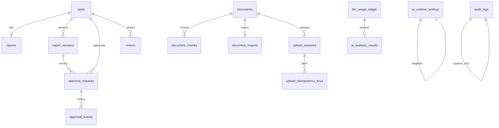
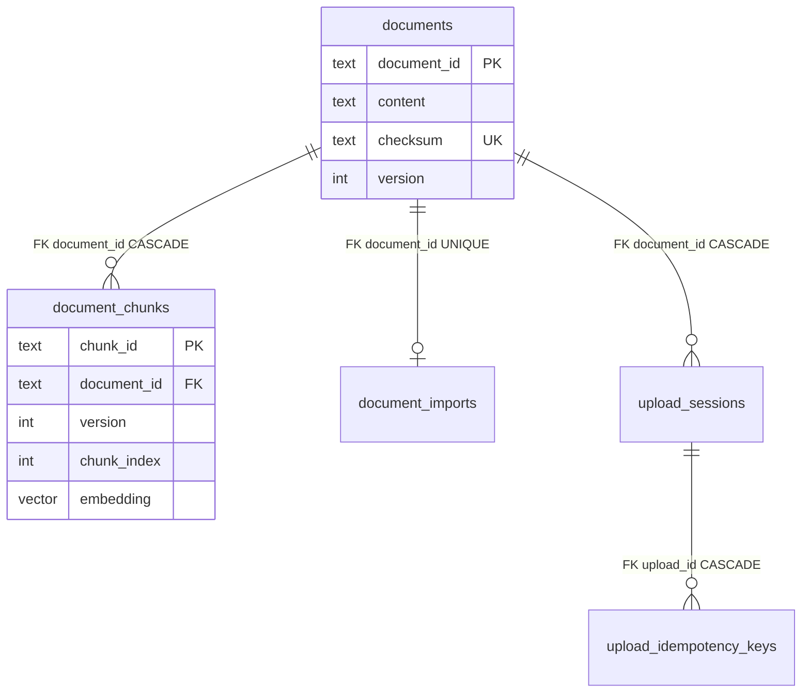
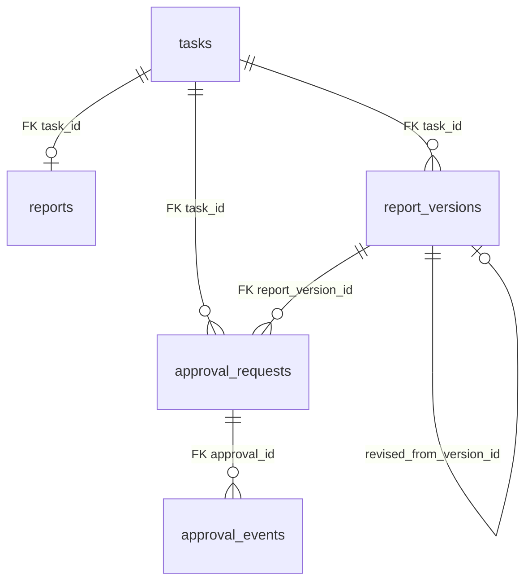
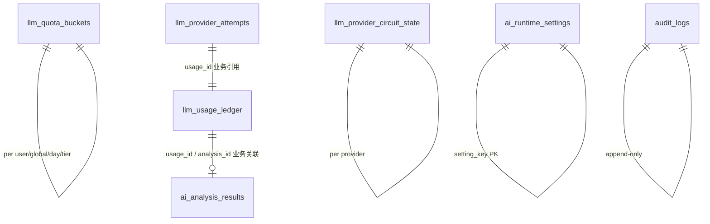

# retail-insight-ai 数据库说明（DATABASE.md）

最后更新：2026-07-17

本文档描述 **ERIP V1.0 当前真实 PostgreSQL Schema**。
建库入口是 **Alembic Migration**，不是本文件，也不是直接执行 `schema.sql`。

---

## 1. 数据库权威来源

| 优先级 | 来源 | 说明 |
|---|---|---|
| 1 | **Alembic Migration**（`backend/alembic/versions/`） | 正式升级入口 |
| 2 | **PostgreSQL 实际 Schema** | 运行时事实 |
| 3 | SQLAlchemy / Domain / Repository | 代码映射 |
| 4 | `backend/db/schema.sql` | 历史/审计基线，**不得**替代 Migration |
| 5 | 本文件 `DATABASE.md` | 说明文档，**不是**建库入口 |

**当前 Alembic head：`20260717_08_ai_runtime`**

---

## 2. 环境数据库边界

| 环境 | 数据库 |
|---|---|
| **本地完整开发** | **WSL 宿主 PostgreSQL** 库 **`erip_local`**（Unix socket `/var/run/postgresql` 或本机 **:5432**；**不依赖 Docker**） |
| **Docker Compose** | Compose PostgreSQL 库默认 **`erip`** + Volume **`erip_postgres_data`**（宿主端口默认 **:5432**；与宿主冲突时 `POSTGRES_PORT=5433`） |
| **自动测试** | **`erip_integration_test`**（**严禁**当页面开发库） |
| **InMemory** | 仅 unittest / 故障隔离；**不是**页面正式运行模式 |

| 数据库 | 用途 | 页面入口 | 是否正式页面数据 |
|---|---|---|---|
| 本地 `erip_local`（**WSL 宿主 PostgreSQL**） | 本地 Backend + Vite（`./scripts/start_local.sh`） | **5173** | **是** |
| Docker Compose `erip`（volume **`erip_postgres_data`**） | Compose 验收/演示（`./scripts/compose_up.sh`） | **8080** | **是** |
| `erip_integration_test` | 自动化测试 | 无 | **否** |
| InMemory | unittest / 故障隔离 | 无正式页面 | **否** |

**说明（冻结）：**

- 本地完整开发权威方案是 **WSL 宿主 PostgreSQL `erip_local`**，**不是** `erip-local-pg` 容器，也**不是** volume `erip_local_pg_data`。
- 历史上误建的 `erip-local-pg` / `erip_local_pg_data` 可保留待人工清理；**不得**再写进日常启动路径。
- **本地库与 Docker Volume 默认不是同一数据源。** 5173 与 8080 不要当成同一套页面数据。
- 首次建库（非日常）：`./scripts/setup_host_postgres_local.sh`（可能需要 sudo）。

---

## 3. 当前全部物理表总览

共 **19** 张 public 表（含 `alembic_version`）；业务表 **18**。

| 表名 | 业务用途 | 主键 | 主要外键 | append-only | Repository/Service |
|---|---|---|---|---|---|
| `ai_analysis_results` | AI 分析成功结果缓存/事实 | PRIMARY KEY (analysis_id) | FOREIGN KEY (usage_id) REFERENCES llm_usage_ledger(usage_id) ON DELETE RESTRICT | 否 | PostgresLLMUsageRepository / AIAnalysisService |
| `ai_runtime_settings` | AI Runtime mode/kill_switch 单例配置 | PRIMARY KEY (setting_key) | — | 否 | PostgresAiRuntimeSettingsRepository / AiRuntimeService |
| `alembic_version` | Alembic 迁移版本指针 | PRIMARY KEY (version_num) | — | 否 | Alembic |
| `approval_events` | 审批 History（append-only 业务轨迹） | PRIMARY KEY (id) | FOREIGN KEY (approval_id) REFERENCES approval_requests(id) ON DELETE CASCADE; FOREIGN KEY (report_version_id) REFERENCES report_versions(id) ON DELETE RESTRICT; FOREIGN KEY (task_id) REFERENCES tasks(task_id) ON DELETE CASCADE | 是 | PostgresApprovalRepository / ApprovalService |
| `approval_requests` | 审批请求当前状态 | PRIMARY KEY (id) | FOREIGN KEY (report_version_id) REFERENCES report_versions(id) ON DELETE RESTRICT; FOREIGN KEY (revised_from_version_id) REFERENCES report_versions(id) ON DELETE RESTRICT; FOREIGN KEY (task_id) REFERENCES tasks(task_id) ON DELETE CASCADE | 否 | PostgresApprovalRepository / ApprovalService |
| `audit_logs` | Persistent Audit（安全审计，append-only） | PRIMARY KEY (id) | — | 是 | PostgresAuditRepository / PersistentAuditService |
| `document_chunks` | 检索片段 + 可选 embedding 向量 | PRIMARY KEY (chunk_id) | FOREIGN KEY (document_id) REFERENCES documents(document_id) ON DELETE CASCADE | 否 | PostgresDocumentChunkRepository / Chunk/Retrieval |
| `document_imports` | 文档 Import 流水状态 | PRIMARY KEY (import_id) | FOREIGN KEY (document_id) REFERENCES documents(document_id) ON DELETE CASCADE | 否 | PostgresDocumentImportRepository / DocumentImportService |
| `documents` | 文档主记录与原文 content | PRIMARY KEY (document_id) | — | 否 | PostgresDocumentRepository / Document*Service |
| `events` | 通用事件流（含 task SSE 等），按 stream 顺序追加 | PRIMARY KEY (id) | — | 是 | PostgresEventRepository / EventPublisher |
| `llm_provider_attempts` | Fallback 链每次 Provider 尝试明细 | PRIMARY KEY (attempt_id) | FOREIGN KEY (usage_id) REFERENCES llm_usage_ledger(usage_id) ON DELETE RESTRICT | 是 | LLM fallback chain / attempt ledger |
| `llm_provider_circuit_state` | Provider 熔断共享状态 | PRIMARY KEY (provider_name) | — | 否 | Circuit breaker repository |
| `llm_quota_buckets` | 用户/全局日额度桶 | PRIMARY KEY (bucket_date, scope_type, scope_id, route_tier) | — | 否 | PostgresLLMUsageRepository / LLMGatewayService |
| `llm_usage_ledger` | LLM 调用额度预占与结算账本 | PRIMARY KEY (usage_id) | — | 否 | PostgresLLMUsageRepository / LLMGatewayService |
| `report_versions` | 不可变报告版本快照 | PRIMARY KEY (id) | FOREIGN KEY (revised_from_version_id) REFERENCES report_versions(id) ON DELETE RESTRICT; FOREIGN KEY (task_id) REFERENCES tasks(task_id) ON DELETE CASCADE | 是 | PostgresReportRepository / ApprovalService |
| `reports` | 当前有效报告实体（与 task 1:1） | PRIMARY KEY (task_id) | FOREIGN KEY (task_id) REFERENCES tasks(task_id) ON DELETE CASCADE | 否 | PostgresReportRepository / Report 相关 Service |
| `tasks` | 任务主实体（KPI/hybrid/research 分析任务） | PRIMARY KEY (task_id) | — | 否 | PostgresTaskRepository / TaskService |
| `upload_idempotency_keys` | 上传幂等键映射 | PRIMARY KEY (idempotency_key) | FOREIGN KEY (upload_id) REFERENCES upload_sessions(upload_id) ON DELETE CASCADE | 否 | PostgresUploadSessionRepository / DocumentUploadService |
| `upload_sessions` | 上传会话进度/校验 | PRIMARY KEY (upload_id) | FOREIGN KEY (document_id) REFERENCES documents(document_id) ON DELETE CASCADE | 否 | PostgresUploadSessionRepository / DocumentUploadService |

### 生命周期摘要

| 领域 | 生命周期 |
|---|---|
| Document | Upload session → documents → import → chunks（可 replace）→ 检索只读 |
| Task/Report | task 创建 → events 追加 → report/report_versions 生成 → 可选审批 |
| Approval | pending → approved/rejected → revised/resubmit；events 只追加 |
| Audit | 请求完成后 append-only 写入，禁止改历史 |
| LLM | reserve ledger → provider → settle；attempts 追加；runtime 单例更新 |

---

## 4. 领域拆分

| 领域 | 物理表 |
|---|---|
| Task / Event | `tasks`, `events` |
| Document / Upload / Import / Chunk | `documents`, `upload_sessions`, `upload_idempotency_keys`, `document_imports`, `document_chunks` |
| Report | `reports`, `report_versions` |
| Approval | `approval_requests`, `approval_events` |
| Persistent Audit | `audit_logs` |
| AI Analysis Result | `ai_analysis_results` |
| LLM Usage / Quota / Fallback | `llm_usage_ledger`, `llm_quota_buckets`, `llm_provider_attempts`, `llm_provider_circuit_state` |
| AI Runtime Settings | `ai_runtime_settings` |
| Migration 元数据 | `alembic_version` |

---

## 5. 全部字段字典

以下类型均来自 PostgreSQL `information_schema` / `\d+` 实查（**非**“类型建议”）。

### `ai_analysis_results`

用途：AI 分析成功结果缓存/事实

| 字段 | PostgreSQL 类型 | Nullable | Default | PK/FK/Unique | 说明 |
|---|---|---|---|---|---|
| `analysis_id` | `text` | NO | — | PK | — |
| `usage_id` | `text` | NO | — | FK,UNIQUE | — |
| `answer` | `text` | NO | — | — | — |
| `citations` | `jsonb` | NO | — | — | — |
| `provider_name` | `text` | NO | — | — | — |
| `model_name` | `text` | NO | — | — | — |
| `input_tokens` | `int4` | NO | — | — | — |
| `output_tokens` | `int4` | NO | — | — | — |
| `total_tokens` | `int4` | NO | — | — | — |
| `actual_cost` | `numeric(20,8)` | NO | — | — | — |
| `currency` | `bpchar(3)` | NO | — | — | — |
| `status` | `text` | NO | — | — | — |
| `created_at` | `timestamptz` | NO | CURRENT_TIMESTAMP | — | — |

### `ai_runtime_settings`

用途：AI Runtime mode/kill_switch 单例配置

| 字段 | PostgreSQL 类型 | Nullable | Default | PK/FK/Unique | 说明 |
|---|---|---|---|---|---|
| `setting_key` | `text` | NO | — | PK | — |
| `mode` | `text` | NO | — | — | stub|openrouter|fallback_chain |
| `real_calls_enabled` | `bool` | NO | false | — | — |
| `kill_switch` | `bool` | NO | false | — | — |
| `version` | `int4` | NO | 1 | — | — |
| `updated_by_user_id` | `text` | YES | — | — | — |
| `updated_by_username` | `text` | YES | — | — | — |
| `updated_at` | `timestamptz` | NO | CURRENT_TIMESTAMP | — | — |

### `alembic_version`

用途：Alembic 迁移版本指针

| 字段 | PostgreSQL 类型 | Nullable | Default | PK/FK/Unique | 说明 |
|---|---|---|---|---|---|
| `version_num` | `varchar(32)` | NO | — | PK | — |

### `approval_events`

用途：审批 History（append-only 业务轨迹）

| 字段 | PostgreSQL 类型 | Nullable | Default | PK/FK/Unique | 说明 |
|---|---|---|---|---|---|
| `id` | `text` | NO | — | PK | — |
| `approval_id` | `text` | NO | — | FK | — |
| `task_id` | `text` | NO | — | FK | — |
| `event_type` | `text` | NO | — | — | — |
| `actor_id` | `text` | YES | — | — | — |
| `reason` | `text` | YES | — | — | — |
| `created_at` | `timestamptz` | NO | CURRENT_TIMESTAMP | — | — |
| `from_status` | `text` | YES | — | — | — |
| `to_status` | `text` | YES | — | — | — |
| `actor_username` | `text` | YES | — | — | — |
| `actor_role` | `text` | YES | — | — | — |
| `report_version_id` | `text` | YES | — | FK | — |

### `approval_requests`

用途：审批请求当前状态

| 字段 | PostgreSQL 类型 | Nullable | Default | PK/FK/Unique | 说明 |
|---|---|---|---|---|---|
| `id` | `text` | NO | — | PK | — |
| `task_id` | `text` | NO | — | FK | — |
| `report_version_id` | `text` | NO | — | FK | — |
| `status` | `text` | NO | — | — | — |
| `requested_by` | `text` | YES | — | — | — |
| `requested_at` | `timestamptz` | NO | CURRENT_TIMESTAMP | — | — |
| `approver_id` | `text` | YES | — | — | — |
| `decision_at` | `timestamptz` | YES | — | — | — |
| `decision_reason` | `text` | YES | — | — | — |
| `revision_no` | `int4` | NO | 1 | — | — |
| `revised_from_version_id` | `text` | YES | — | FK | — |
| `updated_at` | `timestamptz` | NO | CURRENT_TIMESTAMP | — | — |
| `requested_by_username` | `text` | YES | — | — | — |
| `requested_by_role` | `text` | YES | — | — | — |
| `approver_username` | `text` | YES | — | — | — |
| `approver_role` | `text` | YES | — | — | — |

### `audit_logs`

用途：Persistent Audit（安全审计，append-only）

| 字段 | PostgreSQL 类型 | Nullable | Default | PK/FK/Unique | 说明 |
|---|---|---|---|---|---|
| `id` | `text` | NO | — | PK | — |
| `operation_type` | `text` | NO | — | — | — |
| `actor_id` | `text` | YES | — | — | — |
| `organization_id` | `text` | YES | — | — | — |
| `department_id` | `text` | YES | — | — | — |
| `resource_type` | `text` | NO | — | — | — |
| `resource_id` | `text` | NO | — | — | — |
| `result` | `text` | NO | — | — | — |
| `request_id` | `text` | NO | — | — | — |
| `trace_id` | `text` | NO | — | — | — |
| `metadata` | `jsonb` | NO | '{}'::jsonb | — | — |
| `error_code` | `text` | YES | — | — | — |
| `created_at` | `timestamptz` | NO | CURRENT_TIMESTAMP | — | — |
| `actor_username` | `text` | YES | — | — | — |
| `actor_role` | `text` | YES | — | — | — |
| `permission` | `text` | YES | — | — | — |
| `http_method` | `text` | YES | — | — | — |
| `api_path` | `text` | YES | — | — | — |
| `status_code` | `int4` | YES | — | — | — |

### `document_chunks`

用途：检索片段 + 可选 embedding 向量

| 字段 | PostgreSQL 类型 | Nullable | Default | PK/FK/Unique | 说明 |
|---|---|---|---|---|---|
| `chunk_id` | `text` | NO | — | PK | — |
| `document_id` | `text` | NO | — | FK,UNIQUE | — |
| `version` | `int4` | NO | — | UNIQUE | — |
| `chunk_index` | `int4` | NO | — | UNIQUE | — |
| `content` | `text` | NO | — | — | — |
| `character_count` | `int4` | NO | — | — | — |
| `metadata` | `jsonb` | NO | — | — | — |
| `created_at` | `timestamptz` | NO | — | — | — |
| `embedding` | `vector(384)` | YES | — | — | 可选 384 维向量 |

### `document_imports`

用途：文档 Import 流水状态

| 字段 | PostgreSQL 类型 | Nullable | Default | PK/FK/Unique | 说明 |
|---|---|---|---|---|---|
| `import_id` | `text` | NO | — | PK | — |
| `document_id` | `text` | NO | — | FK,UNIQUE | — |
| `status` | `text` | NO | — | — | — |
| `error_code` | `text` | YES | — | — | — |
| `error_message` | `text` | YES | — | — | — |
| `created_at` | `timestamptz` | NO | — | — | — |
| `updated_at` | `timestamptz` | NO | — | — | — |

### `documents`

用途：文档主记录与原文 content

| 字段 | PostgreSQL 类型 | Nullable | Default | PK/FK/Unique | 说明 |
|---|---|---|---|---|---|
| `document_id` | `text` | NO | — | PK | — |
| `title` | `text` | NO | — | — | — |
| `description` | `text` | YES | — | — | — |
| `owner` | `text` | NO | — | — | — |
| `version` | `int4` | NO | — | — | — |
| `language` | `text` | NO | — | — | — |
| `document_type` | `text` | NO | — | — | — |
| `status` | `text` | NO | — | — | — |
| `tags` | `jsonb` | NO | '[]'::jsonb | — | — |
| `source` | `jsonb` | NO | — | — | — |
| `checksum` | `text` | NO | — | UNIQUE | — |
| `content` | `text` | NO | — | — | 文档原文（解码文本） |
| `approval_status` | `text` | NO | — | — | — |
| `metadata_created_at` | `timestamptz` | NO | — | — | — |
| `metadata_updated_at` | `timestamptz` | NO | — | — | — |
| `created_at` | `timestamptz` | NO | — | — | — |
| `updated_at` | `timestamptz` | NO | — | — | — |

### `events`

用途：通用事件流（含 task SSE 等），按 stream 顺序追加

| 字段 | PostgreSQL 类型 | Nullable | Default | PK/FK/Unique | 说明 |
|---|---|---|---|---|---|
| `id` | `int8` | NO | nextval('events_id_seq'::regclass) | PK | — |
| `stream_id` | `text` | NO | — | UNIQUE | — |
| `sequence` | `int4` | NO | — | UNIQUE | — |
| `event_type` | `text` | NO | — | — | — |
| `message` | `text` | NO | — | — | — |
| `data_json` | `jsonb` | NO | '{}'::jsonb | — | — |
| `created_at` | `timestamptz` | NO | CURRENT_TIMESTAMP | — | — |

### `llm_provider_attempts`

用途：Fallback 链每次 Provider 尝试明细

| 字段 | PostgreSQL 类型 | Nullable | Default | PK/FK/Unique | 说明 |
|---|---|---|---|---|---|
| `attempt_id` | `text` | NO | — | PK | — |
| `usage_id` | `text` | NO | — | FK | — |
| `request_id` | `text` | NO | — | — | — |
| `idempotency_key` | `text` | NO | — | — | — |
| `attempt_number` | `int4` | NO | — | — | — |
| `operation` | `text` | NO | — | — | — |
| `route_tier` | `text` | NO | — | — | — |
| `provider_name` | `text` | NO | — | — | — |
| `configured_model` | `text` | NO | — | — | — |
| `actual_model` | `text` | YES | — | — | — |
| `status` | `text` | NO | — | — | — |
| `started_at` | `timestamptz` | YES | — | — | — |
| `completed_at` | `timestamptz` | YES | — | — | — |
| `timeout_seconds` | `float8` | YES | — | — | — |
| `latency_ms` | `int4` | YES | — | — | — |
| `input_tokens` | `int4` | NO | 0 | — | — |
| `output_tokens` | `int4` | NO | 0 | — | — |
| `total_tokens` | `int4` | NO | 0 | — | — |
| `usage_source` | `text` | YES | — | — | — |
| `input_unit_price` | `numeric(20,8)` | NO | 0 | — | — |
| `output_unit_price` | `numeric(20,8)` | NO | 0 | — | — |
| `estimated_cost` | `numeric(20,8)` | NO | 0 | — | — |
| `actual_cost` | `numeric(20,8)` | NO | 0 | — | — |
| `currency` | `bpchar(3)` | NO | 'USD'::bpchar | — | — |
| `provider_request_id` | `text` | YES | — | — | — |
| `error_category` | `text` | YES | — | — | — |
| `error_code` | `text` | YES | — | — | — |
| `fallback_reason` | `text` | YES | — | — | — |
| `response_received` | `bool` | NO | false | — | — |
| `charge_possible` | `bool` | NO | false | — | — |
| `model_mismatch` | `bool` | NO | false | — | — |
| `created_at` | `timestamptz` | NO | CURRENT_TIMESTAMP | — | — |

### `llm_provider_circuit_state`

用途：Provider 熔断共享状态

| 字段 | PostgreSQL 类型 | Nullable | Default | PK/FK/Unique | 说明 |
|---|---|---|---|---|---|
| `provider_name` | `text` | NO | — | PK | — |
| `state` | `text` | NO | — | — | — |
| `failure_count` | `int4` | NO | 0 | — | — |
| `opened_at` | `timestamptz` | YES | — | — | — |
| `half_open_probes` | `int4` | NO | 0 | — | — |
| `updated_at` | `timestamptz` | NO | CURRENT_TIMESTAMP | — | — |

### `llm_quota_buckets`

用途：用户/全局日额度桶

| 字段 | PostgreSQL 类型 | Nullable | Default | PK/FK/Unique | 说明 |
|---|---|---|---|---|---|
| `bucket_date` | `date` | NO | — | PK | — |
| `scope_type` | `text` | NO | — | PK | — |
| `scope_id` | `text` | NO | — | PK | — |
| `route_tier` | `text` | NO | — | PK | — |
| `request_count` | `int8` | NO | 0 | — | — |
| `token_count` | `int8` | NO | 0 | — | — |
| `cost` | `numeric(20,8)` | NO | 0 | — | — |
| `updated_at` | `timestamptz` | NO | CURRENT_TIMESTAMP | — | — |

### `llm_usage_ledger`

用途：LLM 调用额度预占与结算账本

| 字段 | PostgreSQL 类型 | Nullable | Default | PK/FK/Unique | 说明 |
|---|---|---|---|---|---|
| `usage_id` | `text` | NO | — | PK | — |
| `occurred_at` | `timestamptz` | NO | CURRENT_TIMESTAMP | — | — |
| `request_id` | `text` | NO | — | — | — |
| `idempotency_key` | `text` | NO | — | UNIQUE | — |
| `actor_user_id` | `text` | NO | — | UNIQUE | — |
| `actor_username` | `text` | NO | — | — | — |
| `actor_role` | `text` | NO | — | — | — |
| `provider_name` | `text` | NO | — | — | — |
| `model_name` | `text` | NO | — | — | — |
| `operation` | `text` | NO | — | — | — |
| `status` | `text` | NO | — | — | — |
| `reserved_input_tokens` | `int4` | NO | — | — | — |
| `reserved_output_tokens` | `int4` | NO | — | — | — |
| `input_tokens` | `int4` | NO | 0 | — | — |
| `output_tokens` | `int4` | NO | 0 | — | — |
| `total_tokens` | `int4` | NO | 0 | — | — |
| `input_price_per_million` | `numeric(20,8)` | NO | — | — | — |
| `output_price_per_million` | `numeric(20,8)` | NO | — | — | — |
| `estimated_cost` | `numeric(20,8)` | NO | — | — | — |
| `actual_cost` | `numeric(20,8)` | NO | 0 | — | — |
| `currency` | `bpchar(3)` | NO | — | — | — |
| `latency_ms` | `int4` | YES | — | — | — |
| `provider_request_id` | `text` | YES | — | — | — |
| `finish_reason` | `text` | YES | — | — | — |
| `error_code` | `text` | YES | — | — | — |
| `task_id` | `text` | YES | — | — | — |
| `document_ids` | `jsonb` | NO | '[]'::jsonb | — | — |
| `evidence_refs` | `jsonb` | NO | '[]'::jsonb | — | — |
| `analysis_id` | `text` | YES | — | — | — |
| `completed_at` | `timestamptz` | YES | — | — | — |
| `route_tier` | `text` | NO | 'low_cost'::text | — | — |
| `selected_provider` | `text` | YES | — | — | — |
| `selected_model` | `text` | YES | — | — | — |
| `policy_snapshot` | `jsonb` | NO | '{}'::jsonb | — | — |
| `token_limit_snapshot` | `jsonb` | NO | '{}'::jsonb | — | — |
| `price_snapshot` | `jsonb` | NO | '{}'::jsonb | — | — |
| `report_id` | `text` | YES | — | — | — |
| `report_version_id` | `text` | YES | — | — | — |
| `ai_analysis_id` | `text` | YES | — | — | — |
| `fallback_used` | `bool` | NO | false | — | — |
| `attempt_count` | `int4` | NO | 0 | — | — |

### `report_versions`

用途：不可变报告版本快照

| 字段 | PostgreSQL 类型 | Nullable | Default | PK/FK/Unique | 说明 |
|---|---|---|---|---|---|
| `id` | `text` | NO | — | PK | — |
| `task_id` | `text` | NO | — | FK,UNIQUE | — |
| `version_no` | `int4` | NO | — | UNIQUE | — |
| `markdown` | `text` | NO | — | — | — |
| `status` | `text` | NO | — | — | — |
| `revision_reason` | `text` | YES | — | — | — |
| `revised_from_version_id` | `text` | YES | — | FK | — |
| `created_at` | `timestamptz` | NO | CURRENT_TIMESTAMP | — | — |
| `created_by` | `text` | YES | — | — | — |

### `reports`

用途：当前有效报告实体（与 task 1:1）

| 字段 | PostgreSQL 类型 | Nullable | Default | PK/FK/Unique | 说明 |
|---|---|---|---|---|---|
| `task_id` | `text` | NO | — | FK,PK | — |
| `markdown` | `text` | NO | — | — | — |
| `provider` | `text` | NO | — | — | — |
| `approval_status` | `text` | NO | 'generated'::text | — | — |
| `created_at` | `timestamptz` | NO | CURRENT_TIMESTAMP | — | — |
| `updated_at` | `timestamptz` | NO | CURRENT_TIMESTAMP | — | — |

### `tasks`

用途：任务主实体（KPI/hybrid/research 分析任务）

| 字段 | PostgreSQL 类型 | Nullable | Default | PK/FK/Unique | 说明 |
|---|---|---|---|---|---|
| `task_id` | `text` | NO | — | PK | — |
| `question` | `text` | NO | — | — | — |
| `mode` | `text` | NO | — | — | — |
| `status` | `text` | NO | — | — | — |
| `error` | `text` | YES | — | — | — |
| `created_at` | `timestamptz` | NO | CURRENT_TIMESTAMP | — | — |
| `updated_at` | `timestamptz` | NO | CURRENT_TIMESTAMP | — | — |

### `upload_idempotency_keys`

用途：上传幂等键映射

| 字段 | PostgreSQL 类型 | Nullable | Default | PK/FK/Unique | 说明 |
|---|---|---|---|---|---|
| `idempotency_key` | `text` | NO | — | PK | — |
| `upload_id` | `text` | NO | — | FK | — |
| `checksum` | `text` | NO | — | — | — |
| `created_at` | `timestamptz` | NO | CURRENT_TIMESTAMP | — | — |

### `upload_sessions`

用途：上传会话进度/校验

| 字段 | PostgreSQL 类型 | Nullable | Default | PK/FK/Unique | 说明 |
|---|---|---|---|---|---|
| `upload_id` | `text` | NO | — | PK | — |
| `document_id` | `text` | NO | — | FK | — |
| `checksum` | `text` | NO | — | UNIQUE | — |
| `idempotency_key` | `text` | YES | — | UNIQUE | — |
| `status` | `text` | NO | — | — | — |
| `progress` | `int4` | NO | — | — | — |
| `error_code` | `text` | YES | — | — | — |
| `error_message` | `text` | YES | — | — | — |
| `created_at` | `timestamptz` | NO | — | — | — |
| `updated_at` | `timestamptz` | NO | — | — | — |

---

## 6. Constraints

| 表 | 约束名 | 类型 | 定义 |
|---|---|---|---|
| `ai_analysis_results` | `ai_analysis_results_pkey` | PRIMARY KEY | `PRIMARY KEY (analysis_id)` |
| `ai_analysis_results` | `ai_analysis_results_status_check` | CHECK | `CHECK ((status = 'succeeded'::text))` |
| `ai_analysis_results` | `ai_analysis_results_usage_id_fkey` | FOREIGN KEY | `FOREIGN KEY (usage_id) REFERENCES llm_usage_ledger(usage_id) ON DELETE RESTRICT` |
| `ai_analysis_results` | `ai_analysis_results_usage_id_key` | UNIQUE | `UNIQUE (usage_id)` |
| `ai_runtime_settings` | `ai_runtime_settings_mode_check` | CHECK | `CHECK ((mode = ANY (ARRAY['stub'::text, 'openrouter'::text, 'fallback_chain'::text])))` |
| `ai_runtime_settings` | `ai_runtime_settings_pkey` | PRIMARY KEY | `PRIMARY KEY (setting_key)` |
| `ai_runtime_settings` | `ai_runtime_settings_version_check` | CHECK | `CHECK ((version >= 1))` |
| `alembic_version` | `alembic_version_pkc` | PRIMARY KEY | `PRIMARY KEY (version_num)` |
| `approval_events` | `approval_events_approval_id_fkey` | FOREIGN KEY | `FOREIGN KEY (approval_id) REFERENCES approval_requests(id) ON DELETE CASCADE` |
| `approval_events` | `approval_events_pkey` | PRIMARY KEY | `PRIMARY KEY (id)` |
| `approval_events` | `approval_events_report_version_id_fkey` | FOREIGN KEY | `FOREIGN KEY (report_version_id) REFERENCES report_versions(id) ON DELETE RESTRICT` |
| `approval_events` | `approval_events_task_id_fkey` | FOREIGN KEY | `FOREIGN KEY (task_id) REFERENCES tasks(task_id) ON DELETE CASCADE` |
| `approval_requests` | `approval_requests_pkey` | PRIMARY KEY | `PRIMARY KEY (id)` |
| `approval_requests` | `approval_requests_report_version_id_fkey` | FOREIGN KEY | `FOREIGN KEY (report_version_id) REFERENCES report_versions(id) ON DELETE RESTRICT` |
| `approval_requests` | `approval_requests_revised_from_version_id_fkey` | FOREIGN KEY | `FOREIGN KEY (revised_from_version_id) REFERENCES report_versions(id) ON DELETE RESTRICT` |
| `approval_requests` | `approval_requests_revision_no_check` | CHECK | `CHECK ((revision_no > 0))` |
| `approval_requests` | `approval_requests_task_id_fkey` | FOREIGN KEY | `FOREIGN KEY (task_id) REFERENCES tasks(task_id) ON DELETE CASCADE` |
| `audit_logs` | `audit_logs_pkey` | PRIMARY KEY | `PRIMARY KEY (id)` |
| `audit_logs` | `audit_logs_result_check` | CHECK | `CHECK ((result = ANY (ARRAY['success'::text, 'failure'::text, 'denied'::text])))` |
| `document_chunks` | `document_chunks_character_count_check` | CHECK | `CHECK ((character_count >= 0))` |
| `document_chunks` | `document_chunks_chunk_index_check` | CHECK | `CHECK ((chunk_index >= 0))` |
| `document_chunks` | `document_chunks_document_id_fkey` | FOREIGN KEY | `FOREIGN KEY (document_id) REFERENCES documents(document_id) ON DELETE CASCADE` |
| `document_chunks` | `document_chunks_document_id_version_chunk_index_key` | UNIQUE | `UNIQUE (document_id, version, chunk_index)` |
| `document_chunks` | `document_chunks_pkey` | PRIMARY KEY | `PRIMARY KEY (chunk_id)` |
| `document_chunks` | `document_chunks_version_check` | CHECK | `CHECK ((version > 0))` |
| `document_imports` | `document_imports_document_id_fkey` | FOREIGN KEY | `FOREIGN KEY (document_id) REFERENCES documents(document_id) ON DELETE CASCADE` |
| `document_imports` | `document_imports_document_id_key` | UNIQUE | `UNIQUE (document_id)` |
| `document_imports` | `document_imports_pkey` | PRIMARY KEY | `PRIMARY KEY (import_id)` |
| `document_imports` | `document_imports_status_check` | CHECK | `CHECK ((status = ANY (ARRAY['pending'::text, 'running'::text, 'completed'::text, 'failed'::text])))` |
| `documents` | `documents_checksum_key` | UNIQUE | `UNIQUE (checksum)` |
| `documents` | `documents_pkey` | PRIMARY KEY | `PRIMARY KEY (document_id)` |
| `documents` | `documents_version_check` | CHECK | `CHECK ((version > 0))` |
| `events` | `events_pkey` | PRIMARY KEY | `PRIMARY KEY (id)` |
| `events` | `events_sequence_check` | CHECK | `CHECK ((sequence > 0))` |
| `events` | `events_stream_id_sequence_key` | UNIQUE | `UNIQUE (stream_id, sequence)` |
| `llm_provider_attempts` | `llm_provider_attempts_actual_cost_check` | CHECK | `CHECK ((actual_cost >= (0)::numeric))` |
| `llm_provider_attempts` | `llm_provider_attempts_attempt_number_check` | CHECK | `CHECK ((attempt_number >= 1))` |
| `llm_provider_attempts` | `llm_provider_attempts_estimated_cost_check` | CHECK | `CHECK ((estimated_cost >= (0)::numeric))` |
| `llm_provider_attempts` | `llm_provider_attempts_input_tokens_check` | CHECK | `CHECK ((input_tokens >= 0))` |
| `llm_provider_attempts` | `llm_provider_attempts_latency_ms_check` | CHECK | `CHECK (((latency_ms IS NULL) OR (latency_ms >= 0)))` |
| `llm_provider_attempts` | `llm_provider_attempts_operation_check` | CHECK | `CHECK ((operation = ANY (ARRAY['ai_analysis'::text, 'executive_report'::text])))` |
| `llm_provider_attempts` | `llm_provider_attempts_output_tokens_check` | CHECK | `CHECK ((output_tokens >= 0))` |
| `llm_provider_attempts` | `llm_provider_attempts_pkey` | PRIMARY KEY | `PRIMARY KEY (attempt_id)` |
| `llm_provider_attempts` | `llm_provider_attempts_route_tier_check` | CHECK | `CHECK ((route_tier = ANY (ARRAY['low_cost'::text, 'high_quality'::text])))` |
| `llm_provider_attempts` | `llm_provider_attempts_status_check` | CHECK | `CHECK ((status = ANY (ARRAY['started'::text, 'succeeded'::text, 'failed'::text, 'timed_out'::text, 'rate_limited'::text, 'unavailable'::text, 'configuration_error'::text, 'cancelled'::text, 'skipped_circuit_open'::text])))` |
| `llm_provider_attempts` | `llm_provider_attempts_total_tokens_check` | CHECK | `CHECK ((total_tokens >= 0))` |
| `llm_provider_attempts` | `llm_provider_attempts_usage_id_fkey` | FOREIGN KEY | `FOREIGN KEY (usage_id) REFERENCES llm_usage_ledger(usage_id) ON DELETE RESTRICT` |
| `llm_provider_circuit_state` | `llm_provider_circuit_state_failure_count_check` | CHECK | `CHECK ((failure_count >= 0))` |
| `llm_provider_circuit_state` | `llm_provider_circuit_state_half_open_probes_check` | CHECK | `CHECK ((half_open_probes >= 0))` |
| `llm_provider_circuit_state` | `llm_provider_circuit_state_pkey` | PRIMARY KEY | `PRIMARY KEY (provider_name)` |
| `llm_provider_circuit_state` | `llm_provider_circuit_state_state_check` | CHECK | `CHECK ((state = ANY (ARRAY['closed'::text, 'open'::text, 'half_open'::text])))` |
| `llm_quota_buckets` | `llm_quota_buckets_v2_cost_check` | CHECK | `CHECK ((cost >= (0)::numeric))` |
| `llm_quota_buckets` | `llm_quota_buckets_v2_pkey` | PRIMARY KEY | `PRIMARY KEY (bucket_date, scope_type, scope_id, route_tier)` |
| `llm_quota_buckets` | `llm_quota_buckets_v2_request_count_check` | CHECK | `CHECK ((request_count >= 0))` |
| `llm_quota_buckets` | `llm_quota_buckets_v2_route_tier_check` | CHECK | `CHECK ((route_tier = ANY (ARRAY['low_cost'::text, 'high_quality'::text])))` |
| `llm_quota_buckets` | `llm_quota_buckets_v2_scope_type_check` | CHECK | `CHECK ((scope_type = ANY (ARRAY['user'::text, 'global'::text])))` |
| `llm_quota_buckets` | `llm_quota_buckets_v2_token_count_check` | CHECK | `CHECK ((token_count >= 0))` |
| `llm_usage_ledger` | `llm_usage_ledger_actor_user_id_idempotency_key_key` | UNIQUE | `UNIQUE (actor_user_id, idempotency_key)` |
| `llm_usage_ledger` | `llm_usage_ledger_actual_cost_check` | CHECK | `CHECK ((actual_cost >= (0)::numeric))` |
| `llm_usage_ledger` | `llm_usage_ledger_attempt_count_check` | CHECK | `CHECK ((attempt_count >= 0))` |
| `llm_usage_ledger` | `llm_usage_ledger_estimated_cost_check` | CHECK | `CHECK ((estimated_cost >= (0)::numeric))` |
| `llm_usage_ledger` | `llm_usage_ledger_input_tokens_check` | CHECK | `CHECK ((input_tokens >= 0))` |
| `llm_usage_ledger` | `llm_usage_ledger_latency_ms_check` | CHECK | `CHECK (((latency_ms IS NULL) OR (latency_ms >= 0)))` |
| `llm_usage_ledger` | `llm_usage_ledger_operation_check` | CHECK | `CHECK ((operation = ANY (ARRAY['ai_analysis'::text, 'executive_report'::text])))` |
| `llm_usage_ledger` | `llm_usage_ledger_output_tokens_check` | CHECK | `CHECK ((output_tokens >= 0))` |
| `llm_usage_ledger` | `llm_usage_ledger_pkey` | PRIMARY KEY | `PRIMARY KEY (usage_id)` |
| `llm_usage_ledger` | `llm_usage_ledger_reserved_input_tokens_check` | CHECK | `CHECK ((reserved_input_tokens >= 0))` |
| `llm_usage_ledger` | `llm_usage_ledger_reserved_output_tokens_check` | CHECK | `CHECK ((reserved_output_tokens >= 0))` |
| `llm_usage_ledger` | `llm_usage_ledger_route_tier_check` | CHECK | `CHECK ((route_tier = ANY (ARRAY['low_cost'::text, 'high_quality'::text])))` |
| `llm_usage_ledger` | `llm_usage_ledger_status_check` | CHECK | `CHECK ((status = ANY (ARRAY['reserved'::text, 'succeeded'::text, 'failed'::text, 'rejected'::text])))` |
| `llm_usage_ledger` | `llm_usage_ledger_total_tokens_check` | CHECK | `CHECK ((total_tokens >= 0))` |
| `report_versions` | `report_versions_pkey` | PRIMARY KEY | `PRIMARY KEY (id)` |
| `report_versions` | `report_versions_revised_from_version_id_fkey` | FOREIGN KEY | `FOREIGN KEY (revised_from_version_id) REFERENCES report_versions(id) ON DELETE RESTRICT` |
| `report_versions` | `report_versions_task_id_fkey` | FOREIGN KEY | `FOREIGN KEY (task_id) REFERENCES tasks(task_id) ON DELETE CASCADE` |
| `report_versions` | `report_versions_task_id_version_no_key` | UNIQUE | `UNIQUE (task_id, version_no)` |
| `report_versions` | `report_versions_version_no_check` | CHECK | `CHECK ((version_no > 0))` |
| `reports` | `reports_approval_status_check` | CHECK | `CHECK ((approval_status = ANY (ARRAY['generated'::text, 'draft'::text, 'pending_approval'::text, 'approved'::text, 'rejected'::text, 'revised'::text, 'published'::text, 'archived'::text])))` |
| `reports` | `reports_pkey` | PRIMARY KEY | `PRIMARY KEY (task_id)` |
| `reports` | `reports_task_id_fkey` | FOREIGN KEY | `FOREIGN KEY (task_id) REFERENCES tasks(task_id) ON DELETE CASCADE` |
| `tasks` | `tasks_pkey` | PRIMARY KEY | `PRIMARY KEY (task_id)` |
| `tasks` | `tasks_status_check` | CHECK | `CHECK ((status = ANY (ARRAY['queued'::text, 'running'::text, 'completed'::text, 'failed'::text])))` |
| `upload_idempotency_keys` | `upload_idempotency_keys_pkey` | PRIMARY KEY | `PRIMARY KEY (idempotency_key)` |
| `upload_idempotency_keys` | `upload_idempotency_keys_upload_id_fkey` | FOREIGN KEY | `FOREIGN KEY (upload_id) REFERENCES upload_sessions(upload_id) ON DELETE CASCADE` |
| `upload_sessions` | `upload_sessions_checksum_key` | UNIQUE | `UNIQUE (checksum)` |
| `upload_sessions` | `upload_sessions_document_id_fkey` | FOREIGN KEY | `FOREIGN KEY (document_id) REFERENCES documents(document_id) ON DELETE CASCADE` |
| `upload_sessions` | `upload_sessions_idempotency_key_key` | UNIQUE | `UNIQUE (idempotency_key)` |
| `upload_sessions` | `upload_sessions_pkey` | PRIMARY KEY | `PRIMARY KEY (upload_id)` |
| `upload_sessions` | `upload_sessions_progress_check` | CHECK | `CHECK (((progress >= 0) AND (progress <= 100)))` |

### 重要业务边界

- **ReportVersion**：不可变快照；修订创建新版本而非原地更新正文。
- **Approval partial unique**：单 task 同时仅允许一个 `pending_approval`（见索引章节 partial unique）。
- **Audit / Approval events / LLM attempts**：append-only 写入策略（应用层 + 表设计）。
- **LLM 幂等**：`llm_usage_ledger (actor_user_id, idempotency_key)` UNIQUE。
- **Runtime 单例**：`ai_runtime_settings.setting_key` PRIMARY KEY（通常 `default`）。
- **API Key 不入库**：`ai_runtime_settings` 仅 mode/kill_switch/version/actor。

---

## 7. Indexes

| 表 | 索引名 | 定义 | 说明 |
|---|---|---|---|
| `ai_analysis_results` | `ai_analysis_results_pkey` | `CREATE UNIQUE INDEX ai_analysis_results_pkey ON public.ai_analysis_results USING btree (analysis_id)` | — |
| `ai_analysis_results` | `ai_analysis_results_usage_id_key` | `CREATE UNIQUE INDEX ai_analysis_results_usage_id_key ON public.ai_analysis_results USING btree (usage_id)` | — |
| `ai_runtime_settings` | `ai_runtime_settings_pkey` | `CREATE UNIQUE INDEX ai_runtime_settings_pkey ON public.ai_runtime_settings USING btree (setting_key)` | Runtime 更新时间 |
| `ai_runtime_settings` | `idx_ai_runtime_settings_updated` | `CREATE INDEX idx_ai_runtime_settings_updated ON public.ai_runtime_settings USING btree (updated_at DESC)` | Runtime 更新时间 |
| `alembic_version` | `alembic_version_pkc` | `CREATE UNIQUE INDEX alembic_version_pkc ON public.alembic_version USING btree (version_num)` | — |
| `approval_events` | `approval_events_pkey` | `CREATE UNIQUE INDEX approval_events_pkey ON public.approval_events USING btree (id)` | — |
| `approval_events` | `idx_approval_events_approval_created` | `CREATE INDEX idx_approval_events_approval_created ON public.approval_events USING btree (approval_id, created_at)` | — |
| `approval_events` | `idx_approval_events_task_created_id` | `CREATE INDEX idx_approval_events_task_created_id ON public.approval_events USING btree (task_id, created_at, id)` | — |
| `approval_requests` | `approval_requests_pkey` | `CREATE UNIQUE INDEX approval_requests_pkey ON public.approval_requests USING btree (id)` | — |
| `approval_requests` | `idx_approval_requests_task_status` | `CREATE INDEX idx_approval_requests_task_status ON public.approval_requests USING btree (task_id, status)` | — |
| `approval_requests` | `ux_approval_requests_one_pending_per_task` | `CREATE UNIQUE INDEX ux_approval_requests_one_pending_per_task ON public.approval_requests USING btree (task_id) WHERE (status = 'pending_approval'::text)` | Approval 单 pending partial unique |
| `audit_logs` | `audit_logs_pkey` | `CREATE UNIQUE INDEX audit_logs_pkey ON public.audit_logs USING btree (id)` | Audit 过滤/排序 |
| `audit_logs` | `idx_audit_logs_action_created` | `CREATE INDEX idx_audit_logs_action_created ON public.audit_logs USING btree (operation_type, created_at DESC, id DESC)` | Audit 过滤/排序 |
| `audit_logs` | `idx_audit_logs_actor_created` | `CREATE INDEX idx_audit_logs_actor_created ON public.audit_logs USING btree (actor_id, created_at DESC, id DESC)` | Audit 过滤/排序 |
| `audit_logs` | `idx_audit_logs_created_id_desc` | `CREATE INDEX idx_audit_logs_created_id_desc ON public.audit_logs USING btree (created_at DESC, id DESC)` | Audit 过滤/排序 |
| `audit_logs` | `idx_audit_logs_request_id` | `CREATE INDEX idx_audit_logs_request_id ON public.audit_logs USING btree (request_id)` | Audit 过滤/排序 |
| `audit_logs` | `idx_audit_logs_resource_created` | `CREATE INDEX idx_audit_logs_resource_created ON public.audit_logs USING btree (resource_type, resource_id, created_at)` | Audit 过滤/排序 |
| `document_chunks` | `document_chunks_document_id_version_chunk_index_key` | `CREATE UNIQUE INDEX document_chunks_document_id_version_chunk_index_key ON public.document_chunks USING btree (document_id, version, chunk_index)` | — |
| `document_chunks` | `document_chunks_pkey` | `CREATE UNIQUE INDEX document_chunks_pkey ON public.document_chunks USING btree (chunk_id)` | — |
| `document_chunks` | `idx_document_chunks_document_version` | `CREATE INDEX idx_document_chunks_document_version ON public.document_chunks USING btree (document_id, version, chunk_index)` | — |
| `document_chunks` | `idx_document_chunks_embedding_hnsw` | `CREATE INDEX idx_document_chunks_embedding_hnsw ON public.document_chunks USING hnsw (embedding vector_cosine_ops) WHERE (embedding IS NOT NULL)` | pgvector HNSW cosine（partial: embedding IS NOT NULL） |
| `document_imports` | `document_imports_document_id_key` | `CREATE UNIQUE INDEX document_imports_document_id_key ON public.document_imports USING btree (document_id)` | — |
| `document_imports` | `document_imports_pkey` | `CREATE UNIQUE INDEX document_imports_pkey ON public.document_imports USING btree (import_id)` | — |
| `document_imports` | `idx_document_imports_status_updated` | `CREATE INDEX idx_document_imports_status_updated ON public.document_imports USING btree (status, updated_at)` | — |
| `documents` | `documents_checksum_key` | `CREATE UNIQUE INDEX documents_checksum_key ON public.documents USING btree (checksum)` | — |
| `documents` | `documents_pkey` | `CREATE UNIQUE INDEX documents_pkey ON public.documents USING btree (document_id)` | — |
| `documents` | `idx_documents_status_updated` | `CREATE INDEX idx_documents_status_updated ON public.documents USING btree (status, updated_at)` | — |
| `events` | `events_pkey` | `CREATE UNIQUE INDEX events_pkey ON public.events USING btree (id)` | — |
| `events` | `events_stream_id_sequence_key` | `CREATE UNIQUE INDEX events_stream_id_sequence_key ON public.events USING btree (stream_id, sequence)` | — |
| `events` | `idx_events_stream_sequence` | `CREATE INDEX idx_events_stream_sequence ON public.events USING btree (stream_id, sequence)` | — |
| `events` | `idx_events_type_created` | `CREATE INDEX idx_events_type_created ON public.events USING btree (event_type, created_at)` | — |
| `llm_provider_attempts` | `idx_llm_provider_attempts_provider` | `CREATE INDEX idx_llm_provider_attempts_provider ON public.llm_provider_attempts USING btree (provider_name, created_at DESC)` | — |
| `llm_provider_attempts` | `idx_llm_provider_attempts_request` | `CREATE INDEX idx_llm_provider_attempts_request ON public.llm_provider_attempts USING btree (request_id)` | — |
| `llm_provider_attempts` | `idx_llm_provider_attempts_usage` | `CREATE INDEX idx_llm_provider_attempts_usage ON public.llm_provider_attempts USING btree (usage_id, attempt_number)` | — |
| `llm_provider_attempts` | `llm_provider_attempts_pkey` | `CREATE UNIQUE INDEX llm_provider_attempts_pkey ON public.llm_provider_attempts USING btree (attempt_id)` | — |
| `llm_provider_circuit_state` | `llm_provider_circuit_state_pkey` | `CREATE UNIQUE INDEX llm_provider_circuit_state_pkey ON public.llm_provider_circuit_state USING btree (provider_name)` | — |
| `llm_quota_buckets` | `llm_quota_buckets_v2_pkey` | `CREATE UNIQUE INDEX llm_quota_buckets_v2_pkey ON public.llm_quota_buckets USING btree (bucket_date, scope_type, scope_id, route_tier)` | Quota bucket |
| `llm_usage_ledger` | `idx_llm_usage_actor_occurred` | `CREATE INDEX idx_llm_usage_actor_occurred ON public.llm_usage_ledger USING btree (actor_user_id, occurred_at DESC)` | — |
| `llm_usage_ledger` | `idx_llm_usage_analysis_id` | `CREATE INDEX idx_llm_usage_analysis_id ON public.llm_usage_ledger USING btree (ai_analysis_id)` | — |
| `llm_usage_ledger` | `idx_llm_usage_operation_occurred` | `CREATE INDEX idx_llm_usage_operation_occurred ON public.llm_usage_ledger USING btree (operation, occurred_at DESC)` | — |
| `llm_usage_ledger` | `idx_llm_usage_report_id` | `CREATE INDEX idx_llm_usage_report_id ON public.llm_usage_ledger USING btree (report_id)` | — |
| `llm_usage_ledger` | `idx_llm_usage_request_id` | `CREATE INDEX idx_llm_usage_request_id ON public.llm_usage_ledger USING btree (request_id)` | — |
| `llm_usage_ledger` | `idx_llm_usage_route_tier_occurred` | `CREATE INDEX idx_llm_usage_route_tier_occurred ON public.llm_usage_ledger USING btree (route_tier, occurred_at DESC)` | — |
| `llm_usage_ledger` | `idx_llm_usage_status_occurred` | `CREATE INDEX idx_llm_usage_status_occurred ON public.llm_usage_ledger USING btree (status, occurred_at DESC)` | — |
| `llm_usage_ledger` | `llm_usage_ledger_actor_user_id_idempotency_key_key` | `CREATE UNIQUE INDEX llm_usage_ledger_actor_user_id_idempotency_key_key ON public.llm_usage_ledger USING btree (actor_user_id, idempotency_key)` | 幂等 |
| `llm_usage_ledger` | `llm_usage_ledger_pkey` | `CREATE UNIQUE INDEX llm_usage_ledger_pkey ON public.llm_usage_ledger USING btree (usage_id)` | — |
| `report_versions` | `idx_report_versions_task_version` | `CREATE INDEX idx_report_versions_task_version ON public.report_versions USING btree (task_id, version_no DESC)` | — |
| `report_versions` | `report_versions_pkey` | `CREATE UNIQUE INDEX report_versions_pkey ON public.report_versions USING btree (id)` | — |
| `report_versions` | `report_versions_task_id_version_no_key` | `CREATE UNIQUE INDEX report_versions_task_id_version_no_key ON public.report_versions USING btree (task_id, version_no)` | — |
| `reports` | `reports_pkey` | `CREATE UNIQUE INDEX reports_pkey ON public.reports USING btree (task_id)` | — |
| `tasks` | `tasks_pkey` | `CREATE UNIQUE INDEX tasks_pkey ON public.tasks USING btree (task_id)` | — |
| `upload_idempotency_keys` | `idx_upload_idempotency_upload` | `CREATE INDEX idx_upload_idempotency_upload ON public.upload_idempotency_keys USING btree (upload_id)` | 幂等 |
| `upload_idempotency_keys` | `upload_idempotency_keys_pkey` | `CREATE UNIQUE INDEX upload_idempotency_keys_pkey ON public.upload_idempotency_keys USING btree (idempotency_key)` | 幂等 |
| `upload_sessions` | `idx_upload_sessions_document` | `CREATE INDEX idx_upload_sessions_document ON public.upload_sessions USING btree (document_id)` | — |
| `upload_sessions` | `upload_sessions_checksum_key` | `CREATE UNIQUE INDEX upload_sessions_checksum_key ON public.upload_sessions USING btree (checksum)` | — |
| `upload_sessions` | `upload_sessions_idempotency_key_key` | `CREATE UNIQUE INDEX upload_sessions_idempotency_key_key ON public.upload_sessions USING btree (idempotency_key)` | 幂等 |
| `upload_sessions` | `upload_sessions_pkey` | `CREATE UNIQUE INDEX upload_sessions_pkey ON public.upload_sessions USING btree (upload_id)` | — |

---

## 8. ER 图（仅真实物理表）

### 8.1 全局简化 ER



### 8.2 Document / RAG 领域



### 8.3 Report / Approval 领域



### 8.4 Audit / LLM / Runtime 领域



说明：`llm_provider_attempts.usage_id`、`ai_analysis_results` 与 ledger 的关联以 **业务字段引用** 为主；图中对无物理 FK 的边用文字标明，不伪装成强制 FK。

---

## 9. 文档数据流

```text
Upload multipart
  → upload_sessions + upload_idempotency_keys
  → documents（元数据 + content 原文）
  → document_imports（import 状态）
  → document_chunks（片段；可选 embedding vector(384)）
  → Retrieval/RAG 只读查询 chunks
  → Citation：document_id + chunk_id
```

- **`documents.content`**：解码后的文档正文（当前 **PostgreSQL 内**，非对象存储）。
- **原文与 Chunk 并存**：原文供重切分/审计；Chunk 供检索与向量。
- **当前没有 S3/MinIO**；企业演进可将原文件迁对象存储，PG 保留元数据/Chunk/向量。

---

## 10. Approval 数据流

```text
Task/Report 生成
  → reports（当前报告）
  → report_versions（不可变版本）
  → approval_requests（pending_approval）
  → approval_events（History 追加）
  → audit_logs（安全审计追加）
```

| ID | 含义 |
|---|---|
| `task_id` | 业务任务/报告主键（reports 与 tasks 对齐） |
| `report_id` / reports 行 | 当前报告实体（本 schema 以 `reports.task_id` 为主键） |
| `report_version_id` | `report_versions.id` 不可变版本 |
| `approval_id` | `approval_requests.id` |

---

## 11. LLM 数据流

```text
显式 AI Analysis / Executive Report
  → LLM Gateway（唯一外呼）
  → llm_usage_ledger 预占 reserved
  → Provider（stub 默认；chain 时写 llm_provider_attempts）
  → settle succeeded/failed + cost NUMERIC
  → ai_analysis_results（分析成功结果）
  → 可选 report_versions
  → audit_logs
```

| 表/字段 | 说明 |
|---|---|
| `llm_usage_ledger` | 预占/结算；`(actor_user_id, idempotency_key)` 唯一 |
| `llm_quota_buckets` | 用户/全局日额度 |
| `ai_analysis_results` | 分析答案与引用事实 |
| `ai_runtime_settings` | mode / kill_switch / version；**无 API Key** |
| `route_tier` | `low_cost` / `high_quality` |
| cost 字段 | `NUMERIC` / Decimal 语义 |

---

## 12. 数据持久化

| 环境 | 持久化边界 |
|---|---|
| 本地完整开发 | **WSL 宿主 PostgreSQL** 库 **`erip_local`**（系统 data directory，如 `/var/lib/postgresql/16/main`；**无 Docker Volume**） |
| Docker Compose | service `postgres`，volume **`erip_postgres_data`**，宿主端口默认 **5432** |
| 测试 | `erip_integration_test`（禁止当页面库） |

| 操作 | 数据 |
|---|---|
| `docker compose restart` / `down`（无 `-v`） | Volume **保留** |
| `docker compose down -v` | **删除** `erip_postgres_data`（禁止当日常停止） |
| `stop_local.sh` | 只停本地 Backend/Frontend，**不停**宿主 PostgreSQL，**不碰** Docker 容器 |

---

## 13. 当前未实现（禁止画入当前 Schema）

- S3/MinIO Object Storage
- 多租户
- WORM / Tamper Evidence
- Audit Retention / SIEM 产品化
- Billing UI
- HA / Kubernetes
- 企业 IdP / 用户权限物理表（roles/permissions 等）

### 历史设计 / 未实施规划（曾出现在旧 DATABASE.md，**不是**当前物理表）

| 旧名称 | 状态 |
|---|---|
| `roles` / `permissions` / `organizations` / `departments` / `policies` | **未建表**；RBAC 为代码内冻结 Registry |
| `document_versions` / `document_sources` | **未建独立表**；版本/来源字段在 `documents` 等现表 |
| `document_upload_sessions` | 现表名为 **`upload_sessions`** |
| `operation_logs` | **未建表**；运维/审计用 `audit_logs` + 结构化日志 |
| `task_events` | 现通用表 **`events`**（stream_id/sequence） |
| `data_imports` / `import_errors` | 文件 KPI 导入规划表；**文档 import 现为 `document_imports`** |

---

## 14. 迁移链（当前 head）

```text
20260714_01_initial_schema
  → 20260714_02_chunk_embeddings
  → 20260716_03_persistent_audit
  → 20260717_04_enterprise_approval
  → 20260717_05_llm_cost_governance
  → 20260717_06_dual_route_llm
  → 20260717_08_ai_runtime
  → 20260717_08_ai_runtime   ← head
```

---

## 变更记录

| 日期 | 说明 |
|---|---|
| 2026-07-04 | 旧 Phase 2 规划稿（多处“类型建议/未实现表”） |
| 2026-07-17 | 按 Alembic head `20260717_08_ai_runtime` + 实库 `erip_local` 全量重对齐字段/约束/索引/ER |
| 2026-07-17 | 本地完整开发改为 **WSL 宿主 PostgreSQL `erip_local`**；废止 `erip-local-pg`/5433 作为权威方案 |
