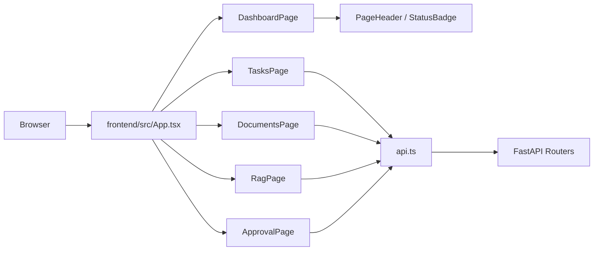
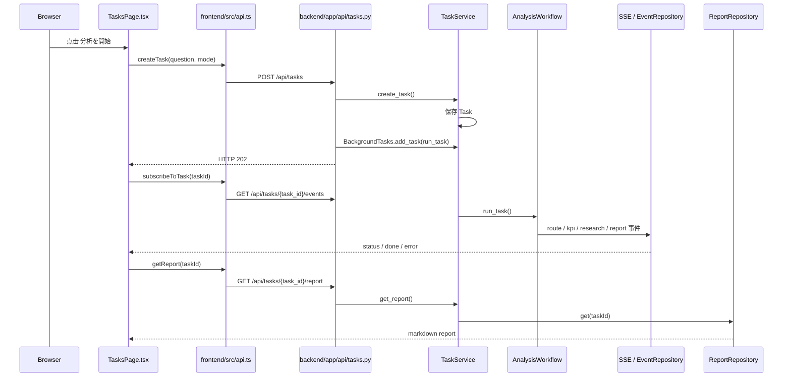
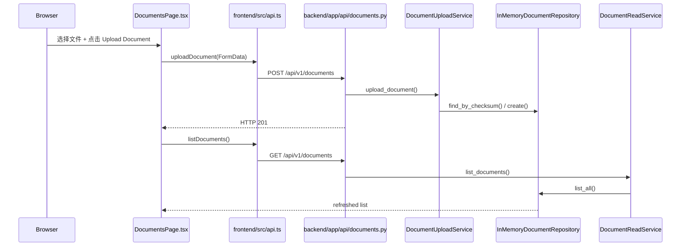
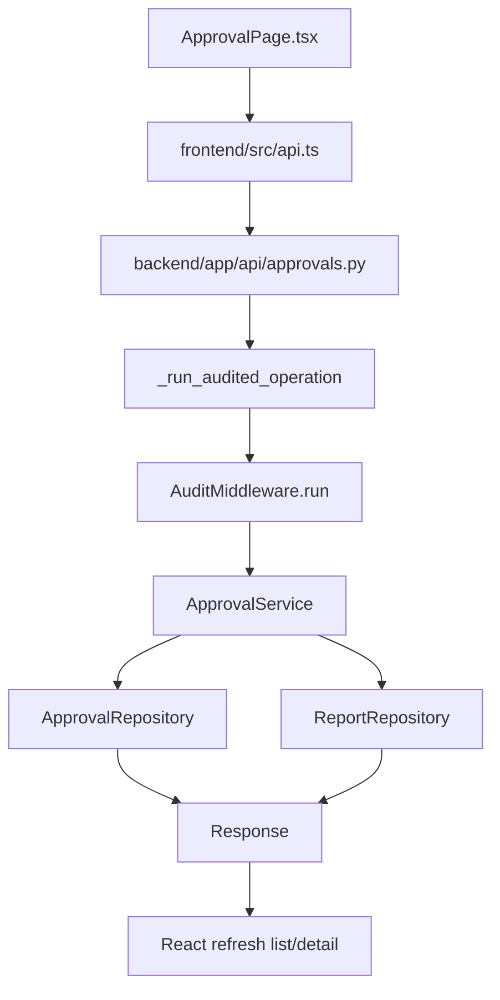
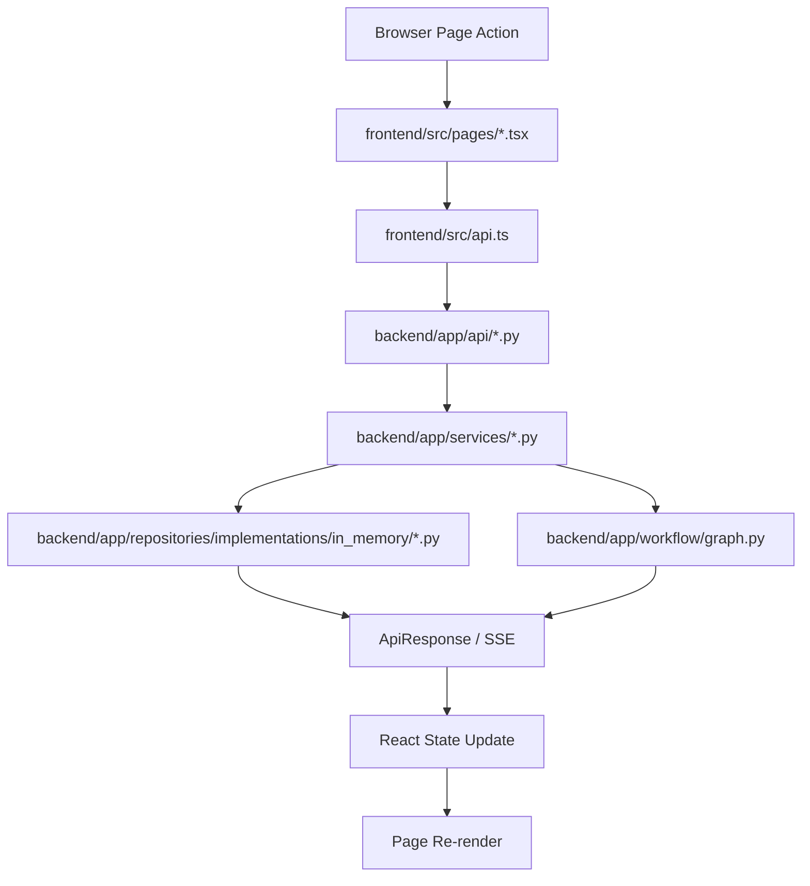
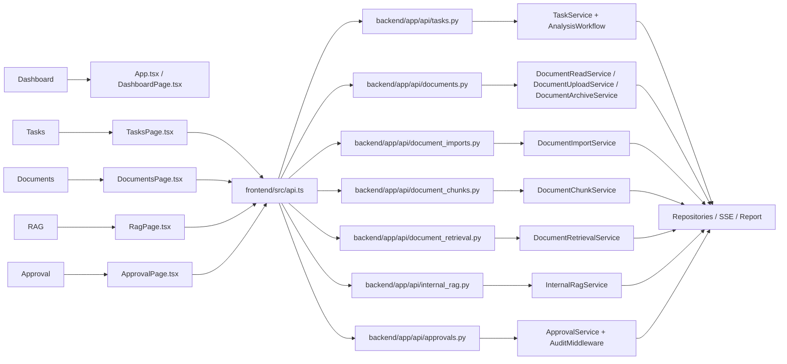

# 页面操作与源码对应学习指南

这份文档只回答一个问题：

“我在浏览器里点了一个按钮以后，程序到底依次经过哪些源码文件？”

它不是 React 教程，也不是 FastAPI 教程，更不是 API 字段手册。

它面向三类读者：

- 前端初学者
- 后端初学者
- 刚进入项目的新成员

本文所有函数名、路径、调用顺序，都以当前源码为准。

---

## 1. 文档使用方法

推荐你一边打开页面，一边对照本文阅读。

最有效的学习顺序是：

1. 先看页面上能点什么
2. 再看对应的 React 事件入口
3. 再看 `frontend/src/api.ts`
4. 再看 FastAPI Router
5. 再看 Service
6. 再看 Repository / Workflow
7. 最后看对应测试

如果你看不懂某个页面，先不要从后端开始钻。先在页面里找到按钮，再回到源码找这个按钮绑定了哪个函数。

---

## 2. 启动系统并打开页面

推荐按项目已有脚本启动。

Backend：

```bash
./scripts/start_backend.sh
```

Frontend：

```bash
./scripts/start_frontend.sh
```

上面两个命令来自真实脚本：

- `scripts/start_backend.sh`
- `scripts/start_frontend.sh`

Backend 手动启动命令在当前 Runbook 中也有明确写法：

```bash
cd backend
python -m uvicorn app.main:app --host 127.0.0.1 --port 8000
```

相关源码路径：

- `scripts/start_backend.sh`
- `scripts/start_frontend.sh`
- `docs/learning/01_Foundation/RUNBOOK_LOCAL.md`
- `frontend/package.json`

打开地址：

- Backend Swagger: `http://127.0.0.1:8000/docs`
- Frontend: `http://127.0.0.1:5173`

---

## 3. 前端整体结构

当前前端不是 React Router 架构。

它是最小页面切换结构：

```text
App.tsx
→ 顶部导航按钮
→ 根据 activeView 渲染不同页面组件
```

真实入口：

- `frontend/src/App.tsx`

真实页面组件：

- `frontend/src/pages/DashboardPage.tsx`
- `frontend/src/pages/TasksPage.tsx`
- `frontend/src/pages/DocumentsPage.tsx`
- `frontend/src/pages/RagPage.tsx`
- `frontend/src/pages/ApprovalPage.tsx`

公共组件：

- `frontend/src/components/PageHeader.tsx`
- `frontend/src/components/StatusBadge.tsx`
- `frontend/src/components/StatusBanner.tsx`

统一 API Client：

- `frontend/src/api.ts`

统一类型定义：

- `frontend/src/types.ts`

整体页面图：



---

## 4. Dashboard 页面

### 4.1 页面操作

你在顶部默认先看到 Dashboard。

你可以点击：

- Open Tasks
- Open Documents
- Open RAG
- Open Approval

### 4.2 用户在页面看到什么

当前 Dashboard 显示的是“当前系统能力说明”，不是实时监控大屏。

真实展示重点包括：

- Repository: InMemory
- Research Provider: Static
- Retrieval: Keyword
- RAG Answer: Deterministic
- Identity: System placeholder user
- Real LLM: Disabled
- PostgreSQL: Not verified
- pgvector: Not implemented

所以这页的作用是“先告诉你当前系统边界”，不是去后端拉统计数据。

### 4.3 React 事件入口

默认显示 Dashboard 的入口在：

- `frontend/src/App.tsx`

真实逻辑：

```text
useState<ViewTab>("dashboard")
```

快捷入口的点击处理也在 `App.tsx`，通过 `setActiveView()` 切页。

### 4.4 页面组件调用的函数

```text
Browser
→ App.tsx
→ DashboardPage.tsx
→ onNavigate("analysis" | "documents" | "rag" | "approval")
→ App.tsx setActiveView()
→ React 重新渲染目标页面
```

### 4.5 api.ts 调用

本功能不调用 `api.ts`。

### 4.6 HTTP Method 和 API Path

本功能没有 HTTP 请求。

### 4.7 FastAPI Router

本功能不经过 Router。

### 4.8 Service

本功能不经过 Service。

### 4.9 Repository

本功能不经过 Repository。

### 4.10 Workflow

本功能不经过 Workflow。

### 4.11 Response 返回

本功能没有后端 Response。

### 4.12 React State 更新

`App.tsx` 中的 `activeView` 变化后，React 重新渲染目标页面。

### 4.13 页面重新渲染

渲染结果来自：

- `frontend/src/pages/DashboardPage.tsx`
- `frontend/src/components/PageHeader.tsx`
- `frontend/src/components/StatusBadge.tsx`

### 4.14 对应测试

- `frontend/src/App.test.tsx`
- `frontend/src/pages/DashboardPage.test.tsx`

重点测试：

- `shows dashboard by default with current runtime facts`
- `highlights the current page in top navigation`
- `sends navigation target when shortcut buttons are clicked`

### 4.15 完整源码路径

- `frontend/src/App.tsx`
- `frontend/src/pages/DashboardPage.tsx`
- `frontend/src/components/PageHeader.tsx`
- `frontend/src/components/StatusBadge.tsx`

### 4.16 如何在浏览器 Network 中验证

这个功能没有网络请求。

你应该在 Network 里看到“没有新请求，但页面已经切换”。这正是前端本地状态切换的证据。

---

## 5. Analysis / Tasks 页面

这一页是当前前端最重要的主链路页面。

它展示的是：

```text
Create Task
→ BackgroundTasks
→ Workflow
→ SSE
→ Get Report
```

### 5.1 创建 Task

#### 页面操作

输入问题，选择 mode，点击“分析を開始”。

#### 用户在页面看到什么

页面会进入执行中状态。

你会看到：

- 任务状态从 `queued` / `running` 变化
- 事件时间线逐步增加
- 最后出现报告

#### React 事件入口

- `frontend/src/pages/TasksPage.tsx`
- 函数：`submit()`

#### 页面组件调用的函数

```text
TasksPage.submit()
→ createTask(question, mode)
→ subscribeToTask(taskId, handlers)
```

#### api.ts 调用

- `createTask()`
- `subscribeToTask()`
- `getReport()`

#### HTTP Method 和 API Path

- `POST /api/tasks`
- `GET /api/tasks/{task_id}/events`
- `GET /api/tasks/{task_id}/report`

#### FastAPI Router

- `backend/app/api/tasks.py`
  - `create_task()`
  - `get_task_events()`
  - `get_report()`

#### Service

- `backend/app/services/task_service.py`
  - `TaskService.create_task()`
  - `TaskService.run_task()`
  - `TaskService.get_report()`

#### Repository

- `backend/app/repositories/implementations/in_memory/task_repository.py`
  - `create()`
  - `save()`
  - `get()`
- `backend/app/repositories/implementations/in_memory/event_repository.py`
  - SSE 事件存储
- `backend/app/repositories/implementations/in_memory/report_repository.py`
  - `get()`

#### Workflow

本功能经过 Workflow。

真实 Workflow 入口：

- `backend/app/workflow/graph.py`
  - `AnalysisWorkflow`
  - `_route_node()`
  - `_kpi_node()`
  - `_research_node()`
  - `_report_node()`

节点顺序不是固定四步直线，而是按 `mode` 决定分支：

- `research` 模式：`route → research → report`
- `kpi` 模式：`route → kpi → report`
- `hybrid` 模式：`route → kpi → research → report`

#### Response 返回

`POST /api/tasks` 返回 `202 Accepted`。

这说明：

- 后端已经接受任务
- 但报告还没有准备好

不是一个请求直接把最终 Markdown 报告返回给前端。

#### React State 更新

`TasksPage` 会更新：

- `taskId`
- `status`
- `events`
- `report`
- `error`

#### 页面重新渲染

SSE 每来一条事件，时间线就刷新一次。

收到 `done` 事件后，前端会再调用 `getReport()` 取最终报告。

这也是为什么“done 事件后还要再请求 report”：

- SSE 只负责进度事件
- 最终大段报告通过普通 GET 获取

#### 对应测试

- `frontend/src/pages/TasksPage.test.tsx`
- `frontend/src/api.test.ts`

重点测试：

- `creates a task, consumes SSE, and renders the report`

#### 完整源码路径

- `frontend/src/pages/TasksPage.tsx`
- `frontend/src/api.ts`
- `backend/app/api/tasks.py`
- `backend/app/services/task_service.py`
- `backend/app/workflow/graph.py`
- `backend/app/workflow/state.py`

#### 如何在浏览器 Network 中验证

1. 打开 Tasks 页面
2. 点击“分析を開始”
3. 在 Network 中看见 `POST /api/tasks`
4. 再看见 `GET /api/tasks/{task_id}/events`
5. 最后看见 `GET /api/tasks/{task_id}/report`

你会发现：

- SSE 请求会一直保持打开一段时间
- report 请求只在 done 之后出现

### 5.2 Task → SSE → Report 主链路图



### 5.3 SSE 与普通 GET 的区别

SSE：

- 长连接
- 连续接收事件
- 适合进度更新

普通 GET：

- 一次请求拿一次结果
- 适合最终报告、详情页、列表页

当前源码里，`subscribeToTask()` 使用的是：

- `new EventSource(/api/tasks/${taskId}/events)`

这不是普通 `fetch()`。

---

## 6. Documents 页面

这一页负责文档主链路：

- 列表
- 上传
- 详情
- Archive
- Import
- Chunk
- Chunk 预览

### 6.1 Document 列表

#### 页面操作

进入 Documents 页面，页面会自动加载列表。

#### 用户在页面看到什么

你会看到：

- 文档标题
- document_id
- 状态
- 文档类型
- 更新时间

#### React 事件入口

- `frontend/src/pages/DocumentsPage.tsx`
- `useEffect(() => { void loadDocuments(true); }, [showArchived])`

#### 页面组件调用的函数

```text
DocumentsPage
→ loadDocuments()
→ listDocuments({ include_archived: showArchived })
```

#### api.ts 调用

- `listDocuments()`

#### HTTP Method 和 API Path

- `GET /api/v1/documents`

#### FastAPI Router

- `backend/app/api/documents.py`
  - `list_documents()`

#### Service

- `backend/app/services/document_read_service.py`
  - `DocumentReadService.list_documents()`

#### Repository

- `backend/app/repositories/implementations/in_memory/document_repository.py`
  - `list_all()`

#### Workflow

本功能不经过 Workflow。

#### Response 返回

返回 `DocumentListResponse`：

- `items`
- `next_cursor`

#### React State 更新

更新：

- `documents`
- `selectedDocumentId`
- `documentsLoading`
- `documentsError`

#### 页面重新渲染

列表区域刷新。

#### 对应测试

- `frontend/src/pages/DocumentsPage.test.tsx`
  - `shows document list, detail, and chunk count`
  - `shows empty state when there are no documents`
  - `shows document list API error and allows refresh retry`

#### 完整源码路径

- `frontend/src/pages/DocumentsPage.tsx`
- `frontend/src/api.ts`
- `backend/app/api/documents.py`
- `backend/app/services/document_read_service.py`
- `backend/app/repositories/implementations/in_memory/document_repository.py`

#### 如何在浏览器 Network 中验证

打开 Documents 页面后，直接看：

- `GET /api/v1/documents`

---

### 6.2 Document 详情

#### 页面操作

点击列表中的某一条文档。

#### 用户在页面看到什么

详情区会显示真实后端返回的文档字段。

同时页面还会单独加载 chunk 列表。

#### React 事件入口

- `setSelectedDocumentId(document.document_id)`
- `useEffect(() => { void refreshSelectedDocument(selectedDocumentId); }, [selectedDocumentId])`

#### 页面组件调用的函数

```text
DocumentsPage
→ refreshSelectedDocument(documentId)
→ getDocument(documentId)
→ getDocumentChunks(documentId)
```

#### api.ts 调用

- `getDocument()`
- `getDocumentChunks()`

#### HTTP Method 和 API Path

- `GET /api/v1/documents/{document_id}`
- `GET /api/v1/documents/{document_id}/chunks`

#### FastAPI Router

- `backend/app/api/documents.py`
  - `get_document()`
- `backend/app/api/document_chunks.py`
  - `get_document_chunks()`

#### Service

- `backend/app/services/document_read_service.py`
  - `get_document()`
- `backend/app/services/document_chunk_service.py`
  - `get_chunks()`

#### Repository

- `InMemoryDocumentRepository.get()`
- `InMemoryDocumentChunkRepository.list_for_document()`

#### Workflow

本功能不经过 Workflow。

#### Response 返回

详情和 chunk 数量来自两个真实接口，不是前端拼出来的假数据。

#### React State 更新

更新：

- `selectedDocument`
- `chunkData`
- `detailError`
- `chunkError`

#### 页面重新渲染

详情区和 chunk 预览区一起刷新。

#### 对应测试

- `frontend/src/pages/DocumentsPage.test.tsx`
  - `shows document list, detail, and chunk count`

#### 如何在浏览器 Network 中验证

点击列表项后，观察两个请求：

- `GET /api/v1/documents/{document_id}`
- `GET /api/v1/documents/{document_id}/chunks`

### 6.3 Document 上传

这是 Documents 页面里最值得重点学习的一条链路。

#### 页面操作

1. 选择文件
2. 填写标题、Owner、Language、Tags
3. 点击 `Upload Document`

#### 用户在页面看到什么

上传中按钮会禁用。

成功后会看到：

- `Upload completed: <document_id>`

然后列表刷新，刚上传的文档会出现在列表里。

#### React 事件入口

- `frontend/src/pages/DocumentsPage.tsx`
- 函数：`submitUpload()`

#### 页面组件调用的函数

```text
用户选择文件
→ DocumentsPage submitUpload()
→ uploadDocument(...)
→ listDocuments(...)
→ setSelectedDocumentId(session.document_id)
→ refreshSelectedDocument(document_id)
```

#### api.ts 调用

- `uploadDocument()`
- `listDocuments()`

#### HTTP Method 和 API Path

- `POST /api/v1/documents`
- 上传成功后再次请求 `GET /api/v1/documents`

#### FastAPI Router

- `backend/app/api/documents.py`
  - `upload_document()`

#### Service

- `backend/app/services/document_upload_service.py`
  - `DocumentUploadService.upload_document()`

#### Repository

- `InMemoryDocumentRepository.find_by_checksum()`
- `InMemoryDocumentRepository.create()`

上传后刷新列表时还会再走：

- `DocumentReadService.list_documents()`
- `InMemoryDocumentRepository.list_all()`

#### Workflow

本功能不经过 Workflow。

#### Response 返回

上传接口返回的是：

- `DocumentUploadSessionResponse`

当前前端只用它来拿：

- `document_id`
- `status`

然后立刻刷新列表。

#### React State 更新

更新：

- `uploading`
- `uploadError`
- `bannerMessage`
- `documents`
- `selectedDocumentId`

#### 页面重新渲染

成功后至少会看到三次 UI 变化：

1. 按钮变成上传中
2. 成功 banner 出现
3. 列表刷新并出现新文档

#### 对应测试

- `frontend/src/pages/DocumentsPage.test.tsx`
  - `uploads a document successfully and refreshes the list`
- `frontend/src/api.test.ts`
  - `uploads document with multipart form data`

#### 完整源码路径

- `frontend/src/pages/DocumentsPage.tsx`
- `frontend/src/api.ts`
- `backend/app/api/documents.py`
- `backend/app/services/document_upload_service.py`
- `backend/app/repositories/implementations/in_memory/document_repository.py`

#### 如何在浏览器 Network 中验证

1. 打开 Network
2. 上传文件
3. 看 `POST /api/v1/documents`
4. 点开 Request Payload
5. 你会看到它不是 JSON，而是 `multipart/form-data`
6. 上传成功后，再看一次 `GET /api/v1/documents`

#### 为什么 metadata 用 multipart，不用 JSON 上传文件

因为这里既要传文件二进制，也要传结构化 metadata。

当前真实前端实现是：

```text
FormData
├── file
└── metadata(JSON string)
```

这正对应后端 Router 的真实签名：

- `file: UploadFile = File(...)`
- `metadata: str = Form(...)`

#### 为什么列表没有伪造 chunk count

因为文档列表接口没有直接返回 chunk 数量。

当前页面选择的做法是：

- 先显示真实文档列表
- 进入详情后，再调用 chunk 接口拿真实 chunk 数据

这比在前端“猜一个 chunk 数”更可靠。

### 6.4 Archive

#### 页面操作

点击 `Archive`。

#### 用户在页面看到什么

成功后会看到：

- `Archive accepted: <document_id> (archived)`

然后列表和详情都会刷新。

#### React 事件入口

- `runDocumentAction("archive")`

#### 页面组件调用的函数

```text
DocumentsPage
→ runDocumentAction("archive")
→ archiveDocument(document_id)
→ loadDocuments(false)
→ refreshSelectedDocument(document_id)
```

#### api.ts 调用

- `archiveDocument()`

#### HTTP Method 和 API Path

- `DELETE /api/v1/documents/{document_id}`

#### FastAPI Router

- `backend/app/api/documents.py`
  - `archive_document()`

#### Service

- `backend/app/services/document_archive_service.py`
  - `archive_document()`

#### Repository

- `InMemoryDocumentRepository.get()`
- `InMemoryDocumentRepository.update()`

#### Workflow

本功能不经过 Workflow。

#### 对应测试

- `frontend/src/pages/DocumentsPage.test.tsx`
  - `archives a document and refreshes current detail`

### 6.5 Import

#### 页面操作

点击 `Import`。

#### 页面组件调用的函数

```text
DocumentsPage
→ runDocumentAction("import")
→ importDocument(document_id)
→ loadDocuments(false)
→ refreshSelectedDocument(document_id)
```

#### api.ts 调用

- `importDocument()`

#### HTTP Method 和 API Path

- `POST /api/v1/documents/{document_id}/import`

#### FastAPI Router

- `backend/app/api/document_imports.py`
  - `import_document()`

#### Service

- `backend/app/services/document_import_service.py`
  - `import_document()`

#### Repository

- `InMemoryDocumentRepository.get()`
- `InMemoryDocumentRepository.update()`

#### Workflow

本功能不经过 Workflow。

#### Response 返回

当前成功状态码是：

- `201 Created`

当前真实业务里，Service 会把文档状态推进到：

- `validated`

前端成功提示显示的是后端真实 `status`：

- `Import result: <status>`

不是前端写死的“imported”。

### 6.6 Create Chunks

#### 页面操作

点击 `Chunk`。

#### 页面组件调用的函数

```text
DocumentsPage
→ runDocumentAction("chunk")
→ chunkDocument(document_id)
→ loadDocuments(false)
→ refreshSelectedDocument(document_id)
```

#### api.ts 调用

- `chunkDocument()`
- `getDocumentChunks()`

#### HTTP Method 和 API Path

- `POST /api/v1/documents/{document_id}/chunks`
- `GET /api/v1/documents/{document_id}/chunks`

#### FastAPI Router

- `backend/app/api/document_chunks.py`
  - `chunk_document()`
  - `get_document_chunks()`

#### Service

- `backend/app/services/document_chunk_service.py`
  - `chunk_document()`
  - `get_chunks()`

#### Repository

- `InMemoryDocumentRepository.get()`
- `InMemoryDocumentChunkRepository.replace_for_document()`
- `InMemoryDocumentChunkRepository.list_for_document()`

#### Workflow

本功能不经过 Workflow。

#### Chunk 预览

chunk 成功后，详情区会重新读取 chunk 列表，所以你能在页面里看到真实 chunk 内容预览。

### 6.7 Document Upload 调用图



---

## 7. RAG 页面

当前 RAG 页面分成两个真实功能：

- Document Retrieval
- Internal RAG Answer

当前一定要记住的系统边界：

- 已实现：Keyword Retrieval
- 已实现：Deterministic Grounded Answer
- 未实现：Embedding
- 未实现：pgvector
- 未实现：Hybrid Retrieval
- 未实现：Reranker
- 未实现：真实 LLM

### 7.1 A. Document Retrieval

#### 页面操作

输入 Query，点击 `Search Retrieval`。

#### 用户在页面看到什么

页面会显示：

- Retrieval mode
- Total matches
- 每条结果的 excerpt
- document_id
- chunk_id
- score
- metadata
- source

#### React 事件入口

- `frontend/src/pages/RagPage.tsx`
- 检索提交函数

#### 页面组件调用的函数

```text
RagPage
→ searchDocumentRetrieval(payload)
→ React 渲染 results
```

#### api.ts 调用

- `searchDocumentRetrieval()`

#### HTTP Method 和 API Path

- `POST /api/v1/document-retrieval/search`

#### FastAPI Router

- `backend/app/api/document_retrieval.py`
  - `search_documents()`

#### Service

- `backend/app/services/document_retrieval_service.py`
  - `DocumentRetrievalService.search()`

#### Repository

这里不是普通 CRUD Repository。

真实检索提供者是：

- `backend/app/repositories/implementations/in_memory/document_retrieval.py`
  - `InMemoryKeywordRetrieval.search()`

它会从文档和 chunk 数据中做当前阶段的关键词检索。

#### Workflow

本功能不经过 Workflow。

#### Response 返回

返回：

- `results`
- `total`
- `query`
- `retrieval_mode`

当前前端展示的 `retrieval_mode` 应该理解为真实后端返回的检索模式，而不是前端自己写死的假标签。

#### 对应测试

- `frontend/src/pages/RagPage.test.tsx`
  - `shows retrieval results`
  - `shows empty retrieval state from backend`
- `frontend/src/api.test.ts`
  - `calls document retrieval search with JSON body`

#### 如何在浏览器 Network 中验证

观察：

- `POST /api/v1/document-retrieval/search`

重点看 Request Body 是否和页面筛选一致。

### 7.2 B. Internal RAG Answer

#### 页面操作

输入 Question，点击 `Generate Answer`。

#### 用户在页面看到什么

页面会显示：

- grounded answer
- citations
- confidence
- warnings
- retrieval_mode
- answer_mode

#### React 事件入口

- `frontend/src/pages/RagPage.tsx`
- 问答提交函数

#### 页面组件调用的函数

```text
RagPage
→ answerInternalRag(payload)
→ 渲染 answer / citations / warnings
```

#### api.ts 调用

- `answerInternalRag()`

#### HTTP Method 和 API Path

- `POST /api/v1/internal-rag/answer`

#### FastAPI Router

- `backend/app/api/internal_rag.py`
  - `answer_internal_rag()`

#### Service

- `backend/app/services/internal_rag_service.py`
  - `InternalRagService.answer()`

#### Repository

真实源码里，这一步不会直接调用普通文档 CRUD Router。

它走的是：

- `DocumentRetrievalProvider.search()`

也就是先检索，再用 deterministic answer generator 组装答案。

#### Workflow

本功能不经过 LangGraph Workflow。

#### Response 返回

返回：

- `answer`
- `citations`
- `retrieval_mode`
- `answer_mode`
- `confidence`
- `warnings`

#### 对应测试

- `frontend/src/pages/RagPage.test.tsx`
  - `shows grounded internal rag answer and citations`
  - `shows internal rag API error`
- `frontend/src/api.test.ts`
  - `calls internal rag answer with deterministic request body`

### 7.3 Retrieval / Internal RAG 调用图

```mermaid
flowchart TD
    A[Browser / RagPage.tsx] --> B[frontend/src/api.ts]
    B --> C[POST /api/v1/document-retrieval/search]
    C --> D[backend/app/api/document_retrieval.py]
    D --> E[DocumentRetrievalService.search()]
    E --> F[InMemoryKeywordRetrieval.search()]
    F --> G[results rendered in React]

    A --> H[frontend/src/api.ts]
    H --> I[POST /api/v1/internal-rag/answer]
    I --> J[backend/app/api/internal_rag.py]
    J --> K[InternalRagService.answer()]
    K --> L[DocumentRetrievalProvider.search()]
    K --> M[RAGAnswerGenerator.generate()]
    M --> N[citations / confidence / warnings]
    N --> O[React render]
```

---

## 8. Approval 页面

这一页要同时理解三件事：

1. Approval 状态机
2. Audit 边界
3. 权限边界

当前真实身份展示是：

- `System placeholder user`

这表示现在前端能学习审批流程，但还不是真实登录系统。

### 8.1 Approval 列表

#### 页面操作

进入 Approval 页面，或点 `Apply Filter` / `Retry / Refresh`。

#### 页面组件调用的函数

```text
ApprovalPage
→ loadApprovals()
→ listApprovals(...)
```

#### api.ts 调用

- `listApprovals()`

#### HTTP Method 和 API Path

- `GET /api/v1/approvals`

#### FastAPI Router

- `backend/app/api/approvals.py`
  - `list_approvals()`

#### Service

- `backend/app/services/approval_service.py`
  - `list_approvals()`

#### Repository

- `InMemoryApprovalRepository.list_approval_requests()`

#### Audit Boundary / RBAC Guard

Approval Router 不是直接调用 Service。

它先经过：

- `_run_audited_operation(...)`
- `AuditMiddleware.run(...)`

也就是：

```text
ApprovalPage
→ api.ts
→ approvals.py Router
→ _run_audited_operation()
→ AuditMiddleware.run()
→ ApprovalService
```

这就是当前源码里的真实“审计边界”。

### 8.2 Approval 详情

#### 页面操作

点击某一条 approval。

#### 页面组件调用的函数

```text
ApprovalPage
→ setSelectedApprovalId()
→ loadApprovalDetail(approvalId)
→ getApproval(approvalId)
```

#### api.ts 调用

- `getApproval()`

#### HTTP Method 和 API Path

- `GET /api/v1/approvals/{approval_id}`

#### FastAPI Router

- `backend/app/api/approvals.py`
  - `get_approval()`

#### Service

- `ApprovalService.get_approval()`

#### Repository

- `InMemoryApprovalRepository.get_approval_request()`

#### 特别说明

当前详情页里明确写着：

`Audit fields are not returned directly by this API response.`

这句话很重要。

它表示：

- 审计存在
- 但审计字段不是直接塞进 Approval Response 里

### 8.3 Submit Approval

#### 页面操作

输入 Task ID，点击 `Submit Approval`。

#### 页面组件调用的函数

```text
ApprovalPage
→ handleSubmitApproval()
→ submitApproval(taskId, payload)
→ refreshAfterChange(created.approval_id)
```

#### api.ts 调用

- `submitApproval()`

#### HTTP Method 和 API Path

- `POST /api/v1/reports/{task_id}/submit-approval`

#### FastAPI Router

- `backend/app/api/approvals.py`
  - `submit_approval()`

#### Service

- `ApprovalService.submit_approval()`

#### Repository

- `InMemoryApprovalRepository.get_latest_report_version()`
- `InMemoryApprovalRepository.save_report_version()`
- `InMemoryApprovalRepository.save_approval_request()`
- `InMemoryReportRepository.save()`

### 8.4 Approve

#### 页面操作

在 `pending_approval` 状态下点击 `Approve`。

#### 页面组件调用的函数

```text
ApprovalPage
→ handleApprove()
→ approveApproval(approvalId, payload)
→ refreshAfterChange(updated.approval_id)
```

#### api.ts 调用

- `approveApproval()`

#### HTTP Method 和 API Path

- `POST /api/v1/approvals/{approval_id}/approve`

#### FastAPI Router

- `backend/app/api/approvals.py`
  - `approve()`

#### Service

- `ApprovalService.approve()`

#### Repository

- `InMemoryApprovalRepository.get_approval_request()`
- `InMemoryApprovalRepository.save_approval_request()`
- `InMemoryReportRepository.save()`

### 8.5 Reject

#### 页面操作

在 `pending_approval` 状态下点击 `Reject`。

#### 页面组件调用的函数

```text
ApprovalPage
→ handleReject()
→ rejectApproval(approvalId, payload)
→ refreshAfterChange(updated.approval_id)
```

#### api.ts 调用

- `rejectApproval()`

#### HTTP Method 和 API Path

- `POST /api/v1/approvals/{approval_id}/reject`

#### FastAPI Router

- `backend/app/api/approvals.py`
  - `reject()`

#### Service

- `ApprovalService.reject()`

#### Repository

- `InMemoryApprovalRepository.save_approval_request()`
- `InMemoryReportRepository.save()`

### 8.6 Request Revision

这里最容易写错。

当前前端不是调用“某个 approval 专属 revise API”。

它调用的是真实源码中的：

- `requestApprovalRevision(taskId, payload)`
- `POST /api/v1/reports/{task_id}/revise`

也就是说，revise 是对 `task_id` 发起，不是假造的 `/approvals/{approval_id}/revise`。

#### 页面组件调用的函数

```text
ApprovalPage
→ handleRevise()
→ requestApprovalRevision(selectedApproval.task_id, payload)
→ refreshAfterChange(selectedApproval.approval_id)
```

#### HTTP Method 和 API Path

- `POST /api/v1/reports/{task_id}/revise`

#### FastAPI Router

- `backend/app/api/approvals.py`
  - `revise()`

#### Service

- `ApprovalService.revise()`

#### Repository

- `InMemoryApprovalRepository.get_latest_report_version()`
- `InMemoryApprovalRepository.save_report_version()`
- `InMemoryReportRepository.save()`

### 8.7 哪些状态允许操作

当前前端源码中的真实判断：

- `Approve / Reject` 只允许 `pending_approval`
- `Revise` 只允许 `rejected`

对应前端判断变量：

- `canApproveOrReject`
- `canRevise`

### 8.8 403 和 409 应该怎么理解

403：

- 权限错误
- 当前 Approval 测试里有真实覆盖

409：

- 状态冲突
- 比如已经提交、已经决策、状态不允许重复推进

### 8.9 Approval 调用图



---

## 9. 页面测试学习

这一章很重要。

如果你只会点页面，不会看测试，你很难快速理解这个项目。

当前前端测试技术栈：

- Vitest
- React Testing Library

常见测试工具在本项目里的意思：

- `render()`：把组件渲染到测试 DOM
- `screen`：查页面元素
- `fireEvent`：模拟点击、输入、change
- `vi.stubGlobal()`：替换全局对象，比如 `fetch`、`EventSource`
- `waitFor()`：等待异步状态完成
- `expect()`：断言结果

当前真实测试文件：

- `frontend/src/App.test.tsx`
- `frontend/src/pages/DashboardPage.test.tsx`
- `frontend/src/pages/TasksPage.test.tsx`
- `frontend/src/pages/DocumentsPage.test.tsx`
- `frontend/src/pages/RagPage.test.tsx`
- `frontend/src/pages/ApprovalPage.test.tsx`
- `frontend/src/api.test.ts`

### 9.1 先看测试覆盖什么

#### App.test.tsx

主要测：

- Dashboard 默认显示
- 顶部导航切换
- Dashboard 快捷入口跳转

#### DashboardPage.test.tsx

主要测：

- 运行时能力说明是否渲染
- 快捷入口按钮是否存在
- `onNavigate` 是否正确发出目标页

#### TasksPage.test.tsx

主要测：

- 创建 Task
- 订阅 SSE
- done 后读取 report

#### DocumentsPage.test.tsx

主要测：

- 列表显示
- 空状态
- 列表错误 + Retry
- 上传成功后刷新
- 上传失败
- Archive 后刷新

#### RagPage.test.tsx

主要测：

- Retrieval 结果显示
- Retrieval 空结果
- Internal RAG Answer
- RAG API 错误

#### ApprovalPage.test.tsx

主要测：

- 列表 + 详情
- Submit Approval
- Submit 失败
- 按钮禁用
- Approve
- Reject
- Revise
- 409/403 错误

#### api.test.ts

主要测：

- API Client 是否发出正确 URL
- method 是否正确
- body 是否正确
- multipart / JSON 是否正确

### 9.2 逐行理解一个真实测试：

`uploads a document successfully and refreshes the list`

真实文件：

- `frontend/src/pages/DocumentsPage.test.tsx`

你应该按下面顺序理解。

#### 第 1 步：Mock 哪些 API

这个测试连续 mock 了多次 `fetch`：

1. 第一次：初始 `GET /api/v1/documents`
2. 第二次：`POST /api/v1/documents`
3. 第三次：上传成功后的再次 `GET /api/v1/documents`
4. 第四次：`GET /api/v1/documents/{document_id}`
5. 第五次：`GET /api/v1/documents/{document_id}/chunks`

这正好对应真实页面行为。

#### 第 2 步：render 哪个组件

测试直接：

```text
render(<DocumentsPage />)
```

这说明它不是先从 Router 进页面，而是直接测试单页组件。

#### 第 3 步：如何构造 File

测试里用了真实浏览器风格的 `File`：

```text
new File(["month,sales"], "budget.csv", { type: "text/csv" })
```

这能真实模拟用户选文件。

#### 第 4 步：如何上传

测试通过 `fireEvent.change()` 模拟文件选择和输入框填写，再点：

- `Upload Document`

#### 第 5 步：如何等待异步调用

上传后不会立刻同步更新页面。

测试使用：

- `await screen.findByRole(...)`
- `await screen.findAllByText(...)`

这表示它在等待异步渲染完成。

#### 第 6 步：如何验证上传成功

它验证页面出现：

- `Upload completed: doc-9`

这说明上传接口结果已经回到页面。

#### 第 7 步：如何验证列表再次调用

这个测试没有直接去断言“fetch 第几次一定是 listDocuments”这种实现细节，而是用页面结果证明刷新发生了：

- 页面里出现新文档 `budget.csv`

这就是更稳的 UI 级验证。

#### 第 8 步：为什么测试不访问真实后端

因为组件测试的目标是：

- 验证页面逻辑
- 验证状态更新
- 验证按钮和反馈

不是验证 FastAPI 真服务是否启动。

如果组件测试直接打真实后端，会让测试：

- 慢
- 不稳定
- 难定位

### 9.3 再看一个 Approval 测试

推荐看：

- `approves a pending approval and refreshes detail`

它展示的真实顺序是：

1. 先 mock 列表
2. 再 mock 详情
3. 点击 `Approve`
4. mock approve 返回
5. 再次刷新列表
6. 再次刷新详情
7. 最终页面显示新状态和审批意见

也就是说，Approval 页面不是“点一下就地改个前端状态”。

它是：

```text
请求后端
→ 用真实响应刷新页面
```

---

## 10. 浏览器 Network 学习方法

这是把“页面点击”和“源码调用链”连起来的最实用方法。

建议每次都按这个顺序做：

1. 启动 Backend
2. 启动 Frontend
3. 打开浏览器
4. 打开 DevTools
5. 打开 Network
6. 在页面点击一个动作
7. 看 Request URL
8. 看 Method
9. 看 Payload / Form Data
10. 看 Response
11. 回到 `frontend/src/api.ts`
12. 找到对应函数
13. 再找 Backend Router
14. 再找 Service
15. 再找 Repository / Workflow
16. 最后找测试

你可以把这套方法理解成：

```text
Browser
→ Network
→ api.ts
→ Router
→ Service
→ Repository / Workflow
→ Test
```

---

## 11. 前端到后端总调用图



---

## 12. 源码路径表

| 页面操作 | 前端组件 | API Client | Backend Router | Service | Repository / Workflow | Test |
|---|---|---|---|---|---|---|
| Dashboard 快捷入口 | `frontend/src/App.tsx` / `frontend/src/pages/DashboardPage.tsx` | 无 | 无 | 无 | 无 | `frontend/src/App.test.tsx`, `frontend/src/pages/DashboardPage.test.tsx` |
| Create Task | `frontend/src/pages/TasksPage.tsx` | `createTask()` | `backend/app/api/tasks.py#create_task` | `TaskService.create_task()` | `InMemoryTaskRepository.create()` | `frontend/src/pages/TasksPage.test.tsx`, `frontend/src/api.test.ts` |
| SSE | `frontend/src/pages/TasksPage.tsx` | `subscribeToTask()` | `backend/app/api/tasks.py#get_task_events` | `TaskService.run_task()` | `AnalysisWorkflow`, `EventRepository` | `frontend/src/pages/TasksPage.test.tsx` |
| Get Report | `frontend/src/pages/TasksPage.tsx` | `getReport()` | `backend/app/api/tasks.py#get_report` | `TaskService.get_report()` | `InMemoryReportRepository.get()` | `frontend/src/pages/TasksPage.test.tsx` |
| Upload Document | `frontend/src/pages/DocumentsPage.tsx` | `uploadDocument()` | `backend/app/api/documents.py#upload_document` | `DocumentUploadService.upload_document()` | `InMemoryDocumentRepository.create()` | `frontend/src/pages/DocumentsPage.test.tsx`, `frontend/src/api.test.ts` |
| Read Document Detail | `frontend/src/pages/DocumentsPage.tsx` | `getDocument()` | `backend/app/api/documents.py#get_document` | `DocumentReadService.get_document()` | `InMemoryDocumentRepository.get()` | `frontend/src/pages/DocumentsPage.test.tsx` |
| Read Chunks | `frontend/src/pages/DocumentsPage.tsx` | `getDocumentChunks()` | `backend/app/api/document_chunks.py#get_document_chunks` | `DocumentChunkService.get_chunks()` | `InMemoryDocumentChunkRepository.list_for_document()` | `frontend/src/pages/DocumentsPage.test.tsx` |
| Archive Document | `frontend/src/pages/DocumentsPage.tsx` | `archiveDocument()` | `backend/app/api/documents.py#archive_document` | `DocumentArchiveService.archive_document()` | `InMemoryDocumentRepository.get()/update()` | `frontend/src/pages/DocumentsPage.test.tsx`, `frontend/src/api.test.ts` |
| Import Document | `frontend/src/pages/DocumentsPage.tsx` | `importDocument()` | `backend/app/api/document_imports.py#import_document` | `DocumentImportService.import_document()` | `InMemoryDocumentRepository.get()/update()` | `frontend/src/api.test.ts` |
| Create Chunks | `frontend/src/pages/DocumentsPage.tsx` | `chunkDocument()` | `backend/app/api/document_chunks.py#chunk_document` | `DocumentChunkService.chunk_document()` | `DocumentRepository + DocumentChunkRepository` | `frontend/src/api.test.ts` |
| Retrieval Search | `frontend/src/pages/RagPage.tsx` | `searchDocumentRetrieval()` | `backend/app/api/document_retrieval.py#search_documents` | `DocumentRetrievalService.search()` | `InMemoryKeywordRetrieval.search()` | `frontend/src/pages/RagPage.test.tsx`, `frontend/src/api.test.ts` |
| Internal RAG Answer | `frontend/src/pages/RagPage.tsx` | `answerInternalRag()` | `backend/app/api/internal_rag.py#answer_internal_rag` | `InternalRagService.answer()` | `DocumentRetrievalProvider + RAGAnswerGenerator` | `frontend/src/pages/RagPage.test.tsx`, `frontend/src/api.test.ts` |
| Submit Approval | `frontend/src/pages/ApprovalPage.tsx` | `submitApproval()` | `backend/app/api/approvals.py#submit_approval` | `ApprovalService.submit_approval()` | `ApprovalRepository + ReportRepository` | `frontend/src/pages/ApprovalPage.test.tsx`, `frontend/src/api.test.ts` |
| Approve | `frontend/src/pages/ApprovalPage.tsx` | `approveApproval()` | `backend/app/api/approvals.py#approve` | `ApprovalService.approve()` | `ApprovalRepository + ReportRepository` | `frontend/src/pages/ApprovalPage.test.tsx` |
| Reject | `frontend/src/pages/ApprovalPage.tsx` | `rejectApproval()` | `backend/app/api/approvals.py#reject` | `ApprovalService.reject()` | `ApprovalRepository + ReportRepository` | `frontend/src/pages/ApprovalPage.test.tsx` |
| Revise | `frontend/src/pages/ApprovalPage.tsx` | `requestApprovalRevision()` | `backend/app/api/approvals.py#revise` | `ApprovalService.revise()` | `ApprovalRepository + ReportRepository` | `frontend/src/pages/ApprovalPage.test.tsx`, `frontend/src/api.test.ts` |

---

## 13. 当前实现边界

这部分一定要和真实源码保持一致。

当前已经存在的能力：

- Dashboard 页面切换
- Task 创建、SSE、Report 展示
- Document 列表、上传、详情、Archive、Import、Chunk
- Retrieval 搜索
- Internal RAG deterministic answer
- Approval 列表、详情、提交、批准、拒绝、修订

当前明确未实现或未接入的能力：

- 真实 LLM
- Embedding 检索
- pgvector
- Hybrid Retrieval
- Reranker
- 真实登录身份
- 前端 Router 框架

Dashboard 页面中的运行时说明也反映了这些边界，所以不要把当前项目误读成“已经完成生产级智能检索平台”。

---

## 14. 推荐学习顺序

建议你按下面顺序学。

### 第 1 步：先学页面切换

- `frontend/src/App.tsx`
- `frontend/src/pages/DashboardPage.tsx`

目的：

先看懂当前前端到底有哪几页。

### 第 2 步：学 Tasks 主链路

- `frontend/src/pages/TasksPage.tsx`
- `frontend/src/api.ts`
- `backend/app/api/tasks.py`
- `backend/app/services/task_service.py`
- `backend/app/workflow/graph.py`

目的：

看懂最完整的一条“前端 → 后端 → Workflow → SSE → 前端”的闭环。

### 第 3 步：学 Documents 页面

先看上传，再看详情，再看 Archive / Import / Chunk。

重点：

- 为什么上传后要刷新列表
- 为什么详情要单独读 chunk

### 第 4 步：学 RAG 页面

先看 Retrieval，再看 Internal RAG。

目的：

先区分“检索”和“问答组装”不是同一个概念。

### 第 5 步：学 Approval 页面

重点：

- 状态边界
- 审计边界
- 权限边界

### 第 6 步：最后补测试

推荐顺序：

1. `frontend/src/App.test.tsx`
2. `frontend/src/pages/TasksPage.test.tsx`
3. `frontend/src/pages/DocumentsPage.test.tsx`
4. `frontend/src/pages/RagPage.test.tsx`
5. `frontend/src/pages/ApprovalPage.test.tsx`
6. `frontend/src/api.test.ts`

---

## 15. 常见排查方法

### 15.1 点了按钮没反应

先查：

1. 浏览器 Console
2. Network 有没有请求
3. 组件事件函数有没有被触发
4. `api.ts` 有没有发请求

### 15.2 页面报错但看不懂

优先看页面里的错误 banner。

当前很多页面都统一用：

- `StatusBanner`
- `ApiClientError`

所以页面上出现的 `[ERROR_CODE] message` 一般已经能告诉你是后端错误还是网络错误。

### 15.3 看不懂列表为什么刷新

去搜页面里的：

- `loadDocuments()`
- `refreshAfterChange()`
- `refreshSelectedDocument()`

很多刷新不是浏览器自动做的，而是组件主动再次请求接口。

### 15.4 为什么测试里不用真实后端

因为页面测试关注的是：

- 点击后调用了什么
- 状态怎么更新
- 页面怎么重渲染

不是验证 FastAPI 服务能不能启动。

### 15.5 为什么 Tasks 页面要同时用 POST、SSE、GET

因为这是一个典型异步任务链路：

- `POST` 负责创建任务
- `SSE` 负责持续拿进度
- `GET report` 负责拿最终结果

如果把这三件事混成一个请求，前端体验和后端结构都会更差。

---

## 16. 全系统页面到源码总图



---

## 17. 本文对应的核心源码入口清单

前端：

- `frontend/src/App.tsx`
- `frontend/src/api.ts`
- `frontend/src/types.ts`
- `frontend/src/pages/DashboardPage.tsx`
- `frontend/src/pages/TasksPage.tsx`
- `frontend/src/pages/DocumentsPage.tsx`
- `frontend/src/pages/RagPage.tsx`
- `frontend/src/pages/ApprovalPage.tsx`
- `frontend/src/components/PageHeader.tsx`
- `frontend/src/components/StatusBadge.tsx`
- `frontend/src/components/StatusBanner.tsx`

后端：

- `backend/app/main.py`
- `backend/app/api/tasks.py`
- `backend/app/api/documents.py`
- `backend/app/api/document_imports.py`
- `backend/app/api/document_chunks.py`
- `backend/app/api/document_retrieval.py`
- `backend/app/api/internal_rag.py`
- `backend/app/api/approvals.py`
- `backend/app/services/task_service.py`
- `backend/app/services/document_read_service.py`
- `backend/app/services/document_upload_service.py`
- `backend/app/services/document_archive_service.py`
- `backend/app/services/document_import_service.py`
- `backend/app/services/document_chunk_service.py`
- `backend/app/services/document_retrieval_service.py`
- `backend/app/services/internal_rag_service.py`
- `backend/app/services/approval_service.py`
- `backend/app/workflow/graph.py`

测试：

- `frontend/src/App.test.tsx`
- `frontend/src/pages/DashboardPage.test.tsx`
- `frontend/src/pages/TasksPage.test.tsx`
- `frontend/src/pages/DocumentsPage.test.tsx`
- `frontend/src/pages/RagPage.test.tsx`
- `frontend/src/pages/ApprovalPage.test.tsx`
- `frontend/src/api.test.ts`

如果你只想找一条最值得先读的链路，请先读：

```text
TasksPage.tsx
→ api.ts
→ backend/app/api/tasks.py
→ task_service.py
→ workflow/graph.py
→ TasksPage.test.tsx
```
