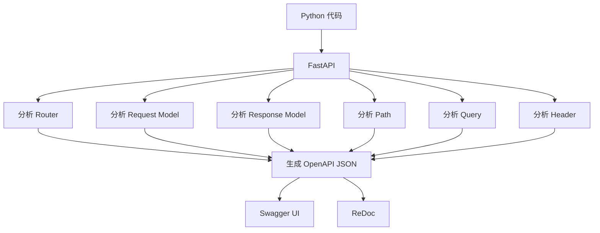
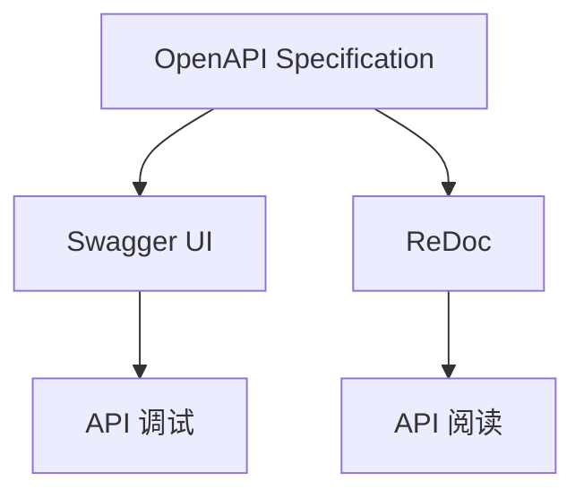
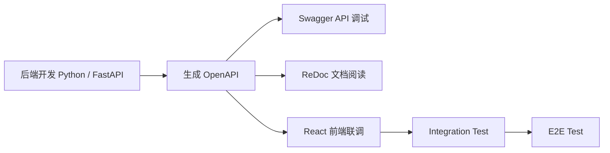
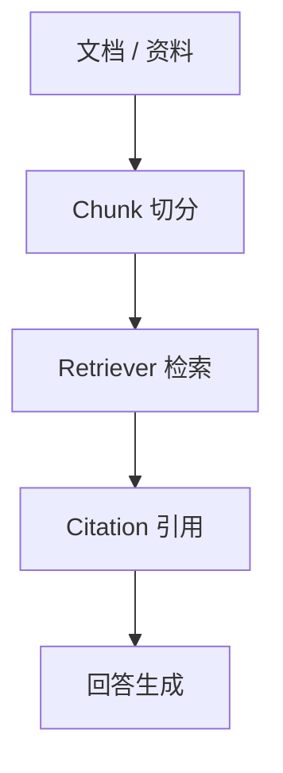
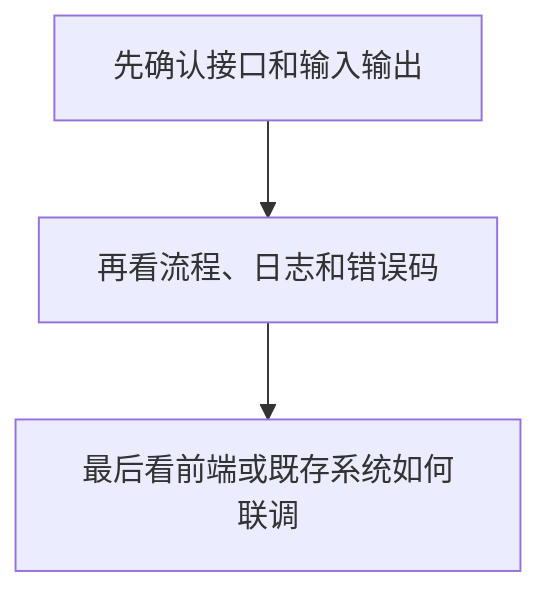

# AI Learn 核心概念图（Concept Map）①

> 本文档用于记录企业 AI 后端项目中最容易混淆的概念关系。
>
> **不是术语表。**
>
> 正式术语请查看：
>
> `ai-lab/术语速查表.md`

---

# 1. Python → FastAPI → OpenAPI → Swagger / ReDoc

## 1.1 真正的数据流



---

## 1.2 每一步到底在做什么？

|阶段|作用|学习重点|
|----|------|----------------|
|Python 代码|真正开发后端代码|开发者写的是 Router、Request、Response，不是 Swagger|
|FastAPI|读取并分析 Python 代码|自动识别 Router、Path、Query、Header、Request Model、Response Model|
|OpenAPI JSON|生成接口标准规范|企业真正提供的是 OpenAPI，而不是 Swagger|
|Swagger UI|API 调试与验证工具|Try it out、Execute、联调接口|
|ReDoc|API 阅读文档工具|阅读接口，不负责调试|

---

## 1.3 一句话记忆

> Python 代码
> ↓
> FastAPI 自动分析代码
> ↓
> 生成 OpenAPI(JSON)
> ↓
> Swagger UI 与 ReDoc 都只是 OpenAPI 的展示方式。
## 1.4 一句话总结
> Python 代码通过 FastAPI 生成 OpenAPI JSON，再由 Swagger UI 和 ReDoc 展示成可读、可验证的接口文档。
---

## 日本語補足

OpenAPI は API 仕様です。

Swagger UI と ReDoc は OpenAPI の表示ツールです。

企業では

> 「OpenAPI を提供します。」

と言います。

---

# 2. 企业里为什么说 OpenAPI，而不是 Swagger

---

## 2.1 概念关系



---

## 2.2 企业怎么理解

|名称|角色|企业说法|
|------|---------|----------------|
|OpenAPI|接口契约 / 标准规范|我们提供 OpenAPI|
|Swagger UI|OpenAPI 的调试 Viewer|我们使用 Swagger 调试 API|
|ReDoc|OpenAPI 的阅读 Viewer|我们使用 ReDoc 阅读 API 文档|

---

## 2.3 为什么？

Swagger 并不是接口。

Swagger 只是：

> OpenAPI 的一个 Viewer（查看器）。

真正重要的是：

```
OpenAPI(JSON)
```

企业真正维护的是：

- Router
- Request Model
- Response Model
- OpenAPI

Swagger 只是读取 OpenAPI。

---

## 企业项目必须记住

✅ Swagger 不是正式 UI。

✅ Swagger 不是测试环境。

✅ Swagger 是 API 调试工具。

✅ React UI 与 Swagger 调用的是同一套 FastAPI API。

✅ UI 完成以后 Swagger 通常仍然长期保留。

---

## 日本語補足

Swagger は本番 UI ではありません。

API の検証画面です。

企業では OpenAPI を提供します。

---

# 3. 企业实际开发流程

---

## 3.1 一个企业项目真正如何开发



---

## 3.2 每一步做什么？

|阶段|做什么|工具|
|----|--------------------------|----------------|
|后端开发|编写 Router、Service、Schema|Python / FastAPI|
|接口规范|自动生成接口定义|OpenAPI JSON|
|接口验证|手动执行 API|Swagger UI|
|文档阅读|阅读 API 文档|ReDoc|
|前端联调|React 调用同一套 API|React + FastAPI|
|集成测试|验证业务流程|Integration Test|
|端到端测试|模拟真实用户操作|Playwright / Cypress|

---

## 企业项目测试体系

```text
                E2E Test
                    ▲
            Integration Test
                    ▲
        Swagger(API Verification)
                    ▲
              Unit Test
```

---

## 四层验证体系

|层级|工具|目的|
|----|----------------|----------------|
|Unit Test|pytest / unittest|验证模块逻辑|
|API Verification|Swagger UI|验证接口合同|
|Integration Test|React + FastAPI|验证业务流程|
|E2E Test|Playwright / Cypress|模拟真实用户|

---

## 日本語補足

企業では通常、

Unit Test

↓

Swagger

↓

Integration Test

↓

E2E Test

という順番で品質を確認します。

---

# 学习重点（★★★★★）

请永远记住：

OpenAPI 才是真正的接口规范。

Swagger 和 ReDoc 都只是 OpenAPI 的展示方式。

FastAPI 自动根据 Python 代码生成 OpenAPI。

开发者从来不会手写 Swagger。

企业项目中：

Python → FastAPI → OpenAPI → Swagger

才是真正的数据流。


## 2. RAG 学习路径



| 概念 | 作用 | 容易混淆点 | 一句话总结 |
|---|---|---|---|
| 文档 / 资料 | 提供原始知识来源 | 它不是最终答案 | RAG 的起点永远是可追溯的资料。 |
| Chunk 切分 | 把长文档拆成小块 | 它不是检索本身 | 切分粒度会影响检索质量。 |
| Retriever | 找到相关证据 | 它不是直接回答模块 | Retriever 负责找证据，不负责编答案。 |
| Citation | 标明证据来源 | 它不是装饰字段 | Citation 让答案可解释、可追踪。 |
| 回答生成 | 基于证据组织答案 | 它不是凭空创作 | 回答必须尽量和证据保持一致。 |

一句话总结：

> RAG 的核心不是“让模型会说”，而是“让答案有证据、有来源、可回溯”。

## 3. 企业学习提示



| 顺序 | 学习重点 | 为什么这样看 |
|---|---|---|
| 1 | 接口和输入输出 | 先确认系统边界和合同。 |
| 2 | 流程、日志、错误码 | 再确认问题如何定位和排查。 |
| 3 | 前端或既存系统联调 | 最后看真实使用场景如何串起来。 |

一句话总结：

> 企业项目学习先看边界，再看流程，最后看联调，这样最容易把概念和实现对应起来。
