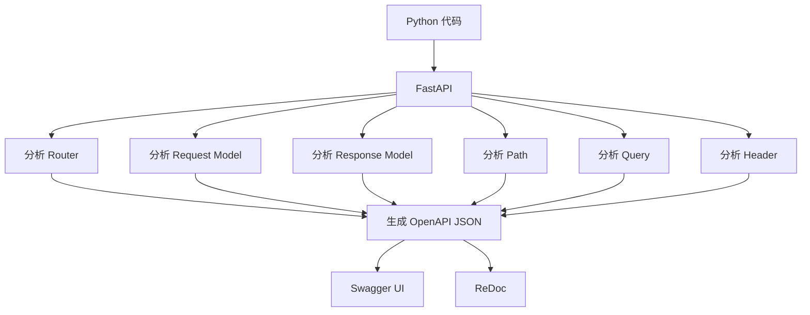
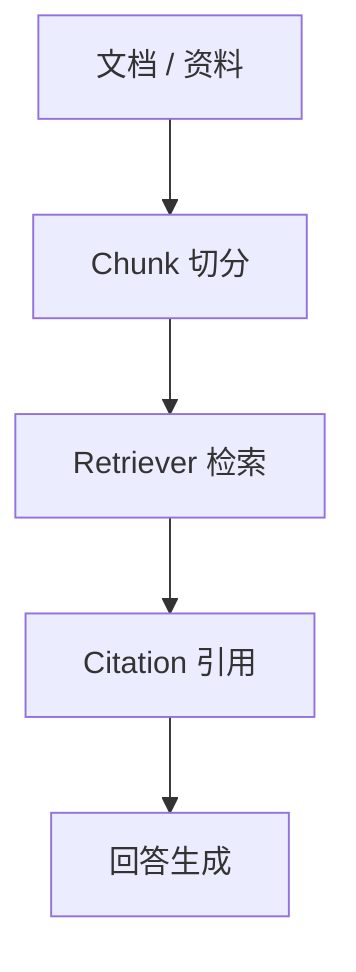
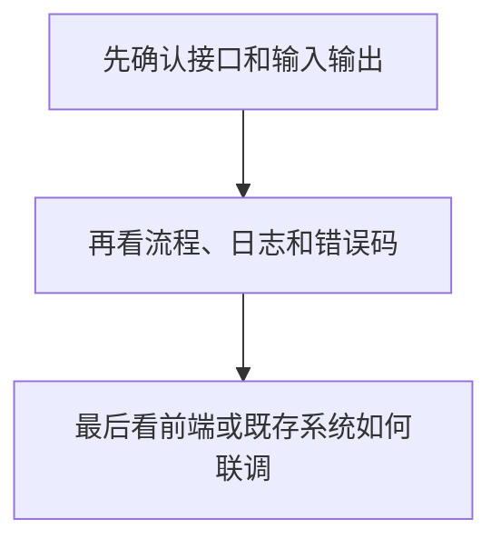

# AI Learn 核心概念图（Concept Map）

这个文档用于记录学习过程中容易混淆的概念关系、流程关系和企业项目理解，不作为正式术语表。

正式术语表仍然是：

[术语速查表.md](../../术语速查表.md)

## 1. Python -> FastAPI -> OpenAPI -> Swagger / ReDoc

| 概念 | 作用 | 容易混淆点 | 一句话总结 |
|---|---|---|---|
| Python 代码 | 编写后端接口和业务逻辑的基础 | 它本身不是文档系统 | 先有 Python 代码，后面才有 FastAPI 的接口定义。 |
| FastAPI | 把 Python 代码变成可调用 API | 它不是 Swagger 本身 | FastAPI 会读取路由和模型，自动生成 OpenAPI。 |
| OpenAPI JSON | 接口标准描述文件 | 它不是网页 | OpenAPI JSON 是接口合同的机器可读形式。 |
| Swagger UI | API 调试与验证界面 | 它不是正式 UI | Swagger 主要用于调试、验证和联调。 |
| ReDoc | API 阅读界面 | 它不是测试工具 | ReDoc 适合阅读接口说明和结构。 |

一句话总结：

> Python 代码通过 FastAPI 生成 OpenAPI JSON，再由 Swagger UI 和 ReDoc 展示成可读、可验证的接口文档。

## 2. RAG 学习路径

| 概念 | 作用 | 容易混淆点 | 一句话总结 |
|---|---|---|---|
| 文档 / 资料 | 提供原始知识来源 | 它不是最终答案 | RAG 的起点永远是可追溯的资料。 |
| Chunk 切分 | 把长文档拆成小块 | 它不是检索本身 | 切分粒度会影响检索质量。 |
| Retriever | 找到相关证据 | 它不是直接回答模块 | Retriever 负责找证据，不负责编答案。 |
| Citation | 标明证据来源 | 它不是装饰字段 | Citation 让答案可解释、可追踪。 |
| 回答生成 | 基于证据组织答案 | 它不是凭空创作 | 回答必须尽量和证据保持一致。 |

一句话总结：

> RAG 的核心不是“让模型会说”，而是“让答案有证据、有来源、可回溯”。

## 3. 企业学习提示

| 顺序 | 学习重点 | 为什么这样看 |
|---|---|---|
| 1 | 接口和输入输出 | 先确认系统边界和合同。 |
| 2 | 流程、日志、错误码 | 再确认问题如何定位和排查。 |
| 3 | 前端或既存系统联调 | 最后看真实使用场景如何串起来。 |

一句话总结：

> 企业项目学习先看边界，再看流程，最后看联调，这样最容易把概念和实现对应起来。
