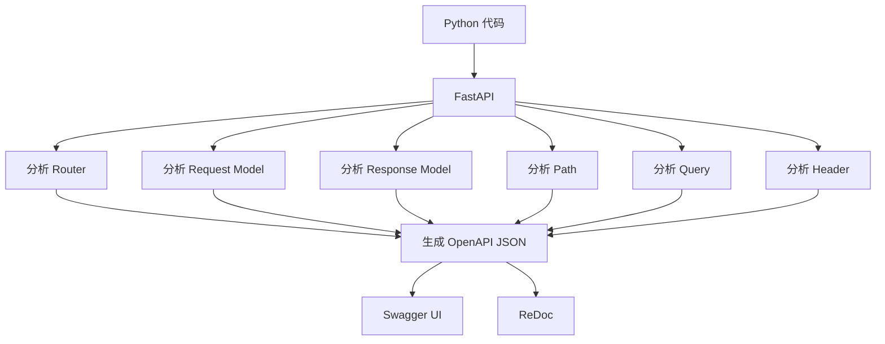
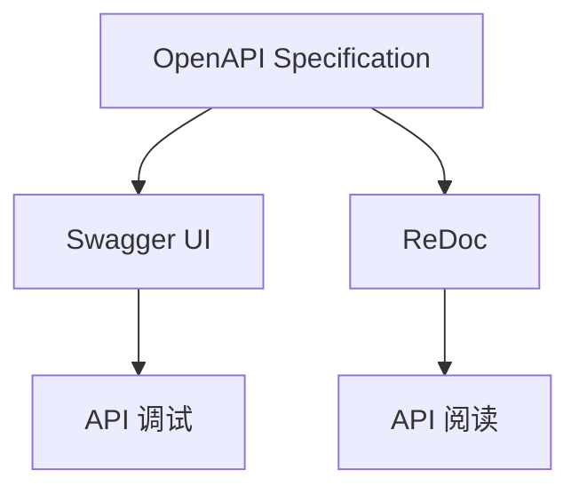
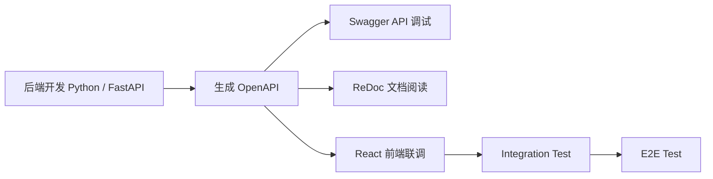
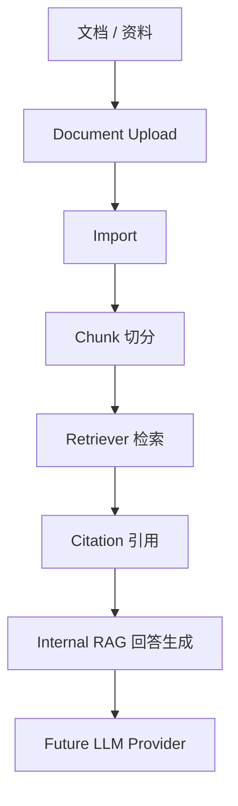
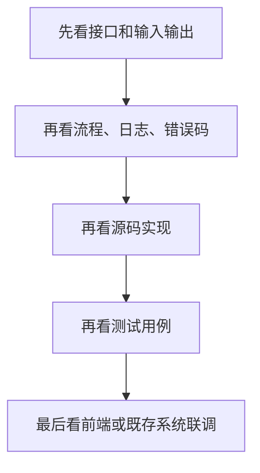

# Retail Insight AI 学习笔记全集（V1.0）

> **历史学习笔记（保留不删除）**  
> 当前正式项目名：**Enterprise Retail Intelligence Platform（ERIP）V1.0**。  
> 面试与现状以 `docs/ai-agent-retail-handbook-v3/` 权威面试材料 + 主 README 为准。  
> 基线：PG 297/6 · IM 286/62 · FE 116 · head `20260717_08_ai_runtime` · 默认 stub。

本文件为 memo 目录学习资料的**整合入口**，原始文档无需删除，仅保留作为历史版本。


## 推荐的新目录

```
docs/learning/notebook/
├── Retail_Insight_AI_学习笔记全集_V1.0.md   （主手册）
├── archive/
│   └── 保存所有原 memo 文档
```

---


# 来源：memo.md

# AI Learn Concept Map（企业 AI 后端学习地图）

> **文档定位**

本系列文档用于建立企业 AI 后端项目的知识体系。

它不是：

- 术语手册
- API 文档
- 源码说明

而是：

> 建立知识之间联系（Concept Map）。

正式术语统一维护在：

```
ai-lab/术语速查表.md
```

---

# 为什么要写 Concept Map？

很多知识点单独看都懂：

- HTTP
- FastAPI
- Swagger
- RAG
- Workflow
- Repository

但是不知道：

它们之间是什么关系？

企业为什么这么设计？

Concept Map 就是回答：

> 为什么？

---

# 学习目标

本系列主要帮助建立：

- 企业 AI 后端整体认识
- 企业项目开发流程
- 系统架构理解
- 源码阅读能力
- 日本企业面试表达能力

---

# 学习路线

建议严格按照下面顺序。

```
Python
    ↓
FastAPI
    ↓
HTTP
    ↓
OpenAPI
    ↓
Swagger
    ↓
Router
    ↓
Service
    ↓
Repository
    ↓
Database
    ↓
Document
    ↓
RAG
    ↓
Workflow
    ↓
Approval
    ↓
RBAC
    ↓
Audit
    ↓
Enterprise AI Backend
```

---

# Concept Map 目录

|编号|主题|状态|
|------|--------------------------|------|
|01|Python → FastAPI → OpenAPI → Swagger → ReDoc|✅|
|02|HTTP（GET / POST / PUT / DELETE）|计划|
|03|FastAPI 生命周期|计划|
|04|Router → Service → Repository|计划|
|05|Request / Response / Schema|计划|
|06|Document System|计划|
|07|RAG 全流程|计划|
|08|Workflow 与 Agent|计划|
|09|Approval Workflow|计划|
|10|RBAC 与 Audit|计划|
|11|Repository Pattern|计划|
|12|Provider Pattern|计划|
|13|Enterprise AI Backend Architecture|计划|
|14|企业测试体系|计划|
|15|前后端联调|计划|
|16|企业部署流程|计划|

---

# 与其它文档的关系

|文档|作用|
|------|----------------------------|
|Concept Map|理解为什么这样设计|
|术语速查表|理解术语是什么意思|
|LEARNING_API_WALKTHROUGH|学习接口|
|TEST_CASES|学习测试|
|CODE_STUDY_GUIDE|学习源码|

---

# 学习建议

每学习一个模块：

① 阅读 memo

↓

② Swagger 实际调用

↓

③ 阅读源码

↓

④ 看测试

↓

⑤ 自己总结

---

# 最终目标

最终形成属于自己的：

> Enterprise AI Backend Notebook

以后：

- 日本面试
- 阅读源码
- 工作开发

全部使用这一套知识体系。


# 来源：memo-01.md

# AI Learn Concept Map 01：OpenAPI / Swagger / ReDoc

> 本章用于理解企业 AI 后端项目中：
>
> Python、FastAPI、OpenAPI、Swagger、ReDoc 的关系。
>
> 正式术语请查看：`ai-lab/术语速查表.md`

---

## 目录

1. Python → FastAPI → OpenAPI → Swagger / ReDoc
2. 企业为什么说 OpenAPI，而不是 Swagger
3. 企业 API 开发流程
4. 企业测试体系
5. RAG 学习路径
6. 企业学习方法
7. 本章总结

---

## 1. Python → FastAPI → OpenAPI → Swagger / ReDoc

### 1.1 真正的数据流



### 1.2 每一步在做什么

| 阶段 | 作用 | 学习重点 |
|---|---|---|
| Python 代码 | 编写后端接口和业务逻辑 | 真正开发的是 Python 代码，不是 Swagger |
| FastAPI | 读取并分析 Python 代码 | 自动识别 Router、Path、Query、Header、Request Model、Response Model |
| OpenAPI JSON | 生成接口标准规范 | 企业真正维护的是 OpenAPI 规范 |
| Swagger UI | API 调试与验证工具 | 用于 Try it out、Execute、联调接口 |
| ReDoc | API 阅读文档工具 | 适合阅读接口结构和字段说明 |

### 1.3 一句话记忆

> Python 代码通过 FastAPI 生成 OpenAPI JSON，再由 Swagger UI 和 ReDoc 展示成可读、可验证的接口文档。

### 1.4 日本語補足

OpenAPI は API 仕様です。
Swagger UI と ReDoc は OpenAPI の表示ツールです。

### 1.5 一句话总结

Python 代码通过 FastAPI 生成 OpenAPI JSON，再由 Swagger UI 和 ReDoc 展示成可读、可验证的接口文档。

---

## 2. 企业为什么说 OpenAPI，而不是 Swagger

### 2.1 概念关系



### 2.2 企业怎么理解

| 名称 | 角色 | 企业说法 |
|---|---|---|
| OpenAPI | 接口契约 / 标准规范 | 我们提供 OpenAPI |
| Swagger UI | OpenAPI 的调试 Viewer | 我们使用 Swagger 调试 API |
| ReDoc | OpenAPI 的阅读 Viewer | 我们使用 ReDoc 阅读 API 文档 |

### 2.3 重点理解

Swagger 不是接口本身。

Swagger 只是：

> OpenAPI 的一个展示工具。

真正重要的是：

```text
OpenAPI JSON
```

企业真正维护的是：

- Router
- Request Model
- Response Model
- OpenAPI Contract

不是手写 Swagger 页面。

### 2.4 企业项目必须记住

- Swagger 不是正式 UI。
- Swagger 不是测试环境。
- Swagger 是 API 调试与验证工具。
- React UI 和 Swagger 调用的是同一套 FastAPI API。
- UI 完成以后，Swagger 通常仍然长期保留。

### 2.5 日本語補足

Swagger は本番 UI ではありません。
API の検証画面です。
企業では OpenAPI 仕様を提供します。

---

## 3. 企业 API 开发流程

### 3.1 开发流程



### 3.2 每一步做什么

| 阶段 | 做什么 | 工具 |
|---|---|---|
| 后端开发 | 编写 Router、Service、Schema | Python / FastAPI |
| 接口规范 | 自动生成接口定义 | OpenAPI JSON |
| 接口验证 | 手动执行 API | Swagger UI |
| 文档阅读 | 阅读 API 结构 | ReDoc |
| 前端联调 | React 调用同一套 API | React + FastAPI |
| 集成测试 | 验证前后端业务流程 | Integration Test |
| 端到端测试 | 模拟真实用户操作 | E2E Test |

---

## 4. 企业测试体系

### 4.1 四层验证关系

```text
                E2E Test
                    ▲
            Integration Test
                    ▲
        Swagger API Verification
                    ▲
              Unit Test
```

### 4.2 四层验证说明

| 层级 | 工具 | 目的 |
|---|---|---|
| Unit Test | pytest / unittest | 验证模块、类、函数逻辑 |
| API Verification | Swagger UI | 手动验证接口请求、响应和业务流程 |
| Integration Test | React + FastAPI | 验证前后端联调流程 |
| E2E Test | Playwright / Cypress | 模拟真实用户完成完整业务流程 |

### 4.3 UI 完成后 Swagger 是否删除？

不会。

企业项目通常会长期保留 Swagger，因为它可以用于：

- 后端开发调试
- 前端联调
- QA 验证
- 第三方系统对接
- 新成员学习 API
- 排查接口问题

---

## 5. RAG 学习路径

### 5.1 RAG 主流程



### 5.2 各模块作用

| 阶段 | 含义 | 本项目对应功能 | 学习重点 |
|---|---|---|---|
| 文档 / 资料 | 原始知识来源 | Document Upload | RAG 的起点是资料，不是模型 |
| Import | 导入并验证文档 | Document Import | 先保证文档状态正确 |
| Chunk | 切分文档 | Document Chunk | Chunk 是检索基本单位 |
| Retrieval | 检索相关证据 | Document Retrieval | Retriever 找证据，不直接生成答案 |
| Citation | 标记答案依据 | Internal RAG citation | 企业 RAG 必须可追溯 |
| Answer | 生成回答 | Internal RAG | 当前先用确定性回答 |
| LLM Provider | 未来模型接入 | OpenRouter / Gemini / Qwen | 后续通过 Provider 扩展 |

### 5.3 一句话总结

> RAG 的核心不是“让模型会说”，而是让答案有证据、有来源、可回溯。

---

## 6. 企业学习方法

### 6.1 推荐学习顺序



### 6.2 为什么这样学习

| 顺序 | 学习重点 | 原因 |
|---|---|---|
| 1 | 接口和输入输出 | 先确认系统边界和 API Contract |
| 2 | 流程、日志、错误码 | 再理解问题如何定位和排查 |
| 3 | 源码实现 | 理解 Router、Service、Repository 如何协作 |
| 4 | 测试用例 | 确认哪些行为被保护 |
| 5 | 前端或既存系统联调 | 最后理解真实业务使用场景 |

### 6.3 一句话总结

> 企业项目学习先看边界，再看流程，再看源码，最后看测试和联调。

---

## 7. 本章总结（★★★★★）

请永远记住：

1. Python 才是真正开发的代码。
2. FastAPI 自动分析 Python 代码。
3. OpenAPI 是接口规范。
4. Swagger 是 API 调试工具。
5. ReDoc 是 API 阅读工具。
6. 企业真正维护的是 OpenAPI，而不是 Swagger。
7. Swagger 不是正式 UI，也不是测试环境。
8. React UI 和 Swagger 调用的是同一套 FastAPI API。
9. UI 完成以后，Swagger 通常仍然长期保留。
10. RAG 的重点是证据、引用和可追溯性。

---

## 学习完成标准

完成本章后，你应该能够回答：

- Swagger 是什么？
- OpenAPI 是什么？
- Swagger 和 OpenAPI 有什么区别？
- ReDoc 是什么？
- 为什么企业说 OpenAPI，而不是 Swagger？
- UI 完成以后 Swagger 是否还保留？
- FastAPI 为什么能自动生成 Swagger？
- RAG 为什么需要 Chunk、Retriever 和 Citation？

如果这些问题都能回答，说明本章已经掌握。


# 来源：FastAPI_学习补充笔记_整理版.md

# FastAPI 学习补充笔记（整理版）

> 根据零散学习笔记重新整理，作为阅读 **LEARNING_API_WALKTHROUGH.md**
> 前的预备知识。

## 1. 推荐学习顺序

1.  `backend/app/main.py` ------ 理解项目启动、Middleware、Router 注册。
2.  `backend/app/api/health.py` ------ 学习最简单的 API。
3.  `backend/app/schemas/health.py` ------ 理解 Response Schema。
4.  回到 `main.py` 理解 `include_router()`。
5.  再学习 `tasks.py`、`services/`、`repositories/`。

------------------------------------------------------------------------

## 2. Router、Service、Repository 三层关系

``` text
tasks.py
    ↓
task_service.py
    ↓
task_repository.py
```

职责：

``` text
Router（接口层）
    ↓
Service（业务层）
    ↓
Repository（数据访问层）
```

-   Router：处理 HTTP 请求
-   Service：处理业务逻辑
-   Repository：访问数据库/文件

------------------------------------------------------------------------

## 3. 一句话理解 FastAPI

``` text
浏览器
    ↓
Router（接收请求）
    ↓
Service（业务处理）
    ↓
Repository（获取数据）
    ↓
Schema（定义返回数据）
    ↓
JSON
    ↓
浏览器
```

> **Schema 不是业务层，而是数据契约（Data Contract）。**

------------------------------------------------------------------------

## 4. api 与 schemas 的职责

``` text
backend/app/

api/
    health.py
    tasks.py

schemas/
    health.py
    task.py
    document.py
```

-   api/：处理 HTTP 请求（Router）
-   schemas/：定义请求与响应的数据结构

记住：

-   Router：处理请求
-   Service：处理业务
-   Repository：访问数据
-   Schema：定义数据结构

------------------------------------------------------------------------

## 5. GET /health 调用过程

``` text
health()
    ↓
HealthResponse
    ↓
return response
```

Learning Trace：

``` text
Swagger / 浏览器
    ↓
main.py（Middleware）
    ↓
health.py
    ↓
health()
    ↓
创建 HealthResponse(...)
    ↓
return response
    ↓
HTTP 200
```

------------------------------------------------------------------------

## 6. 学习建议

每学习一个接口建议：

1.  Swagger 调用接口
2.  阅读 Console Log（Learning Trace）
3.  对照 LEARNING_API_WALKTHROUGH.md
4.  阅读源码（Router → Service → Repository → Schema）

------------------------------------------------------------------------

推荐配合：

-   LEARNING_API_WALKTHROUGH.md
-   FastAPI_项目启动过程_学习笔记.md
-   FastAPI_从启动到一次HTTP请求的完整生命周期.md
-   Retail_Insight_AI_源码阅读路线图_Code_Reading_Roadmap.md


# 来源：FastAPI_项目启动过程_学习笔记.md

# FastAPI 项目启动过程（Retail Insight AI）

## 启动命令

``` bash
cd backend

uvicorn app.main:app --host 127.0.0.1 --port 8000
```

------------------------------------------------------------------------

## 启动过程（项目真实流程）

``` text
执行：

uvicorn app.main:app

        │
        ▼

启动 Uvicorn（Web Server）

        │
        ▼

读取：

backend/app/main.py

        │
        ▼

找到：

app = FastAPI(...)

        │
        ▼

执行：

create_app()

        │
        ▼

注册所有 Router
(include_router)

        │
        ▼

启动 HTTP Server

        │
        ▼

监听：

127.0.0.1:8000

        │
        ▼

等待浏览器请求

        │
        ▼

浏览器访问：

http://127.0.0.1:8000/docs

        │
        ▼

Swagger UI

        │
        ▼

点击 Execute

        │
        ▼

进入 Router

        │
        ▼

Service

        │
        ▼

Repository

        │
        ▼

HTTP Response
```

------------------------------------------------------------------------

## 为什么 Learning Trace 要从 main.py 开始？

真正的入口并不是 `health()` 或 `create_task()`。

程序首先由 **Uvicorn** 启动，然后加载 `backend/app/main.py`， 创建
`FastAPI` 实例，注册所有 Router，最后才会进入具体接口。

因此学习源码时，建议按照下面的顺序阅读：

``` text
Uvicorn
    ↓
backend/app/main.py
    ↓
create_app()
    ↓
include_router()
    ↓
api/health.py 或 api/tasks.py
    ↓
Service
    ↓
Repository
    ↓
Response
```

------------------------------------------------------------------------

## Java 对照理解

  Java                    FastAPI
  ----------------------- --------------------
  Tomcat                  Uvicorn
  SpringBootApplication   main.py
  DispatcherServlet       FastAPI Router
  Controller              api/\*.py
  Service                 services/\*.py
  Repository              repositories/\*.py

> 可以把 **Uvicorn** 理解为 Python 世界中负责运行 FastAPI 应用的 Web
> Server。


# 来源：FastAPI_从启动到一次HTTP请求的完整生命周期.md

# FastAPI 从启动到一次 HTTP 请求的完整生命周期

> 适用项目：Retail Insight AI / ERIP\
> 学习目标：理解 **Uvicorn → FastAPI → Router → Service → Repository →
> Response** 的完整生命周期。

------------------------------------------------------------------------

# 一、整体生命周期

``` text
启动命令

uvicorn app.main:app

        │
        ▼
┌────────────────────────────┐
│ Uvicorn Web Server         │
└────────────────────────────┘
        │
        ▼
读取 backend/app/main.py
        │
        ▼
create_app()
        │
        ▼
创建 FastAPI()
        │
        ▼
注册 Middleware
        │
        ▼
注册 Router
(include_router)
        │
        ▼
HTTP Server 开始监听
127.0.0.1:8000
        │
        ▼
等待 HTTP Request
```

------------------------------------------------------------------------

# 二、浏览器发起一次请求

例如：

``` http
GET /health
```

生命周期：

``` text
浏览器
    │
    ▼
HTTP Request
    │
    ▼
Uvicorn
    │
    ▼
FastAPI
    │
    ▼
Middleware
(request_context 等)
    │
    ▼
Router
(@router.get)
    │
    ▼
Controller(API)
health()
    │
    ▼
Schema
HealthResponse
    │
    ▼
JSON
    │
    ▼
HTTP Response
    │
    ▼
浏览器
```

------------------------------------------------------------------------

# 三、POST /api/tasks 生命周期

## Request（同步执行）

``` text
浏览器

↓

POST /api/tasks

↓

Uvicorn

↓

FastAPI

↓

Middleware

↓

Router

↓

create_task()

↓

TaskService.create_task()

↓

Repository.create()

↓

BackgroundTasks.add_task()

↓

HTTP 202 + task_id

↓

浏览器收到响应
```

> 到这里 **HTTP 请求已经结束**。

------------------------------------------------------------------------

## Background（异步执行）

``` text
BackgroundTasks

↓

Repository.save()

↓

AnalysisWorkflow.stream()

↓

Route

↓

KPI

↓

Research

↓

Report

↓

Repository.save()

↓

EventPublisher.publish()

↓

任务完成
```

> 浏览器不会等待这一阶段执行结束。

------------------------------------------------------------------------

# 四、为什么 Request 与 Background 要分开？

  Request（同步）       Background（异步）
  --------------------- --------------------
  浏览器等待响应        浏览器已收到响应
  必须尽快结束          可以耗时执行
  返回 HTTP 200 / 202   不返回 HTTP
  创建任务              真正完成分析

------------------------------------------------------------------------

# 五、源码阅读顺序（推荐）

``` text
1. backend/app/main.py
        │
        ▼
2. create_app()
        │
        ▼
3. include_router()
        │
        ▼
4. backend/app/api/
        │
        ▼
5. backend/app/services/
        │
        ▼
6. backend/app/repositories/
        │
        ▼
7. backend/app/workflow/
        │
        ▼
8. backend/app/schemas/
```

------------------------------------------------------------------------

# 六、Java 对照理解

  Java（Spring Boot）      FastAPI
  ------------------------ ---------------------------------
  Tomcat                   Uvicorn
  @SpringBootApplication   main.py
  DispatcherServlet        FastAPI Router
  Controller               api/\*.py
  Service                  services/\*.py
  Repository               repositories/\*.py
  ResponseEntity           Pydantic Schema + JSON Response

------------------------------------------------------------------------

# 七、学习建议

建议按下面顺序学习源码：

1.  Uvicorn 如何启动应用
2.  main.py 如何创建 FastAPI
3.  create_app() 注册哪些内容
4.  Router 如何接收 HTTP 请求
5.  Service 如何处理业务
6.  Repository 如何保存数据
7.  Workflow 如何执行后台任务
8.  Schema 如何返回 JSON

完成这八步后，就能理解一次 HTTP 请求在 FastAPI 中的完整生命周期。


# 来源：Retail_Insight_AI_源码阅读路线图_Code_Reading_Roadmap.md

# Retail Insight AI 源码阅读路线图（Code Reading Roadmap）

> **项目：Retail Insight AI / ERIP**
>
> **目标：**
> 从"项目如何启动"到"一次请求如何完成"，建立完整源码阅读路线。

------------------------------------------------------------------------

# 总体阅读路线

``` text
环境准备
    │
    ▼
backend/
    │
    ▼
Uvicorn
    │
    ▼
backend/app/main.py
    │
    ▼
create_app()
    │
    ▼
FastAPI()
    │
    ▼
Middleware
    │
    ▼
Router
    │
    ▼
API
    │
    ▼
Service
    │
    ▼
Repository
    │
    ▼
BackgroundTasks
    │
    ▼
Workflow
    │
    ▼
KPI
    │
    ▼
Research
    │
    ▼
Report
    │
    ▼
Repository.save()
    │
    ▼
SSE / Events
    │
    ▼
Swagger / Frontend
```

------------------------------------------------------------------------

# 第一阶段：项目启动

阅读顺序：

``` text
backend/
    │
    ▼
app/main.py
    │
    ▼
create_app()
```

重点：

-   FastAPI 如何创建
-   Router 如何注册
-   Middleware 如何注册
-   生命周期事件（Startup / Shutdown）

------------------------------------------------------------------------

# 第二阶段：HTTP 请求入口

建议阅读：

``` text
backend/app/api/
```

阅读顺序：

``` text
health.py
    │
    ▼
tasks.py
    │
    ▼
upload.py
```

重点：

-   APIRouter
-   @router.get()
-   @router.post()
-   Request 如何进入 API

------------------------------------------------------------------------

# 第三阶段：业务层（Service）

目录：

``` text
backend/app/services/
```

学习：

``` text
API

↓

TaskService

↓

业务逻辑
```

重点：

-   Service 不处理 HTTP
-   Service 专注业务规则

------------------------------------------------------------------------

# 第四阶段：Repository

目录：

``` text
backend/app/repositories/
```

学习：

``` text
Service

↓

Repository.create()

↓

Repository.save()

↓

Repository.find()
```

重点：

-   数据存取
-   Repository Pattern

------------------------------------------------------------------------

# 第五阶段：BackgroundTasks

重点：

``` text
Request

↓

BackgroundTasks.add_task()

↓

HTTP 202

↓

Background 开始
```

理解：

-   为什么 HTTP 很快返回
-   为什么 Workflow 在后台运行

------------------------------------------------------------------------

# 第六阶段：Workflow

目录：

``` text
backend/app/workflow/
```

建议阅读：

``` text
graph.py

↓

AnalysisWorkflow.stream()

↓

Route()

↓

各节点
```

重点：

-   LangGraph
-   Workflow
-   Route

------------------------------------------------------------------------

# 第七阶段：AI Agent

学习顺序：

``` text
Route

↓

KPI

↓

Research

↓

Report
```

理解：

-   KPI 如何生成
-   Research 如何检索
-   Report 如何组合最终结果

------------------------------------------------------------------------

# 第八阶段：Repository 回写

Workflow 完成：

``` text
Report

↓

Repository.save()

↓

EventPublisher.publish()
```

重点：

-   状态更新
-   数据持久化
-   事件通知

------------------------------------------------------------------------

# 第九阶段：SSE

学习：

``` text
GET /api/tasks/{task_id}/events

↓

Repository

↓

Event

↓

Stream

↓

Browser
```

理解：

-   为什么页面能实时刷新
-   Event 如何推送

------------------------------------------------------------------------

# 第十阶段：Swagger 验证

建议验证顺序：

1.  GET /health
2.  POST /api/tasks
3.  GET /api/tasks/{task_id}
4.  GET /api/tasks/{task_id}/events

每完成一个接口：

-   阅读 Console Log
-   对照 Learning Walkthrough
-   阅读对应源码
-   理解执行阶段（Execution Flow）

------------------------------------------------------------------------

# 推荐源码阅读顺序

``` text
01 main.py
        │
        ▼
02 api/
        │
        ▼
03 services/
        │
        ▼
04 repositories/
        │
        ▼
05 workflow/
        │
        ▼
06 agents/
        │
        ▼
07 reports/
        │
        ▼
08 events/
        │
        ▼
09 schemas/
```

------------------------------------------------------------------------

# 学习建议

建议采用固定四步法：

``` text
① Swagger 测试接口
        │
        ▼
② 阅读 Console Log（Learning Trace）
        │
        ▼
③ 对照 LEARNING_API_WALKTHROUGH.md
        │
        ▼
④ 阅读对应源码
```

完成上述流程后，再进入下一个接口。

------------------------------------------------------------------------

# 最终目标

完成本路线图后，应能够回答：

-   Uvicorn 如何启动 FastAPI？
-   main.py 为什么是项目入口？
-   Router 如何找到 API？
-   Service 与 Repository 如何分工？
-   为什么 POST /api/tasks 分为 Request 与 Background？
-   Workflow 如何驱动 KPI、Research、Report？
-   SSE 如何实时返回执行进度？
-   一次 HTTP 请求如何完成整个生命周期？


# 来源：LangGraph_学习笔记_Retail_Insight_AI.md

# LangGraph 学习笔记（Retail Insight AI）

## 什么是 LangGraph？

> LangGraph 是一个用于构建 AI Workflow（工作流）的框架。

它可以把复杂的 AI
分析流程拆分成多个步骤（Node），通过执行路径（Edge）连接，并共享同一份状态（State）。

------------------------------------------------------------------------

## 四个核心概念

### 1. State（状态）

整个 Workflow 共享的数据。

``` text
State
├── question
├── mode
├── task_id
├── route
├── kpi_result
├── research_result
└── report
```

所有 Node 都可以读取和修改 State。

------------------------------------------------------------------------

### 2. Node（节点）

Node 是一个具体的业务步骤。

本项目中的 Node：

``` text
Route
↓
KPI
↓
Research
↓
Report
```

-   Route：决定分析路线
-   KPI：执行 KPI 分析
-   Research：调用 AI 检索
-   Report：生成最终报告

------------------------------------------------------------------------

### 3. Edge（边）

Edge 是连接两个 Node 的执行路径。

``` text
Route
  │
  ▼
KPI
```

箭头就是 Edge。

------------------------------------------------------------------------

### 4. Conditional Routing（条件路由）

根据条件决定下一步执行哪个 Node。

``` text
          Route
             │
     ┌───────┴────────┐
     │                │
mode=fixed      mode=research
     │                │
     ▼                ▼
   KPI          Research
```

------------------------------------------------------------------------

## Retail Insight AI 对应关系

  LangGraph             项目对应
  --------------------- --------------------------------------------
  State                 question、mode、task_id、report 等共享数据
  Node                  Route、KPI、Research、Report
  Edge                  Route → KPI → Research → Report
  Conditional Routing   根据 mode、provider、route 决定执行路径

------------------------------------------------------------------------

## AnalysisWorkflow.stream()

真正启动整个 Workflow。

``` text
AnalysisWorkflow.stream()

    │
    ├── 创建 State
    ├── 注册 Node
    ├── 定义 Edge
    ├── 配置条件路由
    └── graph.stream(state)
```

------------------------------------------------------------------------

## 项目真实执行流程

``` text
POST /api/tasks
        │
        ▼
TaskService.run_task()
        │
        ▼
AnalysisWorkflow.stream()
        │
        ▼
State
        │
        ▼
Route
        │
        ▼
KPI
        │
        ▼
Research
        │
        ▼
Report
        │
        ▼
Repository.save()
```

------------------------------------------------------------------------

## 高速公路类比

-   State：货车（共享数据）
-   Node：收费站（执行步骤）
-   Edge：高速公路（连接节点）
-   Conditional Routing：高速分岔口（根据条件选择路线）

------------------------------------------------------------------------

## 面试回答

> LangGraph 是一个 AI Workflow 编排框架。它将复杂分析流程拆分为多个
> Node，通过 Edge 定义执行顺序，共享数据保存在 State 中，并利用
> Conditional Routing 根据不同条件动态选择执行路径，因此非常适合构建
> Agent 和复杂 AI 工作流。


# 来源：Retail_Insight_AI_全栈源码学习手册_Volume01.md

# Retail Insight AI 全栈源码学习手册（Volume 01）

> **Project:** Retail Insight AI / ERIP\
> **Audience:** FastAPI 初学者、Python 开发者、日本 Agent 项目面试准备

------------------------------------------------------------------------

# 目录

1.  项目整体架构
2.  开发环境
3.  项目启动流程
4.  FastAPI 生命周期
5.  第一次 HTTP 请求
6.  Learning Trace 与 Execution Flow
7.  源码阅读路线图
8.  核心目录说明
9.  BackgroundTasks 与 Workflow
10. Agent 执行流程
11. SSE 实时事件
12. 学习顺序建议

------------------------------------------------------------------------

# 第1章 项目整体架构

``` text
Browser / Swagger
        │
        ▼
Uvicorn
        │
        ▼
FastAPI
        │
        ▼
Middleware
        │
        ▼
Router(API)
        │
        ▼
Service
        │
        ▼
Repository
        │
        ▼
BackgroundTasks
        │
        ▼
Workflow
        │
        ▼
KPI → Research → Report
        │
        ▼
Repository.save()
        │
        ▼
SSE / Events
```

------------------------------------------------------------------------

# 第2章 开发环境

启动：

``` bash
cd backend
uvicorn app.main:app --host 127.0.0.1 --port 8000
```

Swagger：

``` text
http://127.0.0.1:8000/docs
```

------------------------------------------------------------------------

# 第3章 项目启动流程

``` text
uvicorn
    ↓
backend/app/main.py
    ↓
create_app()
    ↓
FastAPI()
    ↓
注册 Middleware
    ↓
注册 Router
    ↓
监听 127.0.0.1:8000
```

重点学习：

-   create_app()
-   include_router()
-   Middleware 注册

------------------------------------------------------------------------

# 第4章 FastAPI 生命周期

``` text
Application Startup
        ↓
等待 HTTP 请求
        ↓
处理 Request
        ↓
返回 Response
        ↓
Application Shutdown
```

理解：

-   Startup
-   Request
-   Background
-   Shutdown

------------------------------------------------------------------------

# 第5章 一次 HTTP 请求

GET /health：

``` text
Browser
    ↓
Uvicorn
    ↓
Router
    ↓
health()
    ↓
HealthResponse
    ↓
JSON
    ↓
HTTP 200
```

POST /api/tasks：

``` text
Request
    ↓
BackgroundTasks.add_task()
    ↓
HTTP 202
──────────────
Background
    ↓
Workflow
    ↓
Report
```

------------------------------------------------------------------------

# 第6章 Learning Trace 与 Execution Flow

学习步骤：

1.  Swagger Execute
2.  Console Log（Learning Trace）
3.  Execution Flow
4.  阅读源码

理解：

-   Request（同步）
-   Background（异步）

------------------------------------------------------------------------

# 第7章 源码阅读路线图

推荐顺序：

``` text
main.py
    ↓
api/
    ↓
services/
    ↓
repositories/
    ↓
workflow/
    ↓
agents/
    ↓
reports/
    ↓
events/
    ↓
schemas/
```

------------------------------------------------------------------------

# 第8章 核心目录说明

  目录               作用
  ------------------ -------------------------------
  app/api            HTTP 接口
  app/services       业务逻辑
  app/repositories   数据访问
  app/workflow       工作流
  app/events         事件发布
  app/schemas        请求/响应模型
  app/core           公共能力（Learning Trace 等）

------------------------------------------------------------------------

# 第9章 BackgroundTasks 与 Workflow

同步阶段：

``` text
Router
 ↓
Service
 ↓
Repository.create()
 ↓
BackgroundTasks.add_task()
 ↓
HTTP 202
```

异步阶段：

``` text
Workflow
 ↓
KPI
 ↓
Research
 ↓
Report
 ↓
Repository.save()
```

------------------------------------------------------------------------

# 第10章 Agent 执行流程

``` text
Route
 ↓
KPI Agent
 ↓
Research Agent
 ↓
Report Generator
```

学习重点：

-   路由决策
-   数据分析
-   报告生成

------------------------------------------------------------------------

# 第11章 SSE 实时事件

``` text
Browser
 ↓
GET /api/tasks/{task_id}/events
 ↓
Repository
 ↓
EventPublisher
 ↓
Server Sent Events
 ↓
实时更新页面
```

------------------------------------------------------------------------

# 第12章 推荐学习顺序

## 第一轮

1.  项目启动
2.  GET /health
3.  POST /api/tasks

## 第二轮

1.  Service
2.  Repository
3.  Workflow

## 第三轮

1.  KPI
2.  Research
3.  Report
4.  SSE

------------------------------------------------------------------------

# 面试复习清单

完成本手册后，应能够解释：

-   Uvicorn 如何启动 FastAPI
-   main.py 为什么是入口
-   Router 如何找到 API
-   Service 与 Repository 如何协作
-   为什么要区分 Request 与 Background
-   Workflow 如何驱动 Agent
-   SSE 如何实时返回任务状态

------------------------------------------------------------------------

**Volume 01 建议配合阅读：**

-   LEARNING_API_WALKTHROUGH.md
-   FastAPI_项目启动过程_学习笔记.md
-   FastAPI_从启动到一次HTTP请求的完整生命周期.md
-   Retail_Insight_AI_源码阅读路线图_Code_Reading_Roadmap.md


# 来源：tempMemo.md


