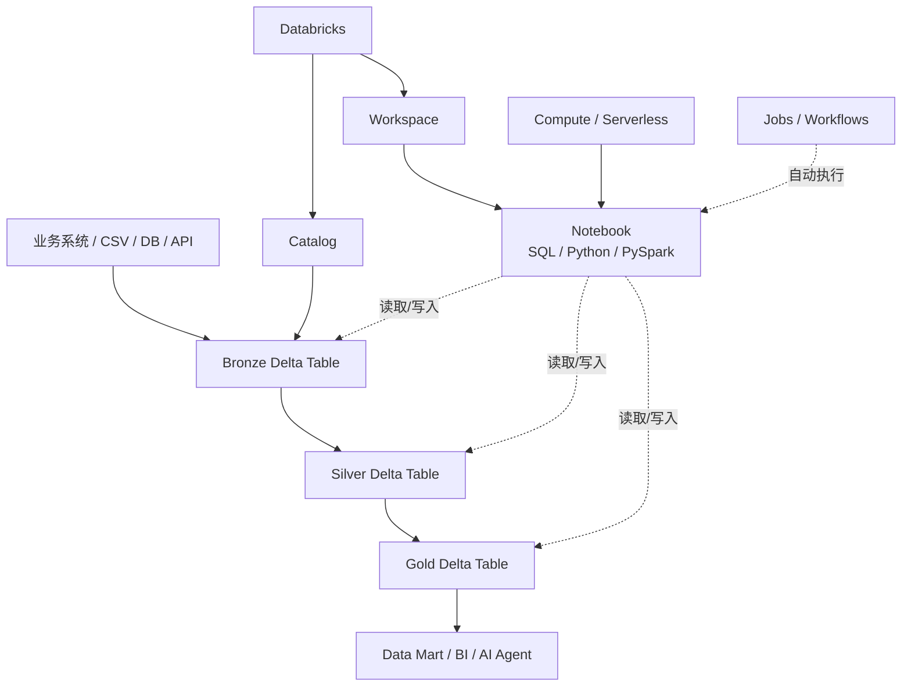
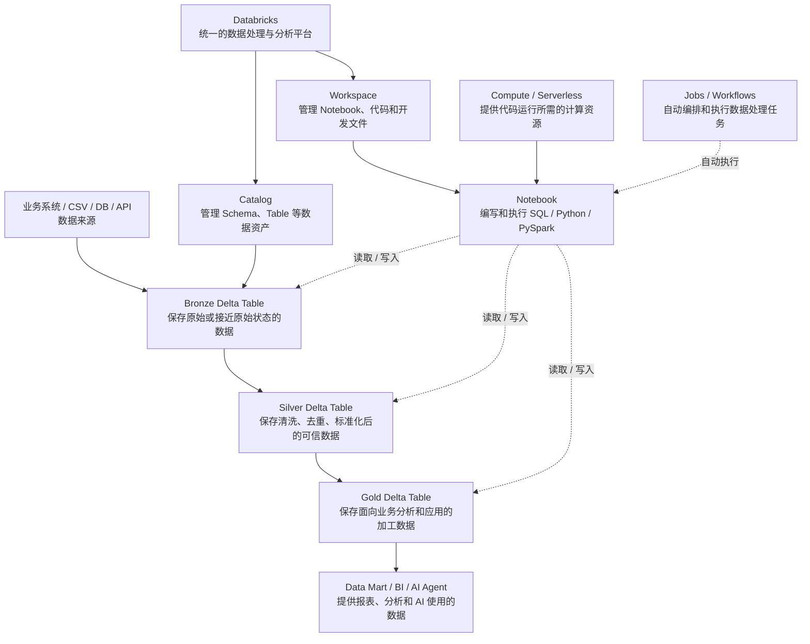
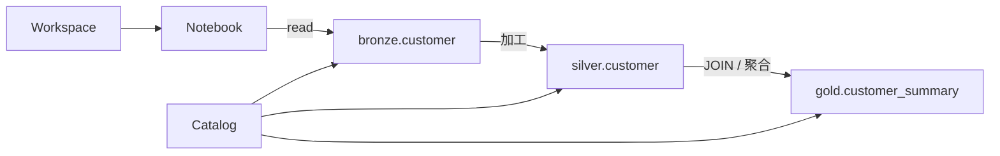
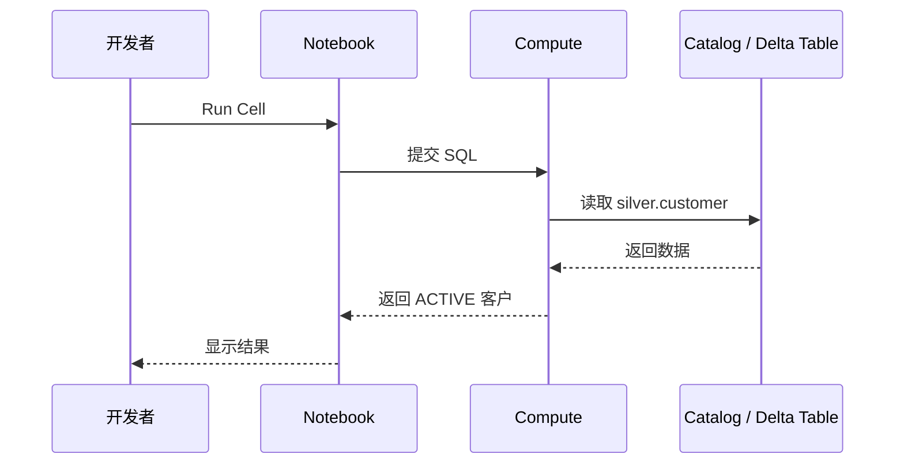

# 01｜Databricks 整体概念与架构

## 1. 先从“它解决什么问题”开始

Databricks 可以把数据工程、SQL 分析和 AI/ML 所需要的数据处理放在统一平台中。

本次参画前学习不要求深入 Spark 内部原理。重点是理解：

```text
数据在哪里？
代码在哪里？
代码怎么执行？
数据怎么从原始状态变成业务可用状态？
```

---

## 2. 整体架构



---


    JOB -. "自动调度执行" .-> NB

## 3. Workspace：代码在哪里

Workspace 可以理解成开发工作区。

典型内容：

```text
Workspace
└── Users
    └── user
        └── databricks_bootcamp_2026
            ├── Notebook
            ├── Python
            ├── SQL
            └── Git 文件
```

类比：

> Workspace ≈ VS Code / IntelliJ 中放开发项目的区域。

它主要回答：

> **“我的代码在哪里？”**

---

## 4. Catalog：数据在哪里

Catalog 用于组织和管理数据资产。

```text
Catalog
  ↓
Schema
  ↓
Table / View
```

例如：

```text
workspace
├── bronze
│   ├── customer
│   └── transaction
├── silver
│   ├── customer
│   └── transaction
└── gold
    └── customer_summary
```

SQL：

```sql
SELECT *
FROM workspace.silver.customer;
```

拆开：

```text
workspace  → Catalog
silver     → Schema
customer   → Table
```

它主要回答：

> **“我的数据在哪里？”**

---

## 5. Workspace 与 Catalog 的关系



最重要的一句话：

> **Workspace 管代码，Catalog 管数据；Notebook 负责读取、加工和写入 Catalog 中的数据。**

---

## 6. Notebook：实际开发的工作台

Notebook 可以混合执行：

```text
SQL
Python
PySpark
Markdown
```

典型工作：

```python
df = spark.read.table("workspace.bronze.customer")
display(df)
```

或：

```sql
SELECT *
FROM workspace.bronze.customer;
```

学习 Notebook 时不要只看代码，要看：

```text
输入 Table
  ↓
Notebook Cell
  ↓
处理
  ↓
结果 / 新 Table
```

---

## 7. Compute / SQL Warehouse

代码本身不会自动执行，需要计算资源。

```text
Notebook / SQL
      ↓
Compute / SQL Warehouse
      ↓
执行
      ↓
返回结果
```

现阶段只需要知道：

- Notebook / PySpark 需要计算资源；
- SQL 查询也需要执行资源；
- Free Edition 中可以使用平台提供的计算能力；
- 暂时不学习 Cluster 深度调优。

---

## 8. Spark / PySpark

```text
Apache Spark
    ↓
大规模分布式数据处理框架

PySpark
    ↓
Python 调用 Spark 的 API
```

例如：

```python
df = spark.read.table("workspace.bronze.customer")

result_df = (
    df
    .filter(df["status"] == "ACTIVE")
    .select("customer_id", "name")
)
```

现在只需要看懂：

```text
读取 customer
 ↓
筛选 ACTIVE
 ↓
只保留 customer_id / name
```

RDD、Shuffle、Catalyst 等暂时不是重点。

---

## 9. Lake / Warehouse / Lakehouse

简化理解：

```text
Data Lake
大量保存各种原始数据
        +
Data Warehouse
SQL / BI / 结构化分析
        ↓
Lakehouse
```

Databricks 的学习重点不是背定义，而是理解：

> 原始数据可以进入平台，经过加工形成可靠的数据表，再直接提供 SQL、BI 和 AI 使用。

---

## 10. 一个完整请求是怎么跑的

假设 Notebook 中执行：

```sql
SELECT *
FROM workspace.silver.customer
WHERE status = 'ACTIVE';
```

流程：



---

## 11. 本章完成标准

你应该可以不看资料回答：

1. Workspace 放什么？
2. Catalog 放什么？
3. `workspace.silver.customer` 三段分别是什么？
4. Notebook 的作用是什么？
5. PySpark 和 Spark 什么关系？
6. Bronze/Silver/Gold 属于代码结构还是数据加工层级？

如果这些能回答，就进入下一章。
