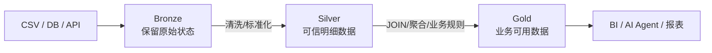
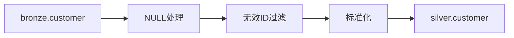
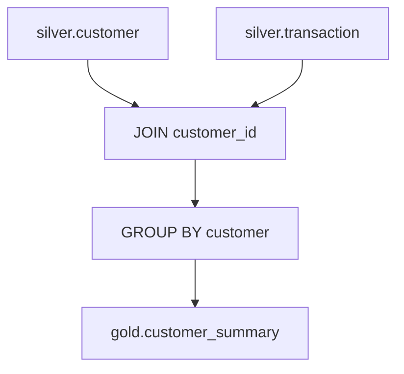
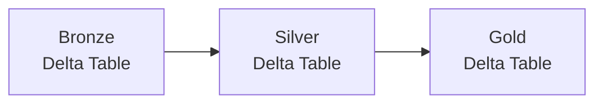

# 02｜Bronze → Silver → Gold 完整实战

## 1. 本章目标

用一个银行客户交易示例贯穿整个数据链：

```text
customer.csv
transaction.csv
       ↓
Bronze
       ↓
Silver
       ↓
Gold
       ↓
Data Mart / AI Agent
```

---

## 2. 为什么需要分层

如果所有加工都直接改原始数据：

```text
原始数据
 ↓
直接修改
 ↓
再修改
 ↓
业务聚合
```

一旦出错，很难确认“原来是什么”。

分层以后：



---

## 3. 示例数据

### customer.csv

```csv
customer_id,name,status,age
C001,Tanaka,ACTIVE,40
C002,Sato,,35
C003,Suzuki,ACTIVE,28
C004,Yamada,INACTIVE,50
```

### transaction.csv

```csv
transaction_id,customer_id,amount
T001,C001,10000
T002,C001,50000
T003,C002,30000
T004,C003,100000
T005,C003,20000
```

---

# 4. Bronze：先保存原始数据

## 是什么？

Bronze 是原始或接近原始状态的数据层。

```text
customer.csv
      ↓
workspace.bronze.customer

transaction.csv
      ↓
workspace.bronze.transaction
```

### 思维重点

Bronze 不是为了“漂亮”。

它的价值是：

```text
来源数据是什么样
        ↓
尽可能保留
        ↓
后续有问题还能追溯
```

### 验证

```sql
SELECT *
FROM workspace.bronze.customer;

SELECT *
FROM workspace.bronze.transaction;
```

执行后应该看到与输入数据接近的内容。

---

# 5. Silver：把数据变得可信、统一

## 是什么？

Silver 对 Bronze 做：

```text
NULL处理
去重
无效数据过滤
类型转换
日期统一
Code / Status 标准化
```

例如：

```sql
CREATE OR REPLACE TABLE workspace.silver.customer AS
SELECT
    customer_id,
    name,
    COALESCE(status, 'UNKNOWN') AS status,
    age
FROM workspace.bronze.customer
WHERE customer_id IS NOT NULL;
```

输入：

```text
C002,Sato,NULL,35
```

输出：

```text
C002,Sato,UNKNOWN,35
```

### 数据流



### 验证

```sql
SELECT *
FROM workspace.silver.customer;
```

比较：

```sql
SELECT COUNT(*) FROM workspace.bronze.customer;
SELECT COUNT(*) FROM workspace.silver.customer;
```

要能解释：

> 为什么行数相同？为什么减少？哪些值被修改？

---

# 6. Gold：变成业务可以直接使用的数据

需求：

> 统计每个客户的交易次数、总金额和平均金额。

数据流：



SQL：

```sql
CREATE OR REPLACE TABLE workspace.gold.customer_summary AS
SELECT
    c.customer_id,
    c.name,
    COUNT(t.transaction_id) AS transaction_count,
    SUM(t.amount) AS total_amount,
    AVG(t.amount) AS avg_amount
FROM workspace.silver.customer c
LEFT JOIN workspace.silver.transaction t
    ON c.customer_id = t.customer_id
GROUP BY
    c.customer_id,
    c.name;
```

### 输入 → 处理 → 输出

```text
Input
silver.customer
silver.transaction

Process
JOIN
GROUP BY
COUNT
SUM
AVG

Output
gold.customer_summary
```

---

# 7. Gold 与 Dimension / Fact

你已经练习过 Dimension / Fact，可以这样放回整体图：

```text
Silver
  │
  ├── customer ─────→ dim_customers
  │
  ├── product  ─────→ dim_products
  │
  └── sales    ─────→ fact_sales
                         │
                         ▼
                     Data Mart
```

简单理解：

### Dimension

回答：

```text
“是谁？”
“是什么？”
“属于什么分类？”
```

例如：

```text
dim_customers
dim_products
```

### Fact

回答：

```text
“发生了什么？”
“多少金额？”
“多少数量？”
“什么时候发生？”
```

例如：

```text
fact_sales
```

不要把 Dimension / Fact 理解成 Databricks 特有功能，它是数据仓库/数据建模中的常见设计思想。

---

# 8. Bronze / Silver / Gold 和 Delta Table 的关系

这是非常容易混淆的地方。

```text
Bronze / Silver / Gold
= 数据加工层级

Delta Table
= 表的存储/管理能力
```

所以可以是：

```text
Bronze Delta Table
Silver Delta Table
Gold Delta Table
```

不是：

```text
Bronze
 ↓
Silver
 ↓
Gold
 ↓
Delta
```

正确图：



---

# 9. 和银行 AI Agent 数据基盘的对应

```text
银行业务系统
      ↓
数据连携
      ↓
Bronze
      ↓
数据整备 / 清洗
      ↓
Silver
      ↓
JOIN / 业务规则 / 聚合
      ↓
Gold / Data Mart
      ↓
AI Agent
```

因此现场说：

> データ整備

通常要想到 Silver 一侧的清洗、标准化、校验等处理。

现场说：

> データマート構築

通常要想到 Gold 一侧面向用途的数据组合和聚合。

---

# 10. 本章完成标准

不看资料画出：

```text
Source
 ↓
Bronze
 ↓
Silver
 ↓
Gold
 ↓
AI / BI
```

并分别说出：

- Bronze 保存什么；
- Silver 做什么；
- Gold 做什么；
- Dimension 和 Fact 大概是什么；
- Delta Table 与 Bronze/Silver/Gold 为什么不是同一层概念。
