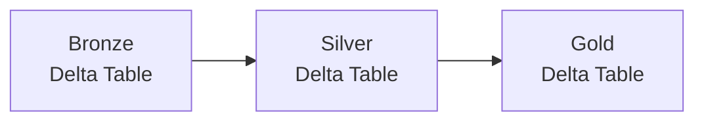
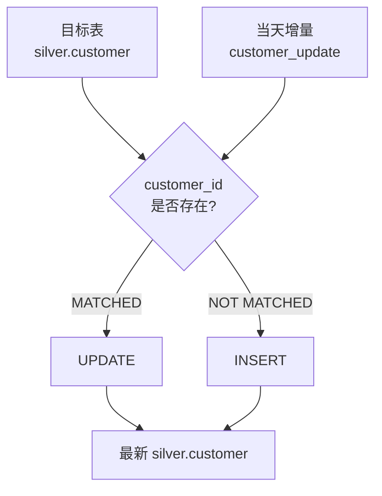

# 03｜Delta Table 与 MERGE 实战【当前重点】

## 1. 先看问题：为什么不能只把数据当 CSV 文件

假设 Silver 已经有客户数据：

```text
C001 Tanaka ACTIVE
C002 Sato   ACTIVE
```

今天又来了：

```text
C001 Tanaka INACTIVE
C003 Suzuki ACTIVE
```

业务需要：

```text
C001 已存在 → 更新
C003 不存在 → 新增
```

这就是增量更新问题。

---

# 2. Delta Table 是什么

现阶段最实用的理解：

> **Delta Table 是 Databricks / Delta Lake 中可以可靠地进行表级数据管理和更新的数据表。**

可以把底层概念简化成：

```text
Delta Table
│
├── 数据文件
│
└── Transaction Log
    └── 记录表发生的变更
```

因此可以支持：

- INSERT
- UPDATE
- DELETE
- MERGE
- History
- Time Travel
- 事务一致性等能力

---

# 3. Delta Table 在我们的流程哪里



注意：

> Bronze/Silver/Gold 是“数据处于什么加工阶段”；Delta Table 是“这些表使用什么表格式/能力”。

---

# 4. MERGE 是解决什么问题



一句话：

```text
MATCHED     → UPDATE
NOT MATCHED → INSERT
```

---

# 5. Step 1：准备目标 Delta Table

例如目标表：

```sql
CREATE OR REPLACE TABLE workspace.silver.customer_merge_demo
USING DELTA
AS
SELECT * FROM VALUES
  ('C001', 'Tanaka', 'ACTIVE'),
  ('C002', 'Sato',   'ACTIVE')
AS t(customer_id, name, status);
```

确认：

```sql
SELECT *
FROM workspace.silver.customer_merge_demo;
```

预期：

| customer_id | name | status |
|---|---|---|
| C001 | Tanaka | ACTIVE |
| C002 | Sato | ACTIVE |

---

# 6. Step 2：准备当天增量数据

Notebook Python Cell：

```python
updates = [
    ("C001", "Tanaka", "INACTIVE"),
    ("C003", "Suzuki", "ACTIVE")
]

update_df = spark.createDataFrame(
    updates,
    ["customer_id", "name", "status"]
)

display(update_df)
```

预期：

```text
C001 → 已有客户，但 status 变化
C003 → 新客户
```

---

# 7. Step 3：注册 Temporary View

```python
update_df.createOrReplaceTempView("customer_update")
```

这里没有新建一个永久 Table。

只是让 SQL 可以：

```sql
SELECT *
FROM customer_update;
```

来读取当前 DataFrame。

关系：

```text
Python DataFrame
   update_df
      ↓
createOrReplaceTempView
      ↓
customer_update
      ↓
SQL 可以查询
```

---

# 8. Step 4：执行 MERGE

SQL Cell：

```sql
MERGE INTO workspace.silver.customer_merge_demo AS target
USING customer_update AS source
ON target.customer_id = source.customer_id

WHEN MATCHED THEN
  UPDATE SET
    target.name = source.name,
    target.status = source.status

WHEN NOT MATCHED THEN
  INSERT (
    customer_id,
    name,
    status
  )
  VALUES (
    source.customer_id,
    source.name,
    source.status
  );
```

逐句看：

```text
MERGE INTO target
→ 要修改谁？

USING source
→ 新数据从哪里来？

ON
→ 用什么判断是不是同一条业务数据？

WHEN MATCHED
→ 找到了已有 customer_id

UPDATE
→ 更新已有数据

WHEN NOT MATCHED
→ 没找到 customer_id

INSERT
→ 插入新数据
```

---

# 9. Step 5：验证结果

```sql
SELECT *
FROM workspace.silver.customer_merge_demo
ORDER BY customer_id;
```

应该变成：

| customer_id | name | status | 结果 |
|---|---|---|---|
| C001 | Tanaka | INACTIVE | UPDATE |
| C002 | Sato | ACTIVE | 不变 |
| C003 | Suzuki | ACTIVE | INSERT |

这一步比“MERGE 执行成功”更重要。

必须能说明：

```text
C001 为什么变了？
→ MATCHED → UPDATE

C002 为什么没变？
→ source 没有它

C003 为什么出现？
→ NOT MATCHED → INSERT
```

---

# 10. MERGE 前后示意图

```text
【Target：执行前】

C001 Tanaka ACTIVE
C002 Sato   ACTIVE

        +

【Source：今天】

C001 Tanaka INACTIVE
C003 Suzuki ACTIVE

        ↓ MERGE

【Target：执行后】

C001 Tanaka INACTIVE  ← UPDATE
C002 Sato   ACTIVE    ← KEEP
C003 Suzuki ACTIVE    ← INSERT
```

---

# 11. Table / View / Temporary View

这三个概念一起理解最容易。

| 类型 | 保存实际数据 | 持久存在 | 典型用途 |
|---|---:|---:|---|
| Table | 是 | 是 | Bronze/Silver/Gold 正式数据 |
| View | 通常保存查询定义 | 是 | 复用查询逻辑 |
| Temporary View | 不作为永久对象使用 | 否，作用域有限 | Notebook 中间加工 |

### Table

```sql
SELECT *
FROM workspace.silver.customer;
```

正式数据。

### View

```sql
CREATE OR REPLACE VIEW workspace.gold.active_customer AS
SELECT *
FROM workspace.silver.customer
WHERE status = 'ACTIVE';
```

以后：

```sql
SELECT *
FROM workspace.gold.active_customer;
```

### Temporary View

```python
update_df.createOrReplaceTempView("customer_update")
```

用于把 DataFrame 暂时暴露给 SQL。

---

# 12. History / Time Travel 先认识即可

查看表历史：

```sql
DESCRIBE HISTORY workspace.silver.customer_merge_demo;
```

学习重点：

> Delta Table 不只是“当前结果”，还维护表变更相关的事务信息。

如果环境和表版本允许，可进一步练习历史版本查询。参画前不要求深入。

---

# 13. 现场工作怎么理解 MERGE

实际项目很可能是：

```text
昨天 Silver Customer
        +
今天 Bronze / 增量 Customer
        ↓
按 customer_id 比较
        ↓
      MERGE
   ↙          ↘
UPDATE       INSERT
        ↓
最新 Silver Customer
```

因此 MERGE 不是孤立 SQL，而是数据 Pipeline 中“增量更新”的一个核心手段。

---

# 14. 本章完成标准

必须能够独立解释：

1. Delta Table 和普通 CSV 文件有什么概念上的不同；
2. Delta Table 和 Bronze/Silver/Gold 是什么关系；
3. MERGE 的 target/source 分别是什么；
4. `ON` 条件的作用；
5. MATCHED 为什么 UPDATE；
6. NOT MATCHED 为什么 INSERT；
7. Temporary View 为什么适合把 DataFrame 交给 SQL；
8. MERGE 后如何验证结果。
