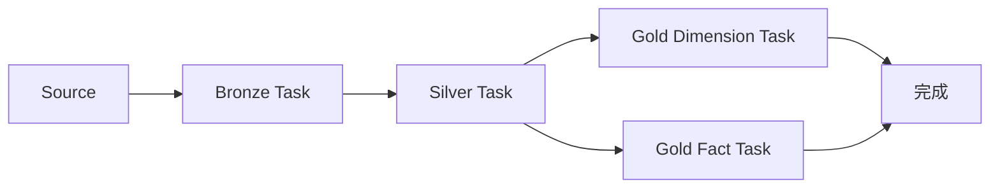
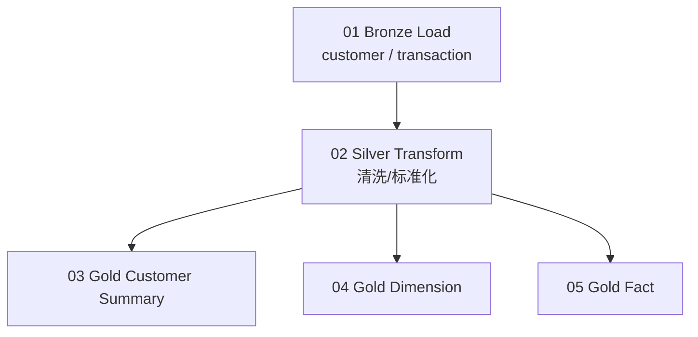
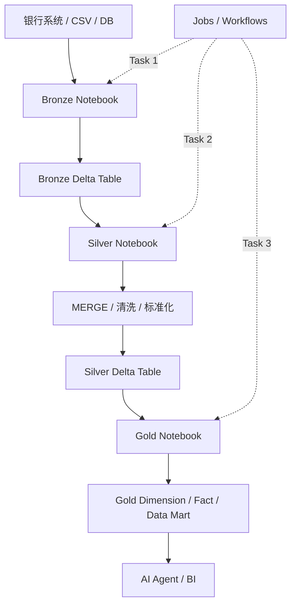

# 05｜Jobs / Workflows 编排实战

## 1. 为什么需要编排

手工执行：

```text
打开 Bronze Notebook → Run
等结束
打开 Silver Notebook → Run
等结束
打开 Gold Notebook → Run
```

开发学习阶段可以，但生产处理不能每天靠人工点击。

因此需要：

```text
Jobs / Workflows
```

---

## 2. 整体位置



Workflow 解决的是：

```text
什么时候执行？
先执行谁？
后执行谁？
失败怎么办？
能不能重试？
运行结果在哪里看？
```

---

# 3. 已经完成的 Notebook Orchestration

当前已经练习过：

```python
notebooks = [
    "./gold_dim_customers",
    "./gold_dim_products",
    "./gold_fact_sales"
]

for nb in notebooks:
    print(f"Running {nb}")
    dbutils.notebook.run(nb, timeout_seconds=0)
```

它的结构：

```text
gold_orchestration
       ↓
gold_dim_customers
       ↓
gold_dim_products
       ↓
gold_fact_sales
```

这已经让你理解了：

- 多 Notebook；
- 顺序执行；
- 一个入口调用多个处理；
- 某一步失败可以定位。

---

# 4. 但 Notebook Orchestration ≠ 正式 Workflow

Notebook 内：

```text
一个 Notebook
   ↓
代码中写调用顺序
   ↓
dbutils.notebook.run()
```

正式 Jobs / Workflows：

```text
Workflow
├── Task A: Bronze
├── Task B: Silver
│      depends on A
├── Task C: Gold Dimension
│      depends on B
└── Task D: Gold Fact
       depends on B
```

区别重点：

| Notebook chaining | Jobs / Workflows |
|---|---|
| 调用关系写在代码中 | Task 依赖在 Workflow 层配置 |
| 适合简单学习/调用 | 更适合正式任务编排 |
| 自己处理很多控制逻辑 | 平台提供 Run History / Retry / Schedule 等 |

---

# 5. 用我们的主案例设计 Workflow



这里已经出现两个重要概念：

### 串行

```text
Bronze → Silver
```

Silver 必须等 Bronze 成功。

### 并行

```text
             ┌→ Gold Summary
Silver ──────┼→ Dimension
             └→ Fact
```

如果三个 Gold 之间没有依赖，可以并行。

---

# 6. 正式练习时需要掌握的操作

在 Databricks Jobs / Workflows 页面完成：

1. 创建一个 Workflow / Job；
2. 添加 Bronze Notebook Task；
3. 添加 Silver Notebook Task；
4. 设置 Silver depends on Bronze；
5. 添加 Gold Task；
6. 设置 Gold depends on Silver；
7. 手动 Run；
8. 查看每个 Task 状态；
9. 打开 Run History；
10. 故意制造一个简单错误，观察失败 Task；
11. 修复后重新运行；
12. 认识 Retry / Schedule 的位置和用途。

---

# 7. 失败时怎么读 DAG

假设：

```text
Bronze  SUCCESS
   ↓
Silver  FAILED
   ↓
Gold    SKIPPED / 未执行
```

不要先看 Gold。

应该：

```text
定位 Silver
 ↓
打开失败日志
 ↓
找到错误
 ↓
修复
 ↓
重新运行
```

这就是正式 Pipeline 的基本排错思维。

---

# 8. Schedule / Retry

## Schedule

解决：

> “什么时候自动运行？”

例如概念上：

```text
每天凌晨
   ↓
Bronze
   ↓
Silver
   ↓
Gold
```

## Retry

解决：

> “偶发失败是否允许自动重试？”

参画前知道用途即可，不需要设计复杂生产策略。

---

# 9. Workflow 与数据层不是同一个概念

不要混淆：

```text
Bronze / Silver / Gold
= 数据加工层

Jobs / Workflows
= 执行这些加工的编排机制
```

正确关系：

```text
Workflow
   │
   ├─ 调用 Bronze Notebook → 写 Bronze Table
   ├─ 调用 Silver Notebook → 写 Silver Table
   └─ 调用 Gold Notebook   → 写 Gold Table
```

---

# 10. 完整参画前流程

学完这里后，把所有知识合成一张图：



如果这张图能够自己解释，就已经把 Databricks 参画前学习的主要知识串起来了。

---

# 11. 本章完成标准

能够解释：

1. 为什么需要 Workflow；
2. Notebook chaining 和正式 Workflow 的区别；
3. Task dependency 是什么；
4. 串行和并行是什么；
5. Run History 用来干什么；
6. 一个 Task 失败后应该先查哪里；
7. Schedule / Retry 大概解决什么问题。
