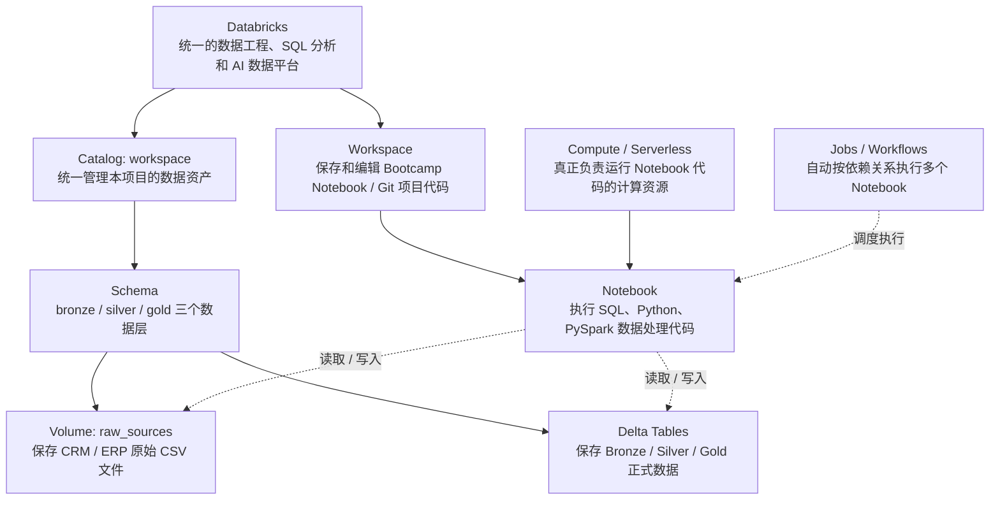
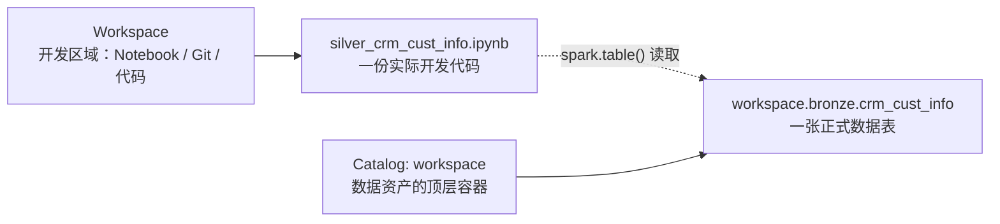
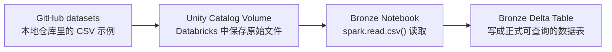
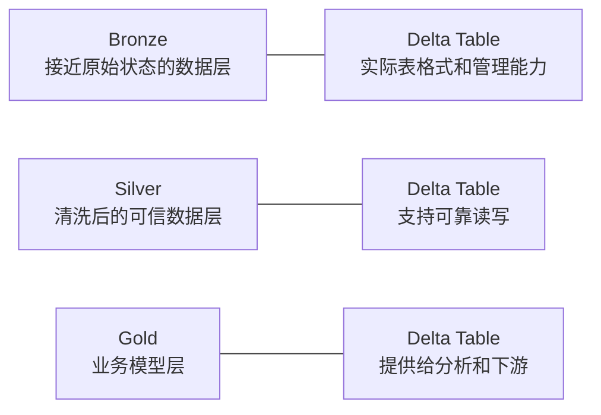
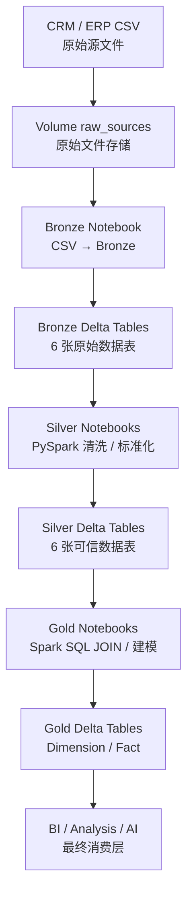

# 01｜Databricks 整体概念与架构｜结合 Bootcamp 实际项目

## 1. 项目整体架构



## 2. Workspace：代码在哪里

```text
Workspace
└── databricks_bootcamp_2026
    └── script
        ├── init_lakehouse.ipynb
        ├── bronze
        ├── silver
        └── gold
```

Workspace 主要回答：**代码在哪里？**

---

## 3. Catalog：数据在哪里

`init_lakehouse.ipynb` 实际执行：

```sql
USE CATALOG workspace;
```

然后创建：

```sql
CREATE SCHEMA IF NOT EXISTS bronze;
CREATE SCHEMA IF NOT EXISTS silver;
CREATE SCHEMA IF NOT EXISTS gold;
```

所以：

```text
workspace.bronze.crm_cust_info
    │       │        │
    │       │        └─ Table
    │       └────────── Schema
    └────────────────── Catalog
```

---

## 4. Workspace 和 `workspace` Catalog 不是一个东西



---

## 5. Volume：原始 CSV 放在哪里

原项目创建：

```sql
CREATE VOLUME IF NOT EXISTS workspace.bronze.raw_sources;
```

Bronze Notebook 读取：

```text
/Volumes/workspace/bronze/raw_sources/source_crm/cust_info.csv
```

关系：



---

## 6. Notebook：实际开发工作台

Bronze basic：

```python
df = spark.read.option("header", "true") \
    .option("inferSchema", "true") \
    .csv("/Volumes/workspace/bronze/raw_sources/source_crm/cust_info.csv")

df.write.mode("overwrite").saveAsTable(
    "workspace.bronze.crm_cust_info"
)
```

读成：

```text
Input
cust_info.csv
 ↓
Process
Spark 读取 CSV
 ↓
Output
workspace.bronze.crm_cust_info
```

---

## 7. Compute / Serverless

```text
Notebook
 ↓
提交 SQL / Python / PySpark
 ↓
Compute / Serverless
 ↓
Spark 执行
 ↓
读写 Delta Table
```

Notebook = 写什么；Compute = 谁来执行。

---

## 8. Spark / PySpark 在项目中的位置

Silver：

```python
df = spark.table("workspace.bronze.crm_cust_info")
df = df.filter(col("cst_id").isNotNull())
```

最终：

```python
df.write.mode("overwrite").format("delta") \
  .saveAsTable("workspace.silver.crm_customers")
```

真实流程：

```text
Bronze Delta Table
 ↓
PySpark DataFrame
 ↓
清洗 / 转换
 ↓
Silver Delta Table
```

---

## 9. Spark SQL 在项目中的位置

Gold 主要用 SQL：

```python
query = """
SELECT ...
FROM silver.crm_customers ci
LEFT JOIN silver.erp_customers ca
  ON ci.customer_number = ca.customer_number
"""

df = spark.sql(query)
```

所以这个项目是：

```text
Bronze → PySpark ingestion
Silver → PySpark transformation
Gold   → Spark SQL 建模
```

---

## 10. Delta Table 和 Bronze/Silver/Gold 的关系



Bronze/Silver/Gold 是数据层；Delta 是表能力，不是第四层。

---

## 11. Bootcamp 整体技术关系


