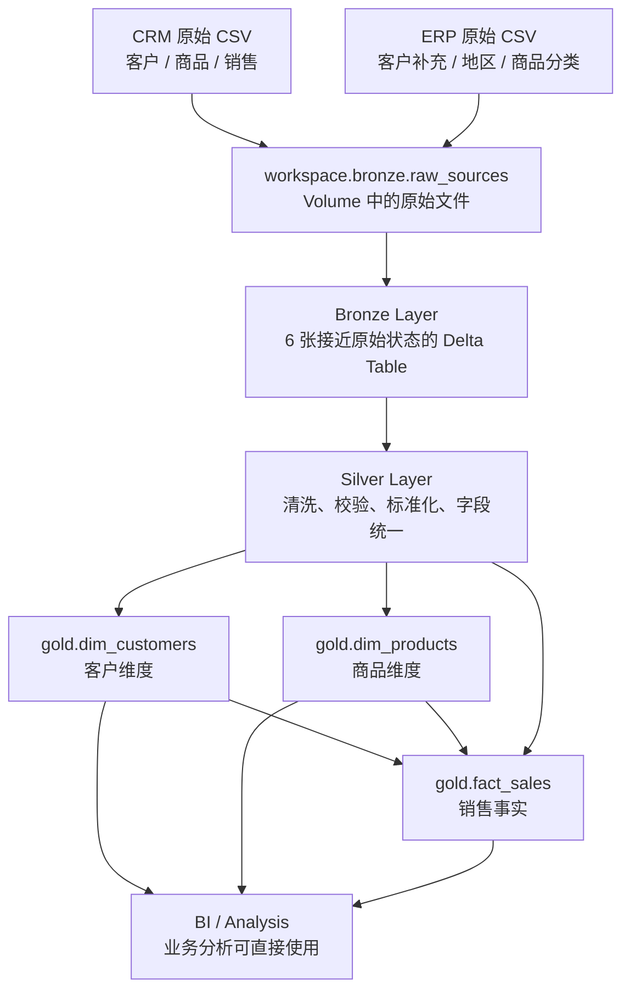
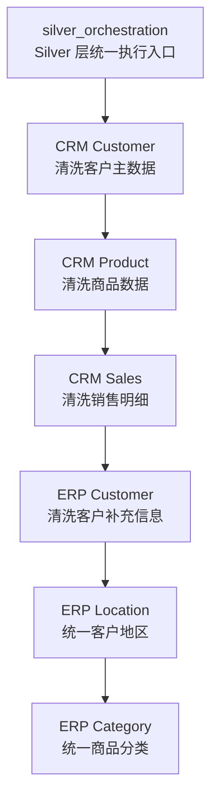
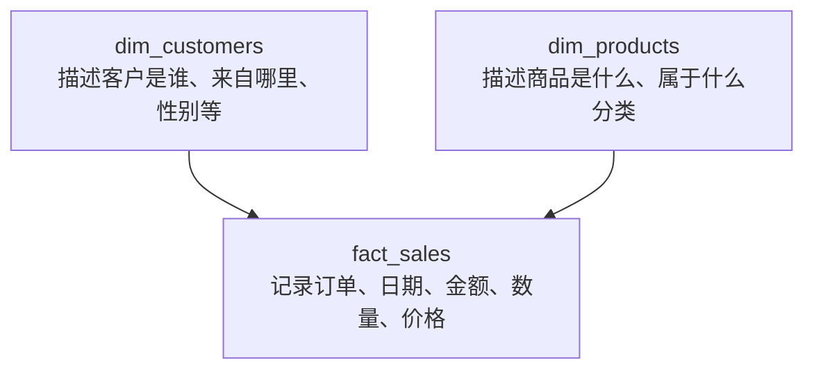

# 02｜Bootcamp Bronze → Silver → Gold 完整实战

## 1. 原仓库真实数据源

```text
CRM
├── cust_info.csv
├── prd_info.csv
└── sales_details.csv

ERP
├── CUST_AZ12.csv
├── LOC_A101.csv
└── PX_CAT_G1V2.csv
```

当前仓库 CSV 大致规模：

| 文件 | 行数 |
|---|---:|
| CRM customer | 18,494 |
| CRM product | 397 |
| CRM sales | 60,398 |
| ERP customer | 18,484 |
| ERP location | 18,484 |
| ERP product category | 37 |

---

## 2. 全流程



---

## 3. Step 0：`init_lakehouse.ipynb`

做三件事：

```sql
USE CATALOG workspace;
```

```sql
CREATE SCHEMA IF NOT EXISTS bronze;
CREATE SCHEMA IF NOT EXISTS silver;
CREATE SCHEMA IF NOT EXISTS gold;
```

```sql
CREATE VOLUME IF NOT EXISTS workspace.bronze.raw_sources;
```

---

## 4. Bronze：CSV → 6 张表

先学：

```text
script/bronze/bronze_layer(basic).ipynb
```

映射关系：

```text
cust_info.csv      → workspace.bronze.crm_cust_info
prd_info.csv       → workspace.bronze.crm_prd_info
sales_details.csv  → workspace.bronze.crm_sales_details

CUST_AZ12.csv      → workspace.bronze.erp_cust_az12
LOC_A101.csv       → workspace.bronze.erp_loc_a101
PX_CAT_G1V2.csv    → workspace.bronze.erp_px_cat_g1v2
```

---

## 5. Bronze basic 代码怎么读

```python
df = spark.read.option("header", "true") \
    .option("inferSchema", "true") \
    .csv("/Volumes/workspace/bronze/raw_sources/source_crm/cust_info.csv")

df.write.mode("overwrite") \
  .saveAsTable("workspace.bronze.crm_cust_info")
```

就是：

```text
CSV
 ↓
Spark DataFrame
 ↓
saveAsTable
 ↓
Bronze Table
```

---

## 6. Bronze improved

文件：

```text
bronze_layer_(improved).ipynb
```

先定义：

```python
INGESTION_CONFIG = [...]
```

再循环 6 个数据源：

```python
for item in INGESTION_CONFIG:
    ...
```

区别：

```text
basic
= 每张表重复写代码

improved
= 配置驱动 + 循环批量 Ingestion
```

---

## 7. Silver 数据流

```text
Bronze CRM
├── crm_cust_info     → silver.crm_customers
├── crm_prd_info      → silver.crm_products
└── crm_sales_details → silver.crm_sales

Bronze ERP
├── erp_cust_az12    → silver.erp_customers
├── erp_loc_a101     → silver.erp_customer_location
└── erp_px_cat_g1v2  → silver.erp_product_category
```

---

## 8. `silver_crm_cust_info.ipynb`

真实处理：

```text
Trim 字符串
 ↓
婚姻状态标准化
S → Single
M → Married
 ↓
性别标准化
F → Female
M → Male
 ↓
删除 cst_id 为 NULL 的记录
 ↓
字段统一改名
 ↓
workspace.silver.crm_customers
```

---

## 9. `silver_crm_prd_info.ipynb`

真实处理：

```text
Trim
 ↓
解析 product key
 ↓
空 product cost → 0
 ↓
product line 标准化
M → Mountain
R → Road
S → Other Sales
T → Touring
 ↓
日期 Cast
 ↓
字段重命名
 ↓
workspace.silver.crm_products
```

---

## 10. `silver_crm_sales_details.ipynb`

真实处理：

```text
Trim
 ↓
订单 / 发货 / 到期日期清洗
0 或长度 != 8 → NULL
否则 yyyyMMdd → DATE
 ↓
price 缺失或 <= 0
→ sales / quantity 重新计算
 ↓
字段重命名
 ↓
workspace.silver.crm_sales
```

---

## 11. ERP Customer：跨系统主键统一

原 ERP：

```text
NASAW00011000
```

Silver 清洗：

```text
删除 NAS
 ↓
AW00011000
```

这样 Gold 才能和 CRM：

```text
AW00011000
```

正确 JOIN。

---

## 12. ERP Location

原始：

```text
AW-00011000
```

清洗：

```text
去掉 -
 ↓
AW00011000
```

国家：

```text
DE        → Germany
US / USA  → United States
空 / NULL → n/a
```

---

## 13. ERP Product Category

```text
YES → true
NO  → false
其他 → NULL
```

字段统一：

```text
id          → category_id
cat         → category
subcat      → subcategory
maintenance → maintenance_flag
```

---

## 14. Silver Orchestration



---

## 15. Gold Customer Dimension

来源：

```text
silver.crm_customers
+
silver.erp_customers
+
silver.erp_customer_location
```

使用 `LEFT JOIN`，生成：

```text
workspace.gold.dim_customers
```

并用：

```sql
ROW_NUMBER() OVER (...) AS customer_key
```

生成 surrogate key。

---

## 16. Gold Product Dimension

来源：

```text
silver.crm_products
+
silver.erp_product_category
```

输出：

```text
workspace.gold.dim_products
```

---

## 17. Gold Sales Fact

来源：

```text
silver.crm_sales
+
gold.dim_products
+
gold.dim_customers
```

输出：

```text
workspace.gold.fact_sales
```

Fact 中使用：

```text
product_key
customer_key
```

连接维表。

---

## 18. Dimension / Fact



Dimension 描述实体；Fact 记录业务事件。

---

## 19. Gold Orchestration

真实顺序：

```text
gold_dim_customers
 ↓
gold_dim_products
 ↓
gold_fact_sales
```

Fact 最后执行，因为依赖两张 Dimension。
