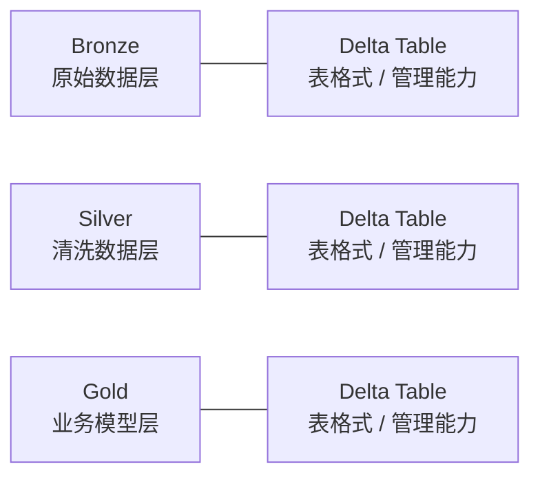
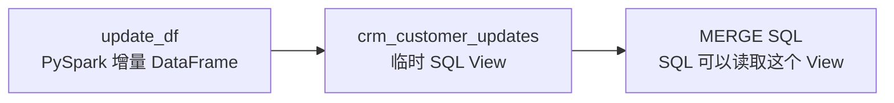
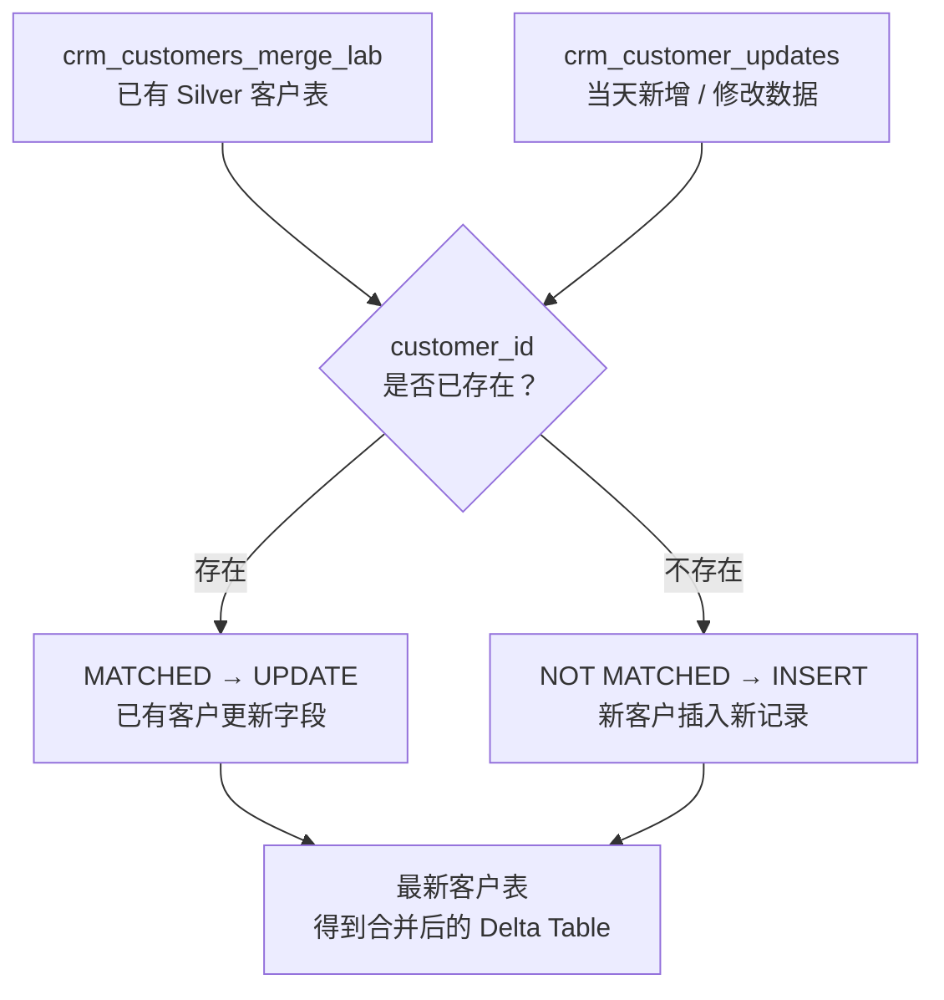

# 03｜Bootcamp Delta Table 与 MERGE 实战

> Bootcamp 原仓库已经大量使用 Delta Table，但当前仓库没有完整 MERGE 主流程。
>
> 所以本章分为：
>
> - **Bootcamp 原版：Delta Table**
> - **项目组要求扩展：MERGE**

---

## 1. 原仓库中的 Delta Table

Bronze improved：

```python
df.write.mode("overwrite") \
  .format("delta") \
  .saveAsTable(...)
```

Silver：

```python
df.write.mode("overwrite") \
  .format("delta") \
  .saveAsTable("workspace.silver.crm_customers")
```

Gold：

```python
df.write.mode("overwrite") \
  .format("delta") \
  .saveAsTable("workspace.gold.dim_customers")
```

所以：

```text
Bronze Delta Table
Silver Delta Table
Gold Delta Table
```

---

## 2. Delta 和 Medallion 不是同一概念



---

## 3. 为什么要扩展 MERGE

原项目主要使用：

```python
.mode("overwrite")
```

即覆盖写。

真实项目常见：

```text
昨天已有客户数据
+
今天新增 / 修改客户
 ↓
只处理差分
```

这时 MERGE 很重要。

---

## 4. 直接基于 Bootcamp Silver 表练

先复制练习表，避免破坏原表：

```sql
CREATE OR REPLACE TABLE workspace.silver.crm_customers_merge_lab
USING DELTA
AS
SELECT *
FROM workspace.silver.crm_customers;
```

---

## 5. 确认表结构

先执行：

```sql
DESCRIBE TABLE workspace.silver.crm_customers_merge_lab;
```

再：

```sql
SELECT *
FROM workspace.silver.crm_customers_merge_lab
ORDER BY customer_id
LIMIT 10;
```

---

## 6. 准备增量 DataFrame

```python
updates = [
    (11000, "AW00011000", "Jon_UPDATED", "Yang", "Married", "Male", "2025-10-06"),
    (999999, "AW99999999", "New", "Customer", "Single", "Female", "2026-08-30")
]

columns = [
    "customer_id",
    "customer_number",
    "first_name",
    "last_name",
    "marital_status",
    "gender",
    "created_date"
]

update_df = spark.createDataFrame(updates, columns)
display(update_df)
```

> 如果你的实际字段类型不同，以 `DESCRIBE TABLE` 结果为准调整。

---

## 7. Temporary View

```python
update_df.createOrReplaceTempView(
    "crm_customer_updates"
)
```



---

## 8. MERGE

```sql
MERGE INTO workspace.silver.crm_customers_merge_lab AS target
USING crm_customer_updates AS source
ON target.customer_id = source.customer_id

WHEN MATCHED THEN
UPDATE SET
    target.customer_number = source.customer_number,
    target.first_name = source.first_name,
    target.last_name = source.last_name,
    target.marital_status = source.marital_status,
    target.gender = source.gender,
    target.created_date = source.created_date

WHEN NOT MATCHED THEN
INSERT (
    customer_id,
    customer_number,
    first_name,
    last_name,
    marital_status,
    gender,
    created_date
)
VALUES (
    source.customer_id,
    source.customer_number,
    source.first_name,
    source.last_name,
    source.marital_status,
    source.gender,
    source.created_date
);
```

---

## 9. MERGE 流程



---

## 10. 验证

```sql
SELECT *
FROM workspace.silver.crm_customers_merge_lab
WHERE customer_id IN (11000, 999999)
ORDER BY customer_id;
```

预期：

```text
11000  → UPDATE
999999 → INSERT
```

---

## 11. Table / View / Temporary View

| 类型 | Bootcamp 对应 |
|---|---|
| Table | `workspace.silver.crm_customers` |
| View | 可保存常用 SQL 查询定义 |
| Temporary View | `crm_customer_updates`，会话内使用 |

View 扩展：

```sql
CREATE OR REPLACE VIEW workspace.gold.customer_view AS
SELECT *
FROM workspace.silver.crm_customers;
```

---

## 12. Delta History

```sql
DESCRIBE HISTORY workspace.silver.crm_customers_merge_lab;
```

重点观察 MERGE / WRITE 等操作记录。
