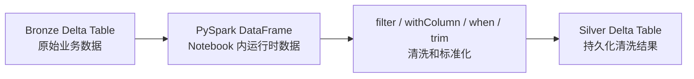
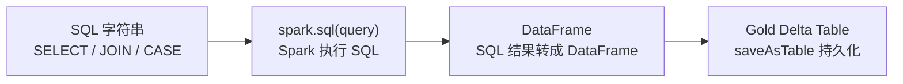

# 04｜Bootcamp PySpark 与 SQL 代码解读

## 1. 直接读 Silver Notebook

推荐顺序：

```text
silver_crm_cust_info
 ↓
silver_erp_loc_a101
 ↓
silver_crm_sales_details
 ↓
silver_crm_prd_info
```

---

## 2. 读取 Table

原项目：

```python
df = spark.table(
    "workspace.bronze.crm_cust_info"
)
```

SQL 思维：

```sql
SELECT *
FROM workspace.bronze.crm_cust_info;
```

---

## 3. Trim

原项目：

```python
for field in df.schema.fields:
    if isinstance(field.dataType, StringType):
        df = df.withColumn(
            field.name,
            trim(col(field.name))
        )
```

真实 CSV 中有类似：

```text
" Jon"
"Yang "
```

所以 Silver 会批量去掉字符串前后空格。

---

## 4. CASE WHEN ↔ `F.when`

PySpark：

```python
df = df.withColumn(
    "cst_marital_status",
    F.when(F.upper(F.col("cst_marital_status")) == "S", "Single")
     .when(F.upper(F.col("cst_marital_status")) == "M", "Married")
     .otherwise("n/a")
)
```

SQL：

```sql
CASE
    WHEN UPPER(cst_marital_status) = 'S' THEN 'Single'
    WHEN UPPER(cst_marital_status) = 'M' THEN 'Married'
    ELSE 'n/a'
END
```

---

## 5. WHERE ↔ filter

PySpark：

```python
df = df.filter(
    col("cst_id").isNotNull()
)
```

SQL：

```sql
WHERE cst_id IS NOT NULL
```

---

## 6. 字段重命名

```python
RENAME_MAP = {
    "cst_id": "customer_id",
    "cst_key": "customer_number",
    "cst_firstname": "first_name",
    "cst_lastname": "last_name"
}
```

目的不是“好看”，而是：

```text
源系统字段名
 ↓
Silver 统一业务字段名
```

---

## 7. 跨系统 Key 标准化

ERP Customer：

```text
NASAW00011000
 ↓ 删除 NAS
AW00011000
```

ERP Location：

```text
AW-00011000
 ↓ 删除 -
AW00011000
```

CRM：

```text
AW00011000
```

最终三边统一，Gold 才能 JOIN。

---

## 8. 日期清洗

Sales Notebook：

```text
日期 = 0
或长度 != 8
→ NULL

否则
yyyyMMdd
→ Date
```

PySpark 使用：

```python
F.when(...)
F.to_date(...)
```

---

## 9. 错误价格修正

逻辑：

```text
price 为空或 <= 0
 ↓
quantity != 0 ?
 ↓
sales / quantity
 ↓
重新计算 price
```

这是典型数据质量规则。

---

## 10. PySpark → Delta

```python
df.write.mode("overwrite") \
  .format("delta") \
  .saveAsTable("workspace.silver.crm_sales")
```



---

## 11. Gold 为什么用 SQL

Gold 重点是：

```text
多张 Silver Table
 ↓
JOIN
 ↓
Dimension / Fact
```

例如：

```sql
FROM silver.crm_customers ci
LEFT JOIN silver.erp_customers ca
  ON ci.customer_number = ca.customer_number
LEFT JOIN silver.erp_customer_location la
  ON ci.customer_number = la.customer_number
```

然后：

```python
df = spark.sql(query)
```

---

## 12. `spark.sql()` 是桥梁



---

## 13. 当前优先掌握 API

```text
spark.table()
spark.read.csv()
display()
filter()
withColumn()
withColumnRenamed()
col()
trim()
when()
upper()
isin()
regexp_replace()
substring()
cast()
to_date()
write
format("delta")
saveAsTable()
spark.sql()
```
