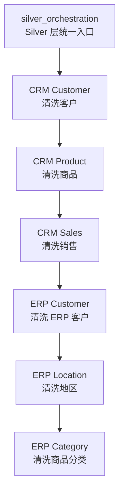
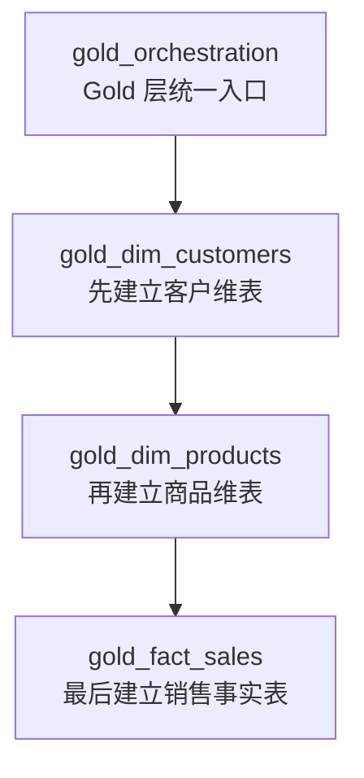
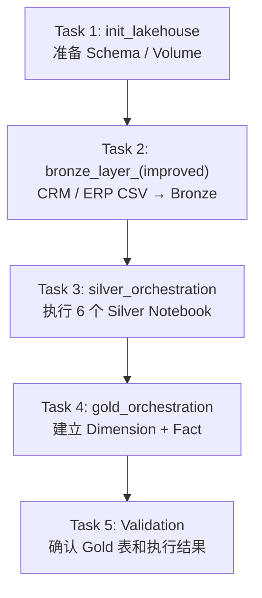
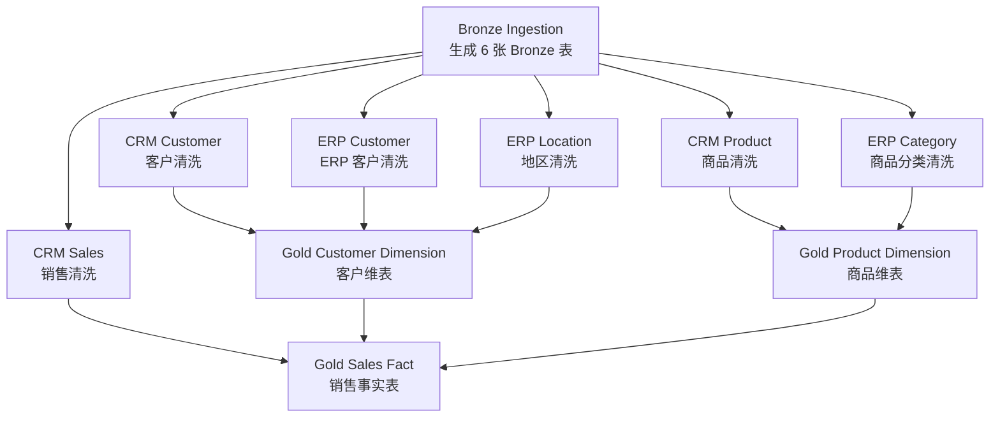
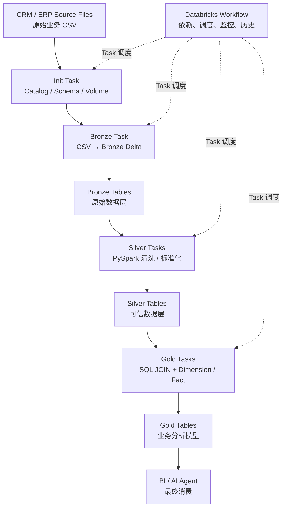

# 05｜Bootcamp Jobs / Workflows 编排实战

> 先学仓库真实存在的 orchestration，再扩展正式 Jobs / Workflows。

---

## 1. Silver Orchestration

原文件：

```text
script/silver/silver_orchestration.ipynb
```

核心代码：

```python
notebooks = [
    "./crm/silver_crm_cust_info",
    "./crm/silver_crm_prd_info",
    "./crm/silver_crm_sales_details",
    "./erp/silver_erp_cust_az12",
    "./erp/silver_erp_loc_a101",
    "./erp/silver_erp_px_cat_g1v2"
]

for nb in notebooks:
    dbutils.notebook.run(nb, timeout_seconds=0)
```

流程：



---

## 2. Gold Orchestration

真实顺序：



Fact 最后，因为它依赖：

```text
gold.dim_customers
gold.dim_products
```

---

## 3. Notebook chaining ≠ 正式 Workflow

| Bootcamp orchestration | Jobs / Workflows |
|---|---|
| 调用关系写在 Python 中 | 依赖在 Workflow 层表达 |
| `dbutils.notebook.run()` | 每个 Notebook 是 Task |
| 简单统一入口 | 更适合生产调度和监控 |
| 逻辑藏在代码 | DAG 可以直接看到 |
| 基本执行 | 有 Run History / Retry / Schedule |

---

## 4. 推荐第一版正式 Workflow

直接复用原仓库现有入口：



这版最适合参画前。

---

## 5. 熟悉后再拆 Task



---

## 6. Workflow UI 实操目标

至少完成：

```text
Create Workflow
 ↓
Add Notebook Task
 ↓
设置 Depends on
 ↓
Run now
 ↓
查看 Task 状态
 ↓
查看 Run History
 ↓
打开失败 Task 日志
 ↓
认识 Retry / Schedule
```

---

## 7. 完整项目图


