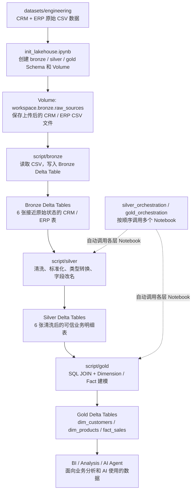
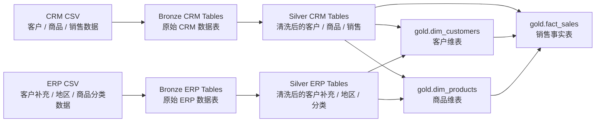

# Databricks 参画前学习资料 V2｜以 `DataWithBaraa/databricks_bootcamp_2026` 为主线

> 本教程不再另外虚构一套 customer / transaction 示例。
>
> **所有主教程均以你本地已经复制的 `DataWithBaraa/databricks_bootcamp_2026` 为基准。**
>
> 原仓库已有内容直接按原 Notebook 学；项目组要求但原仓库没有完整覆盖的内容（例如 MERGE、正式 Jobs/Workflows UI）明确标记为 **【扩展实战】**。

---

## 1. Bootcamp 项目整体地图



---

## 2. 仓库真实目录

```text
databricks_bootcamp_2026-main/
├── datasets/
│   ├── engineering/
│   │   ├── source_crm/
│   │   │   ├── cust_info.csv
│   │   │   ├── prd_info.csv
│   │   │   └── sales_details.csv
│   │   └── source_erp/
│   │       ├── CUST_AZ12.csv
│   │       ├── LOC_A101.csv
│   │       └── PX_CAT_G1V2.csv
│   └── analysts/
└── script/
    ├── init_lakehouse.ipynb
    ├── bronze/
    │   ├── bronze_layer(basic).ipynb
    │   └── bronze_layer_(improved).ipynb
    ├── silver/
    │   ├── silver_orchestration.ipynb
    │   ├── crm/
    │   └── erp/
    └── gold/
        ├── gold_dim_customers.ipynb
        ├── gold_dim_products.ipynb
        ├── gold_fact_sales.ipynb
        └── gold_orchestration.ipynb
```

---

## 3. 真实数据流



---

## 4. 教程阅读顺序

| 顺序 | 文档 | 目的 |
|---|---|---|
| 1 | `01_Databricks整体概念与架构.md` | 把 Workspace、Catalog、Volume、Delta、Notebook 放回 Bootcamp |
| 2 | `02_Bootcamp_Bronze_Silver_Gold完整实战.md` | 逐层理解原仓库 Notebook |
| 3 | `03_Bootcamp_Delta_Table与MERGE实战.md` | 先理解原项目 Delta，再做项目组要求的 MERGE 扩展 |
| 4 | `04_Bootcamp_PySpark与SQL代码解读.md` | 直接读原项目 PySpark / Spark SQL |
| 5 | `05_Bootcamp_Jobs_Workflows编排实战.md` | 从原仓库 orchestration 过渡到正式 Workflow |

---

## 5. 原仓库与扩展练习分开

### Bootcamp 原版已有

- init Lakehouse
- Volume
- Bronze ingestion
- Bronze / Silver / Gold Delta Table
- Silver PySpark 清洗
- Gold Dimension / Fact
- Spark SQL
- Unity Catalog
- `dbutils.notebook.run()` orchestration

### 参画要求扩展

- Table / View / Temporary View
- INSERT / UPDATE / MERGE
- 正式 Jobs / Workflows

本教程会在 **Bootcamp 现有表上继续练**，但会明确标记哪些不是仓库原版。

---

## 6. 推荐学习顺序

```mermaid
flowchart LR
    A["init_lakehouse<br>准备 Catalog / Schema / Volume"]
    B["Bronze basic<br>先看最直白的 CSV → Table"]
    C["Bronze improved<br>理解配置化批量 Ingestion"]
    D["Silver CRM<br>重点学习 PySpark 清洗"]
    E["Silver ERP<br>理解跨系统标准化"]
    F["Silver orchestration<br>理解 Notebook 编排"]
    G["Gold dimensions<br>理解 JOIN + Dimension"]
    H["Gold fact<br>理解 Fact Table"]
    I["Gold orchestration<br>理解统一入口"]
    J["MERGE 扩展<br>在现有 Delta 表上练增量更新"]
    K["正式 Workflow<br>把各 Notebook 配成 Task DAG"]

    A --> B --> C --> D --> E --> F --> G --> H --> I --> J --> K
```


