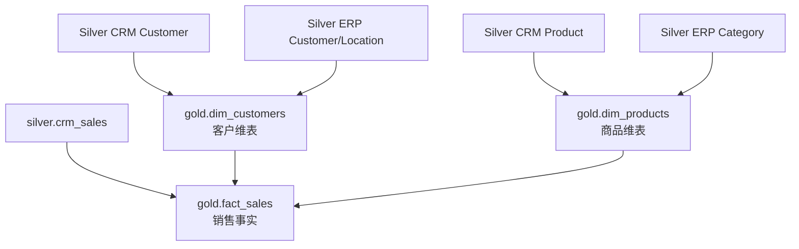

# 05｜Gold Dimension / Fact 完整执行实战

## 目的
从清洗数据建立业务模型。



依次执行：
```text
gold_dim_customers.ipynb
gold_dim_products.ipynb
gold_fact_sales.ipynb
```

验证：
```sql
SELECT * FROM workspace.gold.dim_customers LIMIT 20;
SELECT * FROM workspace.gold.dim_products LIMIT 20;
SELECT * FROM workspace.gold.fact_sales LIMIT 20;
```

再执行：
`gold_orchestration.ipynb`

必须理解：
```text
Dimension = 客户/商品“是什么”
Fact = 发生了什么业务事件
Fact 最后执行，因为依赖两个 Dimension
```

## PASS
- [ ] dim_customers
- [ ] dim_products
- [ ] fact_sales
- [ ] 能解释 Fact 为什么最后
