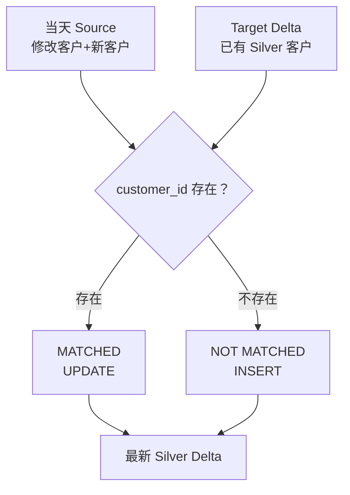

# 07｜MERGE 增量更新完整实战【重点】

## 目标
```text
Target 已有数据 + Source 当天差分
→ ON Key
→ MATCHED UPDATE
→ NOT MATCHED INSERT
```

## Step 0：新建实验 Notebook
```text
Workspace → databricks_bootcamp_2026 → script
→ New Notebook → merge_crm_customers_lab
```

## Step 1：确认真实结构
SQL Cell：
```sql
DESCRIBE TABLE workspace.silver.crm_customers;
SELECT * FROM workspace.silver.crm_customers ORDER BY customer_id LIMIT 10;
```

## Step 2：Target 副本
```sql
CREATE OR REPLACE TABLE workspace.silver.crm_customers_merge_lab
USING DELTA
AS SELECT * FROM workspace.silver.crm_customers;
```

## Step 3：先找真实 UPDATE 对象
```sql
SELECT customer_id, customer_number, first_name, last_name,
       marital_status, gender, created_date
FROM workspace.silver.crm_customers_merge_lab
ORDER BY customer_id
LIMIT 5;
```
下面假定存在 `11000`；如果实际不同，就替换成你看到的真实 ID。

## Step 4：制造当天 Source
Python Cell：
```python
from datetime import date

updates = [
    (11000, "AW00011000", "Jon_UPDATED", "Yang",
     "Married", "Male", date(2025,10,6)),
    (999999, "AW99999999", "New", "Customer",
     "Single", "Female", date(2026,8,30))
]

columns = [
    "customer_id","customer_number","first_name","last_name",
    "marital_status","gender","created_date"
]

update_df = spark.createDataFrame(updates, columns)
display(update_df)
```
字段类型必须以 Step 1 的实际结构为准。

目的：
```text
11000  → 已存在 → UPDATE
999999 → 不存在 → INSERT
```

## Step 5：Temporary View
```python
update_df.createOrReplaceTempView("crm_customer_updates")
```
SQL 验证：
```sql
SELECT * FROM crm_customer_updates;
```

```text
PySpark DataFrame → Temporary View → SQL MERGE Source
```

## Step 6：MERGE 前验证
```sql
SELECT *
FROM workspace.silver.crm_customers_merge_lab
WHERE customer_id IN (11000,999999)
ORDER BY customer_id;
```

## Step 7：执行 MERGE
```sql
MERGE INTO workspace.silver.crm_customers_merge_lab AS target
USING crm_customer_updates AS source
ON target.customer_id = source.customer_id

WHEN MATCHED THEN UPDATE SET
 target.customer_number = source.customer_number,
 target.first_name = source.first_name,
 target.last_name = source.last_name,
 target.marital_status = source.marital_status,
 target.gender = source.gender,
 target.created_date = source.created_date

WHEN NOT MATCHED THEN INSERT (
 customer_id, customer_number, first_name, last_name,
 marital_status, gender, created_date
) VALUES (
 source.customer_id, source.customer_number, source.first_name,
 source.last_name, source.marital_status, source.gender,
 source.created_date
);
```

## Step 8：验证 UPDATE / INSERT
```sql
SELECT *
FROM workspace.silver.crm_customers_merge_lab
WHERE customer_id IN (11000,999999)
ORDER BY customer_id;
```

必须确认：
```text
11000  first_name=Jon_UPDATED → MATCHED UPDATE
999999 新出现                  → NOT MATCHED INSERT
```

## Step 9：History
```sql
DESCRIBE HISTORY workspace.silver.crm_customers_merge_lab;
```
找最新 MERGE。

## Step 10：再次运行
再次 MERGE 时，999999 已经存在，因此会 MATCHED，而不是重复 INSERT。



## PASS
- [ ] Target
- [ ] Source
- [ ] Temporary View
- [ ] ON Key
- [ ] UPDATE
- [ ] INSERT
- [ ] History
- [ ] 能解释第二次运行行为
