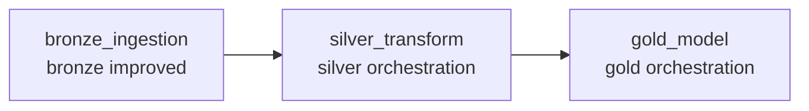

# 09｜Jobs / Workflows 完整 UI 实战

## 目的
从 `dbutils.notebook.run()` 升级到正式 Task DAG。

第一版 Workflow：


> UI 名称可能随 Databricks 版本略有变化；Free Edition 若没有某个高级选项，完成可用的 Task/DAG/Run/History 即可。

## Step 1
左侧进入：
```text
Jobs & Pipelines / Workflows / Jobs
→ Create Job
```
名称：
`bootcamp_medallion_workflow`

## Step 2：Bronze Task
```text
Task name: bronze_ingestion
Type: Notebook
Path: script/bronze/bronze_layer_(improved)
```

## Step 3：Silver Task
```text
Task name: silver_transform
Path: script/silver/silver_orchestration
Depends on: bronze_ingestion
```

## Step 4：Gold Task
```text
Task name: gold_model
Path: script/gold/gold_orchestration
Depends on: silver_transform
```

## Step 5：Run now
确认 DAG 按 Bronze→Silver→Gold 执行。

## Step 6：Run History
必须会找：
```text
整体 Run 状态
每个 Task 状态
Task Output
失败 Task
开始/结束时间
```

失败排查：
```text
Workflow Failed → 红色 Task → Task Run → Error
→ 检查 Path/Table/Input/Code → 修复 → Retry/Repair（若提供）
```

Schedule 先理解：
```text
每天固定时间 → 自动 Bronze → Silver → Gold
```

## PASS
- [ ] Job 创建
- [ ] 三个 Task
- [ ] Depends on
- [ ] Run
- [ ] Run History
- [ ] 会定位失败 Task
