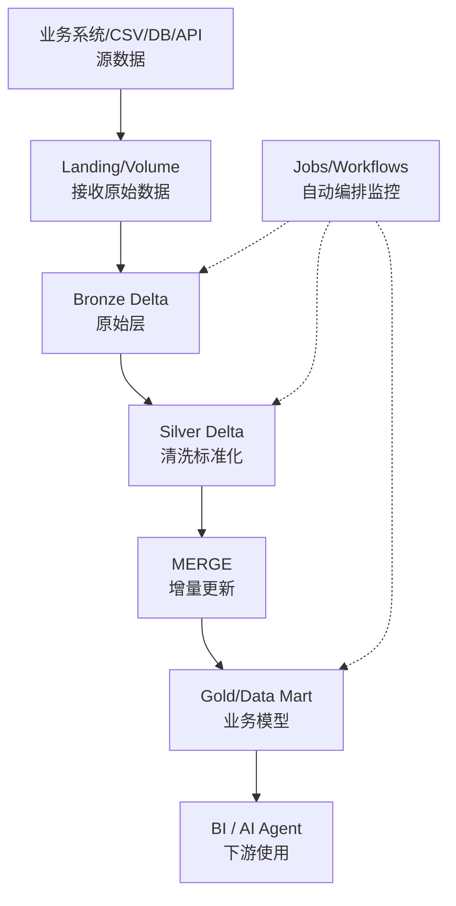

# 10｜银行 AI Agent 数据基盘参画前综合验收



## 上机验收
```sql
SELECT COUNT(*) FROM workspace.bronze.crm_cust_info;
SELECT COUNT(*) FROM workspace.silver.crm_customers;
SELECT COUNT(*) FROM workspace.gold.dim_customers;
SELECT COUNT(*) FROM workspace.gold.fact_sales;
```

重新独立做一次：
```text
MERGE：1 条 UPDATE + 1 条 INSERT
```

打开 Workflow History，指出 Bronze/Silver/Gold Task 依赖。

## 项目要求映射
|现场要求|Bootcamp 实战|
|---|---|
|Python/PySpark|Silver|
|SQL|Gold/MERGE/验证|
|数据连携|CRM/ERP→Bronze|
|数据加工|Bronze→Silver|
|ETL/ELT|完整链路|
|Data Mart|Dimension/Fact|
|Data Pipeline|Workflow|
|增量更新|Delta MERGE|

## 最终 Checklist
- [ ] 项目导入 Workspace
- [ ] Catalog/Schema/Volume
- [ ] CSV 上传
- [ ] Bronze
- [ ] Silver
- [ ] Gold
- [ ] PySpark 基本阅读修改
- [ ] Spark SQL
- [ ] Delta History
- [ ] MERGE
- [ ] View/Temporary View
- [ ] Workflow Task DAG
- [ ] Run History
- [ ] 能从源数据讲到 AI Agent

全部完成后，Bootcamp 参画前主线才算真正结束。
