# Databricks Bootcamp 实战执行版｜00～10 学习路线

> 不替代现有知识版；本套只负责“打开 Databricks 后具体怎么做”。
> 主线：DataWithBaraa/databricks_bootcamp_2026

```mermaid
flowchart LR
A["00 项目导入<br>代码进入 Workspace"] --> B["01 Init<br>Catalog/Schema/Volume"]
B --> C["02 CSV<br>上传原始数据"]
C --> D["03 Bronze<br>CSV→Delta"]
D --> E["04 Silver<br>PySpark 清洗"]
E --> F["05 Gold<br>Dimension/Fact"]
F --> G["06 Delta<br>History/验证"]
G --> H["07 MERGE<br>UPDATE+INSERT"]
H --> I["08 View<br>Table/View/Temp View"]
I --> J["09 Workflow<br>Task DAG"]
J --> K["10 验收<br>完整 Pipeline"]
```

|阶段|成果|PASS|
|---|---|---|
|00|Bootcamp 进入 Workspace|能打开 init_lakehouse|
|01|bronze/silver/gold + Volume|Catalog 可见|
|02|6 个 engineering CSV|Volume 路径可读|
|03|6 张 Bronze 表|SQL 可查|
|04|6 张 Silver 表|能解释清洗规则|
|05|2 Dimension + 1 Fact|能解释模型依赖|
|06|Delta History|能解释 Delta|
|07|MERGE|UPDATE、INSERT 都成功|
|08|View/Temp View|能解释区别|
|09|Workflow|Task DAG 可运行|
|10|综合验收|能讲清源数据→AI|

固定学习法：每个 Notebook 都回答 Input、读取位置、加工内容、Output、业务目的。
