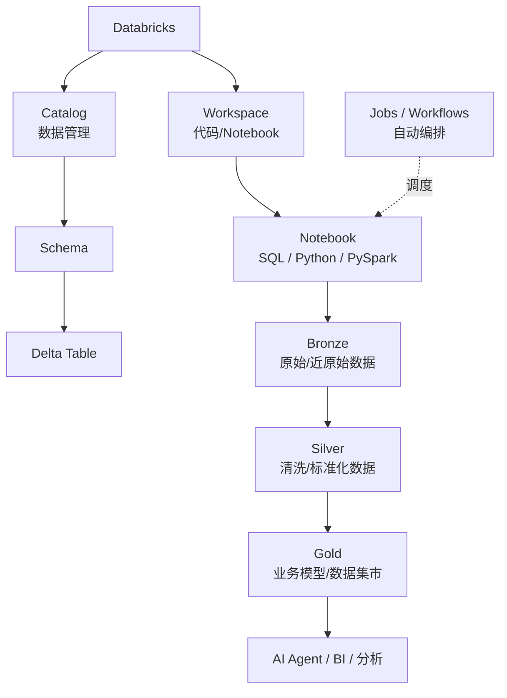

# Databricks 参画前学习资料｜总入口

> 本套资料依据项目组《Databricks 参画前の事前学習内容》和当前已经完成的实战重新整理。
>
> 学习原则：**先看整体 → 跑通一个完整例子 → 再理解每个技术点 → 最后用 Workflow 串起来。**

---

## 1. 先记住这一张整体图



一句话：

- **Workspace：放代码、Notebook、Git 项目**
- **Catalog：管数据**
- **Notebook：执行 SQL / Python / PySpark**
- **Delta Table：Databricks 中支持可靠更新、MERGE、历史版本等能力的数据表**
- **Bronze / Silver / Gold：数据从原始到业务可用的加工层级**
- **Jobs / Workflows：把多个处理步骤自动串起来**

---

## 2. 本教程只使用一条主案例

```text
customer.csv + transaction.csv
              ↓
           Bronze
      原始数据进入 Databricks
              ↓
           Silver
       NULL / 去重 / 标准化
              ↓
            Gold
       JOIN / GROUP BY
              ↓
       Dimension / Fact
              ↓
     Data Mart / AI Agent
```

后续 Delta、MERGE、PySpark、Workflow 都继续使用这条数据链，不反复换例子。

---

## 3. Workspace 和 Catalog 不要混淆

```text
Workspace                           Catalog
─────────                           ───────
放“程序”                            放“数据”

Notebook ─────读取/加工──────────→ Table
Python                              │
SQL                                 ├─ bronze
Git folder                          ├─ silver
                                    └─ gold
```

例如：

```python
df = spark.read.table("workspace.bronze.customer")
```

含义：

```text
Workspace中的 Notebook
        ↓
执行 PySpark
        ↓
读取 Catalog 中
workspace.bronze.customer
```

---

## 4. Catalog 的三层名字

```text
workspace.bronze.customer
    │       │       │
    │       │       └── Table
    │       └────────── Schema
    └────────────────── Catalog
```

注意：`workspace` 在这里是 **Catalog 名称**。它和左侧开发区域的 Workspace 是不同概念。

---

## 5. 当前完整学习路线

```mermaid
flowchart LR
    A[整体概念] --> B[Workspace / Notebook]
    B --> C[Catalog / Schema / Table]
    C --> D[Bronze]
    D --> E[Silver]
    E --> F[Gold]
    F --> G[Dimension / Fact]
    G --> H[Delta Table]
    H --> I[View / Temporary View]
    I --> J[MERGE]
    J --> K[PySpark 巩固]
    K --> L[Jobs / Workflows]
```



### 当前学习状态

| 内容 | 状态 |
|---|---|
| Workspace / Notebook | ✅ 已实际操作 |
| Catalog / Schema / Table | ✅ 已实际确认 |
| Bronze | ✅ 已完成 |
| Silver | ✅ 已完成 |
| Gold | ✅ 已完成 |
| Dimension / Fact | ✅ 已完成 |
| Delta Table 写入 | ✅ 已接触 |
| Notebook Orchestration | ✅ 已完成 |
| Delta Table 概念强化 | ▶ 当前补强 |
| Table / View / Temporary View | ⏳ |
| MERGE | ▶ 当前重点 |
| PySpark 独立加工 | 🟡 继续巩固 |
| 正式 Jobs / Workflows | ⏳ MERGE 后进行 |

---

## 6. 文件怎么读

1. `01_Databricks整体概念与架构.md`
   - 第一次学习或概念混乱时看。
2. `02_Bronze_Silver_Gold完整实战.md`
   - 掌握整个数据加工主流程。
3. `03_Delta_Table与MERGE实战.md`
   - **当前重点。**
4. `04_PySpark与SQL对照实战.md`
   - 用已有 SQL 经验快速掌握 PySpark。
5. `05_Jobs_Workflows编排实战.md`
   - 最后学习正式自动编排。

`reference/` 保存原始要求、GitHub 资源和导入操作，作为参考，不再作为主教程。

---

## 7. 每一章都用同一个学习方法

看到一个知识点，固定回答：

```text
① 它是什么？
② 在整体流程的哪里？
③ 为什么项目需要它？
④ 在 customer / transaction 例子里怎么用？
⑤ 代码怎么写？
⑥ 执行后应该看到什么？
```

不要只背 API 或 SQL。

---

## 8. 参画前最终目标

现场说：

> Bronze の customer データを Silver に加工してください。

能立即想到：

```text
Bronze
 ↓
读取
 ↓
NULL / 重复 / 类型 / 标准化
 ↓
校验
 ↓
Silver Delta Table
```

现场说：

> 差分データを MERGE してください。

能立即想到：

```text
当天增量
   ↓
和目标 Delta Table 按主键比较
   ↓
MATCHED     → UPDATE
NOT MATCHED → INSERT
```

现场说：

> Silver の customer と transaction から Gold を作成してください。

能立即想到：

```text
Silver Customer
      +
Silver Transaction
      ↓
     JOIN
      ↓
 GROUP BY
      ↓
Gold / Data Mart
```

达到这个程度，就是本套资料的目标。
