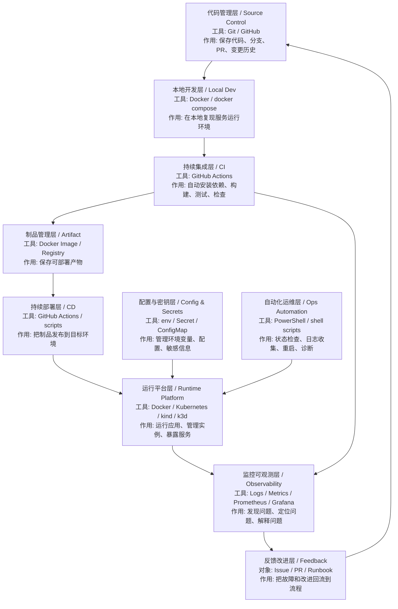
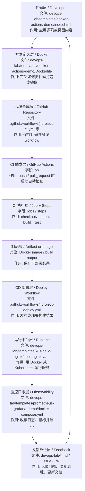

# DevOps 系统学习路线

这份文档先回答一个问题：

```text
DevOps 不是一个工具名，而是一套把代码从开发、构建、测试、部署、运行、监控、排障持续串起来的工程体系。
```

如果只按 `Docker`、`GitHub Actions`、`Kubernetes`、`Prometheus` 单独学，很容易知道很多工具名，但不知道它们在真实项目里分别属于哪一层。

## 1. DevOps 系统整体分层



## 2. 核心层次速查

| 系统层 | 是什么 | 核心作用 | 常见文件 / 工具 | 日本现场说法 |
| --- | --- | --- | --- | --- |
| 代码管理层 | 保存代码和变更历史的地方 | 分支、PR、代码审查、版本管理 | Git / GitHub | ソース管理 / バージョン管理 |
| 本地开发层 | 在本机复现运行环境 | 减少环境差异 | Docker / docker compose | ローカル開発環境 |
| CI 层 | 代码提交后的自动检查 | 构建、测试、静态检查 | `.github/workflows/*.yml` | 継続的インテグレーション |
| 制品层 | 可部署产物的保存位置 | 保存镜像、包、构建产物 | Docker image / registry | 成果物 / アーティファクト |
| CD 层 | 自动发布到目标环境 | 部署、回滚、发布控制 | GitHub Actions / scripts | 継続的デリバリー / デプロイ |
| 运行平台层 | 应用真正运行的地方 | 调度容器、暴露服务、扩缩容 | Docker / Kubernetes | 実行基盤 / コンテナ基盤 |
| 配置与密钥层 | 管理环境差异和敏感信息 | 配置隔离、密钥保护 | env / ConfigMap / Secret | 設定管理 / 秘密情報管理 |
| 自动化运维层 | 用脚本做重复运维动作 | 检查状态、收集日志、诊断 | `.ps1` / shell scripts | 運用自動化 |
| 监控可观测层 | 观察系统是否健康 | 日志、指标、告警、排障 | Prometheus / Grafana / logs | 監視 / 可観測性 |
| 反馈改进层 | 把问题转成改进项 | Runbook、Issue、复盘 | docs / issue / PR | 改善活動 / 障害対応 |

## 3. DevOps 最小处理流程（文件定位版）



这张图的读法：

- 先看节点第一行：它属于 DevOps 哪一层。
- 再看 `文件:`：你应该打开哪个文件学习。
- 最后看 `作用:`：这一层在完整流程里解决什么问题。

| 顺序 | DevOps 层 | 指定文件 / 配置 | 输入是什么 | 输出是什么 | 功能作用 |
| --- | --- | --- | --- | --- | --- |
| 1 | 代码层 | `devops-lab/templates/docker-actions-demo/index.html` | 页面或应用代码 | 可被打包的源码 | 学习“业务代码从哪里开始” |
| 2 | 容器定义层 | `devops-lab/templates/docker-actions-demo/Dockerfile` | 源码、基础镜像、复制规则 | Docker image 构建规则 | 学习如何把代码做成镜像 |
| 3 | 代码仓库层 | GitHub repository | commit / pull request | 版本历史和触发事件 | 学习代码提交如何进入自动化流程 |
| 4 | CI 触发层 | `.github/workflows/jtproject-ci.yml` -> `on` | push / PR / 手动触发 | workflow run | 学习 workflow 什么时候执行 |
| 5 | CI 执行层 | `.github/workflows/jtproject-ci.yml` -> `jobs` / `steps` | 源码和 runner 环境 | 构建、测试、检查结果 | 学习每个 step 做什么 |
| 6 | 制品层 | Docker image / build output | 构建结果 | 可部署产物 | 学习 CI 之后交给 CD 的是什么 |
| 7 | CD 部署层 | `.github/workflows/jtproject-deploy.yml` / `jtproject-deploy-safe.yml` | 构建产物或部署参数 | 部署结果 | 学习发布流程如何自动化 |
| 8 | 运行平台层 | `devops-lab/templates/k8s-hello-nginx/hello-nginx.yaml` | 镜像和 YAML 期望状态 | Pod / Deployment / Service | 学习服务如何真正运行 |
| 9 | 监控日志层 | `devops-lab/templates/prometheus-grafana-demo/docker-compose.yml` | 运行中的服务和 metrics | Prometheus target / Grafana dashboard | 学习运行后怎么看状态 |
| 10 | 反馈改进层 | `devops-lab/*.md` / Issue / PR | 日志、错误、监控结果 | 修复任务、文档、脚本改进 | 学习问题如何回到开发流程 |

## 3.1 对照真实文件先看哪里

| 学习目标 | 优先打开的文件 | 重点看什么 |
| --- | --- | --- |
| 看最小 Docker 打包 | `devops-lab/templates/docker-actions-demo/Dockerfile` | `FROM`、`COPY`、应用如何放进镜像 |
| 看真实 CI workflow | `.github/workflows/jtproject-ci.yml` | `on`、`jobs`、`steps`、测试/构建命令 |
| 看真实部署 workflow | `.github/workflows/jtproject-deploy.yml` | 部署触发条件、部署步骤、产物处理 |
| 看安全部署版本 | `.github/workflows/jtproject-deploy-safe.yml` | 比普通部署多了哪些检查 |
| 看 Kubernetes YAML | `devops-lab/templates/k8s-hello-nginx/hello-nginx.yaml` | `Deployment`、`Service`、镜像、端口 |
| 看监控栈 | `devops-lab/templates/prometheus-grafana-demo/docker-compose.yml` | `app`、`prometheus`、`grafana` 三个服务 |
| 看指标抓取配置 | `devops-lab/templates/prometheus-grafana-demo/prometheus/prometheus.yml` | `scrape_configs`、`targets` |

## 4. 推荐学习主线

| 主线 | 目标 | 推荐文档 |
| --- | --- | --- |
| 容器基础 | 知道镜像、容器、端口、日志、卷是什么 | [02-Docker与容器.md](02-Docker与容器.md) |
| CI/CD 自动化 | 读懂 `trigger -> job -> step -> build/test/deploy` | [03-CI_CD与自动化运维.md](03-CI_CD与自动化运维.md) |
| Kubernetes 入门 | 理解 Pod、Deployment、Service、kubectl、kind/k3d | [05-Kubernetes最小入门.md](05-Kubernetes最小入门.md) |
| 监控与可观测性 | 知道 logs、metrics、targets、dashboard 的作用 | [11-监控与可观测性入口.md](11-监控与可观测性入口.md) |

## 5. 按项目现场场景学习

| 场景 | 先学什么 | 关键文档 | 学完要能说明什么 |
| --- | --- | --- | --- |
| 本地服务跑不起来 | Docker 状态、容器日志、端口 | [02-Docker与容器.md](02-Docker与容器.md) | 如何确认容器是否运行、日志在哪里看 |
| 代码提交后自动检查 | GitHub Actions CI | [06-GitHub_Actions最小示例项目页.md](06-GitHub_Actions最小示例项目页.md) | push 后 workflow 如何触发，job/step 做什么 |
| Docker 镜像自动构建 | Dockerfile + Actions | [09-Docker_GitHub_Actions_最小部署演练.md](09-Docker_GitHub_Actions_最小部署演练.md) | 代码如何变成镜像或部署产物 |
| 本地 Kubernetes 部署 | kind/k3d + YAML | [10-kind_k3d_hello_nginx_本地实操页.md](10-kind_k3d_hello_nginx_本地实操页.md) | manifest 如何创建 Pod/Deployment/Service |
| 服务运行后怎么观察 | 日志、指标、Prometheus、Grafana | [13-docker-compose_最小监控栈演练页.md](13-docker-compose_最小监控栈演练页.md) | 如何从状态、日志、指标定位问题 |

## 6. 日本项目现场常见表达

| 中文 | 日本語 | 现场语境 |
| --- | --- | --- |
| 持续集成 | 継続的インテグレーション / CI | push 時に自動でビルドとテストを実行します |
| 持续部署 | 継続的デリバリー / CD | 成果物を自動で環境にデプロイします |
| 容器化 | コンテナ化 | アプリを Docker イメージとしてパッケージ化します |
| 运行平台 | 実行基盤 | コンテナを実行する基盤を整備します |
| 自动化运维 | 運用自動化 | 状態確認やログ収集をスクリプト化します |
| 监控 | 監視 | サービスの状態とメトリクスを確認します |
| 可观测性 | 可観測性 | 障害発生時に原因を追跡できる状態にします |
| 故障排查 | 障害調査 / トラブルシュート | ログとメトリクスから原因を特定します |

## 7. 当前工作区里的模板位置

| 模板 | 作用 | 适合学习 |
| --- | --- | --- |
| [templates/docker-actions-demo](templates/docker-actions-demo/README.md) | Docker + Actions 最小示例 | CI/CD 和镜像构建 |
| [templates/k8s-hello-nginx](templates/k8s-hello-nginx/README.md) | Kubernetes hello nginx | Pod / Deployment / Service |
| [templates/prometheus-grafana-demo](templates/prometheus-grafana-demo/README.md) | Prometheus + Grafana 最小监控栈 | metrics / dashboard / target |
