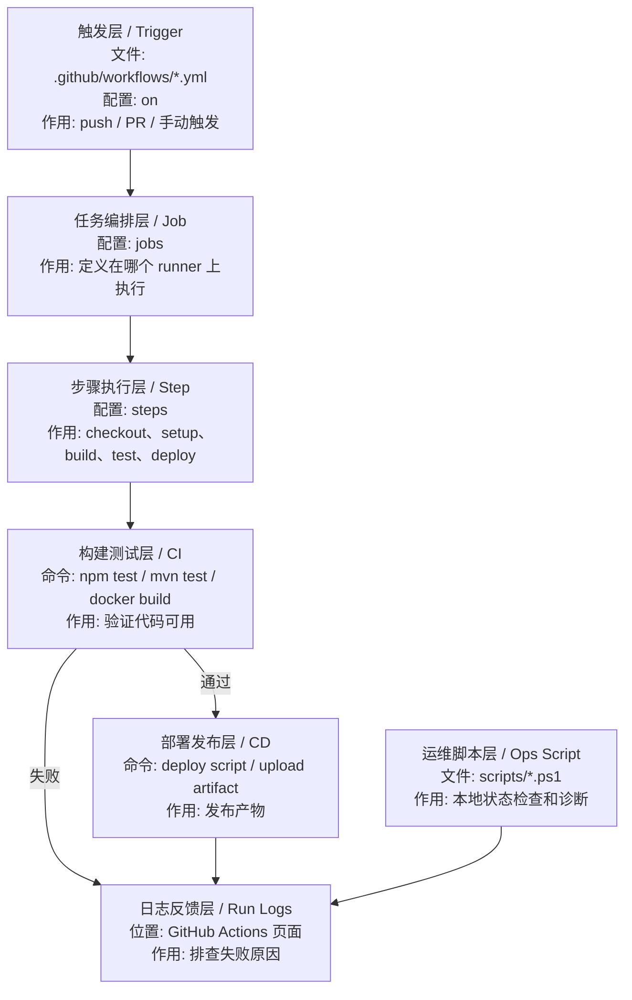

# CI/CD 与自动化运维

## 1. 为什么这两块要放一起

因为对当前工作区来说，最有价值的不是抽象讲 `CI/CD`，而是：

- 看真实工作流怎么写
- 看脚本怎么做状态检查和部署辅助

也就是说，这一章更偏：

- `GitHub Actions + PowerShell 运维脚本`

## 2. 这一阶段要掌握什么

- `CI` 和 `CD` 的区别
- `GitHub Actions` 基本结构
- 工作流里的 job / step
- 自动化检查脚本
- 自动化部署意识

## 3. 当前工作区里的教程

- [GitHub学生版学习与DevOps实践教程.md](D:/dev/source_code/vscode_study/softbs/github/GitHub%E5%AD%A6%E7%94%9F%E7%89%88%E5%AD%A6%E4%B9%A0%E4%B8%8EDevOps%E5%AE%9E%E8%B7%B5%E6%95%99%E7%A8%8B.md)
- [GitHub学生版14天DevOps学习打卡计划.md](D:/dev/source_code/vscode_study/softbs/github/GitHub%E5%AD%A6%E7%94%9F%E7%89%8814%E5%A4%A9DevOps%E5%AD%A6%E4%B9%A0%E6%89%93%E5%8D%A1%E8%AE%A1%E5%88%92.md)
- [Codespaces学习要点.md](D:/dev/source_code/vscode_study/softbs/github/Codespaces%E5%AD%A6%E4%B9%A0%E8%A6%81%E7%82%B9.md)

## 4. 当前工作区里的现成示例

### GitHub Actions

- [jtproject-ci.yml](D:/dev/source_code/vscode_study/.github/workflows/jtproject-ci.yml)
- [jtproject-deploy.yml](D:/dev/source_code/vscode_study/.github/workflows/jtproject-deploy.yml)
- [jtproject-deploy-safe.yml](D:/dev/source_code/vscode_study/.github/workflows/jtproject-deploy-safe.yml)
- [deploy-softbs-pages.yml](D:/dev/source_code/vscode_study/.github/workflows/deploy-softbs-pages.yml)

### 自动化运维脚本

- [scripts/README.md](D:/dev/source_code/vscode_study/java-projects/JtProject/scripts/README.md)
- [monitor-status.ps1](D:/dev/source_code/vscode_study/scripts/localstack/monitor-status.ps1)
- [diagnostic.ps1](D:/dev/source_code/vscode_study/scripts/localstack/diagnostic.ps1)

## 5. 最小教程

先把最小 `CI/CD` 链路理解成：

1. 代码提交
2. 自动执行检查或构建
3. 自动部署或生成产物

而自动化运维可以先理解成：

1. 自动检查状态
2. 自动收集日志
3. 自动执行常见运维动作

## 5.1 CI/CD 在 DevOps 里的处理流程

| 顺序 | DevOps 层 | 文件 / 配置 | 输入是什么 | 输出是什么 | 作用 |
| --- | --- | --- | --- | --- | --- |
| 1 | 触发层 | `.github/workflows/*.yml` -> `on` | push、PR、手动运行 | workflow run | 决定什么时候执行 |
| 2 | 任务编排层 | `jobs` | workflow 配置 | 一个或多个 job | 定义执行环境和任务 |
| 3 | 步骤执行层 | `steps` | job 环境 | step 执行结果 | 按顺序执行 checkout、build、test |
| 4 | CI 层 | build / test 命令 | 源码 | 检查结果 | 判断代码是否能合并或发布 |
| 5 | CD 层 | deploy workflow / script | 构建产物 | 部署结果 | 把应用发布到目标环境 |
| 6 | 日志反馈层 | GitHub Actions logs | 每个 step 输出 | 错误原因 | 支持排障和重试 |
| 7 | 运维自动化层 | `scripts/*.ps1` | 本地服务状态 | 状态报告 | 辅助日常检查和诊断 |

## 6. 最小示例

这一章最适合先看的不是自己新写工作流，而是先读现成的工作流文件。

例如先看：

- [jtproject-ci.yml](D:/dev/source_code/vscode_study/.github/workflows/jtproject-ci.yml)

学习目标是：

- 看懂触发条件
- 看懂 job 在做什么
- 看懂哪些步骤是构建、哪些是部署

## 7. 练习题

### 练习 1

读一个 `GitHub Actions` 工作流，并写下：

- 什么时候触发
- 做了哪些步骤

### 练习 2

比较 `jtproject-deploy.yml` 和 `jtproject-deploy-safe.yml` 的区别。

### 练习 3

运行一个状态检查脚本，并解释它检查了什么。

### 练习 4

自己给某个脚本加一条日志输出或检查项。

## 8. 学到什么程度算过关

- 能解释 `CI` 和 `CD` 的区别
- 能读懂一个基础 `GitHub Actions` 工作流
- 能运行现有自动化脚本
- 能自己改一个小脚本
