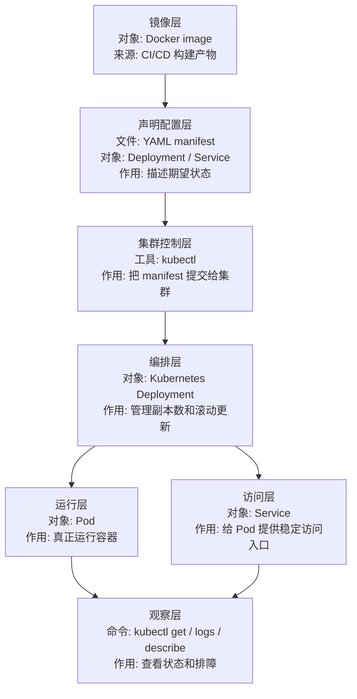

# Kubernetes 入口

## 1. 先说结论

你这个工作区里，`Kubernetes` 目前不是强项。

更准确地说：

- 有零散痕迹
- 但没有像 `Docker`、`CI/CD` 那样成体系的教程和示例

所以这篇的目标不是假装“已经有完整 `Kubernetes` 学习线”，而是明确：

- 当前有什么
- 当前缺什么
- 后面应该怎么补

## 2. 当前工作区里和 Kubernetes 相关的内容

最接近的入口是：

- [Codespaces学习要点.md](D:/dev/source_code/vscode_study/softbs/github/Codespaces%E5%AD%A6%E4%B9%A0%E8%A6%81%E7%82%B9.md)

这里提到了：

- `kubectl`
- `kind`
- `k3d`
- 容器化与云原生入门

另外仓库里也有一些代码痕迹，但不适合作为你的主学习入口。

## 3. 当前阶段应该怎么学

建议顺序是：

1. 先把 `Docker` 学会
2. 先把 `CI/CD` 和自动化脚本看懂
3. 再补 `Kubernetes` 基础概念

不要反过来。

因为如果：

- 容器是什么
- 镜像怎么跑
- 服务怎么部署

这些都还不稳，直接学 `Kubernetes` 会很空。

## 4. 这一章最该掌握的概念

当前阶段你只需要先建立这些概念：

- `Pod`
- `Deployment`
- `Service`
- `kubectl`
- 为什么需要编排

## 4.1 Kubernetes 在 DevOps 里的位置

| Kubernetes 层 | 文件 / 对象 / 命令 | 是什么 | 核心作用 |
| --- | --- | --- | --- |
| 镜像层 | Docker image | 应用的可运行包 | 给 Pod 提供容器镜像 |
| 声明配置层 | YAML manifest | 期望状态说明书 | 描述要创建什么资源 |
| 集群控制层 | `kubectl apply` | 提交配置的命令 | 把 YAML 交给集群 |
| 编排层 | Deployment | 管理 Pod 副本的资源 | 负责滚动更新和副本维护 |
| 运行层 | Pod | Kubernetes 最小运行单元 | 真正运行容器 |
| 访问层 | Service | 稳定访问入口 | 让外部或集群内访问 Pod |
| 观察层 | `kubectl get/logs/describe` | 状态和日志命令 | 排查部署和运行问题 |

## 5. 练习题

### 练习 1

用自己的话解释：

- `Docker` 解决了什么问题
- `Kubernetes` 又多解决了什么问题

### 练习 2

从 `Codespaces学习要点.md` 里整理出和 `Kubernetes` 有关的关键词。

### 练习 3

写一段自己的学习计划，说明什么时候开始补 `Kubernetes`。

## 6. 后续补法建议

如果后面要把这条线补完整，最值得新增的是：

- 一个 `Kubernetes` 基础教程
- 一个 `kind` 或 `k3d` 本地练习模板
- 一个最小部署示例

当前阶段先把它记为：

- 后续明确缺口
