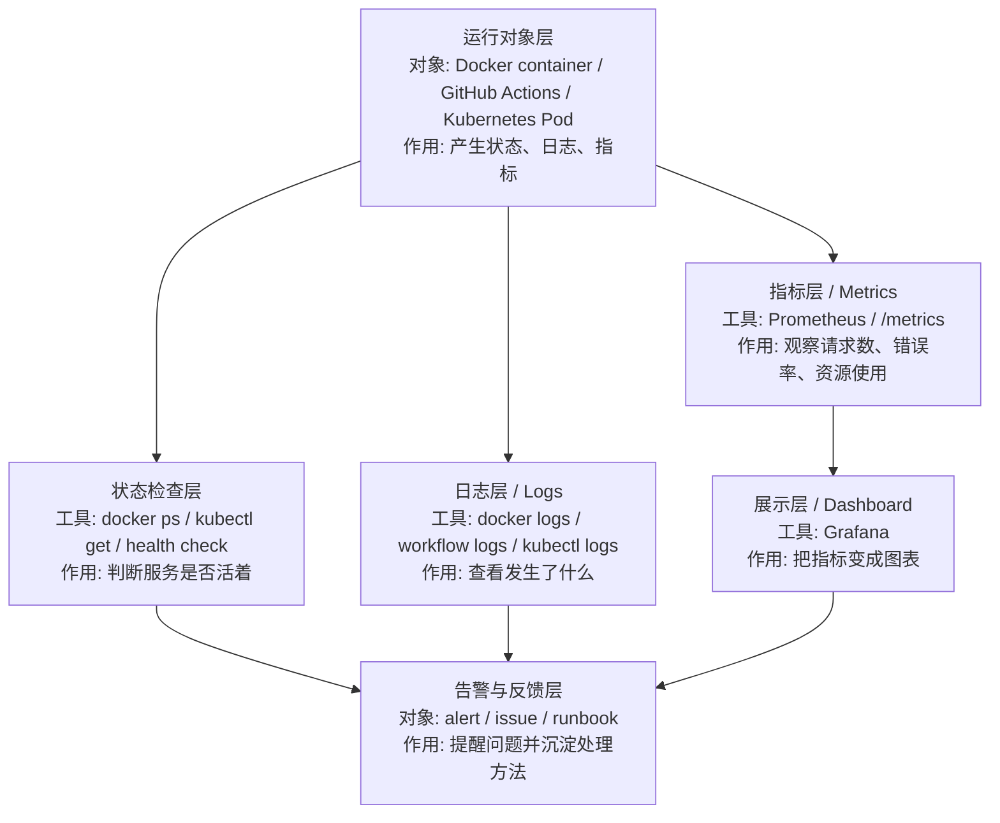

# 监控与可观测性入口

## 1. 这篇是干什么的

前面的内容让你先把下面几件事跑起来：

- `Docker`
- `GitHub Actions`
- 自动化运维脚本
- `Kubernetes` 最小练习

但如果只会“启动成功”，还不够接近真实 `DevOps / SRE` 工作。

这一篇的作用是补一个入口认知：

- 为什么要做监控
- 什么叫可观测性
- 最小应该先看哪些信号
- 在你当前工作区里，哪些材料已经算“监控 / 排障”的起点

这篇仍然是入口，不是假装当前仓库已经有完整监控平台实战。

## 2. 先说结论

如果只记一句话，可以记成：

- 监控不是为了“看图”，而是为了更快发现问题、定位问题、解释问题。

更具体一点：

- `Monitoring`：持续看系统是不是正常
- `Observability`：出问题时，能不能靠日志、指标、状态信息把原因找出来

所以你现在最该先建立的，不是复杂平台，而是最小意识：

- 看状态
- 看日志
- 看错误
- 看资源占用
- 看请求结果

## 3. 最小框架

入门时可以先把可观测性拆成 3 类：

### 指标 Metrics

最常见的是：

- CPU
- 内存
- 磁盘
- 网络
- 请求数量
- 错误率
- 响应时间

你可以把它理解成：

- “系统现在整体怎么样”

### 日志 Logs

最常见的是：

- 应用日志
- 容器日志
- 启动失败日志
- 部署日志
- 工作流执行日志

你可以把它理解成：

- “刚才到底发生了什么”

### 链路 / 过程 Traces

更偏后面的内容，包括：

- 一个请求经过了哪些服务
- 哪一步慢
- 哪一步报错

你可以把它理解成：

- “问题到底卡在哪一段”

对你当前阶段来说，最先该抓牢的是：

- 指标的基本概念
- 日志和状态检查

`Trace` 可以先知道，不用现在深挖。

## 3.1 可观测性处理流程

| 可观测性层 | 工具 / 文件 | 输入是什么 | 输出是什么 | 作用 |
| --- | --- | --- | --- | --- |
| 运行对象层 | Docker / Actions / Kubernetes | 应用运行过程 | 状态、日志、指标 | 产生可观察信号 |
| 状态检查层 | `docker ps` / health check / `kubectl get` | 服务或资源 | running、failed、ready 等状态 | 快速判断是否正常 |
| 日志层 | `docker logs` / workflow logs / `kubectl logs` | 程序输出 | 错误堆栈、启动日志、执行过程 | 解释发生了什么 |
| 指标层 | `/metrics` / Prometheus | 指标端点 | 时间序列数据 | 观察趋势和异常 |
| 展示层 | Grafana | Prometheus 数据 | dashboard | 让状态更容易被人理解 |
| 反馈层 | Runbook / Issue / PR | 故障信息 | 修复任务或操作手册 | 把问题变成改进 |

## 4. 当前工作区里已经有什么

虽然你这个工作区没有完整的 `Prometheus + Grafana + Loki` 实战线，但已经有一批很适合拿来建立监控意识的材料。

### 状态检查

- [monitor-status.ps1](D:/dev/source_code/vscode_study/scripts/localstack/monitor-status.ps1)
- [diagnostic.ps1](D:/dev/source_code/vscode_study/scripts/localstack/diagnostic.ps1)
- [verify-localstack.ps1](D:/dev/source_code/vscode_study/scripts/localstack/verify-localstack.ps1)

这些文件对应的是最朴素、但很真实的第一层能力：

- 服务活着没有
- 端口通不通
- 基本状态对不对
- 某个本地依赖是不是正常

### 日志排障

- [如何查看LocalStack日志.md](D:/dev/source_code/vscode_study/localstack-lab/%E5%A6%82%E4%BD%95%E6%9F%A5%E7%9C%8BLocalStack%E6%97%A5%E5%BF%97.md)
- [TROUBLESHOOTING.md](D:/dev/source_code/vscode_study/localstack-lab/TROUBLESHOOTING.md)

这些材料对应的是第二层能力：

- 出问题时先去哪看
- 日志里哪些信息最关键
- 怎么把“服务没起来”拆成更具体的问题

### 工作流日志

- [jtproject-ci.yml](D:/dev/source_code/vscode_study/.github/workflows/jtproject-ci.yml)
- [deploy-softbs-pages.yml](D:/dev/source_code/vscode_study/.github/workflows/deploy-softbs-pages.yml)

这部分对应的是：

- `CI/CD` 失败时去哪里看
- 是构建失败、测试失败，还是部署失败
- 日志是不是能支持你快速回滚或重试

## 5. 为什么这一章应该接在这里

现在把“监控与可观测性”放在 `11`，是因为顺序更现实：

1. 先学会把东西跑起来
2. 再学会自动构建和自动部署
3. 再学会在本地做最小编排
4. 最后补“怎么观察系统是不是正常”

如果一开始就学 `Prometheus`、`Grafana`、告警规则，很容易变成：

- 名词知道不少
- 但不知道该监控什么
- 也不知道问题通常长什么样

所以更现实的顺序仍然是：

- `Docker -> CI/CD -> 自动化运维 -> Kubernetes -> 监控与可观测性`

## 6. 最小学习范围

这一章先补这些就够：

- 健康检查 `health check`
- 日志查看
- 错误定位
- 服务状态检查
- 基本资源指标
- 最小告警意识

其中“最小告警意识”不是让你现在就搭一整套告警系统，而是先知道：

- 什么叫异常
- 什么指标值得盯
- 什么报错应该第一时间看

## 7. 你现在可以怎么练

### 练习 1：把状态检查和日志关联起来

做法：

1. 跑一个状态检查脚本
2. 发现异常后去看对应日志
3. 用自己的话记录“状态异常”和“日志信息”的对应关系

目标：

- 不只是知道“失败了”
- 而是能说出“为什么失败”

### 练习 2：给一个脚本补更多输出

做法：

1. 选一个现有 `PowerShell` 脚本
2. 多补一项状态输出
3. 让输出更适合排障阅读

目标：

- 从“会运行脚本”升级到“会改检查脚本”

### 练习 3：看一次 GitHub Actions 失败日志

做法：

1. 打开一个现有 workflow
2. 假设某个 step 失败
3. 用自己的话说明你会先看哪一步、怎么看日志

目标：

- 建立 `CI/CD` 也是一种可观测性场景的意识

### 练习 4：写一个最小监控清单

可以按这个格式：

| 对象 | 需要观察什么 | 异常表现 |
| --- | --- | --- |
| Docker 容器 | 是否运行、日志是否报错 | 容器退出、端口不通 |
| GitHub Actions | workflow 是否成功 | job 失败、某 step 报错 |
| 本地服务 | 健康检查、响应时间 | 无响应、返回 500 |
| Kubernetes 练习集群 | Pod 状态、Service 是否可访问 | Pod CrashLoopBackOff、访问失败 |

目标：

- 开始形成“上线后要看什么”的习惯

## 8. 现阶段不必急着补的内容

下面这些很重要，但不用抢主线：

- `Prometheus`
- `Grafana`
- `Loki`
- `OpenTelemetry`
- 分布式追踪平台
- 复杂告警平台

这些内容更适合在你已经有下面经验之后再补：

- 容器练过
- workflow 看过
- 基本脚本改过
- `kind / k3d` 本地演练跑过

## 9. 衔接建议

如果你已经把 `01` 到 `10` 走过一遍，这一章后面建议做两个方向之一：

- 方向 1：给现有脚本补更多健康检查和日志提示
- 方向 2：后续单独补一篇 `Prometheus + Grafana` 最小入门

也就是说，这一章是把这条线补完整的“入口”，不是终点。

## 10. 下一步学什么

学完这一章后，建议回头做一次小收尾：

1. 用 [QUICK_REFERENCE.md](D:/dev/source_code/vscode_study/devops-lab/QUICK_REFERENCE.md) 复盘整条线
2. 选一个模板项目再跑一遍：
   - [docker-actions-demo/README.md](D:/dev/source_code/vscode_study/devops-lab/templates/docker-actions-demo/README.md)
   - [k8s-hello-nginx/README.md](D:/dev/source_code/vscode_study/devops-lab/templates/k8s-hello-nginx/README.md)
3. 记录你自己的第一版“排障与监控清单”
