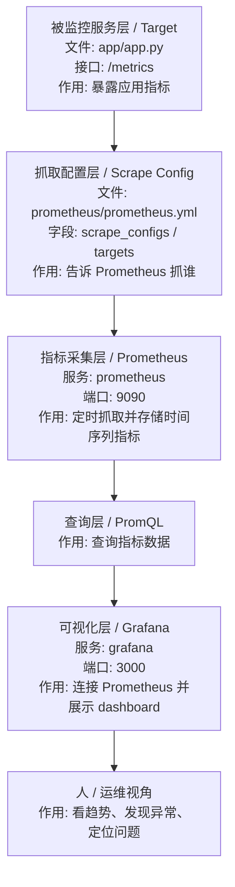

# Prometheus + Grafana 最小入门

## 1. 这篇是干什么的

[11-监控与可观测性入口.md](D:/dev/source_code/vscode_study/devops-lab/11-%E7%9B%91%E6%8E%A7%E4%B8%8E%E5%8F%AF%E8%A7%82%E6%B5%8B%E6%80%A7%E5%85%A5%E5%8F%A3.md) 讲的是“为什么要监控、先看什么”。

这一篇往前再推一步：

- 认识 `Prometheus`
- 认识 `Grafana`
- 知道它们怎么配合
- 学会一个最小可运行监控栈长什么样

目标不是一步到位变成生产级方案，而是先把：

- 采集
- 存储
- 查询
- 看板展示

这条最小链路建立起来。

## 2. 先说结论

如果只记一句话，可以记成：

- `Prometheus` 负责抓和存指标，`Grafana` 负责把指标变成图表和看板。

最小链路可以理解成：

1. 某个服务暴露指标
2. `Prometheus` 定时去抓
3. `Grafana` 读取 `Prometheus`
4. 你在面板上看趋势和异常

## 3. 两个核心角色

### Prometheus 做什么

它最核心的工作是：

- 抓取指标 `scrape`
- 存储时间序列数据
- 用 `PromQL` 查询

你可以把它理解成：

- “监控数据仓库 + 查询引擎”

### Grafana 做什么

它最核心的工作是：

- 连接数据源
- 配 dashboard
- 画图
- 做简单告警展示

你可以把它理解成：

- “监控数据可视化界面”

## 4. 最小监控栈长什么样

最小实践里，通常有 3 个对象：

- 一个被监控服务
- 一个 `Prometheus`
- 一个 `Grafana`

如果被监控对象本身不会暴露指标，还会多一个 exporter。

最常见的 exporter 思路：

- `node_exporter`：主机资源
- `cadvisor`：容器资源
- 应用自己的 `/metrics` 接口：应用指标

你当前阶段先把下面这个最小组合记住就够：

- `Prometheus + Grafana + 被监控对象`

## 4.1 Prometheus / Grafana 数据流



| 顺序 | 监控层 | 文件 / 服务 / 配置 | 输入是什么 | 输出是什么 | 作用 |
| --- | --- | --- | --- | --- | --- |
| 1 | 被监控服务层 | `app/app.py` -> `/metrics` | 应用运行状态 | metrics 文本 | 暴露可被抓取的指标 |
| 2 | 抓取配置层 | `prometheus/prometheus.yml` | target 地址 | scrape 配置 | 告诉 Prometheus 去哪里抓 |
| 3 | 指标采集层 | `prometheus` 服务 | `/metrics` 数据 | 时间序列数据 | 定时抓取并保存指标 |
| 4 | 查询层 | PromQL | 指标名和查询条件 | 查询结果 | 从指标库里取数据 |
| 5 | 可视化层 | `grafana` 服务 | Prometheus 查询结果 | dashboard 图表 | 让人更容易看趋势 |
| 6 | 排障反馈层 | 人 / Runbook / Issue | 图表和日志线索 | 排查结论 | 判断是否需要修复或告警 |

## 5. 最小配置要看什么

### Prometheus 关注两个点

第一，配置抓谁：

- `scrape_configs`

第二，多久抓一次：

- `scrape_interval`

所以你第一次看 `prometheus.yml`，重点不是全部细节，而是先找到：

- 全局抓取频率
- 监控目标地址
- job 名字

### Grafana 关注两个点

第一，数据源有没有接上：

- `Prometheus datasource`

第二，看板是不是能查到数据：

- 一个最小 dashboard panel

## 6. 最小示例

这一节先不要求你现在工作区已经有完整 `docker-compose` 监控项目，而是先看最小配置长什么样。

### 最小 `prometheus.yml`

```yaml
global:
  scrape_interval: 15s

scrape_configs:
  - job_name: "prometheus"
    static_configs:
      - targets: ["localhost:9090"]
```

这份配置表示：

- 每 15 秒抓一次
- 当前先抓 `Prometheus` 自己

这是最小起点，因为你至少能先确认：

- `Prometheus` 自己是否正常
- 数据有没有进来

### 再加一个应用目标时会长这样

```yaml
global:
  scrape_interval: 15s

scrape_configs:
  - job_name: "prometheus"
    static_configs:
      - targets: ["localhost:9090"]

  - job_name: "demo-app"
    static_configs:
      - targets: ["host.docker.internal:8000"]
```

重点只看这两件事：

- `job_name`
- `targets`

## 7. 如果你用 Docker 去练

你当前工作区本来就已经有 `Docker` 学习线，所以最现实的练法是：

1. 先把一个最小服务跑起来
2. 再把 `Prometheus` 跑起来
3. 再把 `Grafana` 跑起来
4. 最后把服务指标接进去

最小思路可以是：

- 一个本地服务暴露 `/metrics`
- `Prometheus` 容器抓这个地址
- `Grafana` 连接 `Prometheus`

你不用一开始就上复杂业务系统。

## 8. 这篇和你前面学过的内容怎么连

### 和 Docker 的关系

`Prometheus`、`Grafana` 最常见的最小练法就是容器化运行。

也就是说，这一章会自然接到：

- [02-Docker与容器.md](D:/dev/source_code/vscode_study/devops-lab/02-Docker%E4%B8%8E%E5%AE%B9%E5%99%A8.md)
- [09-Docker_GitHub_Actions_最小部署演练.md](D:/dev/source_code/vscode_study/devops-lab/09-Docker_GitHub_Actions_%E6%9C%80%E5%B0%8F%E9%83%A8%E7%BD%B2%E6%BC%94%E7%BB%83.md)

### 和自动化运维的关系

你之前已经学过：

- 看状态
- 看日志
- 看工作流失败

现在只是把它从“手工看”往前推进到：

- 定时抓指标
- 看趋势图
- 有固定 dashboard

### 和 Kubernetes 的关系

后面如果你把服务放到 `Kubernetes`，监控思路不会变，只是目标变复杂：

- 抓 Pod
- 抓节点
- 抓 Service
- 做 cluster 视角监控

所以当前顺序仍然合理：

- 先学最小监控栈
- 再想集群监控

## 9. 现阶段最该学会的 4 件事

1. 能解释 `Prometheus` 和 `Grafana` 分工
2. 能看懂最小 `prometheus.yml`
3. 知道什么是一个 metrics endpoint
4. 知道 dashboard 只是结果，不是监控本身

## 10. 常见误区

- 一上来先研究炫酷 dashboard，反而没搞清抓取目标
- 只会导入别人模板，不知道数据从哪来
- 只会看图，不会回到日志和状态排障
- 还没理解应用指标，就先冲复杂告警系统

## 11. 最小练习题

### 练习 1：解释最小链路

用自己的话解释：

- 指标是谁暴露的
- 谁来抓
- 谁来展示

### 练习 2：读懂一个 `prometheus.yml`

至少能说清：

- 抓取频率是多少
- 一共有几个 job
- 每个 job 抓谁

### 练习 3：写一版自己的监控对象清单

按这个格式：

| 对象 | 指标 | 为什么看它 |
| --- | --- | --- |
| 本地服务 | 响应时间、错误数 | 判断服务是否可用 |
| Docker 容器 | CPU、内存 | 判断容器是否异常 |
| GitHub Actions | 成功率、失败次数 | 判断交付链路是否稳定 |

### 练习 4：把手工检查和监控平台对应起来

举例说明：

- `monitor-status.ps1` 看的东西，未来哪些可以进入 `Prometheus`
- 日志排障和 dashboard 各自解决什么问题

## 12. 过关标准

学完这一章，至少要达到：

- 你能解释 `Prometheus + Grafana` 的最小架构
- 你能看懂一个最小 `prometheus.yml`
- 你能说出自己最先想监控的 3 个对象
- 你知道监控不是替代日志，而是和日志一起工作

## 13. 下一步学什么

学完这一章后，最自然的后续有两个方向：

- 方向 1：补一个 `docker-compose` 版最小监控栈模板
- 方向 2：补一个 `Kubernetes` 下的 `Prometheus / Grafana` 入口

如果继续保持当前这条主线，建议下一步优先做方向 1。
