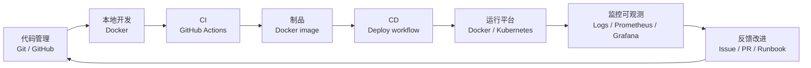

# DevOps Lab

面向当前工作区已有材料整理的 `DevOps / SRE` 学习入口。

这条线不是从零堆概念，而是优先复用你这个工作区里已经存在的：

- `Docker` 教程
- `CI/CD` 工作流示例
- 自动化运维脚本
- 日志与排障资料

当前这条线的现实情况是：

- `Docker`：材料较多
- `CI/CD`：已有真实工作流示例
- 自动化运维：有脚本和排障资料
- `Kubernetes`：只有入门入口，仍是缺口
- 监控与可观测性：有日志和检查脚本基础，但还没有平台化教程
- `Prometheus / Grafana`：现在补到了最小入门层
- `docker-compose` 最小监控栈：现在有可直接运行模板

## 快速入口

如果你现在只想知道“先看什么”，直接按这个顺序：

1. [00-DevOps系统学习路线.md](00-DevOps系统学习路线.md)
2. [01-学习路线.md](01-学习路线.md)
3. [02-Docker与容器.md](02-Docker与容器.md)
4. [03-CI_CD与自动化运维.md](03-CI_CD与自动化运维.md)
5. [05-Kubernetes最小入门.md](05-Kubernetes最小入门.md)
6. [06-GitHub_Actions最小示例项目页.md](06-GitHub_Actions最小示例项目页.md)
7. [07-kind_k3d本地练习模板页.md](07-kind_k3d本地练习模板页.md)
8. [08-自己写第一个GitHub_Actions_Workflow.md](08-自己写第一个GitHub_Actions_Workflow.md)
9. [09-Docker_GitHub_Actions_最小部署演练.md](09-Docker_GitHub_Actions_最小部署演练.md)
10. [10-kind_k3d_hello_nginx_本地实操页.md](10-kind_k3d_hello_nginx_本地实操页.md)
11. [11-监控与可观测性入口.md](11-监控与可观测性入口.md)
12. [12-Prometheus_Grafana最小入门.md](12-Prometheus_Grafana最小入门.md)
13. [13-docker-compose_最小监控栈演练页.md](13-docker-compose_最小监控栈演练页.md)

## 系统分层总览



## 这套资料怎么用

建议按下面这个方式使用：

1. 先看一篇教程文档
2. 再跑工作区里的对应示例
3. 再自己改一版脚本或配置
4. 再进入下一篇

也就是说，不要只看概念。

更好的节奏是：

- 教程负责讲清思路
- 工作区里的现成文件负责给你真实例子
- 自己改脚本和配置负责真正学会

## 主线结论

如果只记一条线，记这个就够了：

- `Docker -> CI/CD -> 自动化运维 -> Kubernetes 基础 -> 监控与可观测性入口 -> Prometheus / Grafana 最小入门 -> docker-compose 最小监控栈`

对应的学习原则是：

- 先把容器和脚本用起来
- 先看真实工作流
- 先学会排障和日志
- 再补 `Kubernetes`
- 最后把状态检查、日志和监控意识串起来
- 再推进到最小监控栈
- 再把最小模板真正跑起来

## 每一篇是干什么的

- [00-DevOps系统学习路线.md](00-DevOps系统学习路线.md)
  - 从系统分层角度说明 `DevOps` 全流程
- [01-学习路线.md](01-学习路线.md)
  - 给出学习顺序和当前工作区里的材料分布
- [02-Docker与容器.md](02-Docker与容器.md)
  - 学 `Docker Desktop`、容器、日志、排障、LocalStack 相关示例
- [03-CI_CD与自动化运维.md](03-CI_CD与自动化运维.md)
  - 学 `GitHub Actions`、部署工作流、脚本化运维和状态检查
- [04-Kubernetes入口.md](04-Kubernetes入口.md)
  - 说明当前工作区里的 `Kubernetes` 缺口和后续补法
- [05-Kubernetes最小入门.md](05-Kubernetes最小入门.md)
  - 补最小 `Kubernetes` 概念和 YAML 结构
- [06-GitHub_Actions最小示例项目页.md](06-GitHub_Actions最小示例项目页.md)
  - 用当前工作区真实工作流讲最小 `CI/CD`
- [07-kind_k3d本地练习模板页.md](07-kind_k3d本地练习模板页.md)
  - 补本地 `kind / k3d` 练习路径
- [08-自己写第一个GitHub_Actions_Workflow.md](08-自己写第一个GitHub_Actions_Workflow.md)
  - 补自己写第一个 workflow 的最小教程
- [09-Docker_GitHub_Actions_最小部署演练.md](09-Docker_GitHub_Actions_最小部署演练.md)
  - 补一个真正可串起来的 `Docker + GitHub Actions` 最小演练
- [10-kind_k3d_hello_nginx_本地实操页.md](10-kind_k3d_hello_nginx_本地实操页.md)
  - 补一个真正可执行的本地 `Kubernetes` 小演练
- [11-监控与可观测性入口.md](11-监控与可观测性入口.md)
  - 补日志、状态检查、最小指标意识和后续监控平台补法
- [12-Prometheus_Grafana最小入门.md](12-Prometheus_Grafana最小入门.md)
  - 补 `Prometheus`、`Grafana`、最小监控栈和后续模板方向
- [13-docker-compose_最小监控栈演练页.md](13-docker-compose_最小监控栈演练页.md)
  - 把 `Prometheus + Grafana + demo-app` 做成真正可跑的最小演练

## 当前工作区里最值得先看的现成材料

### Docker

- [DOCKER_INSTALL_GUIDE.md](../scripts/docker/DOCKER_INSTALL_GUIDE.md)
- [TROUBLESHOOTING.md](../localstack-lab/TROUBLESHOOTING.md)
- [如何查看LocalStack日志.md](../localstack-lab/如何查看LocalStack日志.md)
- [UM890Pro_Win11_WSL2_Docker_Java_Python_本地模型辅助开发教程.md](../softbs/UM890Pro_Win11_WSL2_Docker_Java_Python_本地模型辅助开发教程.md)

### CI/CD

- [jtproject-ci.yml](../.github/workflows/jtproject-ci.yml)
- [jtproject-deploy.yml](../.github/workflows/jtproject-deploy.yml)
- [jtproject-deploy-safe.yml](../.github/workflows/jtproject-deploy-safe.yml)
- [deploy-softbs-pages.yml](../.github/workflows/deploy-softbs-pages.yml)
- [GitHub学生版学习与DevOps实践教程.md](../softbs/github/GitHub学生版学习与DevOps实践教程.md)

### 自动化运维

- [scripts/README.md](../java-projects/JtProject/scripts/README.md)
- [monitor-status.ps1](../scripts/localstack/monitor-status.ps1)
- [diagnostic.ps1](../scripts/localstack/diagnostic.ps1)
- [verify-localstack.ps1](../scripts/localstack/verify-localstack.ps1)
- [如何查看LocalStack日志.md](../localstack-lab/如何查看LocalStack日志.md)

### Kubernetes

- [Codespaces学习要点.md](../softbs/github/Codespaces学习要点.md)

## 当前目录结构

```text
devops-lab/
|-- README.md
|-- QUICK_REFERENCE.md
|-- 01-学习路线.md
|-- 02-Docker与容器.md
|-- 03-CI_CD与自动化运维.md
|-- 04-Kubernetes入口.md
|-- 05-Kubernetes最小入门.md
|-- 06-GitHub_Actions最小示例项目页.md
|-- 07-kind_k3d本地练习模板页.md
|-- 08-自己写第一个GitHub_Actions_Workflow.md
|-- 09-Docker_GitHub_Actions_最小部署演练.md
|-- 10-kind_k3d_hello_nginx_本地实操页.md
|-- 11-监控与可观测性入口.md
|-- 12-Prometheus_Grafana最小入门.md
`-- templates/
    |-- docker-actions-demo/
    |-- k8s-hello-nginx/
    `-- prometheus-grafana-demo/
```
