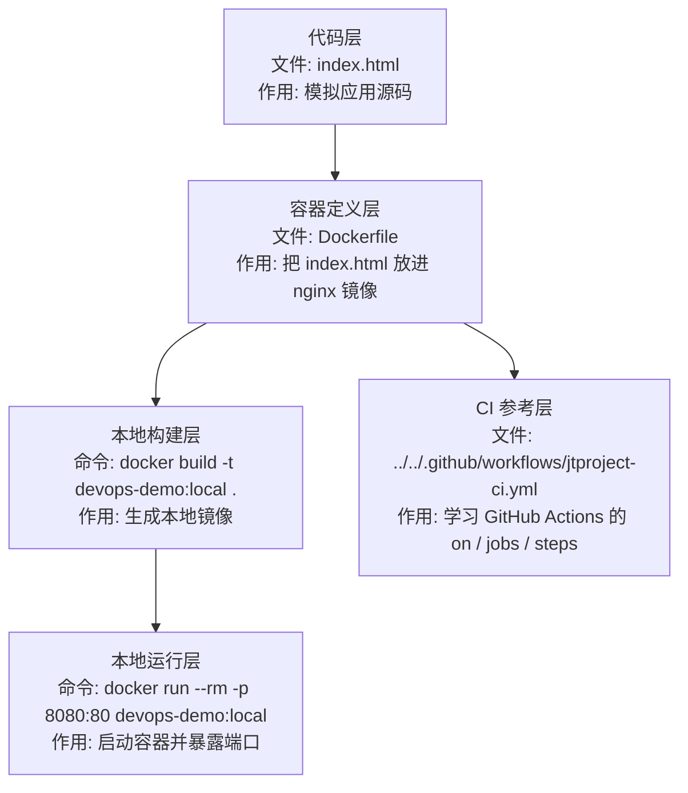

# docker-actions-demo

最小可运行的 `Docker + GitHub Actions` 练习模板。

这个模板解决的问题是：

- 用最小静态页面练 `Dockerfile`
- 本地构建并运行容器
- 用最小 `GitHub Actions` 工作流验证镜像能构建

## 文件结构

```text
docker-actions-demo/
|-- index.html
|-- Dockerfile
|-- README.md
```

注意：

- 这个目录本身只放最小应用文件。
- 仓库真实可参考的 workflow 在根目录 `.github/workflows/`，例如 `jtproject-ci.yml`。
- 如果你要给这个模板单独加 CI，可以自己创建 `.github/workflows/demo-ci.yml`。

## 这个模板在 DevOps 流程里的位置



| 顺序 | 层 | 文件 / 命令 | 输入是什么 | 输出是什么 | 功能作用 |
| --- | --- | --- | --- | --- | --- |
| 1 | 代码层 | `index.html` | 页面内容 | 静态文件 | 模拟一次业务代码变更 |
| 2 | 容器定义层 | `Dockerfile` | `index.html` 和 nginx 基础镜像 | 镜像构建规则 | 定义如何打包应用 |
| 3 | 本地构建层 | `docker build -t devops-demo:local .` | Dockerfile + 当前目录 | `devops-demo:local` 镜像 | 验证镜像能否构建 |
| 4 | 本地运行层 | `docker run --rm -p 8080:80 devops-demo:local` | 镜像 | 本地 Web 服务 | 验证容器能否运行 |
| 5 | CI 参考层 | `.github/workflows/jtproject-ci.yml` | push / PR | workflow 执行结果 | 学习自动化构建检查 |

## 本地运行

构建镜像：

```bash
docker build -t devops-demo:local .
```

运行容器：

```bash
docker run --rm -p 8080:80 devops-demo:local
```

浏览器访问：

- `http://127.0.0.1:8080`

## GitHub Actions

这个模板目录没有内置 workflow。你可以参考仓库里的真实 workflow：

- [../../../.github/workflows/jtproject-ci.yml](../../../.github/workflows/jtproject-ci.yml)
- [../../../.github/workflows/jtproject-deploy.yml](../../../.github/workflows/jtproject-deploy.yml)

如果自己写 `demo-ci.yml`，最小检查通常包含：

- 检出代码
- 构建 Docker 镜像

## 你可以先改什么

- 改 `index.html` 里的标题
- 改版本号
- 给 workflow 加一个 `echo` 步骤

## 对应教程

- [09-Docker_GitHub_Actions_最小部署演练.md](D:/dev/source_code/vscode_study/devops-lab/09-Docker_GitHub_Actions_%E6%9C%80%E5%B0%8F%E9%83%A8%E7%BD%B2%E6%BC%94%E7%BB%83.md)
- [08-自己写第一个GitHub_Actions_Workflow.md](D:/dev/source_code/vscode_study/devops-lab/08-%E8%87%AA%E5%B7%B1%E5%86%99%E7%AC%AC%E4%B8%80%E4%B8%AAGitHub_Actions_Workflow.md)
