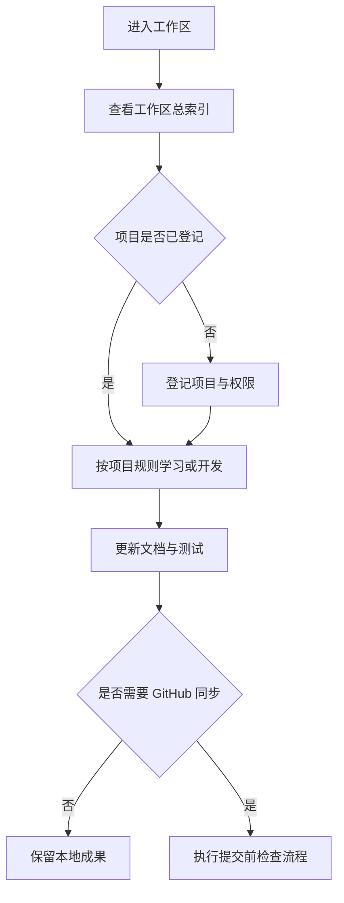
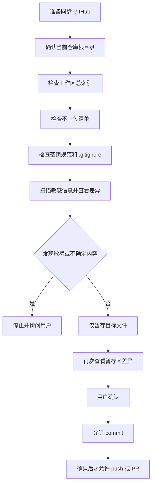
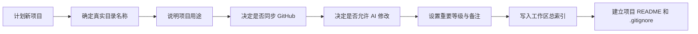

# VSCode Study 工作区管理手册

这份手册写给未来的自己。工作区会越来越大，靠记忆管理很容易遗漏；把规则写下来，可以让自己和 AI Agent 都知道哪些项目能改、哪些文件能上传、每次同步前要检查什么。

## 1. 为什么建立这些规则

这个工作区同时包含学习项目、实验代码、工作资料、投资资料和 API Key。它们的重要程度和公开范围不同。如果不先分类，常见结果是误上传密钥、把私人文件放进公开仓库，或者在错误的 Git 仓库中提交。

治理规则的目标不是增加负担，而是形成稳定习惯：先登记、再开发；先检查、再同步；不确定时先停下来确认。

## 2. 工作区总索引怎么用

打开根目录的 `工作区总索引.md`，先找到准备操作的目录，重点查看：

- 用途：确认自己没有走错项目。
- GitHub同步：为“否”时不得上传。
- AI允许修改：为“否”时，AI 只能阅读，不能编辑。
- 重要等级：星级越高，越要谨慎检查和验证。
- 备注：记录独立仓库、工作资料等特殊限制。

目录用途或权限发生变化时，先更新索引。不要只在脑中记，也不要只告诉某一个 Agent。

## 3. 不上传 GitHub 文件清单怎么维护

根目录的 `不上传GitHub文件清单.md` 是人工维护的禁止上传名单。新增私人、税务、投资、客户或公司资料时，立即把准确文件名写入对应分类；没有合适分类时写入“临时追加”。

清单和 `.gitignore` 的作用不同：清单告诉人和 Agent “为什么不能上传”，`.gitignore` 帮助 Git 自动忽略。重要文件最好两边都维护。

注意：文件如果已经被 Git 跟踪，后来才写入 `.gitignore`，Git 仍可能继续提交它。此时应停止操作并检查暂存区和历史，不要直接推送。

## 4. API Key 怎么管理

把真实 Key 放在项目本地 `.env` 中，通过环境变量读取，例如应用只读取 `OPENROUTER_API_KEY`，而不是把真实值写在代码里。

可以提交 `.env.example` 帮助自己记住需要哪些变量，但里面只能放变量名和无效占位值。不要在教程、日志、截图或聊天复制内容中暴露 Key。

建议为每个服务使用独立、最小权限的 Key。怀疑泄露时，先撤销或轮换，再处理代码和 Git 历史。

## 5. GitHub 同步流程

同步不是直接执行 `git add .`。先确认当前 Git 仓库根目录，再检查索引、禁止清单、密钥规范和 `.gitignore`，最后只暂存计划提交的文件。

推荐检查命令包括 `git status --short`、`git diff` 和 `git diff --cached`。命令只是辅助，不能代替人工判断。

## 6. 新项目如何登记

创建项目目录后，先在 `工作区总索引.md` 新增一行，填写项目名称、用途、是否同步 GitHub、是否允许 AI 修改、重要等级和备注。

暂时无法决定是否公开或是否允许 AI 修改时，默认都填“否”。确认后再放宽，比事后补救更安全。

## 7. Agent 如何遵守规则

任何 Agent 在编辑前要先确定适用的 `AGENTS.md` 和项目边界。在执行 `git add`、`commit`、`push`、PR、发布或 GitHub 同步前，要依次读取四份根级治理文件并扫描敏感信息。

Agent 发现疑似 Key、Token、密码、账号或敏感资料时必须停止并询问，不得自动删除、改名、提交或推送。用户只要求修改代码时，不代表用户授权提交。

## 8. 常见错误

- 在工作区根目录执行 Git 命令，却以为自己位于某个子项目。
- 直接使用 `git add .`，把无关文件和未跟踪资料一起暂存。
- 认为写入 `.gitignore` 后，已经被跟踪的文件会自动消失。
- 把真实 Key 写进 README、教程、测试或日志。
- 提交 `.env`，或者在 `.env.example` 中放真实值。
- 新项目没有登记，导致同步范围和 AI 权限不清楚。
- 只检查文件名，不检查文件内容和暂存区差异。
- 把“可以修改代码”误解成“可以自动 commit 和 push”。

## 9. 推荐工作流程

1. 开始前查看总索引和当前项目规则。
2. 确认当前目录及 Git 仓库根目录。
3. 创建或修改最小范围的文件。
4. 运行与改动对应的验证或测试。
5. 更新学习笔记、README 或教程。
6. 用 `git status --short` 和 `git diff` 检查变化。
7. 对照不上传清单、密钥规范和 `.gitignore`。
8. 需要同步时，先让用户确认文件范围。
9. 用户明确确认后，才执行提交；推送和 PR 仍需明确授权。

长期维护的关键是“小步、可检查、可追踪”。每次只做清楚的一件事，比积累大量未分类改动更容易管理。
