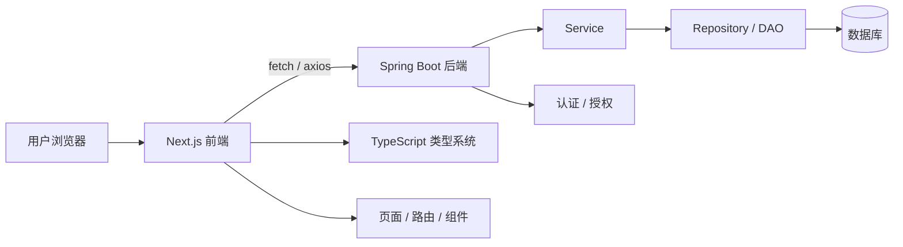
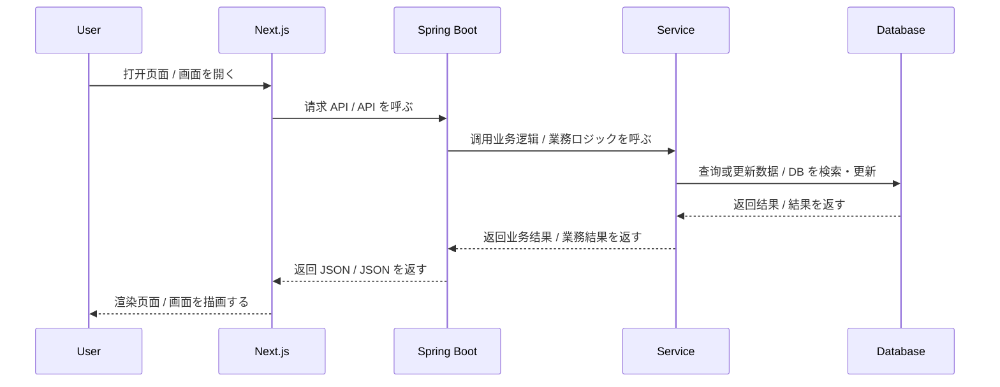

# Spring Boot 与 Next.js 项目结构图 / 流程图

这页用来把 Spring Boot + Next.js + TypeScript 的整体关系画清楚，帮助你从“会搭配”过渡到“会组织项目结构”。

## 1. 总体结构 / 全体構成



## 2. 目录结构图 / ディレクトリ構成図

### Spring Boot 后端 / Spring Boot バックエンド

```text
backend/
|-- src/
|   |-- main/
|   |   |-- java/
|   |   |   `-- com/example/app/
|   |   |       |-- controller/
|   |   |       |-- service/
|   |   |       |-- repository/
|   |   |       |-- entity/
|   |   |       `-- config/
|   |   `-- resources/
|   |       |-- application.yml
|   |       |-- static/
|   |       `-- templates/
|   `-- test/
`-- pom.xml
```

### Next.js 前端 / Next.js フロントエンド

```text
frontend/
|-- app/
|   |-- layout.tsx
|   |-- page.tsx
|   `-- (routes)/
|-- components/
|-- lib/
|-- types/
|-- public/
|-- styles/
`-- package.json
```

## 3. 页面请求流程 / 画面リクエストフロー



## 4. 每层职责 / 各層の役割

| 层 | 中文职责 | 日本語の役割 |
|---|---|---|
| Next.js 页面层 | 页面路由、布局、交互、SSR / SSG | 画面ルーティング、レイアウト、SSR / SSG |
| TypeScript 类型层 | 接口类型、组件 props、状态约束 | API 型、props、状態の制約 |
| Spring Boot Controller | 接收请求、返回响应 | リクエスト受付、レスポンス返却 |
| Spring Boot Service | 业务规则、流程编排 | 業務ルール、処理の組み立て |
| Repository / DAO | 数据访问、SQL 或 ORM | DB アクセス、SQL / ORM |
| Database | 数据持久化 | データ保存 |

## 5. 关键设计点 / 重要な設計ポイント

- 中文：前后端的接口契约要稳定，最好先定义 DTO。
- 日本語：前後端の API 契約は安定させ、先に DTO を決めるとよい。
- 中文：Next.js 的页面、组件、类型文件要分开管理。
- 日本語：Next.js の画面、コンポーネント、型定義は分けて管理する。
- 中文：Spring Boot 的 Controller、Service、Repository 职责要清晰。
- 日本語：Spring Boot の Controller、Service、Repository の責務を明確にする。
- 中文：如果使用 SSR / SSG，认证与缓存要提前设计。
- 日本語：SSR / SSG を使うなら、認証とキャッシュを先に設計する。

## 6. 适合怎么学 / 学び方

1. 先看接口怎么定义。
2. 再看页面怎么组织。
3. 然后看请求如何从 Next.js 走到 Spring Boot。
4. 最后把认证、分页、错误处理、缓存一起补齐。

日本語：
1. まず API 定義を見る。
2. 次に画面構成を見る。
3. その後、Next.js から Spring Boot への流れを追う。
4. 最後に認証、ページング、エラー処理、キャッシュを整える。

## 7. 一句话总结 / 一言まとめ

- 中文：这一页的目的，是把 Spring Boot + Next.js + TypeScript 的“结构、职责和流程”一次看清楚。
- 日本語：このページの目的は、Spring Boot + Next.js + TypeScript の「構成・責務・フロー」を一目で理解できるようにすることです。

## 8. 下一步 / 次のステップ

- [Spring Boot 与 Next.js 前端目录结构 / 组件拆分图](./08-SpringBoot与Nextjs前端目录结构组件拆分图.md)

中文：如果你已经看懂全局结构，下一步就把前端目录和组件拆分再看细一点。

日本語：全体構成が分かったら、次はフロント側のディレクトリとコンポーネント分割を細かく見ると理解しやすいです。
