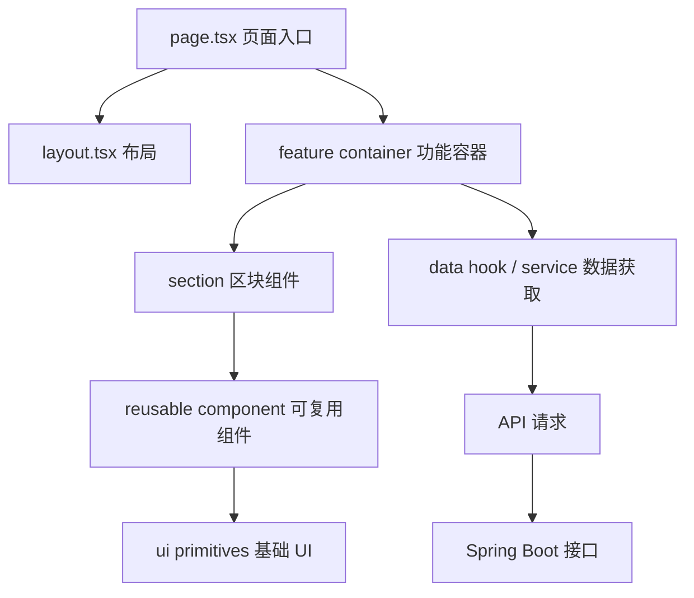
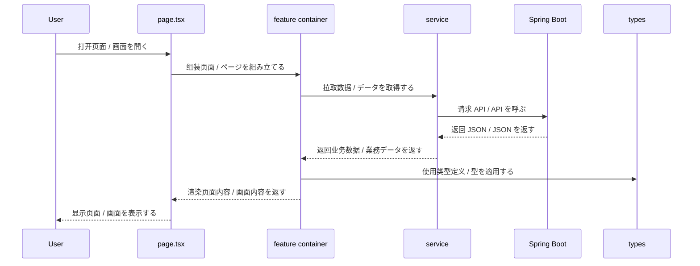
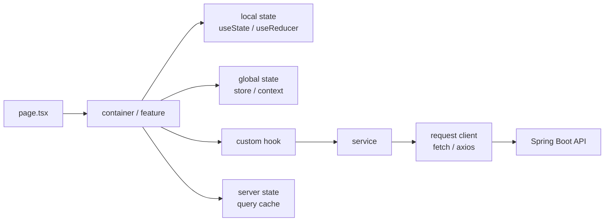

# Spring Boot 与 Next.js 前端目录结构 / 组件拆分图

这页专门把 Next.js 前端部分拆细，帮助你理解页面、组件、类型、请求层和样式层如何协作。

## 1. 这个页面想解决什么 / このページで何を解決するか

- 中文：帮助你看懂 Next.js 前端目录应该怎么分层，以及页面和组件怎么拆。
- 日本語：Next.js のフロントディレクトリをどう分けるか、ページとコンポーネントをどう分解するかを理解するためのページです。

## 2. 前端目录结构图 / フロントディレクトリ構成図

```text
frontend/
|-- app/
|   |-- layout.tsx
|   |-- page.tsx
|   |-- (routes)/
|   |   |-- login/
|   |   |-- products/
|   |   `-- dashboard/
|   `-- api/
|-- components/
|   |-- layout/
|   |-- forms/
|   |-- tables/
|   `-- ui/
|-- features/
|   |-- auth/
|   |-- products/
|   `-- cart/
|-- hooks/
|-- lib/
|-- services/
|-- store/
|-- types/
|-- styles/
|-- public/
`-- package.json
```

## 3. 各目录的职责 / 各ディレクトリの役割

| 目录 | 中文职责 | 日本語の役割 |
|---|---|---|
| app | 页面路由、布局、入口页面 | 画面ルーティング、レイアウト、入口ページ |
| components | 可复用组件 | 再利用可能なコンポーネント |
| features | 按业务域拆分的功能模块 | 業務ドメインごとの機能モジュール |
| hooks | 自定义 Hook | カスタム Hook |
| lib | 工具函数、客户端配置 | ユーティリティ、クライアント設定 |
| services | API 请求封装 | API 呼び出しのラッパー |
| store | 页面状态或共享状态 | 画面状態・共有状態 |
| types | TypeScript 类型定义 | TypeScript 型定義 |
| styles | 全局样式和局部样式 | グローバル / 局所スタイル |
| public | 静态资源 | 静的資産 |

## 4. 页面和组件怎么拆 / ページとコンポーネントの分け方



### 建议拆分方式 / 推奨される分け方

- 中文：page.tsx 只做页面级组装，不写太多业务逻辑。
- 日本語：page.tsx は画面の組み立てに専念し、業務ロジックを詰め込みすぎない。
- 中文：feature 负责某一业务域的状态、请求和展示组合。
- 日本語：feature は特定ドメインの状態・API・表示をまとめる。
- 中文：components 负责可复用 UI，尽量保持无业务依赖。
- 日本語：components は再利用 UI を担当し、業務依存を少なくする。
- 中文：ui 负责按钮、输入框、弹窗这类基础控件。
- 日本語：ui はボタン、入力欄、モーダルなどの基礎部品を担当する。

## 5. 页面请求与渲染流程 / 画面リクエストと描画フロー



## 6. 关键设计点 / 重要な設計ポイント

- 中文：页面层和组件层要分清，不要把页面写成一个巨大的文件。
- 日本語：ページ層とコンポーネント層を分け、大きな 1 ファイルにしない。
- 中文：类型定义要集中管理，接口变更时更容易维护。
- 日本語：型定義は集中管理し、API 変更時の保守性を高める。
- 中文：数据请求建议集中在 service 或 feature 层，不要散落在组件里。
- 日本語：データ取得は service か feature に寄せ、コンポーネントに散らさない。
- 中文：业务模块按 auth、products、cart 这种 domain 分开更容易扩展。
- 日本語：auth、products、cart のようにドメイン単位で分けると拡張しやすい。

## 7. 适合怎么学 / 学び方

1. 先看 app 目录如何定义页面。
2. 再看 components 如何复用。
3. 然后看 feature 如何把请求、状态和 UI 组合起来。
4. 最后把 types、services、store 串起来理解。

日本語：
1. まず app ディレクトリでページ定義を見る。
2. 次に components の再利用を見る。
3. その後、feature で API・状態・UI をどう束ねるかを見る。
4. 最後に types、services、store の連携を理解する。

## 8. 一句话总结 / 一言まとめ

- 中文：这页的目的，是把 Next.js 前端“目录怎么分、页面怎么拆、组件怎么复用”一次讲清楚。
- 日本語：このページの目的は、Next.js フロントの「ディレクトリの分け方、ページの分解、コンポーネントの再利用」を整理して理解することです。

## 9. 状态管理和数据请求层拆分 / 状態管理とデータ取得層の分離



### 常见职责切分 / よくある役割分担

| 层 | 中文职责 | 日本語の役割 |
|---|---|---|
| local state | 控制表单输入、弹窗、切换状态 | 入力、モーダル、切り替え状態を管理する |
| global state | 管理登录态、主题、全局 UI 状态 | ログイン状態、テーマ、全体 UI 状態を管理する |
| server state | 管理从后端拿到的数据 | バックエンドから取得したデータを管理する |
| service | 封装接口调用和参数转换 | API 呼び出しと引数変換をまとめる |
| request client | 统一处理 baseURL、token、错误码 | baseURL、token、エラー処理を統一する |

### 推荐实践 / 推奨プラクティス

- 中文：表单临时状态放在页面或局部组件里。
- 日本語：フォームの一時状態はページか局所コンポーネントに置く。
- 中文：用户信息、登录态、导航菜单这类跨页面状态放在全局层。
- 日本語：ユーザー情報、ログイン状態、ナビゲーションのような跨ページ状態はグローバル層に置く。
- 中文：列表数据、详情数据、搜索结果这类后端数据优先放在 server state 或 hook 里。
- 日本語：一覧、詳細、検索結果のようなバックエンド由来データは server state か hook で扱う。
- 中文：API 错误处理、重试、鉴权刷新尽量收口在 request client。
- 日本語：API エラー処理、リトライ、認証更新は request client にまとめる。

## 10. 典型页面组件树 / 代表的な画面コンポーネントツリー

### 登录页 / ログインページ

```text
app/login/page.tsx
|-- LoginPage
|   |-- AuthCard
|   |   |-- Logo
|   |   |-- LoginForm
|   |   |   |-- EmailField
|   |   |   |-- PasswordField
|   |   |   |-- RememberMeCheckbox
|   |   |   `-- SubmitButton
|   |   `-- OAuthButtons
|   |-- ErrorMessage
|   `-- HelpLink
```

- 中文：登录页重点是表单校验、错误提示和提交流程。
- 日本語：ログインページはフォーム検証、エラー表示、送信フローが中心です。

### 商品页 / 商品ページ

```text
app/products/page.tsx
|-- ProductsPage
|   |-- PageHeader
|   |-- SearchBar
|   |-- FilterPanel
|   |-- ProductGrid
|   |   |-- ProductCard
|   |   |   |-- ProductImage
|   |   |   |-- ProductTitle
|   |   |   |-- PriceTag
|   |   |   `-- AddToCartButton
|   |   `-- EmptyState
|   `-- Pagination
```

- 中文：商品页重点是筛选、分页、列表渲染和加入购物车动作。
- 日本語：商品ページはフィルタ、ページング、一覧描画、カート追加が中心です。

### 仪表盘页 / ダッシュボードページ

```text
app/dashboard/page.tsx
|-- DashboardPage
|   |-- SummaryCards
|   |   |-- RevenueCard
|   |   |-- OrdersCard
|   |   `-- UsersCard
|   |-- ChartSection
|   |   |-- SalesChart
|   |   `-- TrendChart
|   |-- RecentActivityPanel
|   `-- QuickActions
```

- 中文：仪表盘页重点是数据概览、图表和快捷操作区。
- 日本語：ダッシュボードは概要カード、グラフ、クイック操作が中心です。

### 页面拆分判断 / ページ分割の判断

- 中文：如果一个页面同时有表单、列表、图表和多个交互，就应该拆成多个 section。
- 日本語：1 画面にフォーム、一覧、グラフ、複数の操作があるなら、section 単位に分けるべきです。
- 中文：如果组件只负责展示一个小块内容，就放进 reusable component 或 ui 层。
- 日本語：小さな表示単位なら reusable component か ui 層に置く。
- 中文：如果组件要带业务状态，就更适合放在 feature 层。
- 日本語：業務状態を持つなら feature 層に置くほうが適切です。

## 11. 下一步 / 次のステップ

- [Spring Boot 与 Next.js 公共组件库 / UI 原子组件拆分图](./09-SpringBoot与Nextjs公共组件库UI原子组件拆分图.md)

中文：如果页面结构已经看清楚，下一步就看公共组件和原子组件怎么沉淀。

日本語：画面構成が分かったら、次は共通コンポーネントと原子部品の作り方を確認するとよいです。
