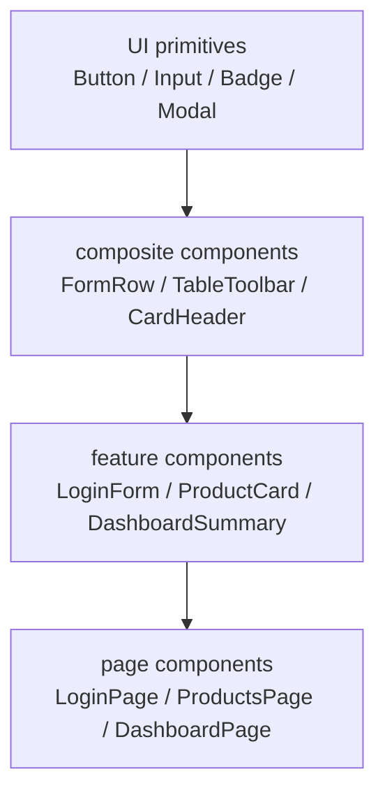
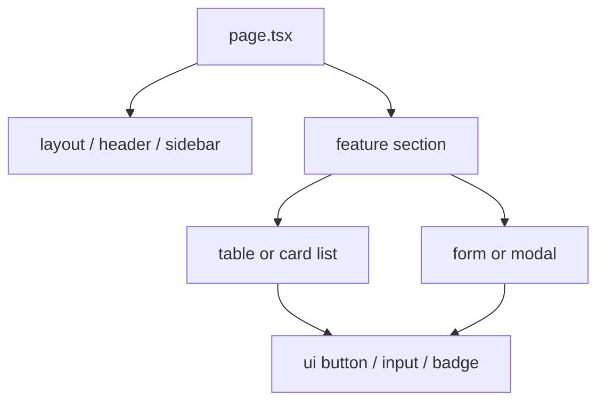

# Spring Boot 与 Next.js 公共组件库 / UI 原子组件拆分图

这页专门把 Next.js 前端里的公共组件库拆出来，帮助你理解基础 UI、组合组件、业务组件和页面之间的边界。

## 1. 这页要解决什么 / このページで何を解決するか

- 中文：帮助你建立“UI 原子组件 -> 公共组件 -> 业务组件 -> 页面”的分层认识。
- 日本語：UI 原子コンポーネント -> 共通コンポーネント -> 業務コンポーネント -> ページ、という層の考え方を整理するためのページです。

## 2. 组件库分层图 / コンポーネントライブラリの階層図



### 各层职责 / 各層の役割

| 层级 | 中文职责 | 日本語の役割 |
|---|---|---|
| UI primitives | 最小可复用控件，尽量无业务逻辑 | 最小単位の再利用部品、業務ロジックを持たない |
| composite components | 将多个原子组件组合成常用模块 | 複数の原子部品をまとめた共通モジュール |
| feature components | 承载某个业务域的展示和交互 | ある業務ドメインの表示と操作を担う |
| page components | 页面级编排和路由入口 | ページ単位の組み立てとルーティング入口 |

## 3. 推荐目录结构 / 推奨ディレクトリ構成

```text
frontend/
|-- app/
|-- components/
|   |-- ui/
|   |   |-- button/
|   |   |-- input/
|   |   |-- badge/
|   |   |-- modal/
|   |   `-- table/
|   |-- composite/
|   |   |-- form-row/
|   |   |-- card-header/
|   |   `-- table-toolbar/
|   `-- layout/
|       |-- header/
|       |-- sidebar/
|       `-- footer/
|-- features/
|-- hooks/
|-- lib/
|-- services/
|-- store/
|-- types/
|-- styles/
`-- public/
```

## 4. UI 原子组件怎么拆 / UI 原子コンポーネントの分け方

### Button

```text
button/
|-- button.tsx
|-- button.types.ts
|-- button.test.tsx
`-- index.ts
```

- 中文：Button 只负责样式、变体、禁用态和点击事件透传。
- 日本語：Button は見た目、バリエーション、無効状態、クリックイベントの受け渡しだけを担当する。

### Input

```text
input/
|-- input.tsx
|-- input.types.ts
|-- input.test.tsx
`-- index.ts
```

- 中文：Input 只负责基础输入能力，不直接承担表单校验业务。
- 日本語：Input は入力の基本機能だけを担当し、フォーム検証の業務ロジックは持たない。

### Modal

```text
modal/
|-- modal.tsx
|-- modal.types.ts
|-- modal.test.tsx
`-- index.ts
```

- 中文：Modal 负责显示、关闭和遮罩层，不绑定具体业务场景。
- 日本語：Modal は表示、閉じる処理、オーバーレイだけを担当し、具体的な業務には依存しない。

## 5. 公共组件和页面怎么组合 / 共通コンポーネントとページの組み立て方



### 常见组合方式 / よくある組み合わせ

- 中文：表单页通常由 Label、Input、Select、Button 和提示组件组合而成。
- 日本語：フォーム画面は Label、Input、Select、Button、補助文言の組み合わせが基本です。
- 中文：列表页通常由 Toolbar、Table、Pagination、EmptyState 组合而成。
- 日本語：一覧画面は Toolbar、Table、Pagination、EmptyState の組み合わせが基本です。
- 中文：详情页通常由 Card、Description、Tabs、Modal 组合而成。
- 日本語：詳細画面は Card、Description、Tabs、Modal の組み合わせが基本です。

## 6. 典型页面的组件使用示意 / 代表的な画面のコンポーネント利用例

### 登录页 / ログインページ

```text
LoginPage
|-- AuthLayout
|   |-- BrandPanel
|   `-- LoginCard
|       |-- Input
|       |-- PasswordInput
|       |-- Checkbox
|       |-- Button
|       `-- ErrorMessage
```

### 商品页 / 商品ページ

```text
ProductsPage
|-- PageHeader
|-- FilterBar
|   |-- Select
|   |-- Input
|   `-- Button
|-- ProductGrid
|   |-- ProductCard
|   |   |-- Badge
|   |   |-- Image
|   |   |-- Text
|   |   `-- Button
|   `-- EmptyState
`-- Pagination
```

### 仪表盘页 / ダッシュボードページ

```text
DashboardPage
|-- SummaryGrid
|   |-- StatCard
|   |-- StatCard
|   `-- StatCard
|-- ChartPanel
|   |-- ChartCard
|   `-- ChartCard
|-- ActivityList
`-- QuickActions
```

## 7. 设计原则 / 設計原則

- 中文：原子组件尽量只解决一个问题，接口越小越好。
- 日本語：原子コンポーネントは 1 つの問題だけを解決し、API は小さく保つ。
- 中文：公共组件不要直接依赖业务域状态。
- 日本語：共通コンポーネントは業務ドメインの状態に直接依存させない。
- 中文：业务变化频繁的内容放到 feature 层，稳定的基础能力放到 ui 层。
- 日本語：変化しやすい業務内容は feature 層へ、安定した基礎機能は ui 層へ置く。
- 中文：组件命名优先按“用途”命名，而不是按“技术细节”命名。
- 日本語：コンポーネント名は技術詳細よりも用途ベースで付ける。

## 8. 适合怎么学 / 学び方

1. 先看 ui 层，理解最小组件边界。
2. 再看 composite 层，理解常用组合方式。
3. 然后看 feature 层，理解业务组件如何复用公共能力。
4. 最后回到 page 层，看路由和布局如何把这些组件拼起来。

日本語：
1. まず ui 層を見て最小部品の境界を理解する。
2. 次に composite 層でよくある組み合わせを理解する。
3. その後 feature 層で業務コンポーネントと共通部品の関係を見る。
4. 最後に page 層でルーティングとレイアウトの組み立てを確認する。

## 9. 一句话总结 / 一言まとめ

- 中文：这页的核心，是把 Next.js 前端的“公共组件库”和“原子组件拆分”讲清楚。
- 日本語：このページの核心は、Next.js フロントの「共通コンポーネント」と「原子コンポーネントの分割」を整理することです。

## 10. 下一步 / 次のステップ

- [Spring Boot 与 Next.js 公共组件库目录规范 / 命名规则](./10-SpringBoot与Nextjs公共组件库目录规范命名规则.md)

中文：如果你已经知道组件层怎么拆，下一步就把目录规范和命名规则统一起来。

日本語：コンポーネントの分け方が分かったら、次はディレクトリ規約と命名規則をそろえるとよいです。
