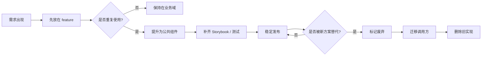
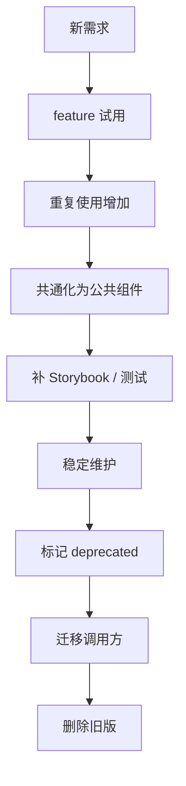

# Spring Boot 与 Next.js 公共组件库版本演进 / 废弃策略

这页把公共组件库从创建到淘汰的生命周期补齐，帮助你把组件当成可演进资产来管理，而不是一次性代码。

## 1. 这页的目标 / このページの目的

- 中文：说明公共组件什么时候创建、什么时候升级、什么时候废弃、什么时候删除。
- 日本語：共通コンポーネントをいつ作り、いつ改善し、いつ廃止し、いつ削除するかを整理するためのページです。

## 2. 生命周期总览 / ライフサイクル概要

## 3. 阶段划分 / フェーズ分け

| 阶段 | 中文说明 | 日本語の説明 |
|---|---|---|
| feature 内试用 | 先在业务目录快速实现 | まず業務ディレクトリで素早く実装する |
| 提升为公共组件 | 复用次数足够后再抽到 components | 再利用が増えたら components に切り出す |
| 稳定维护 | 保持 API 稳定，补测试和示例 | API を安定させ、テストとサンプルを整える |
| 废弃标记 | 新方案可替代但旧调用还很多 | 新方式はあるが旧呼び出しがまだ多い |
| 迁移替换 | 引导调用方逐步切换 | 呼び出し側を段階的に移行する |
| 删除清理 | 所有调用方都已迁移完成 | すべての呼び出し側の移行が完了する |

## 4. 什么时候该提升为公共组件 / 共通化の判断基準

- 中文：同类页面重复出现 3 次以上。
- 日本語：同じような画面で 3 回以上使われる。
- 中文：组件 API 已经稳定，不再频繁改字段。
- 日本語：コンポーネント API が安定していて頻繁に変わらない。
- 中文：不依赖特定业务域状态。
- 日本語：特定の業務状態に強く依存していない。
- 中文：测试和 Storybook 可以覆盖主要状态。
- 日本語：テストと Storybook で主要状態を確認できる。

## 5. 什么时候该标记废弃 / 廃止を検討する条件

- 中文：新的组件方案已经明显更简单。
- 日本語：新しいコンポーネント案のほうが明らかに単純。
- 中文：旧组件 API 太复杂，维护成本明显上升。
- 日本語：旧 API が複雑で保守コストが高い。
- 中文：组件已经只剩少量遗留调用。
- 日本語：古いコンポーネントの利用がごく少数だけ残っている。
- 中文：设计系统或框架升级后，旧实现不再符合标准。
- 日本語：デザインシステムやフレームワーク更新後、旧実装が標準に合わなくなる。

## 6. 废弃策略 / 廃止戦略

### 6.1 标记阶段

- 中文：先在组件文档里标注 deprecated。
- 日本語：まずコンポーネントの документа に deprecated を付ける。
- 中文：在 Storybook 里加废弃说明和替代方案。
- 日本語：Storybook に廃止理由と代替案を記載する。
- 中文：如果可能，保留一段兼容期。
- 日本語：可能なら互換期間を設ける。

### 6.2 迁移阶段

- 中文：新页面默认使用新组件。
- 日本語：新規画面は新コンポーネントを使う。
- 中文：旧页面逐步替换，不要一次性大改。
- 日本語：旧画面は段階的に置き換え、一気に変更しない。
- 中文：可以加 codemod 或批量替换脚本辅助迁移。
- 日本語：codemod や一括置換スクリプトで移行を助ける。

### 6.3 删除阶段

- 中文：确认没有调用方后再删除。
- 日本語：呼び出し側が残っていないことを確認してから削除する。
- 中文：删除前先移除文档和导出入口。
- 日本語：削除前にドキュメントと export 入口を外す。
- 中文：保留必要的迁移记录，方便后来人排查。
- 日本語：必要なら移行履歴を残し、後から追跡できるようにする。

## 7. 版本演进建议 / バージョン進化の考え方

| 版本变化 | 中文建议 | 日本語の推奨 |
|---|---|---|
| 小改动 | 尽量保持向后兼容 | できるだけ後方互換を保つ |
| 中改动 | 通过新增 props 兼容旧调用 | 新しい props を追加して旧呼び出しを維持する |
| 大改动 | 新建组件，旧组件进入废弃期 | 新コンポーネントを作り、旧版は廃止期間に入れる |
| 彻底替换 | 新旧并行一段时间后删除旧版 | 新旧並行期間を経て旧版を削除する |

## 8. 维护约定 / 保守ルール

- 中文：组件 API 变更要写迁移说明。
- 日本語：コンポーネント API の変更には移行手順を書く。
- 中文：废弃组件不要继续接收新需求。
- 日本語：廃止予定のコンポーネントには新機能を追加しない。
- 中文：替代方案明确后，要在 README 和 Storybook 里同步提示。
- 日本語：代替手段が決まったら README と Storybook に同時に案内を出す。
- 中文：如果一个组件难以维护，先问“能不能拆回 feature”，而不是继续堆补丁。
- 日本語：保守が難しい場合は、まず feature に戻せないかを考える。

## 9. 生命周期流程图 / ライフサイクル図

## 10. 一句话总结 / 一言まとめ

- 中文：公共组件不是“写出来就结束”，而是要经历创建、稳定、废弃和删除的完整生命周期。
- 日本語：共通コンポーネントは作って終わりではなく、作成・安定・廃止・削除まで含むライフサイクルで管理するべきです。

## 11. 下一步 / 次のステップ

- [Spring Boot 与 Next.js 公共组件库发布清单 / 检查表](./13-SpringBoot与Nextjs公共组件库发布清单检查表.md)

中文：如果生命周期已经清楚，下一步就把上线前的检查项整理成清单。

日本語：ライフサイクルが分かったら、次は公開前のチェック項目を一覧にするとよいです。
