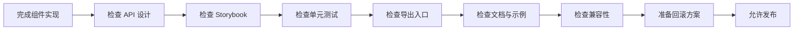

# Spring Boot 与 Next.js 公共组件库发布清单 / 检查表

这页把公共组件库上线前的检查项收口，作为发布前最后一道门槛，确保组件进入共享层时是可用、可测、可回滚的。

## 1. 这页的目标 / このページの目的

- 中文：在发布公共组件前，统一检查 API、文档、测试、Storybook 和回滚方案。
- 日本語：共通コンポーネントを公開する前に、API、ドキュメント、テスト、Storybook、ロールバック手段を統一して確認するためのページです。

## 2. 发布前总流程 / リリース前の全体フロー

## 3. 发布清单总表 / リリースチェックリスト

| 检查项 | 中文要求 | 日本語の要求 |
|---|---|---|
| API 设计 | props 是否足够清晰、最小化、可扩展 | props が明確で最小限、かつ拡張可能か |
| 默认状态 | 是否有合理默认值 | 適切なデフォルト値があるか |
| 错误状态 | 是否能展示错误提示 | エラー表示ができるか |
| 加载状态 | 是否支持 loading | loading 状態を扱えるか |
| 无障碍 | 是否有 aria、键盘操作支持 | aria とキーボード操作を考慮しているか |
| 文档 | README 和 Storybook 是否齐全 | README と Storybook が揃っているか |
| 测试 | 是否覆盖主要交互和边界条件 | 主要操作と境界条件をテストしているか |
| 导出 | 是否从稳定入口导出 | 安定した入口から export しているか |
| 兼容性 | 是否破坏旧调用方式 | 旧呼び出しを壊していないか |
| 回滚 | 是否能快速切回旧版本 | 旧版へ素早く戻せるか |

## 4. 发布前必查项 / リリース前の必須確認項目

### 4.1 组件 API

- 中文：检查 props 是否过多，能不能再收敛。
- 日本語：props が多すぎないか、さらに絞れないか確認する。
- 中文：检查命名是否统一，是否符合项目约定。
- 日本語：命名が統一され、プロジェクト規約に沿っているか確認する。
- 中文：检查是否暴露了不该让外部依赖的内部细节。
- 日本語：外部に見せるべきでない内部詳細を公開していないか確認する。

### 4.2 Storybook

- 中文：至少覆盖默认态、主要变体和异常态。
- 日本語：少なくともデフォルト、主要バリエーション、異常系をカバーする。
- 中文：示例数据要真实，能代表实际使用场景。
- 日本語：サンプルデータは実際の利用シーンを再現できるものにする。
- 中文：说明文字里要写清楚适用范围和限制。
- 日本語：説明文に適用範囲と制限を明記する。

### 4.3 测试

- 中文：测试主要用户交互，不只测渲染结果。
- 日本語：単なる描画だけでなく、主要な操作もテストする。
- 中文：测试边界情况，例如空值、长文本、disabled、error。
- 日本語：空値、長文、disabled、error などの境界条件を確認する。
- 中文：如果组件很核心，优先补回归测试。
- 日本語：重要な部品なら回帰テストを優先する。

### 4.4 文档

- 中文：README 里要写安装、导入和最小示例。
- 日本語：README に導入手順、import 方法、最小サンプルを書く。
- 中文：废弃或替代信息要同步更新。
- 日本語：廃止や代替情報も同時に更新する。
- 中文：如果有设计限制，要明确写出来。
- 日本語：設計上の制約があるなら明記する。

## 5. 发布前风险检查 / リリース前のリスク確認

| 风险 | 中文处理方式 | 日本語の対応 |
|---|---|---|
| API 破坏 | 先新增后废弃，不直接改旧调用 | 直接変更せず、新規追加→廃止で進める |
| 样式回退 | 用 Storybook 和视觉回归发现 | Storybook とビジュアル回帰で検知する |
| 行为回退 | 用测试保护关键交互 | テストで重要な動作を守る |
| 误用 | 提供清晰文档和示例 | 明確なドキュメントと例を用意する |
| 回滚困难 | 保留旧版本一段时间 | 旧版をしばらく残しておく |

## 6. 发布前检查顺序 / リリース前の確認順

1. 先看 API 是否合理。
2. 再看 Storybook 是否齐全。
3. 然后看测试是否通过。
4. 接着看文档是否完整。
5. 最后确认回滚方案和迁移说明。

日本語：
1. まず API が妥当か確認する。
2. 次に Storybook が揃っているか確認する。
3. その後、テストが通るか確認する。
4. 続いてドキュメントを確認する。
5. 最後にロールバック手段と移行説明を確認する。

## 7. 发布后观察 / リリース後の観察

- 中文：观察调用方是否出现兼容问题。
- 日本語：呼び出し側に互換問題が出ていないか確認する。
- 中文：观察错误日志和使用反馈。
- 日本語：エラーログと利用者のフィードバックを確認する。
- 中文：如果组件使用量快速上涨，及时补文档和示例。
- 日本語：利用が急増したら、すぐにドキュメントと例を補足する。

## 8. 最小发布包 / 最小リリースパッケージ

- 中文：组件实现。
- 日本語：コンポーネント実装。
- 中文：类型定义。
- 日本語：型定義。
- 中文：Storybook。
- 日本語：Storybook。
- 中文：测试。
- 日本語：テスト。
- 中文：导出入口。
- 日本語：export 入口。
- 中文：文档和使用示例。
- 日本語：ドキュメントと利用例。

## 9. 一句话总结 / 一言まとめ

- 中文：这页的核心，是在公共组件发布前加一道明确的检查门槛，避免“能用但不好维护”的组件进入共享层。
- 日本語：このページの核心は、共通コンポーネントを公開する前に明確な確認ゲートを置き、「使えるが保守しづらい」部品が共有層に入るのを防ぐことです。

## 10. 下一步 / 次のステップ

- [Spring Boot 与 Next.js 公共组件库总索引](./14-SpringBoot与Nextjs公共组件库总索引.md)

中文：如果你想从一个页面直接进入整条组件库线，就打开总索引。

日本語：1 ページから共通コンポーネント全体に入るなら、総索引を開くとよいです。
