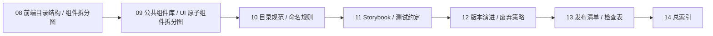

# Spring Boot 与 Next.js 公共组件库总索引

这一页把公共组件库相关的整条线单独汇总，作为统一入口，方便从一个页面跳到各个专题。

## 1. 这页的用途 / このページの用途

- 中文：如果你只想看公共组件库相关内容，就从这里开始。
- 日本語：共通コンポーネント関連だけを見たいなら、このページから入るとよいです。
- 中文：这一页不替代各专题，而是把它们按顺序串起来。
- 日本語：このページは個別ページの代わりではなく、順序よくつなぐ入口です。

## 2. 阅读路径总览 / 読み順の全体像

## 3. 公共组件库专题列表 / 共通コンポーネント一覧

| 编号 | 页面 | 中文说明 | 日本語の説明 |
|---|---|---|---|
| 09 | [公共组件库 / UI 原子组件拆分图](./09-SpringBoot与Nextjs公共组件库UI原子组件拆分图.md) | 看懂原子组件、组合组件、业务组件和页面的边界 | 原子部品、複合部品、業務部品、ページの境界を理解する |
| 10 | [公共组件库目录规范 / 命名规则](./10-SpringBoot与Nextjs公共组件库目录规范命名规则.md) | 统一目录、命名、导出和维护规则 | ディレクトリ、命名、export、保守ルールを統一する |
| 11 | [公共组件库 Storybook / 测试约定](./11-SpringBoot与Nextjs公共组件库Storybook测试约定.md) | 把组件验证流程落到 Storybook 和测试 | 検証フローを Storybook とテストに落とし込む |
| 12 | [公共组件库版本演进 / 废弃策略](./12-SpringBoot与Nextjs公共组件库版本演进废弃策略.md) | 管理组件从创建到淘汰的生命周期 | 作成から廃止までのライフサイクルを管理する |
| 13 | [公共组件库发布清单 / 检查表](./13-SpringBoot与Nextjs公共组件库发布清单检查表.md) | 发布前检查 API、文档、测试、回滚方案 | 公開前に API、文書、テスト、ロールバックを確認する |

## 4. 建议使用方式 / 推奨の使い方

1. 先从 [09 公共组件库 / UI 原子组件拆分图](./09-SpringBoot与Nextjs公共组件库UI原子组件拆分图.md) 看组件怎么分层。
2. 再看 [10 目录规范 / 命名规则](./10-SpringBoot与Nextjs公共组件库目录规范命名规则.md) 把结构统一起来。
3. 然后看 [11 Storybook / 测试约定](./11-SpringBoot与Nextjs公共组件库Storybook测试约定.md) 把验证流程补齐。
4. 接着看 [12 版本演进 / 废弃策略](./12-SpringBoot与Nextjs公共组件库版本演进废弃策略.md) 理解生命周期。
5. 最后看 [13 发布清单 / 检查表](./13-SpringBoot与Nextjs公共组件库发布清单检查表.md) 完成上线前确认。

日本語：
1. まず [09 共通コンポーネント / UI 原子分割図](./09-SpringBoot与Nextjs公共组件库UI原子组件拆分图.md) で層の分け方を見る。
2. 次に [10 ディレクトリ規約 / 命名規則](./10-SpringBoot与Nextjs公共组件库目录规范命名规则.md) で構造をそろえる。
3. その後 [11 Storybook / テスト規約](./11-SpringBoot与Nextjs公共组件库Storybook测试约定.md) で検証フローを補う。
4. 続けて [12 ライフサイクル / 廃止戦略](./12-SpringBoot与Nextjs公共组件库版本演进废弃策略.md) で寿命管理を理解する。
5. 最後に [13 公開チェックリスト](./13-SpringBoot与Nextjs公共组件库发布清单检查表.md) で公開前確認をする。

## 5. 适合什么人 / 向いている人

- 中文：想从一个页面快速跳到公共组件库所有专题的人。
- 日本語：1 ページから共通コンポーネントの全テーマへ素早く移動したい人。
- 中文：已经看过 08 页，希望继续深入组件库治理的人。
- 日本語：08 ページを見たうえで、コンポーネントライブラリの運用まで深めたい人。
- 中文：想把组件开发、验证、发布、废弃连成完整流程的人。
- 日本語：コンポーネント開発、検証、公開、廃止を一連の流れで理解したい人。

## 6. 一句话总结 / 一言まとめ

- 中文：这一页是公共组件库的总入口，按“拆分 -> 规范 -> 测试 -> 演进 -> 发布”把整条线串起来。
- 日本語：このページは共通コンポーネントの総入口で、「分割 -> 規約 -> テスト -> 進化 -> 公開」の順に全体をつなぎます。
