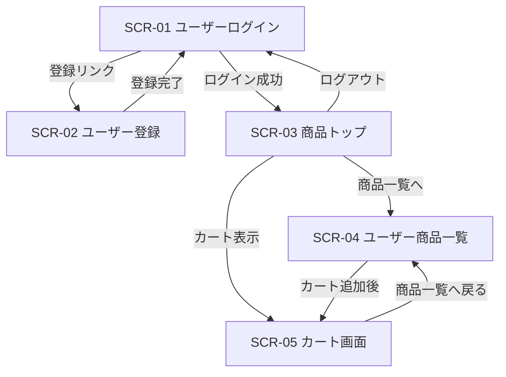
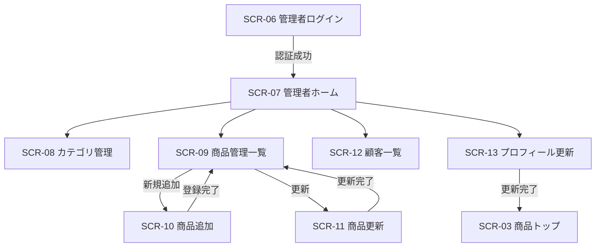

# 画面遷移図

## 1. 目的

本書は `JtProject` の画面間遷移を可視化し、一般ユーザー導線、管理者導線、補助画面導線を明確化する。

## 2. 一般ユーザー画面遷移図

## 3. 管理者画面遷移図

## 4. 補助画面

| 画面ID | 画面名 | 位置づけ |
|---|---|---|
| SCR-14 | `test.jsp` | 学習・動作確認用 |
| SCR-15 | `test2.jsp` | 学習・動作確認用 |
| SCR-16 | `cartproduct.jsp` | 補助画面、実導線要確認 |

## 5. 遷移上の留意点

- 一般ユーザーと管理者ではログイン入口が分かれている
- 一般ユーザーはログアウト後、`SCR-01` に戻る
- 管理者プロフィール更新後は `/index` にリダイレクトされるため、運用上は一般商品トップへ戻る実装となっている
- `SCR-16` は現在の主要業務導線上では使用状況が不明確である

## 6. 画面資料対応一覧

画面遷移図から詳細資料へたどれるよう、主要画面の対応文書を以下に整理する。

| 画面ID | 画面名 | 画面一覧 | レイアウト定義 | 項目定義 |
|---|---|---|---|---|
| SCR-01 | ユーザーログイン画面 | [14:SCR-01](14_画面一覧.md) | [70:4.1](70_画面レイアウト定義書.md) | [65:3.1](65_画面項目定義書.md) |
| SCR-02 | ユーザー登録画面 | [14:SCR-02](14_画面一覧.md) | [70:4.2](70_画面レイアウト定義書.md) | [65:3.2](65_画面項目定義書.md) |
| SCR-03 | 商品トップ画面 | [14:SCR-03](14_画面一覧.md) | [70:4.3](70_画面レイアウト定義書.md) | [63](63_出力項目一覧.md) |
| SCR-05 | カート画面 | [14:SCR-05](14_画面一覧.md) | [70:4.4](70_画面レイアウト定義書.md) | [63](63_出力項目一覧.md) |
| SCR-06 | 管理者ログイン画面 | [14:SCR-06](14_画面一覧.md) | [70:4.5](70_画面レイアウト定義書.md) | [68](68_入力チェックメッセージ対応一覧.md) |
| SCR-07 | 管理者ホーム画面 | [14:SCR-07](14_画面一覧.md) | [70:4.8](70_画面レイアウト定義書.md) | [65:3.5](65_画面項目定義書.md) |
| SCR-08 | カテゴリ管理画面 | [14:SCR-08](14_画面一覧.md) | [70:4.6](70_画面レイアウト定義書.md) | [65:3.4](65_画面項目定義書.md) |
| SCR-09 | 商品管理画面 | [14:SCR-09](14_画面一覧.md) | [70:4.7](70_画面レイアウト定義書.md) | [65:3.3](65_画面項目定義書.md) |
| SCR-12 | 顧客一覧画面 | [14:SCR-12](14_画面一覧.md) | [70:4.9](70_画面レイアウト定義書.md) | [65:3.6](65_画面項目定義書.md) |
| SCR-13 | プロフィール更新画面 | [14:SCR-13](14_画面一覧.md) | [70:4.10](70_画面レイアウト定義書.md) | [65:3.7](65_画面項目定義書.md) |
