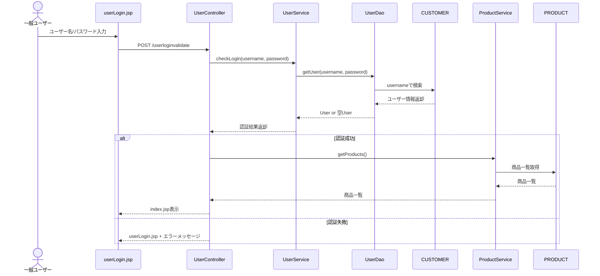
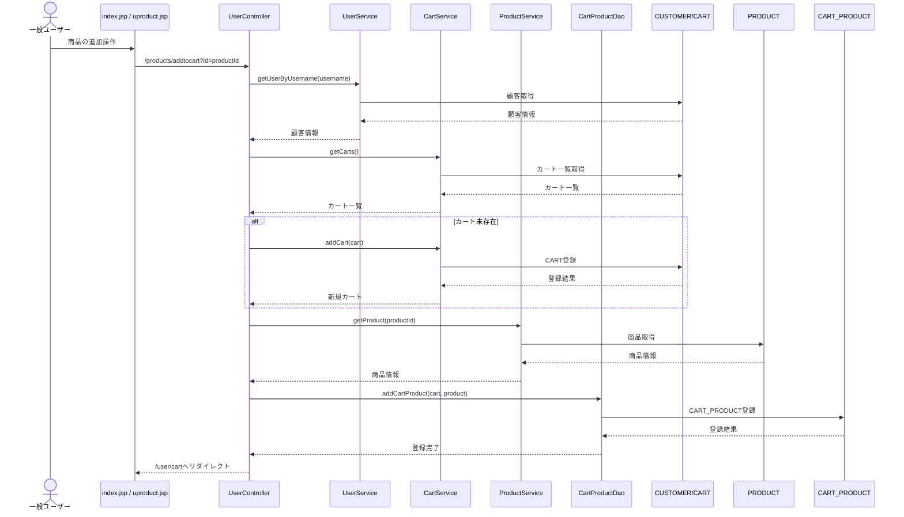
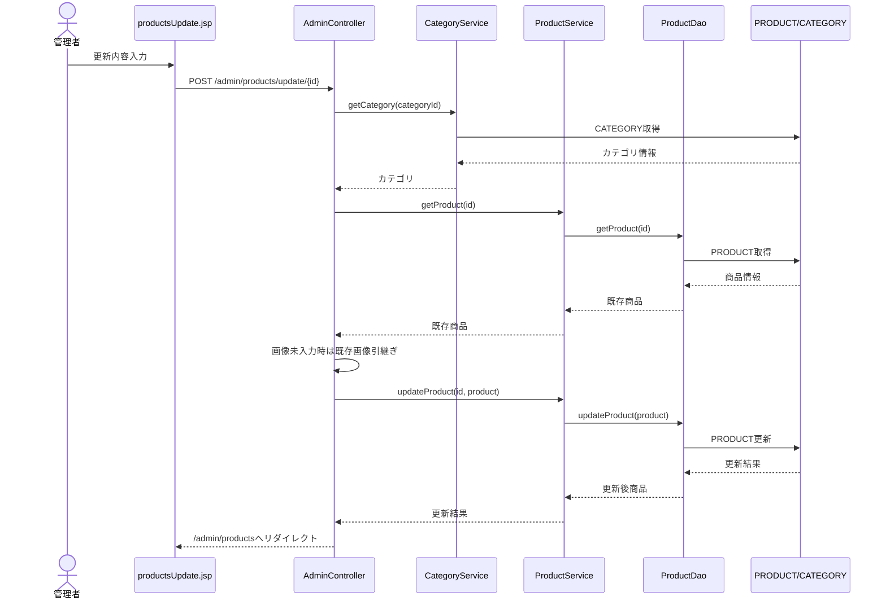

# シーケンス図

## 1. 目的

本書は `JtProject` の主要処理について、画面から Controller、Service、DAO、DB に至る呼出順序を明示する。

## 2. ユーザーログイン処理

[Mermaid source: 20_シーケンス図-mermaid-1.mmd](assets/20_シーケンス図-mermaid-1.mmd)

Mermaid source (editable)

## 3. カート追加処理

[Mermaid source: 20_シーケンス図-mermaid-2.mmd](assets/20_シーケンス図-mermaid-2.mmd)

Mermaid source (editable)

## 4. 管理者商品更新処理

[Mermaid source: 20_シーケンス図-mermaid-3.mmd](assets/20_シーケンス図-mermaid-3.mmd)

Mermaid source (editable)

## 5. 備考

- 実案件ではこの資料に加え、正常系 / 異常系を分けたシーケンス図を作成することが多い
- 必要に応じて「登録」「削除」「カテゴリ更新」も別図として追加可能
