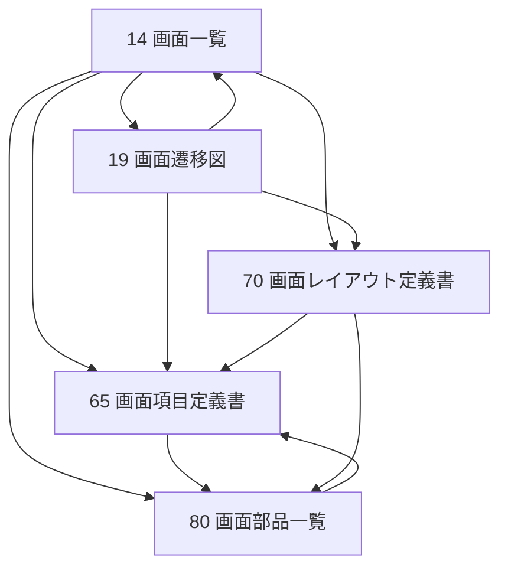

# 73. 画面設計資料相関一覧

## 1. 文書情報

| 項目 | 内容 |
|---|---|
| 文書名 | 画面設計資料相関一覧 |
| 対象システム | JtProject |
| 文書区分 | 画面設計ナビゲーション資料 |
| 版数 | v1.0 |

## 2. 目的

本書は、画面設計に関する主要文書の役割と相互関係を整理し、どの文書から何を確認すべきかを明確化することを目的とする。

## 3. 画面設計資料の役割

| 文書 | 役割 | 主な確認内容 |
|---|---|---|
| [14_画面一覧.md](14_画面一覧.md) | 画面総覧 | 画面ID、用途、利用者、遷移先、対応文書 |
| [19_画面遷移図.md](19_画面遷移図.md) | 画面導線確認 | 画面間の遷移関係、導線、資料対応 |
| [65_画面項目定義書.md](65_画面項目定義書.md) | 項目詳細確認 | 入力項目、表示項目、ボタン、リンク、メッセージ |
| [70_画面レイアウト定義書.md](70_画面レイアウト定義書.md) | レイアウト確認 | 画面構成、領域配置、簡易レイアウト図 |
| [80_画面部品一覧.md](80_画面部品一覧.md) | 部品台帳確認 | 入力欄、ボタン、リンク、一覧、メッセージ領域の部品単位管理 |

## 4. 文書相関図

## 5. 画面別参照一覧

| 画面ID | 画面名 | 最初に見る文書 | 次に見る文書 | 補足 |
|---|---|---|---|---|
| SCR-01 | ユーザーログイン画面 | [14](14_画面一覧.md) | [70:4.1](70_画面レイアウト定義書.md) / [65:3.1](65_画面項目定義書.md) | 導線は [19](19_画面遷移図.md) |
| SCR-03 | 商品トップ画面 | [14](14_画面一覧.md) | [70:4.3](70_画面レイアウト定義書.md) / [63](63_出力項目一覧.md) | 商品表示中心 |
| SCR-05 | カート画面 | [14](14_画面一覧.md) | [70:4.4](70_画面レイアウト定義書.md) / [63](63_出力項目一覧.md) | 遷移は [19](19_画面遷移図.md) |
| SCR-07 | 管理者ホーム画面 | [14](14_画面一覧.md) | [70:4.8](70_画面レイアウト定義書.md) / [65:3.5](65_画面項目定義書.md) | 管理導線起点 |
| SCR-08 | カテゴリ管理画面 | [14](14_画面一覧.md) | [70:4.6](70_画面レイアウト定義書.md) / [65:3.4](65_画面項目定義書.md) | CRUD 画面 |
| SCR-09 | 商品管理画面 | [14](14_画面一覧.md) | [70:4.7](70_画面レイアウト定義書.md) / [65:3.3](65_画面項目定義書.md) | 商品管理中心 |
| SCR-12 | 顧客一覧画面 | [14](14_画面一覧.md) | [70:4.9](70_画面レイアウト定義書.md) / [65:3.6](65_画面項目定義書.md) | 顧客参照用 |
| SCR-13 | プロフィール更新画面 | [14](14_画面一覧.md) | [70:4.10](70_画面レイアウト定義書.md) / [65:3.7](65_画面項目定義書.md) | 更新画面 |

部品単位で確認したい場合は、各画面とも [80_画面部品一覧.md](80_画面部品一覧.md) を併読すること。

## 6. 推奨読書順

1. まず [14_画面一覧.md](14_画面一覧.md) で対象画面を特定する。
2. 次に [19_画面遷移図.md](19_画面遷移図.md) で前後導線を確認する。
3. その後 [70_画面レイアウト定義書.md](70_画面レイアウト定義書.md) で画面構成を確認する。
4. [80_画面部品一覧.md](80_画面部品一覧.md) で入力欄、ボタン、リンク、メッセージ領域の構成を確認する。
5. 最後に [65_画面項目定義書.md](65_画面項目定義書.md) で項目定義を確認する。
