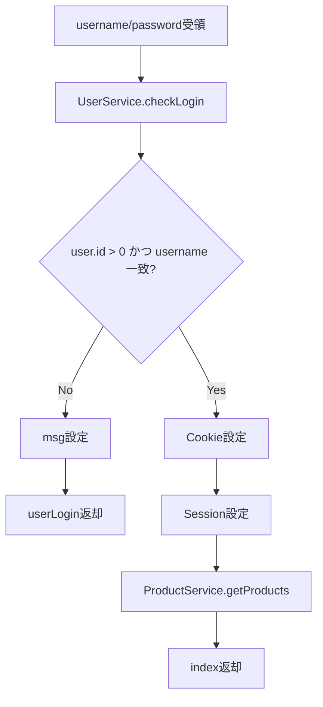

# UserController 詳細設計書

## 1. 文書情報

| 項目 | 内容 |
|---|---|
| 文書名 | UserController 詳細設計書 |
| 対象クラス | `UserController` |
| パッケージ | `com.jtspringproject.JtSpringProject.controller` |
| 作成日 | 2026-03-15 |
| 作成者 | Codex |

## 2. クラス概要

| 項目 | 内容 |
|---|---|
| 役割 | 一般ユーザー向けのログイン、登録、商品表示、カート操作を制御する |
| 依存 | `UserService`、`ProductService`、`CartService`、`CartProductDao` |
| セッション項目 | `username`、`userRole`、`cartMsg` |
| Cookie | `username` |
| 主な画面 | `userLogin`、`register`、`index`、`uproduct`、`cart` |

## 3. メソッド一覧

| No | メソッド名 | HTTP / URL | 役割 |
|---|---|---|---|
| 1 | `registerUser()` | `GET /register` | 登録画面表示 |
| 2 | `userloginPage()` | `GET /` | ログイン画面初期表示 |
| 3 | `userlogin()` | `POST /userloginvalidate1` | ログイン認証本体 |
| 4 | `userloginAlias()` | `POST /userloginvalidate` | 旧 URL 互換 |
| 5 | `newUseRegister()` | `POST /newuserregister` | 一般ユーザー登録 |
| 6 | `getproduct()` | `GET /user/products` | 商品一覧表示 |
| 7 | `indexPage()` | `GET /index` | トップ画面表示 |
| 8 | `addToCart()` | `GET/POST /products/addtocart` | カート追加 |
| 9 | `showCart()` | `GET /user/cart` | カート表示 |
| 10 | `deleteFromCart()` | `GET /user/cart/delete` | カート商品削除 |
| 11 | `logout()` | `GET /logout` | ログアウト |

## 4. メソッド詳細

### 4.1 `userlogin()`

| 項目 | 内容 |
|---|---|
| 目的 | 画面入力されたユーザー名とパスワードでログイン認証を行う |
| 入力 | `username`、`password` |
| 出力 | `ModelAndView` |
| 正常遷移 | `index` |
| 異常遷移 | `userLogin` |

処理手順:

1. リクエストパラメータを受領する。
2. `UserService.checkLogin()` を呼び出す。
3. 戻り値の `User` が `null` でないことを確認する。
4. `id > 0` かつユーザー名一致時を認証成功とする。
5. 認証成功時は Cookie、Session を設定する。
6. `ProductService.getProducts()` で商品一覧を取得する。
7. `index` 画面へ商品一覧付きで遷移する。
8. 認証失敗時は `userLogin` にメッセージを設定する。

業務ルール:

- エラーメッセージは認証失敗理由を細分化せず共通メッセージとする。
- 商品一覧取得に失敗してもログイン処理全体は極力継続させる。

処理フロー図:



### 4.2 `newUseRegister()`

処理手順:

1. `User` モデルを受領する。
2. `UserService.checkUserExists()` で重複確認する。
3. 未存在時は `ROLE_NORMAL` を付与して保存する。
4. 保存後はログイン画面へ遷移する。
5. 重複時は登録画面にエラーメッセージを返却する。

### 4.3 `addToCart()`

処理手順:

1. Session / Cookie からログインユーザー名を解決する。
2. 未ログイン時は `cartMsg` を設定して商品一覧へ戻る。
3. `UserService.getUserByUsername()` でユーザー取得する。
4. 管理者の場合は管理画面へ誘導する。
5. 既存カートを探索し、なければ `CartService.addCart()` で作成する。
6. `ProductService.getProduct(id)` で商品存在確認する。
7. `CartProductDao.addCartProduct()` で明細追加する。
8. `cartMsg` を設定して `/user/cart` へリダイレクトする。

処理フロー図:


```mermaid
flowchart TD
    A[ログインユーザー解決] --> B{ユーザー名取得済?}
    B -- No --> C[cartMsg設定]
    C --> D[商品一覧へ戻る]
    B -- Yes --> E[UserService.getUserByUsername]
    E --> F{ROLE_ADMIN?}
    F -- Yes --> G[管理画面へ誘導]
    F -- No --> H[既存Cart探索]
    H --> I{Cart有?}
    I -- No --> J[CartService.addCart]
    I -- Yes --> K[既存Cart使用]
    J --> L[ProductService.getProduct]
    K --> L
    L --> M{商品存在?}
    M -- No --> N[失敗メッセージ]
    M -- Yes --> O[CartProductDao.addCartProduct]
    O --> P[/user/cartへリダイレクト]
```
### 4.4 `showCart()`

処理手順:

1. ログインユーザーを特定する。
2. 管理者の場合は管理画面へリダイレクトする。
3. 顧客に紐づくカートを探索する。
4. カート存在時は `CartProductDao.getProductByCartID()` で商品一覧取得する。
5. `cart` 画面へ商品一覧を設定する。

### 4.5 `deleteFromCart()`

処理手順:

1. ログイン状態と対象ユーザーを確認する。
2. 顧客カートを取得する。
3. `cartId + productId` で対象明細を取得する。
4. 明細存在時は 1 件削除する。
5. 結果メッセージを設定してカート画面へ戻る。

## 5. 例外・注意事項

- `UserService.checkLogin()` の戻り値ポリシーが空 `User` ベースである点に依存する。
- Cookie と Session の両方を使ってログイン状態を扱っている。
- 画面メッセージのキーが `msg` と `cartMsg` に分かれている。

## 6. 関連資料

- [15a_Controller詳細設計書.md](15a_Controller詳細設計書.md)
- [13_機能設計書.md](../01_design/13_機能設計書.md)
- [20_シーケンス図.md](../01_design/20_シーケンス図.md)

