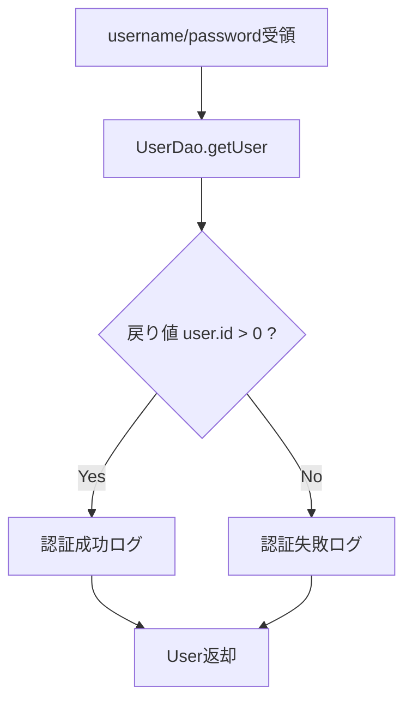

# UserService 詳細設計書

## 1. 文書情報

| 項目 | 内容 |
|---|---|
| 文書名 | UserService 詳細設計書 |
| 対象クラス | `UserService` / `UserServiceImpl` |
| パッケージ | `services` / `services.impl` |
| 作成日 | 2026-03-15 |
| 作成者 | Codex |

## 2. クラス概要

| 項目 | 内容 |
|---|---|
| 役割 | ユーザー取得、登録、認証、重複確認を担当する |
| 呼出元 | `UserController`、`AdminController` |
| 委譲先 | `UserDao` |
| 主な戻り値 | `User`、`List<User>`、`boolean` |

## 3. メソッド一覧

| No | メソッド名 | 役割 |
|---|---|---|
| 1 | `getUsers()` | ユーザー一覧取得 |
| 2 | `addUser(user)` | ユーザー追加または更新 |
| 3 | `checkLogin(username, password)` | 認証処理 |
| 4 | `getUserByUsername(username)` | ユーザー名検索 |
| 5 | `getUserById(id)` | ID 検索 |
| 6 | `checkUserExists(username)` | ユーザー名重複確認 |

## 4. メソッド詳細

### 4.1 `checkLogin(username, password)`

処理手順:

1. `UserDao.getUser(username, password)` を呼び出す。
2. 戻り値 `User` の `id > 0` を成功判定の基準とする。
3. 成功時はログに認証成功を記録する。
4. 失敗時は認証失敗を記録する。
5. `User` を呼出元へ返却する。

業務ルール:

- 認証失敗時も `null` ではなく空 `User` が返る実装を前提とする。
- パスワード比較自体は DAO 側で実施している。

処理フロー図:

### 4.2 `addUser(user)`

処理手順:

1. 受領した `User` の属性をそのまま DAO へ渡す。
2. `UserDao.saveUser()` を呼び出す。
3. 保存結果を返却する。

利用場面:

- 新規ユーザー登録
- 管理者プロフィール更新

### 4.3 `checkUserExists(username)`

処理手順:

1. `UserDao.userExists(username)` を呼び出す。
2. 戻り値 `boolean` をそのまま返却する。

利用場面:

- 登録前の重複確認

### 4.4 `getUserByUsername()` / `getUserById()`

処理手順:

1. DAO に検索を委譲する。
2. 取得結果を返却する。

利用場面:

- カート処理時のログインユーザー特定
- 管理者プロフィール更新対象取得

## 5. 設計上の注意

- Service 層の責務としては比較的薄く、DAO 呼出とログ出力が中心である。
- 実案件では認証失敗時の戻り値ポリシー統一、パスワードハッシュ化、トランザクション境界見直しが必要となる。

## 6. 関連資料

- [15b_Service詳細設計書.md](15b_Service詳細設計書.md)
- [15c-01_UserDao詳細設計書.md](15c-01_UserDao詳細設計書.md)

