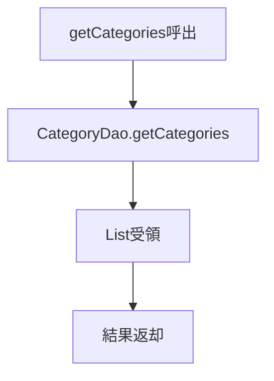
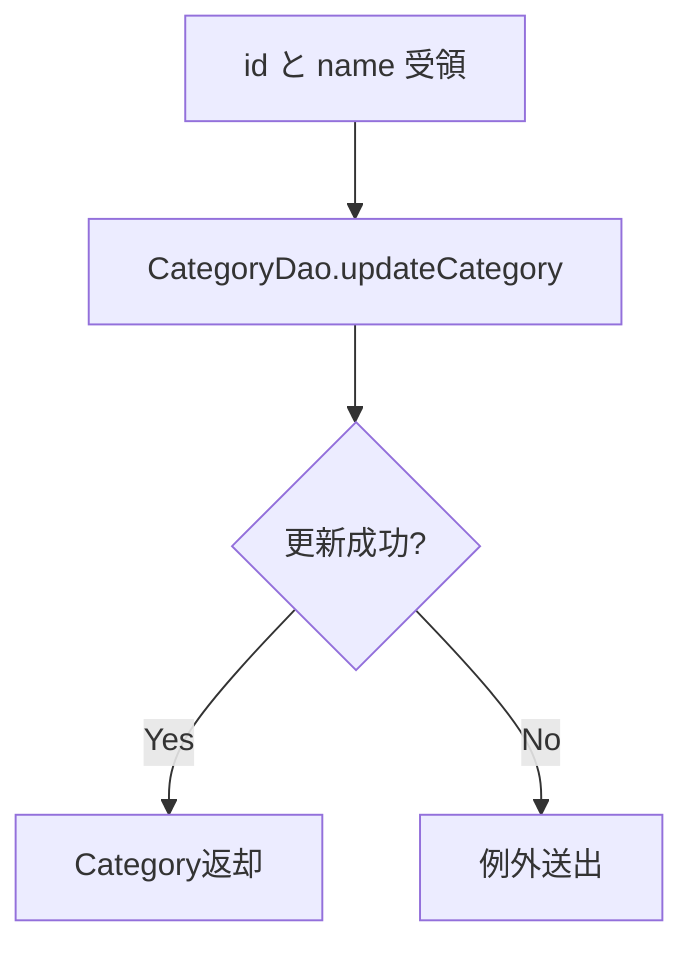

# CategoryService 詳細設計書

## 1. 文書情報

| 項目 | 内容 |
|---|---|
| 文書名 | CategoryService 詳細設計書 |
| 対象クラス | `CategoryService` / `CategoryServiceImpl` |
| パッケージ | `services` / `services.impl` |
| 作成日 | 2026-03-15 |
| 作成者 | Codex |

## 2. クラス概要

| 項目 | 内容 |
|---|---|
| 役割 | カテゴリ一覧取得、詳細取得、追加、更新、削除を担当する |
| 呼出元 | `AdminController` |
| 委譲先 | `CategoryDao` |
| 主な戻り値 | `List<Category>`、`Category`、`Boolean` |

## 3. メソッド一覧

| No | メソッド名 | 役割 |
|---|---|---|
| 1 | `addCategory(name)` | カテゴリ登録 |
| 2 | `getCategories()` | カテゴリ一覧取得 |
| 3 | `deleteCategory(id)` | カテゴリ削除 |
| 4 | `updateCategory(id, name)` | カテゴリ更新 |
| 5 | `getCategory(id)` | カテゴリ詳細取得 |

## 4. メソッド詳細

### 4.1 `addCategory(name)`

処理手順:

1. 画面から受領したカテゴリ名 `name` を受け取る。
2. `CategoryDao.addCategory(name)` を呼び出す。
3. DAO 側で生成された `Category` を受領する。
4. 登録結果を呼出元へ返却する。

業務ルール:

- Service 層ではカテゴリ名の整形や重複判定を持たず、そのまま DAO に委譲する。
- 実案件では空文字、桁数、重複チェックを Service 層で実施する余地がある。

### 4.2 `getCategories()`

処理手順:

1. `CategoryDao.getCategories()` を呼び出す。
2. カテゴリ一覧を受領する。
3. 取得結果をそのまま返却する。

利用場面:

- 管理者カテゴリ一覧画面表示
- 商品登録、商品更新画面のカテゴリ選択肢生成

処理フロー図:

[Mermaid source: 15b-03_CategoryService詳細設計書-mermaid-1.mmd](assets/15b-03_CategoryService詳細設計書-mermaid-1.mmd)

Mermaid source (editable)

### 4.3 `deleteCategory(id)`

処理手順:

1. 削除対象カテゴリ ID を受領する。
2. `CategoryDao.deletCategory(id)` を呼び出す。
3. DAO の削除成否 `Boolean` を受領する。
4. 呼出元へ成否を返却する。

業務ルール:

- 削除前の関連商品有無判定は Service 層では持たない。
- 実案件ではカテゴリ参照中商品の存在確認を先に行う必要がある。

### 4.4 `updateCategory(id, name)`

処理手順:

1. 更新対象 ID と新カテゴリ名を受領する。
2. `CategoryDao.updateCategory(id, name)` を呼び出す。
3. 更新後の `Category` を受領する。
4. 更新結果を返却する。

業務ルール:

- 対象カテゴリ不存在時のエラー制御は DAO 側に委譲している。
- 名称変更履歴や承認フローは本実装では持たない。

処理フロー図:

[Mermaid source: 15b-03_CategoryService詳細設計書-mermaid-2.mmd](assets/15b-03_CategoryService詳細設計書-mermaid-2.mmd)

Mermaid source (editable)

### 4.5 `getCategory(id)`

処理手順:

1. 対象カテゴリ ID を受領する。
2. `CategoryDao.getCategory(id)` を呼び出す。
3. 該当カテゴリを受領する。
4. 存在しない場合は `null` を返却する。

利用場面:

- 管理者カテゴリ更新画面表示
- 商品カテゴリ存在確認

## 5. 設計上の注意

- Service 層は薄く、業務判断の大半を呼出元または DAO 側へ委譲している。
- ログは ServiceImpl 側で出力するが、入力値妥当性の共通化は未実施である。
- 実案件ではカテゴリ重複禁止、削除制約、論理削除方針を Service 層で管理した方がよい。

## 6. 関連資料

- [15b_Service詳細設計書.md](15b_Service詳細設計書.md)
- [15c-03_CategoryDao詳細設計書.md](15c-03_CategoryDao詳細設計書.md)

