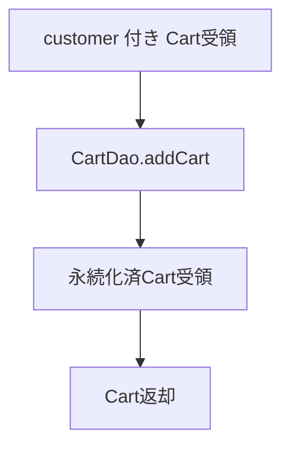
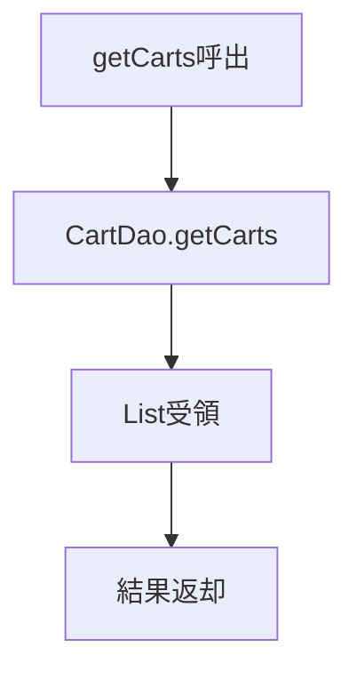
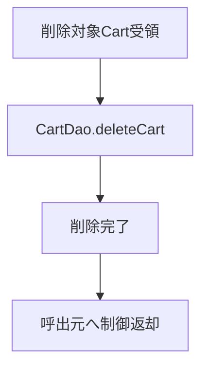

# CartService 詳細設計書

## 1. 文書情報

| 項目 | 内容 |
|---|---|
| 文書名 | CartService 詳細設計書 |
| 対象クラス | `CartService` / `CartServiceImpl` |
| パッケージ | `services` / `services.impl` |
| 作成日 | 2026-03-15 |
| 作成者 | Codex |

## 2. クラス概要

| 項目 | 内容 |
|---|---|
| 役割 | カートヘッダの作成、取得、更新、削除を担当する |
| 呼出元 | `UserController` |
| 委譲先 | `CartDao` |
| 主な戻り値 | `List<Cart>`、`Cart`、`void` |

## 3. メソッド一覧

| No | メソッド名 | 役割 |
|---|---|---|
| 1 | `addCart(cart)` | カート登録 |
| 2 | `getCarts()` | カート一覧取得 |
| 3 | `updateCart(cart)` | カート更新 |
| 4 | `deleteCart(cart)` | カート削除 |

## 4. メソッド詳細

### 4.1 `addCart(cart)`

処理手順:

1. `customer` を保持した `Cart` を受領する。
2. `CartDao.addCart(cart)` を呼び出す。
3. 永続化後の `Cart` を受領する。
4. 生成済み ID を含むカートを返却する。

業務ルール:

- 顧客ごとのカート存在確認は主に Controller 側で実施してから本メソッドを呼ぶ。
- 同一顧客に対する重複カート防止ロジックは本 Service では持たない。

処理フロー図:

### 4.2 `getCarts()`

処理手順:

1. `CartDao.getCarts()` を呼び出す。
2. 全カート一覧を受領する。
3. 取得結果を返却する。

処理フロー図:

利用場面:

- ログインユーザーのカート存在確認
- 対象カート ID 特定のための前段検索

### 4.3 `updateCart(cart)`

処理手順:

1. 更新対象 `Cart` を受領する。
2. `CartDao.updateCart(cart)` を呼び出す。
3. 更新処理完了後、呼出元へ制御を返す。

業務ルール:

- 現行実装ではカートヘッダ自体の更新場面は限定的である。
- 将来的な顧客付替えや状態管理の拡張を想定した更新窓口である。

### 4.4 `deleteCart(cart)`

処理手順:

1. 削除対象 `Cart` を受領する。
2. `CartDao.deleteCart(cart)` を呼び出す。
3. 削除完了後、呼出元へ制御を返す。

業務ルール:

- カート削除前の明細削除制御は本 Service では扱わない。
- 実案件では明細存在時の削除順序、論理削除、監査ログが必要になる。

処理フロー図:

## 5. 設計上の注意

- 顧客単位のカート取得 API がないため、上位層で全件取得後に絞り込む実装になっている。
- 現行 Service は薄い委譲中心の構成で、業務ルール集約は十分でない。
- 実案件では `getCartByCustomerId` やカート数量再計算メソッドの追加が望ましい。

## 6. 関連資料

- [15b_Service詳細設計書.md](15b_Service詳細設計書.md)
- [15c-04_CartDao詳細設計書.md](15c-04_CartDao詳細設計書.md)

